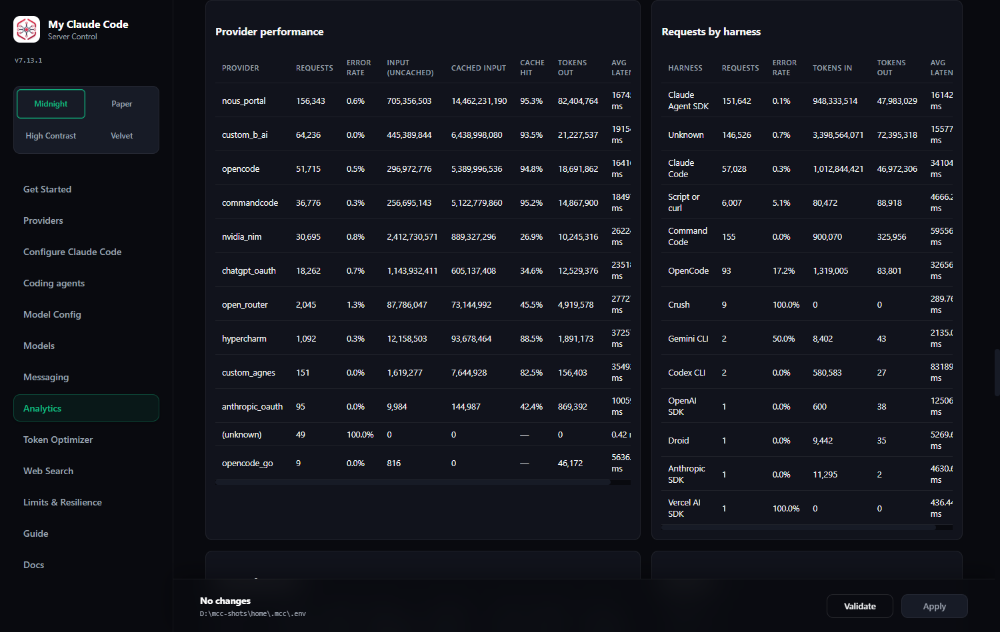

# Using a Claude subscription through MCC

> **This page is the disclaimer. Read it before enabling `anthropic_oauth`.**

MCC can route requests using the OAuth credential from your Claude Pro or Max
subscription, either by discovering the one Claude Code already stored or by
signing in itself.

**Anthropic does not permit this.** Not "discourages", not "is ambiguous about"
— their published documentation names both halves of it directly.

## What Anthropic actually says

From [Claude Code → Legal and compliance](https://code.claude.com/docs/en/legal-and-compliance),
verbatim:

> **OAuth authentication** is intended exclusively for purchasers of Claude
> Free, Pro, Max, Team, and Enterprise subscription plans and is designed to
> support ordinary use of Claude Code and other native Anthropic applications.
>
> **Developers** building products or services that interact with Claude's
> capabilities, including those using the Agent SDK, should use API key
> authentication through Claude Console or a supported cloud provider.
> **Anthropic does not permit third-party developers to offer Claude.ai login
> or to route requests through Free, Pro, or Max plan credentials on behalf of
> their users.**
>
> Anthropic reserves the right to take measures to enforce these restrictions
> and may do so **without prior notice**.

Timeline: the documentation was updated on **19 February 2026**; subscriptions
stopped covering third-party tool usage on **4 April 2026**. Enforcement is
live and is applied at the account level.

## There is no "inside Claude Code" exemption

This is the specific misconception this page exists to correct, because it is
the intuitive one and it is wrong.

It is tempting to reason: *the session is a real Claude Code session, so the
subscription still covers it.* It does not, and the reason is mechanical rather
than legalistic:

```
claude  ──►  127.0.0.1:8082  ──►  MCC  ──►  api.anthropic.com
             (ANTHROPIC_AUTH_TOKEN=<yours>)   ▲
                                             └── MCC's HTTP client presents
                                                 YOUR subscription credential
```

Claude Code authenticates to **MCC**. **MCC** then makes the upstream call with
its own HTTP client and headers, presenting your plan credential. That is a
third-party product routing requests through a Max credential, which is the
sentence quoted above, regardless of what launched the session.

Anyone who tells you otherwise — including an earlier version of these docs —
is describing how they wish it worked.

## What MCC does to limit the blast radius

MCC cannot make this permitted. It can refuse to make it *worse*, and it does
one specific thing.

The attribution it reads is the same one the dashboard reports back to you, per
harness, so you can see exactly which client the subscription credential served:

<div align="center">
  
  <p><em>Requests by harness, on Analytics: the attribution marker resolved into a client name, counted per client.</em></p>
</div>

Claude Code stamps an attribution line at the head of the system prompt, inside
the request body:

```
x-anthropic-billing-header: cc_version=2.1.258; cc_entrypoint=cli;
```

Measured on real traffic, four values appear: `cli` (the terminal), `cli-bg`
(the same client running a background task), `sdk-cli` (the Agent SDK driving
the Claude Code binary — this is also what `claude -p` reports) and `sdk-py`
(the Python Agent SDK). Because the marker travels in the body, a proxy can
neither forge it for traffic it did not receive nor strip it from traffic it
did.

**The marker is a good-faith attribution field, not an authenticator.** Its
value is `process.env.CLAUDE_CODE_ENTRYPOINT`, so anything that sets that
variable and reuses Claude Code's system-prompt shape can claim any entrypoint.
The gate narrows who reaches the credential; it does not prove who they are,
and nothing in this document should be read as claiming otherwise.

**The policy this gate enforces: the subscription credential may serve requests
from Anthropic's own clients only — the Claude Code CLI and the Claude Agent
SDK.** Those are the entrypoints `cli`, `cli-bg`, `sdk-cli`, `sdk-py`,
`sdk-ts`, `claude-desktop-3p` and `claude-desktop`. Every other harness routed through MCC — OpenCode, Cline, Crush, a
bare API call — is refused, with a message naming
`ANTHROPIC_OAUTH_REQUIRE_CLAUDE_CODE` and pointing at the `anthropic` provider
instead.

Before 6.36.0 the gate admitted `cli` alone. On the traffic this was measured
against that refused 64% of genuine Claude Code work, all of it Anthropic's own
Agent SDK — which Anthropic's policy names alongside Claude Code rather than
against it. Widening the gate to the SDK entrypoints is what 6.36.0 changed;
what stayed the same is that everything else is still refused.

The gate is controlled by `ANTHROPIC_OAUTH_REQUIRE_CLAUDE_CODE` (default
`true`), settable as **Only Serve Claude Code And The Agent SDK** on the Claude
subscription card of the dashboard's Providers page. Turning it off removes
the only structural protection here, and takes effect on Save (since 7.48.0,
without a restart).

### What MCC sends upstream

Since 6.36.0 the upstream header set is Claude Code's, with the values mirrored
from the inbound request wherever the client sent its own. Every row was read
out of Claude Code 2.1.258's binary; `providers/anthropic_oauth/auth.py`
carries the byte offsets.

| Header | What MCC sends |
| --- | --- |
| `Authorization` | `Bearer <access token>` |
| `x-api-key` | **never sent** — Claude Code nulls it whenever an OAuth credential is in play |
| `anthropic-version` | the client's value, else `2023-06-01` |
| `anthropic-beta` | MCC's floor (`oauth-2025-04-20`, `claude-code-20250219`) unioned with the client's own list, intersected with a closed allow-list |
| `user-agent` | the client's value, else `claude-cli/2.1.258 (external, cli)` |
| `x-app` | the client's value (`cli` or `cli-bg`), else `cli` |
| `anthropic-dangerous-direct-browser-access` | `true` |

Tool names go upstream verbatim. Releases before 6.36.0 renamed every tool to
`cc_<name>`; no such prefix exists anywhere in Claude Code, and the rename is
gone.

Mirroring is not the same as asserting: every mirrored value is one the client
itself sent. The fallback constants are used only when a request arrived
without them, and the gate refuses those requests anyway.

## What it does not do

Be clear about what the gate is and is not:

- It does **not** make this permitted. It narrows the traffic, nothing more.
- It does **not** hide anything from Anthropic. MCC sends the Claude Code
  header set, including `x-app` and a `claude-cli` User-Agent, because the
  operator chose the full header set. Those headers assert the request came
  from Anthropic's official CLI. The gate is what keeps that assertion true —
  but the assertion is being made by MCC, not by Claude Code.
- It does **not** protect against retry amplification. MCC's three retry layers
  have no shared deadline; a pathological case can produce far more upstream
  attempts than a real client would. Anthropic's stated enforcement concern is
  third-party harnesses generating unusual traffic patterns.
- It cannot protect an account that is already flagged.

## The risk, stated plainly

The risk is to **the Claude account whose credential you use**. Anthropic
states it may enforce without prior notice. Reported consequences for
subscription OAuth used outside Claude Code have included request-level
refusals and account-level disruption.

Nobody can tell you the probability. What is knowable is that the behaviour is
named in the policy, enforcement exists, and it is your account.

## The supported alternative, which is already shipped

MCC has an `anthropic` provider that uses a **Claude Console API key** and is
billed per token. It speaks the same native Messages API, through the same
transport, and carries no policy question at all:

```
ANTHROPIC_API_KEY="sk-ant-..."      # platform.claude.com/settings/keys
MODEL="anthropic/claude-sonnet-4-6"
```

Claude models are also reachable through `bedrock` and `vertex` under
commercial agreements, and resold by several gateways in the catalog
(`kilo`, `nous_portal`, `cline`).

And the two-door pattern still works and disturbs nothing:

```
claude       -> native auth, your subscription, supported
mcc-claude   -> the proxy, for everything else, that session only
```

## Enabling it anyway

If you have read the above and still want it:

```bash
# Option A: use the credential Claude Code already stored (nothing to do --
# MCC finds ~/.claude/.credentials.json and SHARES it: Claude Code's file stays
# the truth, MCC never renews it early, and renews it only once it has expired
# and a real request needs it, under Claude Code's own lock, writing the new
# token back for both -- see "Shared and native credentials" below)

# Option B: sign in with a credential MCC owns and can refresh itself
mcc-anthropic-oauth-login
```

Then point a model reference at it:

```
MODEL="anthropic_oauth/claude-sonnet-4-6"
```

### Signing in

`mcc-anthropic-oauth-login` prints the consent notice, waits for you to type
`yes`, and then opens your browser. There are two ways it can finish, and it
picks for you:

- **Loopback (the default).** A callback server binds an ephemeral port on
  `127.0.0.1`, and approving in the browser is the whole interaction — there is
  nothing to copy. This is what Claude Code itself does
  (`redirect_uri=http://localhost:<port>/callback`).
- **Paste (`--paste`, and the automatic fallback).** Anthropic's hosted
  callback page shows a code; you paste it back. Used whenever the browser
  cannot reach this machine's `localhost` — under WSL, over SSH, in a
  container, or on a remote desktop. The command detects those cases up front
  and says so, rather than waiting five minutes for a callback that can never
  arrive.

  In the paste flow you may paste any of: the `code#state` string the page
  shows, the bare code, or **the whole callback URL out of your address bar**.
  All three work.

```
mcc-anthropic-oauth-login --help          # the flow and the flags; prompts for nothing
mcc-anthropic-oauth-login --paste         # skip the callback server
mcc-anthropic-oauth-login --no-browser    # print the URL instead of opening it
```

The command never shows you a traceback. A refused code, a closed pipe and a
Ctrl-C are each one line and exit status 1.

The dashboard offers the same two flows behind **Sign in with Anthropic**: it
tries the loopback transport, and falls back to a paste field if the browser
and MCC do not share a `localhost`.

### Several accounts, each its own pool slot

Since **7.30.0** MCC stores **N Claude accounts**, not one. Signing in while an
account is already stored **adds** another; signing the *same* account in again
updates it in place and keeps the name you gave it. Each account is a slot in
the ordinary credential pool, so `ANTHROPIC_OAUTH_ACCESS_TOKEN_ROTATION`, the
401/403 lockout ladder, the 429 bench and the (key, model) bench all apply per
account — through the same rotation engine every API-key pool uses, which
learned nothing about accounts to make this work.

Each account carries a **name**. It defaults to the account's email address,
which arrives on the token response itself at no extra upstream cost (MCC still
never fetches the profile), or, for an account imported from Claude Code, from
the `oauthAccount` block of `~/.claude.json`, read once and read-only. You can
change or clear it on the card; a name you chose is never overwritten by a
default. The name is what the card row, the request log and all three exports
show, exactly as a named API key's is.

On the command line:

```
mcc-anthropic-oauth-login            # adds an account
mcc-anthropic-oauth-login --list     # id, name, plan, expiry, origin; never a token
mcc-anthropic-oauth-login --remove <account id>
```

With **one** account stored, everything below behaves exactly as it did before
7.30.0.

### Which credential MCC uses, and when it changes its mind

With one account, MCC can see up to two credentials, and picks between them
**on viability, not on existence**:

1. **MCC's own store** (`~/.mcc/anthropic_oauth.json`; an install that has not yet been migrated has it under `~/.fcc/anthropic_oauth.json`
   on a legacy install that has not run `mcc-migrate`) — preferred *while it is
   usable*: either the access token has not expired, or it has expired but the
   refresh token is not itself past a stated expiry.
2. **Claude Code's own file** (`~/.claude/.credentials.json`) — used whenever
   the first is not viable. This credential is **shared** with Claude Code
   (7.69.1): MCC re-reads the file whenever its `(mtime, size)` moves, never
   renews it early, and renews it only once it has expired and a real request
   needs it — under Claude Code's own lock, writing the result back into that
   file. Before 7.69.1 MCC refreshed it into its *own* store and left Claude
   Code holding a spent refresh token, which is what kept logging Claude Code
   out.

If it falls back, it says so once, in `server.log`, naming both the source it
chose and the one it skipped:

```
Claude subscription credential: using claude-code (access token still valid);
skipped mcc (access token expired and no refresh token)
```

> **Fixed in 6.43.0.** Before this, the first file holding a non-empty access
> token won, whether or not that token was years dead. A stale
> `~/.mcc/anthropic_oauth.json` therefore masked a perfectly healthy Claude
> Code credential sitting next to it *permanently*, and the provider served
> nothing for the life of that file. If that is the state you are in, upgrading
> is the entire fix — there is nothing for you to do.

### A failed refresh is not a dead credential

Anthropic's token endpoint rate-limits refresh attempts and answers **429**:

```json
{"error": {"type": "rate_limit_error", "message": "Rate limited. Please try again later."}}
```

That means *wait*. It does not mean your credential is finished, and signing in
again in response to it **rotates a working refresh token away** — turning a
five-minute hiccup into a real outage.

MCC classifies refresh failures into two classes and reports them differently:

| Response | Class | What MCC does |
| --- | --- | --- |
| `400`/`401`/`403` **with a JSON OAuth error body** | definitive | Sets the store aside as `anthropic_oauth.json.dead-<epoch>`, falls back to any other source, and tells you to sign in again |
| `408`, `429`, `5xx`, a transport error | transient | Keeps the credential, says "the stored credential was kept", and hands the failure to the same retry ladder, backoff and provider-health machinery an API-key provider's `429`/`5xx` goes through |
| `400`/`401`/`403` **without** a JSON error body | transient | Keeps the credential — see below |

That last row is not pedantry. The edge in front of the token endpoint answers
a short non-JSON `403` for reasons that have nothing to do with your grant (an
unrecognised `User-Agent`, for one — measured, not guessed). A request that
never reached the OAuth handler is not evidence about your credential, and
retiring one on that basis would be the same bug this rule exists to prevent.

A quarantined store is **renamed, never deleted**. If a credential is set aside
and you think that was wrong, the file is still there.

### The Refresh now and Disconnect buttons

The dashboard's Anthropic card shows **one row per account**, with the name,
the plan, the access-token expiry, the refresh-token expiry and that account's
own rate-limit windows. Each row has two controls, both local-only:

- **Refresh now** renews **that account's** credential immediately and reports
  the new expiry. If Anthropic is rate-limiting, it says so and leaves the
  credential alone; it does not tell you to sign in again. On a **shared** row
  the button reads **Re-read from Claude Code**: it re-reads Claude Code's file
  and adopts what it finds. It renews only when the token has expired and the
  file has not changed, and it never renews a token that is still valid.
- **Disconnect** removes **that account** and writes its record aside as
  `anthropic_oauth.json.dead-<epoch>`. The other accounts keep serving. Your
  Claude Code login is untouched, so if that credential is healthy MCC simply
  falls back to it once the last account is gone. Nothing needs restarting.

Neither button can remove Claude Code's own file, and neither renews a shared
credential that is still valid.

### Shared and native credentials

Since 7.69.1 every Claude account MCC serves is in one of two modes, shown on
its card row as **Owner**:

- **Shared** — the credential was read from Claude Code's
  `~/.claude/.credentials.json`, by **Use Claude Code credentials** (Import) or
  by the automatic fallback. Claude Code's file is the truth; MCC's copy is only
  a cache.
- **Native** — MCC signed the account in itself (loopback, paste, device or
  browser). MCC owns it and renews it as it always has.

The last explicit action wins: signing in with MCC to an account held as shared
makes it native, and an Import makes it shared again.

**For a shared credential MCC:**

1. Re-reads Claude Code's file on every use when its `(mtime, size)` has
   changed — Claude Code's own rule — and adopts the token it finds
   (`shared:adopted`). A half-written file keeps the cached token for that call
   and is never read as a logout.
2. Never renews it early: no 120-second head start, no background refresh, no
   refresh from discovery, probes, model listing, image descriptions or the
   dashboard while the token is valid. Claude Code renews its own token about
   five minutes before it expires; MCC leaves that to it.
3. Renews it only when **all** of these hold: the access token has expired (or
   a real request got a 401 within two minutes of expiry); the file still holds
   the token MCC last read; a real client request needs it now; write-back is
   possible (the file exists and is writable, the OS is not macOS,
   `ANTHROPIC_OAUTH_WRITE_BACK` is on and the account's own write-back is on);
   and the refresh token is neither past its stated expiry nor one Anthropic
   already refused. Otherwise the credential is **read-only**: MCC serves it
   while it is valid and then the request moves down your existing chain, and
   the card says why (`Read-only`).
4. Never posts a refresh token twice once Anthropic has refused it: MCC keeps
   the token's `sha256[:16]` fingerprint (never the token) on a known-dead list
   until the file changes, and the card says *Sign in again in Claude Code
   (`claude /login`)*.
5. Never drops a token it renewed: if the write-back cannot land, the token is
   kept as a shared record marked **Write-back pending** (amber on the card),
   and every later use retries the write — same locks, same compare-and-swap,
   no second refresh — until it lands or Claude Code's file changes.
6. Follows an account switch: when the file changes, MCC checks
   `~/.claude.json` `oauthAccount.accountUuid`. A different account means you
   logged in again or switched in Claude Code; MCC adopts the new account, drops
   the old shared record (its name stays in `credential_names.json`) and never
   renews the old identity.

**How a shared renewal joins Claude Code's own protocol** (Claude Code 2.1.283):

- Take `<claude dir>/.oauth_refresh.lock`, then the legacy
  `<realpath(claude dir)>.lock` — both `proper-lockfile` directories, both
  heartbeated every 5 s while held. The directory is
  `CLAUDE_SECURESTORAGE_CONFIG_DIR` when set, else Claude Code's config home.
  A lock is broken only when its heartbeat is more than 60 s old; a live lock
  is waited on (five tries one to two seconds apart, then a 7.5 s liveness
  window) and otherwise the attempt fails as transient, into your existing
  chain. MCC never writes Claude Code's `.oauth_refresh.lock.owner` record.
- Re-read the file under the lock. If the access token changed, Claude Code (or
  another MCC server) already renewed it: adopt it, no refresh
  (`shared:waited`).
- Refresh once.
- Take `.storage-write.lock` and **compare-and-swap**: write only if the file
  still holds the refresh token MCC sent (or none), up to three tries. Only
  `claudeAiOauth` is replaced — every other key, `mcpOAuth` included, is kept —
  and the file is backed up once to `.credentials.json.bak-<epoch>`. If the
  file changed in the meantime, its token wins and MCC's is discarded
  (`shared:superseded`).
- Release the locks — only after the write.

Every one of these decisions is logged once, with the request id, as a stable
code — `shared:adopted`, `shared:refreshed+wrote-back`, `shared:waited`,
`shared:lock-busy`, `shared:read-only:<reason>`, `shared:sign-in-again`,
`native:refreshed`, `native:waited` and so on — on `server.log`, on the
account's card row (**Last decision**) and in the triggering request's row
(the request log's `credential_event` column).

**Native credentials** behave as before — two-minute head start, a 401 renews
once and retries once, a definitive refusal retires that account — with one
addition: a renewal takes a lock beside MCC's own store
(`anthropic_oauth.json.refresh.lock`, same heartbeat and waiting rules), so
several MCC servers holding the same account spend its single-use refresh
token once between them; the others adopt the winner's token
(`native:waited`).

**Upgrading.** The first start of 7.69.1 runs a one-time check and writes a
marker. If MCC's own store holds an MCC-signed token for the *same* account as
Claude Code, Claude Code's token has expired, Claude Code has not written its
file since, and MCC's token expires later, MCC writes its token into Claude
Code's file under all three locks (compare-and-swap, backup first) and the
account becomes shared. In every other case it writes nothing, and it never
reads the `.dead-*` copies.

### Writing a renewed token back to Claude Code

When MCC renews a **shared** credential (imported, or found automatically),
it writes the new token back into `~/.claude/.credentials.json` before it
releases Claude Code's lock, so your real Claude Code session keeps working.
This is `ANTHROPIC_OAUTH_WRITE_BACK` on the dashboard (default on). Set it to
`false` and MCC will **never** renew a shared credential: it serves the token
while it is valid and then waits for Claude Code.

It never applies to a native account: an account MCC signed in itself has no
source file to own, and MCC never claims one.

How it is done safely:

- **The locks.** The renewal already holds Claude Code's refresh locks (above).
  The write itself takes the `proper-lockfile` lock Claude Code uses around its
  own credential writes, `~/.claude/.storage-write` (retries 10, 100–1000 ms
  backoff, 15 s stale), with the same parameters. A lock MCC cannot acquire
  inside that budget is not a forced write: the token is kept as **Write-back
  pending** and retried.
- **Compare-and-swap, then the monotonicity guard.** Inside that lock the file
  is re-read. MCC writes only if it still holds the refresh token MCC sent —
  Claude Code's own save rule — and only if its stored expiry is older than
  ours. MCC can never write an older token, or somebody else's, over a newer
  one.
- **Only `claudeAiOauth` is replaced.** Every other key in that file is
  preserved byte-for-byte, including the `mcpOAuth` block that holds your MCP
  server logins. The file is backed up once, to
  `.credentials.json.bak-<epoch>`, before the first write.
- **Claude Code picks it up while running.** It revalidates its cached
  credential against the file's mtime on access, so a token MCC writes is
  honoured by a session already open — not just the next launch.

**macOS is a no-op.** Claude Code there keeps the credential in the login
keychain, not in that file, and a Windows install using the `windows-credman`
backend is the same. MCC detects this by the file simply not being there, does
nothing, and the card says so rather than reporting a success that did not
happen.

The Codex side (`CHATGPT_OAUTH_WRITE_BACK`) follows the same shared/native
rules with one weaker guarantee, stated plainly: Codex publishes no filesystem
lock on its `auth.json`, so there is nothing to join. MCC re-reads the file
immediately before the refresh and again immediately before the write, and
writes only if the file still holds the refresh token MCC sent **and** the same
`account_id` (left exactly as found); otherwise it adopts Codex's token. If
Codex starts its own refresh inside MCC's refresh window (about one round
trip), one of the two refreshes fails and that client has to sign in again.
MCC acts only after the token has actually expired, and Codex normally renews
before that. Importing from Codex no longer refreshes anything.

### Changes take effect without a restart

Importing a credential from the dashboard, signing in, pressing **Refresh
now**, pressing **Disconnect**, or running `mcc-anthropic-oauth-login` in
another terminal all take effect on the **next request**. The running provider
watches the store's `(mtime, size)` and re-resolves when it changes — the same
thing Claude Code does with its own credential file.

> **Fixed in 6.43.0.** Before this, the provider read the store once and cached
> it for the life of the process. The dashboard's Import button wrote the file
> and reported success while the live provider went on using the old, broken
> credential, and nothing said a restart was needed. The import was not broken;
> it was invisible.

### On macOS

Claude Code on macOS usually keeps its credential in the **login keychain**
rather than in `~/.claude/.credentials.json`. MCC cannot read the keychain, so
"Use Claude Code credentials" will report that no credential was found, and
that is expected rather than a bug. Sign in directly instead. If a shared
credential is present on macOS anyway, it is **read-only** there: MCC serves it
while it is valid and never renews it (`shared:read-only:macos`), because a
write to the file would not reach the keychain Claude Code reads.

### Settings

| Setting | Default | What it does |
| --- | --- | --- |
| `ANTHROPIC_OAUTH_REQUIRE_CLAUDE_CODE` | `true` | Refuse any request that did not come from Claude Code or the Claude Agent SDK (`cc_entrypoint` in `cli`, `cli-bg`, `sdk-cli`, `sdk-py`, `sdk-ts`, `claude-desktop-3p`, `claude-desktop`) |
| `ANTHROPIC_OAUTH_ACCESS_TOKEN` | *(empty)* | Raw token override, **one value only**. It carries no refresh token, so it **cannot be refreshed** — it will expire and stay expired. A comma-separated list is rejected at construction: several non-refreshing tokens are not a rotation pool. Prefer the login. |
| `ANTHROPIC_OAUTH_UPSTREAM_BASE_URL` | `https://api.anthropic.com/v1` | Upstream override. Deliberately *not* `ANTHROPIC_BASE_URL`, which points Claude Code at MCC. |
| `ANTHROPIC_OAUTH_PROXY` | *(empty)* | HTTP proxy for this provider |

### Credential handling

- MCC's own credential lives at `~/.mcc/anthropic_oauth.json`, mode `0600` — in
  whichever config directory this install resolved, so a legacy install that has
  not yet been migrated has it under `~/.fcc/` instead.
- Claude Code's file (`~/.claude/.credentials.json`) is **read-only** to MCC and
  never refreshed in place — rotating it would log out your real client.
- Tokens are never written to the request log, an HTTP response, or a log line.
  Neither is a token endpoint's response body, which can echo what was
  presented to it.
- The access token is refreshed **before** it expires, in the background, so a
  request in flight goes out on the credential it already has. Only a genuinely
  expired token makes a request wait. A 401 refreshes once and retries once.
- Refresh is single-flight per **(credential file, account id)**, so a second
  MCC process or a hot-reloaded provider cannot spend one account's refresh
  token twice, and two accounts never wait on each other.
- The store holds an `accounts` list, and **mirrors the first account to the
  seven legacy top-level keys** on every save. That is the whole downgrade
  story, and it is **read-safe, not write-safe**: a 7.29.x build still finds
  and serves the primary account, but the first write *it* performs replaces
  the whole document and drops the rest. A `.bak-<epoch>` copy is taken once,
  before the first migration, and is the recovery path. A single-account
  document is migrated to a list on first read, once; the second read writes
  nothing.
- **MCC now stores your email address** on disk, in
  `~/.mcc/anthropic_oauth.json` at mode `0600` beside the token, and as a
  *name* in `credential_names.json` at default permissions. It arrives on the
  token response — MCC still never fetches the profile — and it is used to
  default the account's name. It appears on the dashboard card, so it will be
  in any screenshot of it. Clear the name if you would rather it were not.
- The request log's `key_label` for this provider is the account's **name**,
  falling back to the plan and the credential's origin — `max · mcc`,
  `max · claude-code` — for an account you have not named. Nothing there ever
  reaches for the email field itself; a default name seeded from it is a name
  like any other, and you can change or clear it.
- A credential that is set aside — by a definitive rejection or by
  **Disconnect** — is renamed to `anthropic_oauth.json.dead-<epoch>` in the
  same directory. It is never deleted. Remove them yourself once you are
  satisfied nothing was lost.
- The refresh token's own expiry is honoured without a network call: a store
  whose `refreshTokenExpiresAt` has passed is not viable, and the dashboard
  card says **"Refresh token expired — sign in again"** rather than showing a
  stale date beside a Refresh button that cannot help.
- A store written by MCC before 6.36.0 holds `expiresAt` in *seconds* and no
  `refreshTokenExpiresAt` or `rateLimitTier`. It is read correctly as-is, and
  the first successful refresh rewrites it in the current shape.

### What MCC sends to the token endpoint

Matched against Claude Code 2.1.260's own bundle (`$U` at offset 182768825,
`EAn` at offset 182768091) — see `providers/anthropic_oauth/constants.py`,
which cites an offset and a quoted snippet for every value:

| | Value |
| --- | --- |
| `Content-Type` | `application/json` |
| `User-Agent` | `claude-cli/2.1.260 (external, cli)` |
| `anthropic-beta` | **not sent** |
| refresh body | `grant_type`, `refresh_token`, `client_id`, `scope` |
| refresh `scope` | `user:profile user:inference user:sessions:claude_code user:mcp_servers user:file_upload` |

Claude Code sets only `Content-Type` explicitly; its HTTP client supplies the
`User-Agent`. Sending none is answered by a `403` at the edge, so MCC sends the
same Claude Code identity it presents on `/v1/messages` — which the entrypoint
gate is what keeps honest. Before 6.43.0 MCC sent `anthropic-beta:
oauth-2025-04-20` and `User-Agent: anthropic` here, and omitted `scope`
entirely; none of those three matches any Claude Code login path.
