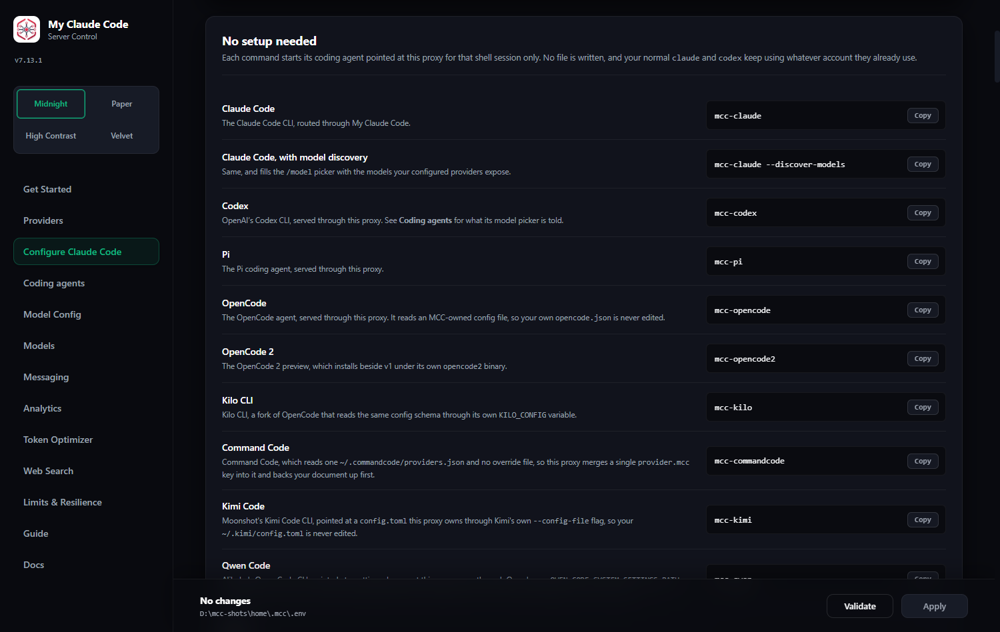
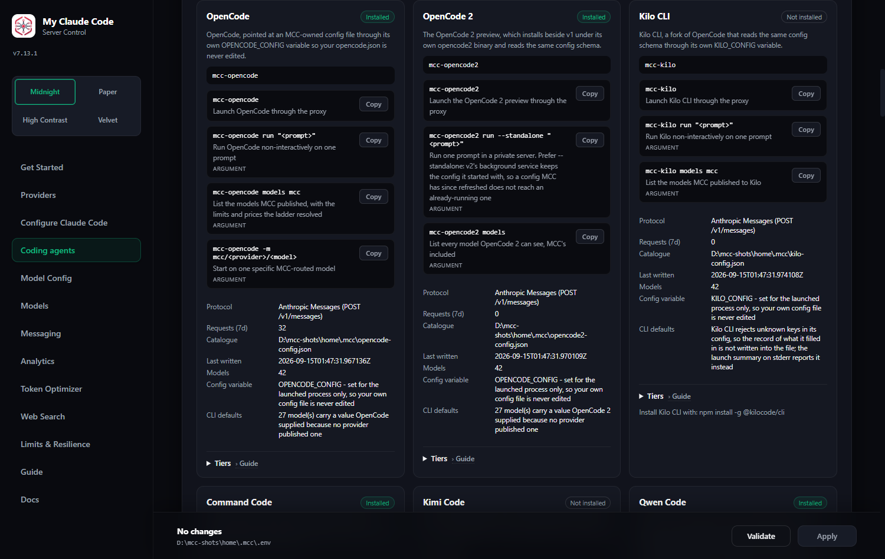
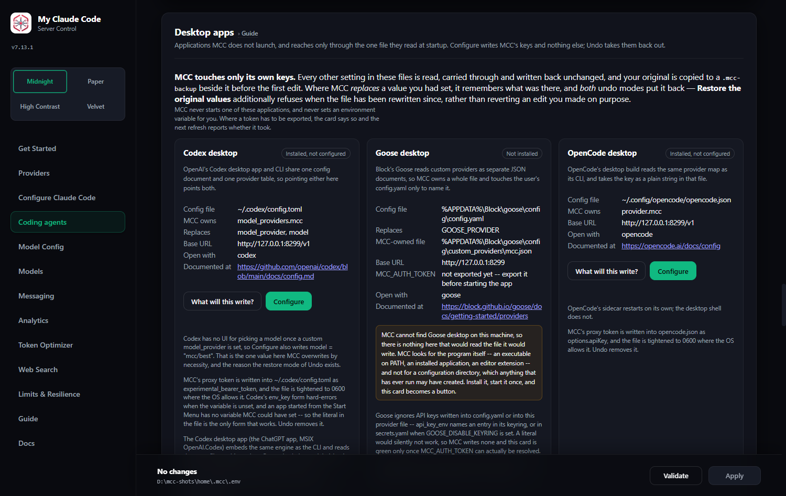

# Connecting other clients and editors

Editor integrations and any OpenAI-, Anthropic- or Gemini-shaped client. Moved out of the README in 6.57.0; nothing here changed.

For terminal use, start `mcc-server`, then run `mcc-claude`, `mcc-codex`, or `mcc-pi`. (The legacy `fcc-*` names were retired in 7.0.0: each prints the `mcc-*` name that replaced it and exits 1.) Use the guides below for editor integrations.

<div align="center">
  
  <p><em>Configure Claude Code → No setup needed: every launcher command, and what each one does to that shell session only.</em></p>
</div>

The **Coding agents** page is the same list with the detail behind it: whether the
CLI is installed on this machine, which protocol MCC answers it on, the catalogue
file MCC generates for it and when that file was last written.

<div align="center">
  
  <p><em>Coding agents: sixteen CLIs, each marked Installed or not, with its launcher commands.</em></p>
</div>

<div align="center">
  
  <p><em>One card in full: the protocol MCC answers on, the catalogue file it generates, and how many models that file carries.</em></p>
</div>

Applications MCC does not launch — the desktop apps — get a card each. It writes
only its own keys into the one file each app reads at startup, and copies the
original beside it first.

<div align="center">
  
  <p><em>Desktop apps: the file each application reads, the keys MCC replaces, and a dry run before anything is written.</em></p>
</div>

<details>
<summary><strong>Claude Code in VS Code</strong></summary>

Install the [Claude Code extension](https://marketplace.visualstudio.com/items?itemName=anthropic.claude-code). Open VS Code's user settings as JSON and add:

```json
"claudeCode.disableLoginPrompt": true,
"claudeCode.environmentVariables": [
  { "name": "ANTHROPIC_BASE_URL", "value": "http://localhost:8082" },
  { "name": "ANTHROPIC_AUTH_TOKEN", "value": "<your token: dashboard Providers -> Runtime>" },
  { "name": "CLAUDE_CODE_ENABLE_GATEWAY_MODEL_DISCOVERY", "value": "1" },
  { "name": "CLAUDE_CODE_AUTO_COMPACT_WINDOW", "value": "190000" },
  { "name": "DISABLE_AUTOUPDATER", "value": "1" },
  { "name": "DISABLE_FEEDBACK_COMMAND", "value": "1" },
  { "name": "DISABLE_ERROR_REPORTING", "value": "1" },
  { "name": "DISABLE_TELEMETRY", "value": "1" }
]
```

Match the port and authentication token to the Admin UI, then reload the extension.

</details>

<details>
<summary><strong>Codex App</strong></summary>

Start `mcc-server`, then edit your Codex configuration:

- Windows: `%USERPROFILE%\.codex\config.toml`
- macOS: `~/.codex/config.toml`

Add the matching model-catalog path and replace `YOUR_USERNAME`.

Windows:

```toml
model_catalog_json = "C:/Users/YOUR_USERNAME/.mcc/codex-model-catalog.json"
```

macOS:

```toml
model_catalog_json = "/Users/YOUR_USERNAME/.mcc/codex-model-catalog.json"
```

Then add the shared MCC settings:

```toml
model_provider = "fcc"
model = "nvidia_nim/nvidia/nemotron-3-super-120b-a12b"

[model_providers.fcc]
name = "My Claude Code"
base_url = "http://127.0.0.1:8082/v1"
env_key = "MCC_CODEX_API_KEY"
wire_api = "responses"
```

Match the model and port to the Admin UI. The `env_key` reads the same proxy auth token the `mcc-codex` launcher sets for each process. `mcc-server` publishes the catalog file under `~/.mcc/` on startup and whenever the model inventory changes, so restart the Codex App after setup or model changes, then select an MCC model from its model picker.

</details>

<details>
<summary><strong>Codex in VS Code</strong></summary>

Install the [Codex extension](https://marketplace.visualstudio.com/items?itemName=openai.chatgpt). Create or edit `~/.codex/config.toml` (`%USERPROFILE%\.codex\config.toml` on Windows):

```toml
model_provider = "fcc"
model = "nvidia_nim/nvidia/nemotron-3-super-120b-a12b"

[model_providers.fcc]
name = "My Claude Code"
base_url = "http://127.0.0.1:8082/v1"
http_headers = { Authorization = "Bearer <your ANTHROPIC_AUTH_TOKEN>" }
wire_api = "responses"
```

Match `model`, the port, and bearer token to the Admin UI, then restart VS Code. For WSL-backed Codex, edit the file inside WSL.

</details>

<details>
<summary><strong>Claude Code in JetBrains ACP</strong></summary>

Edit the installed Claude ACP configuration:

- Windows: `C:\Users\%USERNAME%\AppData\Roaming\JetBrains\acp-agents\installed.json`
- Linux/macOS: `~/.jetbrains/acp.json`

Set the environment for `acp.registry.claude-acp`:

```json
"env": {
  "ANTHROPIC_BASE_URL": "http://localhost:8082",
  "ANTHROPIC_AUTH_TOKEN": "<your token: dashboard Providers -> Runtime>",
  "CLAUDE_CODE_ENABLE_GATEWAY_MODEL_DISCOVERY": "1",
  "CLAUDE_CODE_AUTO_COMPACT_WINDOW": "190000",
  "DISABLE_AUTOUPDATER": "1",
  "DISABLE_FEEDBACK_COMMAND": "1",
  "DISABLE_ERROR_REPORTING": "1",
  "DISABLE_TELEMETRY": "1"
}
```

Match the port and token to the Admin UI, then restart the IDE.

</details>

<details>
<summary><strong>Claude Code still asks you to log in</strong></summary>

If Claude Code asks you to log in after you configure the MCC URL and token, open its state file:

- Windows: `%USERPROFILE%\.claude.json`
- macOS/Linux/WSL: `~/.claude.json`

Merge this property into the existing JSON without removing its other fields:

```json
"hasCompletedOnboarding": true
```

If the file does not exist, create it with a complete JSON object:

```json
{
  "hasCompletedOnboarding": true
}
```

Restart Claude Code or the IDE after saving the file.

</details>

<a id="optional-integrations"></a>

