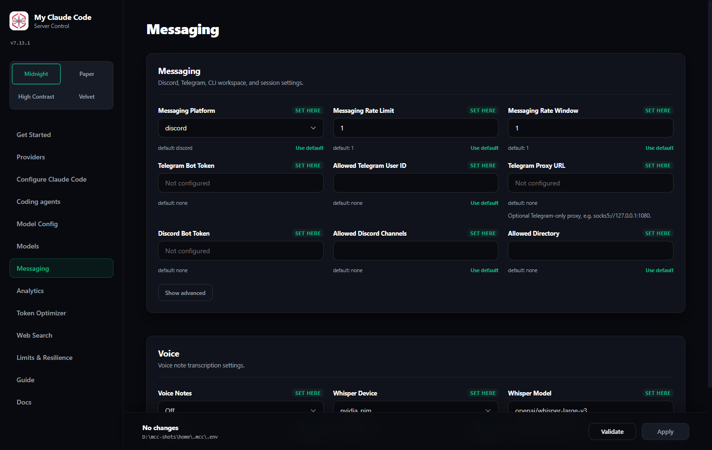

# Messaging and voice

Running coding-agent sessions through Discord or Telegram, with voice-note transcription. Moved out of the README in 6.57.0; nothing here changed.

Configure integrations from **Admin UI → Messaging**, then click **Validate** and **Apply**.

<div align="center">
  
</div>

<details>
<summary><strong>Discord bot</strong></summary>

1. Create a bot in the [Discord Developer Portal](https://discord.com/developers/applications).
2. Enable **Message Content Intent** and invite it with read, send,
   message-history, and **Manage Messages** permissions so `/clear` can remove
   user prompts.
3. Set **Messaging Platform** to **discord**.
4. Enter **Discord Bot Token**, **Allowed Discord Channels**, and an absolute **Allowed Directory**.
5. Apply the settings and restart the server if requested.

</details>

<details>
<summary><strong>Telegram bot</strong></summary>

1. Create a bot with [@BotFather](https://t.me/BotFather).
2. Get your numeric user ID from [@userinfobot](https://t.me/userinfobot).
   In groups, grant the bot permission to delete messages.
3. Set **Messaging Platform** to **telegram**.
4. Enter **Telegram Bot Token**, **Allowed Telegram User ID**, and an absolute **Allowed Directory**.
5. Apply the settings and restart the server if requested.

</details>

### Messaging commands

| Usage | Behavior |
| --- | --- |
| `/stats` | Show session state. |
| Standalone `/stop` | Cancel all work. |
| Reply with `/stop` | Cancel only the selected request while other queued requests continue. |
| Standalone `/clear` | Reset all MCC state and remove every tracked message in that chat, including user prompts, voice notes, MCC replies, Telegram's online notice, and the clear command itself. |
| Reply with `/clear` | Delete the selected message and its literal platform reply subtree while preserving its ancestors and siblings. |

<details>
<summary><strong>Voice notes</strong></summary>

Re-run the installer with the voice backend you need.

macOS/Linux:

```bash
# NVIDIA NIM transcription
curl -fsSL "https://raw.githubusercontent.com/FiredMosquito831/my-claude-code/main/scripts/install.sh" | sh -s -- --voice-nim

# Local Whisper on CPU or CUDA
curl -fsSL "https://raw.githubusercontent.com/FiredMosquito831/my-claude-code/main/scripts/install.sh" | sh -s -- --voice-local

# Both backends
curl -fsSL "https://raw.githubusercontent.com/FiredMosquito831/my-claude-code/main/scripts/install.sh" | sh -s -- --voice-all

# Local Whisper with the CUDA 13.0 PyTorch backend
curl -fsSL "https://raw.githubusercontent.com/FiredMosquito831/my-claude-code/main/scripts/install.sh" | sh -s -- --voice-local --torch-backend cu130
```

Windows PowerShell:

```powershell
# NVIDIA NIM transcription
& ([scriptblock]::Create((irm "https://raw.githubusercontent.com/FiredMosquito831/my-claude-code/main/scripts/install.ps1"))) -VoiceNim

# Local Whisper on CPU or CUDA
& ([scriptblock]::Create((irm "https://raw.githubusercontent.com/FiredMosquito831/my-claude-code/main/scripts/install.ps1"))) -VoiceLocal

# Both backends
& ([scriptblock]::Create((irm "https://raw.githubusercontent.com/FiredMosquito831/my-claude-code/main/scripts/install.ps1"))) -VoiceAll

# Local Whisper with the CUDA 13.0 PyTorch backend
& ([scriptblock]::Create((irm "https://raw.githubusercontent.com/FiredMosquito831/my-claude-code/main/scripts/install.ps1"))) -VoiceLocal -TorchBackend cu130
```

Restart `mcc-server`. In **Admin UI → Messaging → Voice**, enable voice notes, select `cpu`, `cuda`, or `nvidia_nim`, and choose the Whisper model. Local gated models need `HUGGINGFACE_API_KEY`; NVIDIA NIM transcription needs `NVIDIA_NIM_API_KEY`.

</details>

### Desktop & token optimizer

The `mcc-desktop` tray menu covers **Open Admin**, **Check Server Status**, **Restart Server**, **Server mode** (`spawn` / `attach` / `off`), **Start at Login**, **Tray Enabled**, a **Token optimizer** submenu, and **Quit**; preferences persist to `~/.mcc/desktop.json`. The **Token optimizer** card in the Admin UI controls the same RTK integration per agent as `mcc-rtk status|enable|disable|uninstall|apply`, persisted to `~/.mcc/rtk.json`. Full details, including per-platform start-at-login, are in the [Usage Guide](./USAGE.md).

