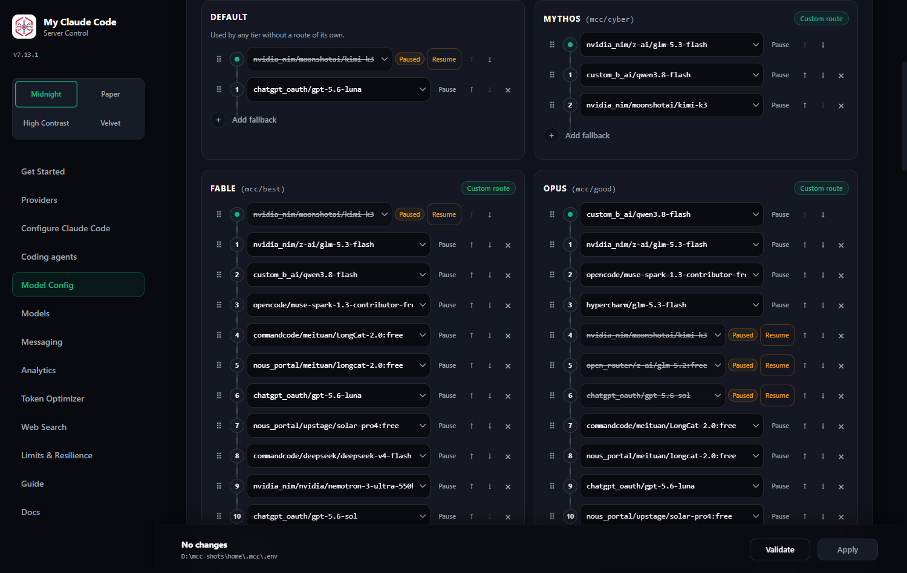
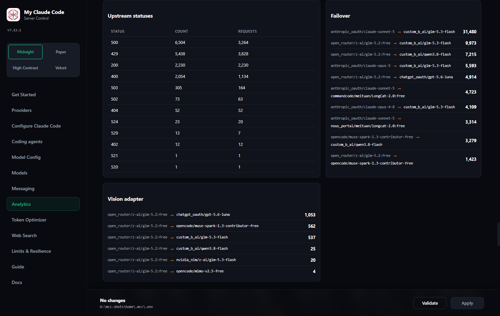
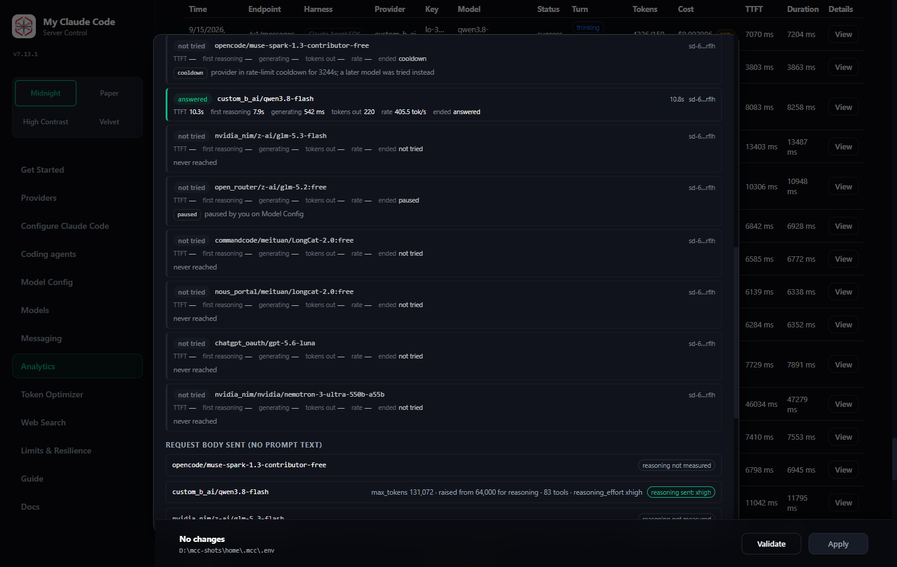
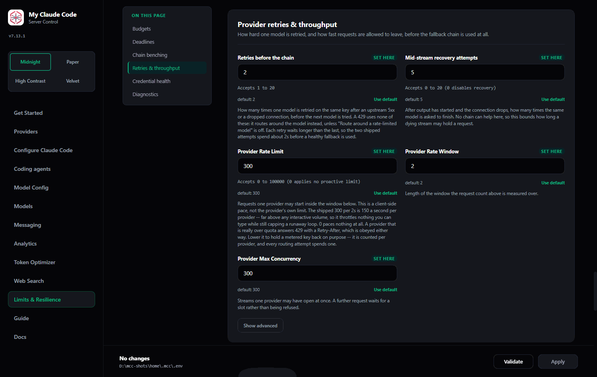
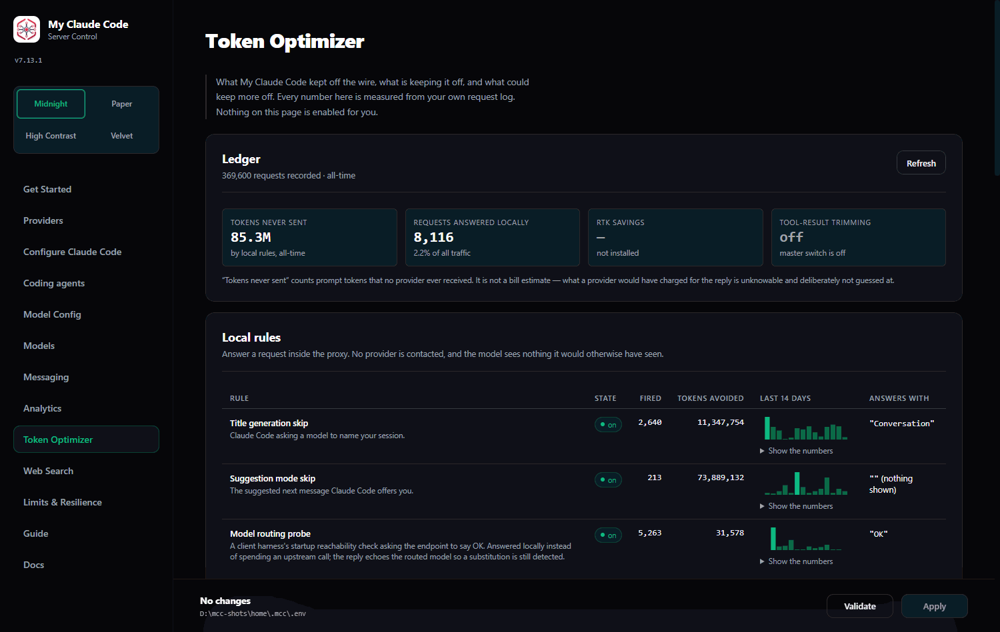

# Routing, limits and optimizer reference

The subsections the README used to carry inline: key rotation, fallback chains, output budgets, limits and resilience, and the token optimizer. Moved out of the README in 6.57.0; nothing here changed. Task-oriented versions of the same material are in the [Usage Guide](./USAGE.md).

### Multi-Key Rotation

Put multiple API keys in one variable, comma-separated, and choose a policy with `{ENV}_ROTATION`:

```bash
OPENROUTER_API_KEY="sk-or-key1,sk-or-key2,sk-or-key3"
OPENROUTER_API_KEY_ROTATION=round_robin
```

Policies:

| Policy | Behavior |
| --- | --- |
| `single` | Always the first key (default when one key is set). |
| `round_robin` | Spread requests across healthy keys in turn. |
| `least_used` | Healthy key with the fewest requests goes first. |
| `failover` (alias `on_error`) | Stick to the first healthy key until it fails, then move to the next (default when multiple keys are set). |

Each key gets its own upstream client and its own rate-limit window, so one key saturating or stalling never throttles the others.

**The order in the pool is the order these policies read.** `failover` serves the first healthy key, `single` serves the first key and nothing else, and `round_robin` cycles in that sequence. Since 7.29.0 that order is editable without retyping the variable: open **Configure** on the provider's card and drag a key by its grip, or use **Move up** / **Move down** (or ArrowUp / ArrowDown on a focused grip). It applies at once with no restart. It does rebuild the pool, so that pool's health counters and benches start again -- exactly as they do when you add or remove a key.

**A key can also carry a name.** Type one beside the key, or in the optional Name field when you add it, and that key then reads as its name wherever a credential is shown: the card, the request log row and modal, the retry ladder, the per-key analytics and the CSV. Its masked label stays on hover, and the exports keep their `key_label` column and gain a `key_name` one beside it. Names live in `~/.mcc/credential_names.json`, keyed by `sha256(key)[:16]` and never by the key itself; they never reach an upstream request, the request log or a rollup. A name is a display join resolved from the pool as it stands now, so renaming a key rewrites no history -- and a masked label two keys share resolves to no name at all rather than to a guess.

**Health model — a key is only ever judged on signals about the key.** There are exactly three:

- **401/403** — the provider rejected the credential. It is locked out on an escalating ladder (`CREDENTIAL_LOCKOUT_TIERS`, 5 min → 1 h → 24 h by default), on its own counter.
- **429** — the credential is throttled **for that model**. The (key, model) pair is benched for exactly as long as the provider asked via `Retry-After` / `x-ratelimit-reset-*`, or for `RATE_LIMIT_COOLDOWN_SECONDS` when it sent no header, capped at `RATE_LIMIT_COOLDOWN_MAX_SECONDS` (default 3600, the number hard-coded before 7.22.0; `0` removes the ceiling). `RATE_LIMIT_COOLDOWN_MODE` decides whether that happens at all: `provider` (default) is the behaviour described here, `fixed` ignores the header and always uses `RATE_LIMIT_COOLDOWN_SECONDS`, `off` benches nothing and keeps rotating. The key stays `HEALTHY` and every other model on it keeps serving, because a gateway that limits one model has said nothing about the key's others — measured on NVIDIA NIM, one model 429s on all three keys inside 0.1 s while two other models answer on those same keys in the same second. The key itself is benched only once `CREDENTIAL_MODEL_BENCH_ESCALATION` (default 2) distinct models hold a live bench on it at the same time. No ladder, no escalation beyond that one step.
- **Exhausted credits** (since 6.34.0) — the provider said in words that the account behind the key has no balance left: HTTP 402, or a 400/403 whose structured error body names an explicit billing phrase (`insufficient credits`, `purchase more credits`, `insufficient balance`, `NOT_ENOUGH_BALANCE`, `quota exceeded`, `insufficient_quota`, `payment required`, `out of credits`, `credit balance is too low`, `CreditsError`). The whole key is benched for `RATE_LIMIT_COOLDOWN_SECONDS` — a wallet is not per-model — and the request rotates to the next key, then to the next model. A **bare 402 with no recognisable phrase** rotates and falls through but charges nothing: the matcher reads only the provider's own words, through the same echo-safe reader the recovery ladder uses, so a prompt that happens to contain "insufficient credits" can never bench a key.

Everything else — timeouts, 5xx, 410, and every other 4xx — leaves a key's health untouched.

| Setting | Default | What it does |
| --- | --- | --- |
| `CREDENTIAL_LOCKOUT_TIERS` | `300,3600,86400` | The escalating bench for a key the provider keeps rejecting with 401/403, in comma-separated seconds. One step per consecutive rejection, staying at the last entry. This is the only ladder left — a 429 waits exactly as long as the provider asked, and nothing else changes a key's health. |
| `RATE_LIMIT_COOLDOWN_SECONDS` | `60` | Used **only** when a 429 carries no `Retry-After`, `retry-after-ms` or `x-ratelimit-reset-*` header at all. A header always wins in `provider` mode, and whatever the header asks for is capped at `RATE_LIMIT_COOLDOWN_MAX_SECONDS`. `0` does not pause. |
| `RATE_LIMIT_COOLDOWN_MAX_SECONDS` | `3600` | The longest wait a provider may ask for **in a header** and have MCC obey. Hard-coded at 3600 until 7.22.0. `0` removes the ceiling. It does not bound a wait published in the response **body** -- that is a statement about the account's daily allowance, is bounded at one day, and is ignored only by `RATE_LIMIT_COOLDOWN_MODE`. |
| `RATE_LIMIT_COOLDOWN_MODE` | `provider` | What a 429 costs the key. `provider` obeys the published wait under the ceiling and falls back to the cooldown above; `fixed` always uses the cooldown above; `off` benches nothing at all -- no key bench, no (key, model) bench, no provider-wide pause -- while still rotating to the next key and still walking the fallback chain. |
| `CREDENTIAL_MODEL_BENCH_ESCALATION` | `2` | How many *different* models have to be rate-limited on one key at the same time before the key itself is benched instead of just the (key, model) pair. `1` benches the whole key on every 429 (the pre-6.19.0 behaviour, and the no-redeploy rollback); `0` never escalates past the pair. |

All four live on **Admin UI → Limits & Resilience → Credential health**. Rotation *policy* is not there: it is per pool, on each provider's card.

**Everything else leaves every key untouched** — timeouts, 5xx, `410 model gone`, overloaded, 400s, context overflows, transport faults. Those are properties of the model, the request or the moment, and the same keys serve every model in a fallback chain, so charging them benched working credentials for faults they did not cause. A model that will not answer is the model's problem: the **fallback chain moves to the next model**, not the next key.

**Rotation follows the same rule.** The pool tries another key for an auth rejection, a 429, or a connection fault — cases where a different key or a different connection can genuinely help. Anything else is raised so routing can spend the time on a different model instead of on the rest of the pool.

**Availability, not just health.** A key can be perfectly healthy and still unable to serve right now: rate-limited, or out of daily budget. Rotation skips those keys and picks one that can answer immediately, instead of queueing behind a throttled key while an idle key sits unused. If *every* key is unavailable the request still goes out rather than failing — a soft guardrail should never become a self-inflicted outage.

**Provider-declared backoff.** On a 429, MCC reads the upstream's own `Retry-After`, `retry-after-ms`, and `X-RateLimit-Reset-*` headers (all the formats providers actually ship, including `6m0s` and `250ms`) and waits exactly that long, capped at an hour. Only when a provider says nothing does it fall back to a fixed minute.

**No invented ceilings.** MCC never caps a key at a number it made up. Every limit it applies comes from the provider's own response — the reset window on a 429, the status on a rejection. Providers change their limits without notice, so a hardcoded budget is wrong the moment it ships; reading what the upstream actually reports stays right.

**When rotation happens.** Exactly three cases, because they are the only ones a different key could fix: a 401/403, a 429, and a transport fault (a different key means a different connection). A timeout, a 5xx, an overload, a `410`, a plain 400 — every key in the pool talks to the same model and would meet the same answer, so those raise out of the rotating loop and the **fallback chain** gets its turn instead. One consequence is worth stating: a **timeout is not a transport fault** here. `openai.APITimeoutError` subclasses `APIConnectionError`, and reading a model that never answered as a broken socket would spend the whole pool on it, so it is excluded by name.

Failover happens before the first streamed chunk; once output has started, switching credentials would corrupt the response, so a mid-stream failure is recorded against the key but propagated to the client.

**The deliberate cost of that rule.** A key that fails with a 5xx or a dropped connection on *every* request is no longer benched — rotation tries it once per request and the chain absorbs the wasted attempt. That was the trade: on a live three-key pool, the failure classes that could have identified a dead key were the same ones benching healthy keys **1,529 times in one day** (a `410 model gone`, a rejected `top_p`, a model that stayed silent). A truly dead credential still answers 401/403, and that still locks it out.

All of this is visible and manageable from **Admin UI → Providers**: press **Configure** on a provider's card to open its key pool, which lists every key with its own health and usage, lets you add keys (one, or several comma-separated), reorder them, give each one a name, and remove them individually, and carries the rotation policy. **Refresh models** on the card face makes a real call to the provider. For historical per-key request volume, error rate, tokens, and latency, see [Per-Key Attribution](#per-key-attribution).

Web search provider keys share the same rotation engine — see [Web Search → Multi-key rotation](#multi-key-rotation-web-search-keys).

<div align="center">
  
  <p><em>Credential health, on Limits &amp; Resilience: the two settings that can bench a key, and nothing else.</em></p>
</div>


### Fallback Chains

Every tier can carry an ordered list of stand-ins. If the model a request routes to cannot serve it, MCC tries the next entry in that tier's chain, then the next, until one answers.

<div align="center">
  
  <p><em>Model Config: one rail per tier. The struck-through rows with an amber Paused badge keep their place in the chain and are never tried.</em></p>
</div>

<div align="center">
  
  <p><em>The same rails with the chains expanded — a ten-deep Fable route beside a three-deep Mythos one.</em></p>
</div>

What the chains actually did is on Analytics. The **Failover** panel counts the
pairs that fired: which primary was replaced, by which stand-in, how often.

<div align="center">
  
  <p><em>Failover, on Analytics: every primary → stand-in pair that actually fired, with its count, beside the upstream statuses that caused them.</em></p>
</div>

| Setting | Chain used |
| --- | --- |
| `MODEL_FALLBACKS` | after `MODEL`, for any tier with no override of its own |
| `MODEL_MYTHOS_FALLBACKS` | after `MODEL_MYTHOS` |
| `MODEL_FABLE_FALLBACKS` | after `MODEL_FABLE` |
| `MODEL_OPUS_FALLBACKS` | after `MODEL_OPUS` |
| `MODEL_SONNET_FALLBACKS` | after `MODEL_SONNET` |
| `MODEL_HAIKU_FALLBACKS` | after `MODEL_HAIKU` |

A single request shows the same thing from the other end: the ladder it walked,
with a reason beside every model it did not try.

<div align="center">
  
  <p><em>One request's ladder: the first model sat out a rate-limit cooldown, the second answered, and the rest were never reached. The block below shows the request's shape with no prompt text in it.</em></p>
</div>

**Pausing one entry.** Each row on a route rail has a **Pause** button. A paused model keeps its place in the chain and stays fully on screen, but the router never tries it: no attempt is spent, no deadline is consumed, and the request log still lists it as *not tried* with the reason `paused`. Unlike everything else on that page a pause is written the moment you click it, with no Apply, and the status panel offers an Undo. Pausing is per route — the same model paused on Opus keeps serving Sonnet — and it is stored in `MODEL_PAUSED`, `MODEL_MYTHOS_PAUSED`, `MODEL_FABLE_PAUSED`, `MODEL_OPUS_PAUSED`, `MODEL_SONNET_PAUSED`, `MODEL_HAIKU_PAUSED` and `MODEL_VISION_PAUSED`. **Pausing is not hiding:** the Models page's visibility lists change what appears in `/v1/models` and never change routing, and these change routing and never change listings. A route whose every model is paused fails with an error naming the key rather than quietly falling through to another route.


Each is a comma-separated list of `provider/model` refs, in priority order — for example `MODEL_OPUS_FALLBACKS="cerebras/qwen-3-coder-480b,groq/moonshotai/kimi-k2"`. Edit them in **Admin UI → Model Config**, where each chain sits directly under the model it backs up. Drag a row by its grip to reorder it, Ctrl/Cmd-click or Shift-click to pick several, drag onto another tier to copy (hold Shift to move), and drop onto a card's top slot to make that model the route's own. The up/down arrows still do the same job one step at a time, Ctrl+Z undoes the last drag, and nothing is saved until you press **Apply**.

A tier with its own override uses only its own chain; the two are never merged. So `MODEL_OPUS` set means Opus tries `MODEL_OPUS` then `MODEL_OPUS_FALLBACKS`, while an unset `MODEL_SONNET` means Sonnet tries `MODEL` then `MODEL_FALLBACKS`.

**Failover stops when the client has actually seen bytes.** A model that fails while connecting, authenticating, rate-limiting, or before emitting anything is replaced silently. What counts as "seen" depends on the client:

- **Streaming requests** commit at the first chunk. A model that fails *after* it has begun answering is not replaced, because the reply is already on the wire and switching mid-answer would splice two different completions together.
- **Non-streaming requests** commit at the end. The response is assembled into a single message before the client sees anything, so a failure at *any* point still falls back, and the failed attempt's partial output is discarded with it.

Requests that name a provider and model directly (`open_router/…`) are never redirected — an explicit choice is honoured as given.

**A silent model counts as a failure too — but only once you say when.** A provider that accepts the request and then produces nothing holds it until the transport read timeout, and the chain gets its turn long after the client gave up. These settings bound it, on **Admin UI → Limits & Resilience** (deadlines on the **Deadlines** card, the last two on **Chain benching**).

> **Since 6.16.0 all four deadlines ship at `0`, meaning no limit. With the shipped zeros MCC never ends a silent or stalled upstream on its own: the fallback chain moves only on an error the provider actually returns.** A model that thinks for forty minutes is left to think; a stream that goes quiet and never resumes is left open until the transport gives up (`HTTP_READ_TIMEOUT`, 300 s by default, applied per read rather than per request). This is deliberate — a deadline that kills real work is a worse failure than a stall you can see in Analytics, and MCC is configured by the operator who runs it. **To get time-based failover, set the ones that matter to you:** `FALLBACK_FIRST_TOKEN_TIMEOUT` (silence before any output — the only one that produces a *failover*, since nothing has streamed yet), `FALLBACK_STALL_TIMEOUT` (silence after output started — ends the request; no failover is possible past the first token), `FALLBACK_TOTAL_TIMEOUT` (the whole request, across every attempt and retry). The Deadlines calculator on that page shows the resulting per-model allowance for your own chains. An install that already sets any of these keys keeps its own value; nothing is rewritten on upgrade. Every error MCC raises from one of these limits now names the env var that set it and the card that edits it.

| Setting | Default | What it does |
| --- | --- | --- |
| `FALLBACK_FIRST_TOKEN_TIMEOUT` | `0` (no limit) | The first-token deadline: seconds a model may stay silent before the next model takes over. Nothing has streamed yet, so the handover is invisible — this is the only deadline that produces a *failover* rather than an ending. `0` (shipped) waits indefinitely. When you set it, each attempt also gets an equal share of what is left of `FALLBACK_TOTAL_TIMEOUT`, counting itself and every model still behind it, and what applies is whichever is smaller — unless `FALLBACK_ATTEMPT_SHARE_FLOOR` raises that share. **Admin UI → Limits & Resilience** computes it per route for your own chains. |
| `FALLBACK_ATTEMPT_SHARE_FLOOR` | `3600` (one hour) | **Changed in 6.68.0** — was `0`. Smallest slice of `FALLBACK_TOTAL_TIMEOUT` one attempt may be cut down to. A **chain-side** allowance — it bounds each model's first-token wait, never a retry of the same model. Without it the equal share alone decides, and on a long chain it silently undercuts the deadline above: 600 ÷ 8 models = 75s, so a box reading `120` logged `produced no first token after 74.9494s`. `3600` (shipped) is an hour-wide floor that cannot fire while `FALLBACK_TOTAL_TIMEOUT` is `0` — there is no budget to divide — and becomes a real floor the moment you set a budget; `0` divides the budget equally with no floor. It is moot out of the box either way, because the budget ships at `0`. The trade once you set both: N silent models can spend up to N × this floor before the budget clamps them, and the models after that get less, or nothing — the Deadlines calculator shows both numbers and warns when the floor cannot fit. |
| `FALLBACK_TOTAL_TIMEOUT` | `0` (no limit) | Whole-request budget across every attempt, retry and recovery — the backstop for a stream that committed and then stalled. Divided between the models still to try, floored by `FALLBACK_ATTEMPT_SHARE_FLOOR`. `0` (shipped) disables it: a request may run for as long as the upstream keeps the connection open. |
| `FALLBACK_STALL_TIMEOUT` | `0` (no limit) | Seconds a stream that *has* started producing may then go quiet. Measured from the last chunk that moved the answer forward, so keepalives cannot hold a dead stream open and a model producing steadily is never cut. `0` (shipped) allows an unlimited pause. No failover is possible here — the reader has already seen the first model's words — so this ends the request rather than moving the chain. |
| `FALLBACK_END_CLEANLY_AFTER_COMMIT` | `true` | What happens when a model that has *already started answering* then fails. The chain cannot step in — the reader has seen its words — so instead of an API error printed under a half-written answer, the message is ended: the open block is closed and the client is told the answer was cut short. The session continues with a short but complete reply. Set `false` to go back to the error. |
| `FALLBACK_RESUME_AFTER_COMMIT` | `true` | Goes one step further than the row above: rather than only *ending* a half-written answer, the next model on the route is handed the text already on screen and asked to carry on from it, and its output is spliced into the same message — so the turn survives. Same chain, same bench, same budget as an ordinary fallback; nothing new is retried. Continuation is model-dependent (many models answer nothing, and one that starts the answer over is rejected rather than shown twice), and every one of those outcomes falls back to the short message above rather than an error. A half-written tool call is never continued. Set `false` to stop at the short message. |
| `FALLBACK_EJECT_SECONDS` | `10` | **Changed in 6.68.0** — was `30`. How long a benched model stays out of the chains that name it. Half a minute outlives most of the sessions that bench a model. |
| `FALLBACK_COOLDOWN_STEP_OVER_FLOOR` | `5` | Seconds of remaining rate-limit cooldown that make it worth trying the next model rather than waiting. Shorter waits are waited out, because stepping over costs the chain a slot. |

**A model that dies after it started answering ends the message, not the turn.** The commit boundary above cuts both ways: once real text has reached the client no other model can take over, and until 6.15.0 that meant every failure past that point — the stall deadline, the total budget, a mid-stream 5xx, a dropped connection — reached Claude Code as an API error under a partial answer, and the turn was dead. One incident streamed 1,333 characters, went quiet, and was reported as `API Error … stopped producing output`, with seven healthy fallback models recorded as `not tried`. Since 6.15.0 the stream is closed properly instead: the open text or thinking block is stopped, a `message_delta` carrying `stop_reason: max_tokens` says the answer was cut short rather than finished, and `message_stop` ends it. Nothing about *when* the stream is stopped changed — only what the client is handed. The answer is genuinely incomplete, and the request detail says so: the attempt still reads `failed` with its real cause, alongside `ended early after N chars`. One case still errors and cannot be rescued — a stream that stopped halfway through a tool call's arguments, because a tool call cannot be completed honestly and Claude Code would *run* it.

**And since 6.18.0 it can be finished rather than only ended.** With `FALLBACK_RESUME_AFTER_COMMIT` on (the default), the next model on the route is given the text already on screen and asked to continue from it, and its output is spliced into the same message: one envelope, one text block, one ending. There is no visible seam, deliberately — the reader gets an answer, not a report about routing — and the model change is recorded in the request detail instead, as *continued here after `<model>` stalled at N chars*. It is the same chain as an ordinary fallback: benched models are skipped, `FALLBACK_SKIP_KINDS` still ends a route, the attempt shares the same budget, and no new retry layer or deadline exists. What the second model does with the request is not guaranteed: measured across thirteen live model/host pairs, some continue cleanly, most answer nothing, and a few start the answer over — and a restart is detected and thrown away rather than shown twice. Every unusable continuation lands on the truncated message above, never on an error, which is why this can ship on.

Ejection can never empty a chain: if every model on a route is benched, they are tried in order anyway — skipping a bad model is an optimisation, refusing to try anything is an outage.

**What benches a model.** `FALLBACK_BENCH_ENABLED` is the master switch, and it **ships off**: every model in the chain is tried every time, so a model failing half its requests is still retried at chain position 0 on every single request. It reads on two pages — **Model Config**, at the top of the routing view, beside the routes it governs, and **Limits & Resilience → Chain benching**, where it gates the tuning below. They are the same setting; changing either changes both. With it off *every* control below is inert. Turn it on and `FALLBACK_BEHAVIOR` picks the evidence:

**Only model-shaped failures count.** With benching on, a failure benches a model only when it says something about the *model*: an upstream 5xx, an overloaded response, or a 401/403 from the provider. Timeouts (first-token, stall, budget), 429s, exhausted credits, `context_length` and malformed requests are facts about the *request* or the *account* — they fail identically on a healthy model and a dead one — and never bench anything. That distinction is why the switch could be turned off by default: the bench used to count everything, so one prompt larger than any model's context window ejected the entire chain and the request was answered by whichever model was left holding the 400.

| Setting | Default | What it does |
| --- | --- | --- |
| `FALLBACK_BENCH_ENABLED` | `false` | Master switch for benching. Off (the default) tries every model every time; on makes the whole card live. Set on **Model Config** or on this card — one setting, two places. |
| `FALLBACK_BEHAVIOR` | `rate_based` | `rate_based` benches on a failure rate over a window; `legacy` restores the older consecutive-count rule. |
| `FALLBACK_EJECT_WINDOW` / `FALLBACK_EJECT_FAILURE_RATE` | `10` / `0.5` | `rate_based` only: benched once 5 of the last 10 requests fail. |
| `FALLBACK_EJECT_MIN_SAMPLES` | `8` | `rate_based` only: nothing is benched until that many of its requests have been seen, so one failure on a barely-used model cannot trip it. |
| `FALLBACK_EJECT_AFTER_FAILURES` | `3` | `legacy` only: consecutive failures. `0` turns counting off. |
| `FALLBACK_RETRY_FIRST` | `skip` | `retry_once` gives the **primary only** one more attempt on a transient error before the chain moves on. An already-failed fallback is never retried. |

The card keeps the *unselected* mode's fields visible but disabled, each carrying its own note — "Not used while eject mode is `legacy`", "Not used while benching is off" — rather than dimming them and leaving you to infer why. Disabled fields are skipped by the change tracker, so switching modes cannot save the other mode's values by accident.

**A rate-limited model is routed around, not waited on.** Since 6.20.0 a `429` never sleeps and never spends a retry: the (key, model) pair is benched and the request moves to the next model on the **same provider**, because a gateway that limits one model usually still answers another on the same key in the same second. One measured request spent 51 of its 57 seconds asleep between retries of a model that was refusing in 0.2 s, with a healthy sibling one chain slot away. `RATE_LIMIT_ROUTES_AROUND_MODEL=false` restores retry-then-rotate.

**One model is still retried on a 5xx before the chain is used.** An upstream `5xx` or a dropped connection is retried against the same model on an exponential backoff — that is the one failure a second knock on the same key can fix — and four settings shape it:

| Setting | Default | What it does |
| --- | --- | --- |
| `PROVIDER_RETRY_ATTEMPTS` | `2` | **Changed in 6.68.0** — was `3`, and `5` before 6.20.0. Tries one model gets on the same key after a 5xx or a dropped connection. A 429 uses none of them. The third try lands about six seconds after the first, by which time a healthy model behind it could have answered. |
| `PROVIDER_RETRY_BACKOFF_BASE_SECONDS` | `2` | How long a provider waits before its first retry of a 5xx. Each further retry doubles it. |
| `PROVIDER_RETRY_BACKOFF_MAX_SECONDS` | `5` | **Changed in 6.68.0** — was `10`. The longest single wait — the ceiling the doubling backoff stops growing past. The chain is not consulted until the ladder is spent, so this is added to how long a request waits before another model is tried. A 429 walks no ladder at all. |
| `PROVIDER_RETRY_BACKOFF_JITTER_SECONDS` | `0.5` | **Changed in 6.68.0** — was `1`, and is kept below the ceiling above. Random spread added to each wait, so several clients hitting the same limit do not retry in lockstep. |

**A context overflow is not a malformed request.** Both usually arrive as HTTP `400`, and until 5.43.0 MCC treated every `400` the same way — as a client error that would fail identically everywhere, so the whole chain was abandoned. That is right for a malformed body and wrong for a conversation that outgrew the model's window, which is exactly the case a larger-window fallback exists to cover. Context-length failures are now classified as their own kind and fall through to the next model.

| Setting | Default | What it does |
| --- | --- | --- |
| `FALLBACK_SKIP_KINDS` | `invalid_request` | Comma-separated failure kinds that abort the chain instead of falling through. Known kinds: `invalid_request`, `model_rejected`, `context_length`, `authentication`, `permission`, `quota`, `rate_limit`, `overloaded`, `timeout`, `upstream`, `unavailable`, `free_tier`. Since 6.46.0 `invalid_request` means only a 400 whose own message says the request is *malformed*; every other 400 is `model_rejected` and falls through. Set `FALLBACK_SKIP_KINDS=invalid_request,model_rejected,context_length` to restore the pre-5.43.0 behaviour of giving up on any `400`. `quota` is deliberately absent from the default: an account out of credits says nothing about the request, and the next key or the next model may well answer it. |

**Thinking is not answering.** A reasoning model that streams its thoughts and never writes an answer used to commit the route on its very first thought: from that moment no other model could take over, the stall guard never fired because thoughts kept arriving, and the request ran until the whole budget ended it. Measured across 21 days of real traffic, 44 of 499 budget exhaustions were a stream that had only reasoned, and 490 of the 499 never left the first model on the chain.

Since 5.50.0 reasoning is held back like an envelope frame, so the attempt stays abandonable and the next model can still answer. Two settings control it, both on **Admin UI → Limits & Resilience → Deadlines** — beside the first-token deadline they pre-empt, rather than on Model Config where the reasoning deadline used to sit:

| Setting | Default | What it does |
| --- | --- | --- |
| `FALLBACK_ON_REASONING_ONLY` | `true` | Hold reasoning back so a model that only thinks does not commit the route. The cost is that thinking no longer streams live — it arrives with the answer, or once 64 KB have accumulated. Set `false` to watch a model think in real time and accept that it commits the route. |
| `STREAM_COMMIT_HOLDBACK_CHARS` | `0` | Visible characters that must arrive before output is released to the client, *on top of* `STREAM_COMMIT_HOLDBACK_SECONDS` — both conditions, or the stream ending. While output is held a failure is still invisible, so the route can start over on the next model with nothing shown; raising it buys that for a model that writes a word and dies, and costs exactly that much time-to-first-visible-word on every request. `0` (shipped) asks only the clock. |
| `FALLBACK_REASONING_ANSWER_TIMEOUT` | `0` (no limit) | Seconds a model may think before the chain moves on. A flat allowance on purpose: the attempt's share of `FALLBACK_TOTAL_TIMEOUT` is sized for a model that has shown *nothing*, and 600s split across an eleven-model chain leaves 54s, far too little to think in. `0` (shipped) lets a thinking model run to the whole request budget — and, while that is `0` too, to no limit at all. |

**Silence is not a closed connection.** Since 7.46.0 a streaming response that has been silent for a while -- no model has produced a frame yet, or one has and then gone quiet -- gets a keepalive frame its protocol defines as meaningless: `event: ping` on `/v1/messages`, an SSE comment on `/v1/chat/completions`, `/v1/responses` and Gemini. It is written at the HTTP boundary, outside the request log's view, so it never moves `ttft_ms` or any other measurement, and every other byte of the answer is identical with it on or off. It helps OpenAI and Gemini SDK clients and any proxy between the client and MCC that closes idle connections. **It does not help Claude Code by default**: the official Anthropic SDK drops `ping` before its idle timer sees it, and only `_CLAUDE_CODE_ASSUME_FIRST_PARTY_BASE_URL=1` in Claude Code's environment makes the bytes count. Settings on **Admin UI → Limits & Resilience → Stream keepalive**, where a card also says when a deadline above outlasts Claude Code's 300 s idle floor.

| Setting | Default | What it does |
| --- | --- | --- |
| `STREAM_KEEPALIVE_IDLE_SECONDS` | `30` | Seconds of silence before the first keepalive. A keepalive sent before any model answered commits the HTTP 200, so a failure after it arrives as an error inside the stream instead of an HTTP status. `0` never sends one. |
| `STREAM_KEEPALIVE_INTERVAL_SECONDS` | `20` | Seconds between keepalives while the silence lasts; a real frame resets the clock. |
| `STREAM_KEEPALIVE_MAX_SECONDS` | `300` | Longest single stretch of silence kept alive. Past it nothing more is written and the client's own idle timer runs exactly as with keepalives off. `0` = no cap. |

Every attempt is recorded, and since 6.12.0 so is every *try* inside an attempt. **Analytics** shows the model that actually answered rather than the one the route started from, and the request detail draws the whole chain — every model the chain reached, and under each one every upstream try it made, with the status it met, the credential it used and the seconds it spent waiting — see [Route tracing](#route-tracing).

### Output Token Budget

**Each model is asked for what it can actually produce.** MCC reads the routed model's published output limit — the provider's own `/models` payload first, the [models.dev](https://models.dev) catalog second — and sizes `max_tokens` from it:

- The client asked for **less** than the limit → it gets exactly what it asked for.
- The client asked for **more** → the request is lowered to the model's maximum and a `MAX TOKENS CLAMPED` warning names the model, the ask and the limit. Sending the original value instead just buys a 400 from the provider.
- The client asked for **nothing** → the model's **full** limit is sent. A model that can write 230,400 tokens is used as one.
- The request is going to **think** → the ask is raised to the model's published limit first, and the clamps above then apply to *that*. Thinking tokens and answer tokens are spent from one `max_tokens`, so a client that sized the number for an answer unknowingly sized the thinking too — and the model, not the client, is the one that knows what it can emit. An unknown limit is never widened: a number nobody published has no standing to raise an explicit request, exactly as it has none to lower one.

For a 64,000-token ask at the `max` reasoning tier on a 262,144-output model, that is the difference between starving the answer and not:

| | before | after |
| --- | --- | --- |
| wire `max_tokens` | 64,000 | 131,072 (the model's limit, held to the ceiling) |
| answer reserve | 16,384 | 16,384 |
| thinking budget | 47,616 | 114,688 |
| answer room left | 16,384 | 16,384 |

**The rung does not widen anything — the presence of reasoning does.** `low` and `max` produce the same `max_tokens`; the rung then decides how much of that allowance the thinking may spend. On a host that takes an effort word rather than a number, nothing about the level changes at all — only the answer stops being squeezed out by the thinking in front of it. With reasoning off, the wire is byte-identical to 6.7.0 apart from the ceiling, which now applies to every request.

This replaces a flat 81,920 that every model got regardless. On real routes that number was simultaneously too high (`minimaxai/minimax-m3` and `thinkingmachines/inkling` both stop at 16,384) and too low (`tencent/hy3:free` does 128,000, `meituan/longcat-2.0:free` 131,072).

These cover what the model itself cannot answer, all on **Admin UI → Limits & Resilience → Output & thinking budgets**:

| Setting | Default | What it does |
| --- | --- | --- |
| `MAX_OUTPUT_TOKENS_UNKNOWN_DEFAULT` | `32768` | Used **only** when no source publishes a limit for the routed model. A fallback for a missing client value, never a cap on a present one — a number nobody published has no business shrinking an explicit request. |
| `MAX_OUTPUT_TOKENS_FLOOR` | `8192` | **New in 6.47.0, and it changes behaviour on update.** The smallest allowance any request is sent with — the one setting here that raises a number rather than lowering it. A client that hardcodes a tiny `max_tokens` gets a truncated answer out of a model that could have finished it. Bounded twice: never above the routed model's own published limit, and applied *before* the context headroom so it can never re-inflate a budget the context cannot hold. It stands down on an explicit `max_tokens: 0`, and the ceiling below beats it. Not the same setting as `MAX_OUTPUT_TOKENS_CONTEXT_FLOOR`. **Set `MAX_OUTPUT_TOKENS_FLOOR=0` to turn it off** and restore 6.46.0. |
| `MAX_OUTPUT_TOKENS_CEILING` | `131072` | Absolute head on every request, whatever the model can do — reasoning or not. It ships set because a thinking request is sized from the routed model's full published limit, and OpenAI/Azure-style limiters reserve `max_tokens` against the TPM bucket *before* generating — so an unbounded thinking turn on a 262,144-output model can 429 a request that would otherwise have been served. It never raises a model above its own limit. Range `0`–`1048576`; **`0` is the sentinel for "no ceiling"**, and blank resolves to the default rather than to off. |
| `MAX_OUTPUT_TOKENS_CONTEXT_MARGIN` | `1024` | Tokens reserved for the prompt when a model's output limit is as large as its whole context window — about 15% of the catalog reports exactly that, and on those, asking for the full output leaves no room for the messages. |
| `MAX_OUTPUT_TOKENS_CONTEXT_FLOOR` | `4096` | Smallest budget the reserve above may produce. A wrong or small published context can leave a handful of tokens, and a request carrying `max_tokens: 3` succeeds with a one-token answer — which looks like a useless model rather than a misconfigured catalog. Below this, the request is sent unchanged so the provider reports the real context error. `0` sends any positive headroom. |
| `REASONING_ANSWER_FLOOR_MAX` | `16384` | Most tokens ever held back from the output allowance for the visible answer while extended thinking is on. Thinking and the answer share one `max_tokens`. The reserve applied is `min(this, output // 2)`, so a 16,384-output model keeps a working thinking budget instead of zero. |
| `ANTHROPIC_DEFAULT_MAX_OUTPUT_TOKENS` | `81920` | **Settable since 6.47.0** — it was a hardcoded literal threaded through every provider profile. The `max_tokens` written onto a request that reached a provider with none of its own and no published limit to take one from. A fallback, never a cap: a routed request was bound to the model's real limit long before this applies. `0` sends no `max_tokens` at all. |
| `REASONING_EFFORT_BUDGET_RATIOS` | `0.10,0.20,0.50,0.80,0.95,0.95` | **New in 6.47.0.** Share of the output allowance each effort may spend on thinking, in order: minimal, low, medium, high, xhigh, max. Six values, each strictly between 0 and 1, never decreasing. A small ratio does not disable thinking — Anthropic's 1,024-token minimum is applied afterwards and wins above an allowance of 1,025. |

**Two of these are overridable per model, since 7.25.0.** A row in `~/.mcc/model_overrides.json` -- or the Models page, which writes it -- may carry `reasoning_preference` and `max_output_tokens`. The reasoning word **outranks `REASONING_POLICY` and the `REASONING_*` tier settings for that model**: precedence runs model row, provider row, tier setting, per-harness tier override, `REASONING_POLICY`, then the client's own ask, and `"reasoning_preference": "client"` hands one model back to the client. `max_output_tokens` is a cap -- `min(published limit, your number)` -- so it only ever lowers, and the ceiling and context headroom in this table still have the last word. Both are opt-in: with neither set, every number here resolves exactly as it did in 7.24.0. See [USAGE](USAGE.md#per-model-reasoning-and-output-preferences).

**A third, and it is not a number: `response_surface`.** It names which wire API one model is posted to -- `chat_completions`, `responses` or `messages` -- and it never reaches a body. Precedence for it is its own: the override, then what a probe of this deployment proved, then what the vendor's published registry says (models.dev's per-model `provider.npm`), then -- 7.35.0 -- the surface the *profile* declares for the case nobody has an opinion, and only then Chat Completions. The fourth rung exists because the third is silent on every fresh or keyless install, whose models.dev cache has not been fetched yet: a gateway that fronts three APIs names the door to knock on first rather than inheriting a constant written for the 39 providers that have one. Both OpenCode profiles declare Chat Completions there; every other profile declares nothing and resolves exactly as it did. Whatever wins is folded against what the **provider declares it serves**, and a surface outside that list resolves to `unservable` with the reason shown on the Models page rather than the model disappearing.

Which providers declare more than one surface: `opencode` and `opencode_go` by profile, and -- since 7.33.0 -- any custom provider whose entry ticks a second wire API. Every other provider declares nothing, which means one surface and no resolution at all. The Models page offers the override only where there is more than one door to choose between, and offers only the doors that host declares.

**One more ceiling lives off this card.** NVIDIA NIM carries its own `max_tokens` in the nested NIM settings, and where it is set it lowers whatever the table above resolved — for NIM routes only. It ships unset, so it is inert on a default install. It is deliberately not on the Budgets card: the nested NIM group has no flat environment variable of its own, and giving it one is a change of its own rather than part of this table.

**Context is respected.** Where the provider publishes a context window, the budget is bounded by what the prompt left of it, minus the margin. If the prompt already fills the window the request is sent unchanged, so the provider reports the real error rather than MCC guessing at it.

**A provider's own rejection still wins.** Some upstreams cap output below what they publish and say so in a 400 (`max_completion_tokens must be less than or equal to 40960`). MCC parses that, retries once, and remembers the cap for that model — and a learned cap always beats a catalogue value, because it came from the deployment actually serving the request.


### Limits & Resilience

Everything above that is a number rather than a model lives on one page, **Admin UI → Limits & Resilience**. It was a single flat grid of 37 fields until 6.2.0; it is now six cards behind a sticky section rail, each stating in one line what it decides:

| Card | What it decides |
| --- | --- |
| **Output & thinking budgets** | How large one answer may be, and how it is split between thinking and the answer. A per-model limit published by the provider always wins over anything here. |
| **Deadlines** | How long one model may hold a request before the chain moves on — including `FALLBACK_REASONING_ANSWER_TIMEOUT`, which used to sit on Model Config away from the deadline it pre-empts. |
| **Chain benching** | Whether a model that keeps failing is skipped, and on what evidence. |
| **Provider retries & throughput** | How hard one model is retried, and how fast requests may leave — `HTTP_*_TIMEOUT`, `PROVIDER_RATE_*` and `PROVIDER_MAX_CONCURRENCY` moved here from Providers, where the transport ceiling underneath every deadline had no description at all. |
| **Credential health** | What one API key's failures cost it. Nothing else can bench a key. |
| **Diagnostics** | Logging and debugging flags, `LOG_LEVEL` included. |

Two groups deliberately left: the nine `REQUEST_LOG_*` settings are at the bottom of **Analytics**, and the nine `DESKTOP_*` ones on **Providers** — the page that shows the consequence owns the control. `FALLBACK_SKIP_KINDS` stays on **Model Config** with a cross-link, because it is a routing decision, not a limit.

<div align="center">
  
  <p><em>Limits &amp; Resilience: six cards behind a section rail, each one subsystem.</em></p>
</div>

**The number in the box is not the number you get unless the floor holds it there.** The allowance is `min(first-token deadline, this attempt's share of the total budget)`, and that share is `total ÷ models still to try`. On a ten-model Opus chain with a 600 s budget a field reading `120` gives each model 60 s — the field is a ceiling, not the allowance. `FALLBACK_ATTEMPT_SHARE_FLOOR` stops that share falling below the deadline you set, so the box means what it says; `0` is the pure equal share and `3600` (shipped since 6.68.0) is a floor wider than any interactive request. With the budget at the shipped `0` none of this arithmetic runs whatever the floor says, and the calculator agrees: every route reads **no limit**, and the headline names `HTTP_READ_TIMEOUT` as the only thing left that ends a silent model.

The trade is real and the page states it rather than hiding it: a floor of 180 s across a ten-model chain would need 1,800 s of budget, so with 600 s only the first three silent models can use the whole floor and the rest get what is left, then nothing. The Deadlines card carries a calculator that computes all of this per route from your own chains, names the floor in the formula when the floor is what decides, and warns with the fix rather than the complaint: the budget that would fit the floor, the total budget that *would* honour the deadline you configured, or that `HTTP_READ_TIMEOUT` sits below the deadline above it — in which case a slow model produces a transport error instead of a clean handover.

<div align="center">
  
  <p><em>The deadline calculator: one row per route, the real first-token share, and the budget that would honour the number you typed.</em></p>
</div>

What it deliberately does *not* model: time already spent on the request, a primary retried under `FALLBACK_RETRY_FIRST`, benched models shortening the chain, or the reasoning deadline taking over once a model starts thinking. It is the worst case for the first model on a route, not a fixed slot — time an attempt does not use flows to the models behind it.

The card below it is the one that decides how hard a single model is retried
before the chain is used at all, and how fast requests are allowed to leave.

<div align="center">
  
  <p><em>Provider retries &amp; throughput: the transport ceiling that sits underneath every deadline above it.</em></p>
</div>

<a id="proxy-chains"></a>

### Proxy Chains: More Than One Way Out

Every provider has had a `<PROVIDER>_PROXY` setting for a long time. It is one string, read once in the provider's constructor and baked into a long-lived client: if it dies, every request to that provider dies with it, and if the provider meters a free tier **per source address** there is nothing to switch to. **Admin UI → Proxying** is the resource that expresses the other shape — an ordered list of addresses for one provider, a rotation policy, and the failures that move a request to the next one.

**A provider with no chain behaves exactly as it always has.** Its `<PROVIDER>_PROXY` is used as the single static address, the `.env` is never rewritten, and nothing about the request path changes — which is every provider on every install until somebody opens the page. When you do add a chain, the first entry can be seeded from that stored address, and the key keeps its value: the chain simply becomes what gets used while it has entries.

#### Where the chain sits

Inside the credential pool, not above it. A provider with two keys and a three-entry chain is one credential pool over two proxy pools over six clients, and everything above the proxy pool — credential rotation, the (key, model) bench, the route-around, the retry ladder, the deadlines — is untouched. When a chain is exhausted, **the same error escapes that would have escaped with no chain at all**, and the request follows your model fallback chain exactly as it does today. The only behaviour that changes direction is the intended one: with a chain configured, fewer 402s and 429s reach the credential pool.

#### What moves a request to the next address

Two separate rules.

**The failures you select**, from the chips on the card. `quota`, `rate_limit` and `timeout` are on by default. `authentication` and `permission` are refused outright and cannot be armed, in the store, in the API and in the runtime: a new address does not fix a rejected key, and rotating on a 401 burns the whole chain in one request and benches every address it touched. Everything else is selectable and off, with a line on the chip saying why a new address is unlikely to help.

**A failure of the proxy itself** — connection refused, connect timeout, or the proxy answering `407` — always moves to the next entry, whatever you selected. The thing that failed *is* the address; making that configurable would let you build a chain that cannot route around a dead entry. A `502` or `503` is deliberately *not* in that set, because a proxy and an origin send byte-identical ones; select `upstream` or `unavailable` if you want those to move the chain too.

#### The two benches

| Bench | What earns it | How long | How wide |
| --- | --- | --- | --- |
| **Reachability** | the address would not carry the request at all | escalating `60s → 5m → 1h`, clamped at the last — the ladder is `PROXY_REACHABILITY_TIERS` since 7.32.0, and `60,300,3600` is what it ships as | the **address**, across every provider on this install — a dead proxy is dead for everybody, and discovering that once per provider is three connect timeouts instead of one |
| **Trigger** | the provider answered with a failure you selected | the provider's own published `Retry-After` if it sent one — capped by `PROXY_COOLDOWN_MAX_SECONDS` (`3600`) — else `PROXY_COOLDOWN_SECONDS` (`300`) | the **address and the provider**, across all its keys, because the allowance is metered by address. Switch *Quota is metered per* to **address and key** on a provider that meters per (address, account) |

Both are live on the card: each entry says `healthy`, `failing`, `cooldown 4m`, `unhealthy — next check in 5m (reason)`, or **not checked yet** — which means exactly that, an address no request has gone through, not a bad measurement. A fourth state, **refused — TLS intercepted**, is not a bench at all: see *Testing an address* below.

#### A bench running out is not a way back (7.19.0)

Up to 7.18 a reachability tier expiring made an address selectable again, with nothing having measured it. On a list of free proxies that meant a dead address was re-tried on a live request every minute, forever, at the cost of a connect timeout each time.

Since **7.19.0** the tier expiring means the address is **due for a re-check**, and the only thing that puts it back in the rotation is a check that **passes** — the same check the **Check now** button on its row runs, against that provider's own host. `PROXY_HEALTH_REPROBE_ENABLED` on **Limits & Resilience** (default **on**) is the loop that runs those checks for you, on the same `60s → 5m → 1h` cadence. It contacts only provider hosts you already route to, only for addresses that have already failed on your own traffic, and only inside chains you have switched **on** — a chain that is off is never probed. Turn it off and an address that fails stays out until you press **Check now**.

An address already known to be unhealthy is **skipped for free**: it spends no switch, no live-failure budget and no connect timeout. That is what makes a three-hundred-entry chain of mostly-dead free proxies usable.

The bench is also **written down** now, in `~/.mcc/proxy_chains.json` beside the address it describes, and re-armed at startup. A restart used to make every dead proxy look healthy again; a bench that expired while MCC was not running comes back as *unhealthy and due*, never as healthy, because nothing checked it.

#### How long a chain may be

There is **no limit** on a fresh install. 7.13 capped a chain at twelve entries because each one was a client, a rate limiter and a recovery ladder built for every credential at startup; 7.19.0 builds a rung's leaf the first time a request goes out through it and closes it again when it has been idle longest, so a three-hundred-entry chain is three hundred strings and at most `PROXY_MAX_OPEN_LEGS` (default `32`) open clients. Set `PROXY_CHAIN_MAX_ENTRIES` on **Limits & Resilience** if you want a ceiling of your own; a longer chain is then refused with a message rather than silently truncated. A card longer than fifty rows draws fifty and offers **Show 50 more** / **Show all**.

#### The bounds, and why they are real

`PROXY_MAX_SWITCHES_PER_REQUEST` on **Limits & Resilience** (default `2`, range `1`–`5`) is the most any chain on this install may move inside one request **because a trigger you armed fired**; each card carries its own number, and the smaller of the two applies. Every switch spends wall-clock inside a single attempt and **the deadlines above it do not move to make room**.

`PROXY_MAX_LIVE_FAILURES` (default `5`, `0` = no bound) is the companion bound on the other kind of move: how many addresses may fail while actually carrying the request — a refused CONNECT, a connect timeout, a `407`, a failed SOCKS handshake, or a reply MCC could not decode before the first byte of output — before MCC stops walking the chain. Addresses already known unhealthy are skipped for free and do not count against it.

`PROXY_CONNECT_TIMEOUT_SECONDS` (default `10`, range `1`–`120`) is what one dead address actually costs. It bounds **establishing the proxied connection** and nothing else: read, write and pool timeouts stay on the provider's own settings, and a provider with no chain is not affected. Since 7.36.1 "establishing" includes the **SOCKS5 handshake**, which `httpcore` 1.0.9 performs with no deadline of any kind — a `socks5`/`socks5h` rung that completed the TCP accept and then never answered the greeting held the request for ever, and neither this setting nor `HTTP_READ_TIMEOUT` nor the pool timeout reached that read. An HTTP `CONNECT` rung was never affected: its tunnel is carried by an ordinary HTTP/1.1 connection that already honours the request's own timeouts. An expired handshake is now the same `ConnectTimeout`-class failure a dead TCP dial produces, so the rung is benched and the chain switches exactly as it always did. Since 7.20.0 a proxied connect failure is also surfaced to the chain on the **first** dial — `PROVIDER_RETRY_ATTEMPTS` used to run its ladder *inside* the leg, so every dead address was dialled twice before the chain was told. Status retries (`429`, `5xx`) inside a leg are unchanged: the address answered, so a second knock can still help.

#### What counts as the address's fault (7.20.0)

Two failure shapes were previously filed against the **model**. Both are now read as the address's, and both only when the request was actually going out through a proxy and nothing had been yielded yet:

- a failed SOCKS handshake (`socksio` — “Malformed reply”), which can only happen to a proxied connection by construction; and
- a reply MCC could not decode, which in one measured day happened 293 times, on one host, and never once unproxied.

Both switch to the next address and bench the one that failed on the reachability ladder, and both count against `PROXY_MAX_LIVE_FAILURES` — so a chain of such addresses still ends at Direct. After the first chunk of output neither is read that way: the request cannot move address then, and a decode fault there is the origin's.

Separately, an error reply whose `Content-Encoding` does not describe its bytes no longer loses its status. MCC reads a `>=400` body raw and decodes it afterwards, so a `403` or a `429` is classified as a `403` or a `429` whatever the body turned out to be — and the response head (status, content-type, content-encoding, length, `server`, `cf-ray`, `retry-after`, and the first 128 bytes as hex) is recorded on that try in the request-detail modal.

#### Direct is the last rung (7.19.0)

When a chain has no healthy address left, or has spent `PROXY_MAX_LIVE_FAILURES`, the request goes out **with no proxy at all** — on this machine's own address — **once**, and the request log's per-try `proxy` label says `Direct` on that try.

This is a per-chain switch, **Fall back to this machine's own address**, on the card beside the switch bound. It is **on** for every chain including one stored before 7.19.0 and including a subscription-login provider, because the alternative is a provider that stops answering the moment its free proxies die, and an operator who added proxies to *reach* a provider did not ask for that. **Turn it off** on a provider that must never see this machine's address: with it off, a chain whose addresses are all benched behaves exactly as it did before 7.19.0 — it dispatches into a bench rather than answer nothing, and the failure reaches the model fallback chain as it always did.

An address the checker found terminating TLS is **never** used, in any of these branches, including the direct one: a bench is a preference and an interception is a prohibition. If the chain already contains an explicit **Direct (no proxy)** entry, that rung is an ordinary rung and no second direct try is added.

#### Rotation policies

The same four names and the same meanings credential rotation uses: `single`, `round_robin`, `least_used`, `failover` (`on_error` is an accepted alias). `failover` is the default and the conservative one: it pins to the first healthy entry and changes nothing until something breaks. **`round_robin` is the one that multiplies a per-address allowance** — with four working addresses a per-IP limit applies four times over, from the first request rather than only after an error.

#### Where the addresses come from: MCC ships no lists

You can type an address into a chain yourself, or you can point MCC at a published proxy list and choose from what it offers. **MCC ships nobody's list.** It knows how to *read* seven formats — three flavours of JSON keyed by a wrapper object, three flavours of bare JSON array, and plain `ip:port` text — and which lists to read is entirely your choice. Earlier releases bundled seven concrete public feeds; that made every release depend on seven strangers' uptime and on their URLs not moving, and it meant shipping a judgement about whose endpoints you ought to be fetching. Reading a format is a fact about a file; shipping a catalogue is a recommendation, and this one was not ours to make.

So the feed list on **Admin UI → Proxying** starts empty. Give a list a name and an `https` URL — plain `http` is refused, because a feed decides which addresses end up in front of your credentials and nobody on the path should get a vote — and press **Detect format**: MCC reads that URL **once** and proposes the format it recognises, saying what it found and how many addresses a trial read produced. The picker is always shown and always yours; the proposal just moves it, and whatever it says when you press **Add to list** is what gets stored. A list nothing recognises can still be added — something that 404s this afternoon may answer tomorrow. Nothing is fetched again until you switch the feed on and press **Fetch**, or turn on `PROXY_FEED_REFRESH_ENABLED`. Removing a list keeps the addresses it already offered: those are facts of their own, with their own test results, and often the reason you added it.

If you are upgrading from 7.17.x, the feeds you had switched on are converted to entries of your own on first start — same URLs, same readers, still switched on — and are then ordinary rows you can rename, re-point or remove.

#### Fetch tests what it found, and only offers addresses that work

Up to 7.20.0, pressing **Fetch** downloaded the lists, merged them, ranked them and offered the result. Every row was a claim somebody else had published, none of it had been measured, and you found out which addresses were real one **Add** at a time — a ten-second check each, mostly spent discovering that a free proxy had stopped listening months ago. Seven lists offered 1,572 addresses once; a handful of them worked.

Since 7.21.0 a fetch finishes the job. It reads the lists, merges and ranks them exactly as before, and then **tests every address it found** with the same check the Add button runs — a TCP connect, a `CONNECT` tunnel, and a strict-TLS request to the chosen provider's own host. Only the addresses that passed are stored and offered. An address that did not answer is not kept. An address whose tunnel broke certificate validation is recorded **refused**, durably, so no later fetch offers it again — and, as always, that verdict is lifted only by a later test that *succeeds*.

Since 7.22.2 a sweep stops at the handshake by default. It still opens the tunnel and still completes a full TLS handshake to the chosen provider's own host through it, with ordinary strict trust — which is where the interception verdict comes from, so that control is unchanged — but it sends no HTTP request. The reason is the provider's side of it: the 1,592-address pass above arrived at `opencode.ai` as about a thousand `HEAD` requests from a thousand different source addresses, and the handshake had already answered the question those requests were asked. What this does **not** prove is that the provider would have answered a request through that address, which is why **Test**, **Add** and **Add all working** still send one. Set `PROXY_FETCH_CHECK_DEPTH=request` to have the sweep do it too.

**Which provider it tests against** is the one picked in **Add to** beneath the list, and each row says so: *working for NVIDIA NIM · 190 ms*. A check answers one question about one host, so a verdict without a destination would be a claim about providers nobody measured. The default is the first provider that already has a chain, otherwise the first configured provider with an `https` base URL. If no provider has one, the fetch is **refused with the reason** rather than falling back to storing addresses it could not test.

**It runs in the background and you can watch it.** A list of several hundred addresses takes minutes, so the press starts a job and returns; the page shows `Tested 212 of 834 · 41 working · 163 dead · 2 refused`, with a **Stop**. Stopping keeps everything that has already passed — it means "that is enough addresses", not "throw the work away". Reloading the page re-attaches to a sweep that is still running rather than losing it, and only one fetch runs at a time: a second press while one is going is refused, naming the one that is.

**Eleven settings, all on Limits & Resilience → Credential health.** Six of them became settings in 7.24.0; every one ships with exactly the number the code used before, so nothing about a fetch changes unless you change it.

| Setting | Default | What it does |
| --- | --- | --- |
| `PROXY_FETCH_TEST_CONCURRENCY` | `100` | How many addresses are tested at once. The work is waiting on other people's networks, so it overlaps; this is also exactly how many sockets are open to strangers at one moment. Range 4–500. Measured: seven lists offered 1,592 addresses and 32 at a time had tested 848 of them after 186 seconds, because a dead address costs the whole connect timeout. The single **Test** and **Add** buttons are unaffected — those are one address with you watching a row. |
| `PROXY_FETCH_CONCURRENCY_MODE` | `fixed` | How the number above is read. `fixed` is a count of addresses and is 7.21.0 exactly. `percent` reads it as a percentage of however many addresses the feeds actually offered this pass — 6 with 1,592 on offer tests 96 at a time — resolved after the lists are read, never below 4 and never above 500. The Proxying page says what it worked out to. A `percent` value outside 1–100 is a typo: it is reported on the page and read as a fixed count for that pass, never a crash and never a silence. |
| `PROXY_FETCH_CHECK_DEPTH` | `tls` | How far each address's test goes. `tls` opens the tunnel, completes a full TLS handshake to the provider's own host through it with ordinary strict trust, and closes — **no HTTP request is sent**. `request` is 7.22.1's check: the same tunnel, then a `HEAD`. Both catch an intercepting proxy identically, because that verdict arrives during the handshake. **Test**, **Add** and **Add all working** always use `request`, whatever this says. |
| `PROXY_FETCH_CONNECT_TIMEOUT_SECONDS` | `5` | How long the TCP step waits before calling an address dead. Short on purpose: most of what a public list publishes has stopped listening. An address that *does* answer gets the checker's full ten seconds for the HTTPS handshake that follows — this shortens the first step only. |
| `PROXY_CANDIDATES_MAX` | `0` | How many of the ranked addresses are tested and offered. **0 is unlimited and is what ships** — chains have held any number of entries since 7.19.0, so a ceiling on the offer would be one MCC invented. A number you set is applied in rank order, so a bounded fetch tests the best of what was found. |
| `PROXY_CHECK_TIMEOUT_SECONDS` | `10` | How long any single leg of an address check may take — the TLS handshake through the tunnel, and the `HEAD` that follows it when one is sent. Ten seconds is what every release up to 7.23.0 hard-coded. Raise it for a chain that has to reach the other side of the world, where a working but distant address is otherwise written off; lower it to give up on a slow address sooner. Range 1–120. This is the *check*, not the request path: a real request through a proxy is bounded by `PROXY_CONNECT_TIMEOUT_SECONDS`. |
| `PROXY_CHECK_MAX_CONCURRENCY` | `4` | How many addresses the **background health re-prober** tests at the same time — the loop that, since 7.19.0, is the only way a benched address gets back into the rotation. That loop is the single consumer; the fetch sweep and **Add all working** are paced by `PROXY_FETCH_TEST_CONCURRENCY`. Four is what 7.19.0–7.23.0 hard-coded. Each check sends the full end-to-end request to your provider's own host, which is why the ceiling is 128 rather than the fetch sweep's 500. Range 1–128. |
| `PROXY_FEED_TIMEOUT_SECONDS` | `15` | How long one feed has to answer before it is skipped for that pass. Feeds are read one after another, so this is what bounds the **Fetch** button by the number of lists rather than by the patience of the slowest one. Fifteen seconds is 7.20.0's number. Range 1–300. |
| `PROXY_FEED_MAX` | `20` | How many feed URLs the store will hold; saving a longer list on the Proxying page is refused, naming the count. Twenty is what 7.20.0–7.23.0 allowed. It bounds a list you type, not anything a chain holds: every feed is one request to somebody else's server on every refresh pass. Range 1–1000. |
| `PROXY_CANDIDATE_BULK_MAX` | `100` | How many addresses one press of **Add all working**, or one bulk **Discard**, may carry. A hundred is 7.21.0's number. It bounds one HTTP request and the sweep it starts — never how many entries a chain may hold, which has had no limit since 7.19.0. Raise it to hand a whole sweep to a provider in one press; every address is still proven end to end on the way in. Range 1–100000. |
| `PROXY_REACHABILITY_TIERS` | `60,300,3600` | How long an address that would not carry a request **at all** — a refused `CONNECT`, a connect timeout, a `407` — waits before it is re-probed. One step per consecutive failure, staying at the last entry; the same shape and the same rules as `CREDENTIAL_LOCKOUT_TIERS`, for the connection instead of the key. `60,300,3600` is the ladder 7.19.0 hard-coded, so the default changes nothing. Since 7.19.0 a failed address stays out of every chain until a check **passes**; this ladder only decides how soon that check is owed. Shortening it re-arms benches already on the books — including the ones read back from disk at startup — so a pending hour becomes the new last entry rather than running out the old numbers, and a stored failure count past the end of a shorter ladder reads as its last entry. Lengthening it never extends a bench already running. Restart required. |
| `PROXY_COOLDOWN_SECONDS` | `300` | How long one address sits out after the **upstream** answered with a failure class you armed on the Proxying page and published no wait of its own. Five minutes is what 7.19.0–7.31.0 hard-coded: long enough that a per-address allowance has a chance of rolling over, short enough that a chain of two recovers inside one working session. A wait the provider *did* publish is honoured instead, capped by the setting below. `0` benches nothing the provider did not time itself — the same reading `RATE_LIMIT_COOLDOWN_SECONDS` has for a key. Range 0–86400. Restart required. |
| `PROXY_COOLDOWN_MAX_SECONDS` | `3600` | The ceiling on a `Retry-After` the provider sent for an address. An hour, not the day a credential gets: a key the host refused until midnight really is refused until midnight, while an address is one of several and the cheap move is to try it again. Range 1–86400. Restart required. |
| `PROXY_FETCH_PERSIST_INTERVAL_SECONDS` | `5` | The longest a proven address may sit unwritten while a fetch is still running. Since 7.22.0 a sweep saves in batches as it goes rather than only at the end, so a server that stops mid-sweep keeps what it had already proven; this is that clock. Five seconds is 7.22.0's number. Addresses are also written whenever twenty-five have accumulated, and always once at the end. Range 0.5–300. |

**Then one press to use them.** **Add all N working to `<provider>`** takes the whole offer into that chain. It re-tests every address on the way in — with the **full `request` check**, and at the concurrency `PROXY_FETCH_TEST_CONCURRENCY` resolves to, so three hundred addresses are re-tested at the pace you set rather than four at a time — exactly as a hand-picked add does — the verdict you are looking at is about one destination, this button may be pointing at another, and the interception check is the one thing standing between a stranger's machine and your credentials. A few seconds is not worth skipping it for.

**A fetch does not disturb the request path.** The reachability ladder that tells the runtime which addresses are worth dialling holds a bounded number of rows and is about *your* addresses. A sweep of eight hundred strangers is not charged to it: an address no chain references gets no row at all. An address that **is** in one of your chains is charged normally — a fetch-test is the same three questions the Test button asks, so its answer about an address you route through is ordinary evidence.

**Candidates stored by 7.18–7.20** were offered without being tested. They are not deleted on upgrade, and they are never shown as working: each is marked *not tested — fetch again*. The next fetch replaces the offer list, so they clear themselves the first time you press the button.

#### Testing an address before you rely on it

Every saved entry has a **Test** button, and each card has **Test all**. One press does three things, in order:

1. **A TCP connect** to the proxy itself. A free address that has stopped listening is the commonest thing in any list of them, and one socket finds out.
2. **An HTTPS request through the proxy to that provider's own host**, with the ordinary strict certificate verification every other client here uses. Not a third-party IP-echo service: the destination has to be the thing the chain will actually talk to, and it is a host you already chose to talk to.
3. **The latency of step 2** — a real handshake through the tunnel, not a ping.

**Step 2 is a security control.** If the certificate that comes back does not verify, the tunnel is not being relayed, it is being *read*: something between you and the provider terminated the TLS and is looking at the plaintext. That address is marked **TLS intercepted** and **refused** — it cannot be saved into a chain, and one already in a chain is held out of selection immediately rather than waiting for you to edit anything. There is no override; the way out is a later Test that passes, which is a measurement rather than a confirmation dialog. In one published study of 640,000 open proxies, 16,923 of them were manipulating traffic, and this is the one check that tells them apart from the honest ones — up to the handshake they are indistinguishable, so a TCP check alone would call them healthy.

**Nothing is measured until you ask.** Pressing **Fetch** is asking — that is what starts the sweep described above — and so is this button. Set **Check proxies in the background** on **Limits & Resilience** to have MCC re-measure every address in a chain on a timer (**Minutes between proxy checks**, default `30`, floor `5`, `0` for off). It ships off: an install that never opens this page makes no outbound request it was not asked to. An address the checker finds dead walks the reachability ladder above with no action from you, so the chain routes around it.

**The exit-IP check is yours to enable.** **Exit-IP check URL** is empty by default and MCC names no default host for it. Set a URL that answers with the address it saw and the checker fetches it through each proxy, so the row can show the address the far end reported — proof that the source address really changed. It is the one leg of the check that contacts somebody you did not already choose to talk to, which is why it happens only if you name them, and it never decides whether an address passes.

#### Telling whether it worked

Two places, both in the request log. Every rung of the ladder in an attempt's modal names the address that try went out through, and each attempt row carries a `proxy_label` column you can group by. The value is `host:port` with any `user:pass` stripped — never the URL — and the literal `direct` is a rung you chose, distinct from an empty cell, which means "not measured".

`proxy_label` is the address the attempt *ended* on. Every address it dialled is listed under the attempt, in order, as **proxy dials** (since 7.45.1): the address, the TCP connect to the proxy and the tunnel handshake after it (the SOCKS5 negotiation or the HTTP `CONNECT`) when a new connection was opened, what the address answered and how long that took, and what the chain did next:

- **switched in N ms**: another address followed. The row names the answer that made the chain move on (`429`, `ConnectTimeout`, …) and the time MCC took to move.
- **answered**: the address's last try was answered.
- **then N without a switch**: the address failed and the chain never moved on while the attempt lasted.
- **never completed**: the dial began and no try on it ever finished. It is written when the dial *starts*, so a dial that hangs is still on the record.

A term that was not measured is left out rather than shown as zero: a dial that reused an open connection has no connect time. The same rows are stored as `params.ladder.dials` on the attempt. The try count and `proxy_label` do not change.

#### Two more things worth knowing

**Direct is a legal entry.** "Try my addresses, then fall back to my own IP" has to be expressible, and it is the recommended last rung.

**Saving a chain rebuilds that provider.** The address is read when a provider is constructed, so the save has to republish the provider generation for the chain to route — which resets the credential pools' counters, so key health on the Providers page reads zeros immediately afterwards. The old numbers were not wrong; the pools they were measured on no longer exist.

**Subscription logins are behind an acknowledgement.** `anthropic_oauth` and `chatgpt_oauth` carry a personal subscription rather than a revocable key, and changing source address between requests is the behaviour most likely to be read as account sharing. Their chain stays inert — in the page *and* in the runtime — until you say you understand that.

### Model catalogue, prices and learned facts

Three caches sit behind the model picker, and until 7.32.0 every clock in them was a literal in the module that read it. They are settings now, at exactly the numbers those modules shipped with, on **Model Config → Model catalogue & learned facts** (and the two price ones on **Analytics → Cost estimation**, beside the source that fetches them).

Nothing here is on the request path. A refresh that does not land leaves the last good answer in place, and expiry never deletes: an expired learned fact is still loaded, still shown on the **Models** page marked *stale*, and simply not applied — so the next real request re-pays one rejection and the row is fresh again.

| Setting | Default | What it does |
| --- | --- | --- |
| `MODELS_DEV_CACHE_TTL_SECONDS` | `86400` | How long the models.dev catalogue on disk counts as current. Past it the next refresh revalidates with the `ETag` models.dev served, so an unchanged catalogue costs one conditional request rather than 4.4 MB, and the stale copy is still used while that runs. Lower it to pick up a newly published model sooner; `0` revalidates every pass. Applies without a restart. Range 0–31536000. |
| `MODELS_DEV_FETCH_TIMEOUT_SECONDS` | `10` | How long one fetch of that catalogue may take before the pass is written off. Raise it on a slow link. Applies without a restart. Range 1–300. |
| `LITELLM_CACHE_TTL_SECONDS` | `86400` | The same clock for LiteLLM's price table, while `COST_SOURCE_LITELLM_ENABLED` is on. Separate from the catalogue's on purpose: prices move more often than capabilities do, and the table is 2.3 MB. Applies without a restart. Range 0–31536000. |
| `LITELLM_FETCH_TIMEOUT_SECONDS` | `10` | How long one fetch of that table may take. A pass that does not land changes nothing — the copy on disk goes on pricing requests, and a payload that fails the integrity check is discarded rather than written. Applies without a restart. Range 1–300. |
| `STATED_FACT_TTL_SECONDS` | `2592000` (30 d) | How long a fact the host **stated** in its own words — an output cap, an effort enum, a tool-name length — stays applicable. Read per fact, so a change applies to the next row rather than to the next restart. Range 60–31536000. |
| `INFERRED_FACT_TTL_SECONDS` | `604800` (7 d) | The same clock for a refusal nobody stated, proven only by a retry that worked once a field was dropped. Shorter than a stated fact on purpose: a gateway rearranges which of its APIs serves a model far more often than it changes a published ceiling. Read per fact. Range 60–31536000. |
| `WITHHELD_FACT_TTL_SECONDS` | `259200` (72 h) | How long a model id that went missing from a provider's catalogue stays hidden. The shortest clock here, and deliberately so — a 404 that was really an outage, or a model the vendor has since launched, must not become a permanent hole in your picker. Read per fact. Range 60–31536000. |
| `DESCRIBE_CONCURRENCY` | `3` | How many pictures of one request describe mode has in flight at once — only `VISION_ADAPTER_MODE=describe` reads it. Concurrency is what keeps a five-screenshot turn from costing five round trips in series; the bound is what keeps it from opening five upstream connections on a vision provider that meters by concurrency. Restart required: the adapter is built once. Range 1–64. |

<a id="saving-settings"></a>

### Saving Settings: Blank Means Unset

Pressing **Apply** writes only what you actually changed. Until 6.1.0 it did the opposite: the first Save of any field materialised *every* manifest default into `~/.mcc/.env` as a real value — and a value on disk outranks a code default forever, so on any install that had pressed Save once, **no shipped default could ever change again**. `FALLBACK_BENCH_ENABLED=false` outliving the release that flipped its default to `true` is the casualty people actually hit — and the same rule cuts the other way now that the default is `false` again: an install with `FALLBACK_BENCH_ENABLED=true` written into `~/.mcc/.env` keeps benching on until that line is removed.

Now the managed file is the starting point, and an untouched field is written as a commented placeholder that records what it would do:

```bash
# FALLBACK_BENCH_ENABLED= (default: false)
```

The rules that follow from that:

- **Blank means unset.** Clearing a field removes its line and the code default applies again. Every field carries its default underneath it and a **Use default** button that does exactly that.
- **Setting a field *to* its current default still writes it.** That is an explicit choice, and it survives a later change to the shipped default — which is the whole point of the distinction.
- **Unless the repo `.env` sets the key.** Then blanking writes `KEY=` to mask it where the type accepts an empty string, and Save returns a named warning where it does not — surfaced in the dashboard rather than swallowed.
- **Booleans are three-state selects** — `Default (On)` / `On` / `Off` — and selects carry an explicit `Default (…)` option. Before, an unset select rendered its first option as if you had chosen it, and merely loading the page could save it.
- A source chip reads **"set here"** for a value the managed file owns, so "this is my value" and "this is the shipped default" are never the same pixel.

No migration ran: defaults already materialised in an existing `.env` are left alone, because a value on disk is effective configuration and silently rewriting it would be the worse bug. Clear them yourself with **Use default** if you want the shipped default back.

<a id="web-search"></a>


### Token Optimizer

A dedicated dashboard page — **Admin UI → Token Optimizer** — reports what MCC kept off the wire, what is keeping it off, and what could keep more off. Every number on it is measured from your own request log. **Nothing on the page is enabled for you.**

<div align="center">
  
  <p><em>Token Optimizer: 85.3M prompt tokens no provider ever received, and the per-rule counts behind that number.</em></p>
</div>

| Panel | What it shows |
| --- | --- |
| **Ledger** | "Tokens never sent" — prompt tokens no provider ever received. Not a bill estimate: what a provider *would* have charged for the reply is unknowable and is deliberately not guessed at. |
| **Local rules** | Per-rule fire counts for the rules that answer a request inside the proxy. |
| **Candidates** | Recurring request families that no rule covers, ranked by tokens actually spent. |
| **Cache effectiveness** | Prompt-cache hit rates per provider — the largest lever on the page, and not one the optimizer controls. An em dash means the provider never reported the field, which is a different fact from reporting zero. |

**The local rules, and how to switch one off.** Each answers a request MCC can answer correctly without a provider, and each has its own kill switch — set it to `false` and that request goes upstream exactly as it did before.

| Rule | What it matches | Env key |
| --- | --- | --- |
| Title generation | Claude Code asking for a short conversation title. | `ENABLE_TITLE_GENERATION_SKIP` |
| Suggestion mode | A `[SUGGESTION MODE:` turn, which expects no model output. | `ENABLE_SUGGESTION_MODE_SKIP` |
| Model routing probe | An agent harness's startup reachability check: one `Say OK` user turn, no system text, no tools, not streaming, `max_tokens` ≤ 32. The reply echoes the model that *would* have answered — the first model on the route your fallback health registry has not benched — so a proxy silently substituting a different model is still detected. | `ENABLE_PROBE_AUTO_RESPONSE` |

**Candidates are scanned on demand only.** Pressing **Scan the log** runs a fresh, bounded scan of the request log (`GET /admin/api/requests/discover-optimizations`). It is never scheduled and never runs on page load, it proposes nothing and changes nothing about how any request is answered, and asked for more rows than its ceiling it returns `422` rather than silently sampling a subset and reporting the result as if it were complete.

The page also reports RTK's measured savings, read from `rtk gain --all --format json` and served at `GET /admin/api/rtk/gain`, and tells you when the RTK binary on your machine has drifted from the version MCC pins.

<a id="tool-result-trimming"></a>

#### Tool-Result Trimming — Off By Default, And Probably Should Stay Off

Claude Code resends the whole conversation every turn, tool results included, so one large file read is paid for again on every later turn. MCC can shorten oversized `Read`, `Grep` and `Glob` results before they reach the model. The controls live on the Token Optimizer page (they were on **Limits** before 5.48.0).

**This is not a recommended optimization, and it is not presented as one.** A controlled 24-turn experiment against a prefix-caching model found that at the shipped `TOOL_RESULT_TRIM_PROTECT_RECENT_RESULTS=2` trimming costs **10.9% more fresh input tokens than leaving it off entirely**. Rewriting bytes in the middle of an already-established prompt invalidates the prefix cache, and the cache is worth more than the bytes removed. Switching it on mid-conversation costs one near-total cache miss — a 3.8% hit rate on that turn. Break-even is a baseline cache hit rate of about **90.9%**: below that trimming wins, above it trimming loses, and a healthy provider is usually above it.

The full measured table, including why the cheaper `protect_recent_results=0` was *not* made the default, is in the docstring of [`core/anthropic/tool_result_trimming.py`](../src/my_claude_code/core/anthropic/tool_result_trimming.py) and in `.env.example`. Read it there before enabling anything.

What it does **not** do:

- It does not run unless you turn it on. The master switch `ENABLE_TOOL_RESULT_TRIMMING` defaults to `false` **and** all three per-tool rules default to `off`; both have to change.
- It never touches `Bash` results — client-side compressors already own those, and two layers compressing the same bytes makes neither one's savings attributable.
- It never trims silently. Every elision carries an inline marker naming MCC as the actor, stating how much was removed, and telling the model not to describe content it did not see.
- It leaves anything ambiguous byte-for-byte alone — an unmatched or duplicated `tool_use_id`, an error result, or any content shape it does not fully understand.

Each rule has three states rather than two, and the middle one is the point:

| Setting | Default | What it does |
| --- | --- | --- |
| `ENABLE_TOOL_RESULT_TRIMMING` | `false` | Master switch. With this off, no rule runs whatever its own state. |
| `TOOL_RESULT_TRIM_READ` / `_GREP` / `_GLOB` | `off` | Per-tool state: `off`, `observe`, or `on`. **`observe` measures what the rule *would* have removed against your real traffic while the bytes on the wire stay exactly as the client sent them** — the safe way to find out whether trimming would pay for you. |
| `TOOL_RESULT_TRIM_THRESHOLD_CHARS` | `20000` | A result smaller than this is never touched. |
| `TOOL_RESULT_TRIM_KEEP_HEAD_CHARS` / `_KEEP_TAIL_CHARS` | `4000` / `4000` | How much of the start and end survive the elision. |
| `TOOL_RESULT_TRIM_PROTECT_RECENT_RESULTS` | `2` | How many of the most recent results are exempt. This is the setting the measurement above is about. |

Measure with `observe`, check your cache hit rate on the Token Optimizer page against the 90.9% break-even, and only then decide.

<a id="environment-variables-read-at-startup"></a>

## Environment variables read at startup

**Every setting MCC has is on a page.** A contract test pins it both ways: each
`Settings` field has a field in the admin manifest, and each manifest section is
claimed by a page. If you can configure it, you can see it and change it in the
browser — and since 7.24.0 a second contract pins that each one also has a line
in `.env.example`, so the file and the form can never describe different
installs.

The names below are the exception, and they are an exception for one reason:
**a dashboard field for any of them would be a field that does nothing.** Each
is read before there is a settings file to read, or by a *different process*
that never loads the server's settings at all. They are environment variables
you set in your shell, your service unit or your CI job.

| Variable | Read by | What it does |
| --- | --- | --- |
| `MCC_CONFIG_DIR` | every MCC process, first thing | Pins the config directory to an absolute path, overriding `~/.mcc`. It decides *which* `.env` is read, so it can never be a line inside one. Set it for the `mcc-*` launchers too, or they will read a different directory than the server does. |
| `MCC_ENV_FILE` | the server, at load | Names the env file to load instead of the default. Same circularity. |
| `LOG_FILE` | the server and the CLI, at load | Where a startup failure is written — including a failure that *is* "the settings would not load". |
| `MCC_INSTALL_NO_START` | `install.ps1` / `install.sh` / the npm wrapper | `1` installs without stopping or starting any server. The environment form of `-NoStart` / `--no-start`. |
| `MCC_INSTALL_NO_DESKTOP` | the installers | `1` restarts the server as usual but never opens the desktop app. |
| `MCC_INSTALL_LOG` | the update helper | Where the in-place update writes its progress. |
| `MCC_DESKTOP_SKIP_AUTOSTART` | `mcc-desktop` | `1` starts the tray without starting a server. |
| `MCC_DESKTOP_SHELL_DIR`, `MCC_DESKTOP_SHELL_BASE_URL`, `MCC_DESKTOP_SHELL_TRAY`, `DESKTOP_SHELL` | the desktop **shell** | Where the shell lives, what it points at, whether it shows a tray, and whether it is used at all. The shell is a separate binary and never loads the server's settings. |
| `MCC_SHELL_DESKTOP_COMMAND`, `MCC_SHELL_SERVER_COMMAND` | the desktop shell | The commands it launches. Packaging and test seams. |
| `CLAUDE_CONFIG_DIR`, `CODEX_HOME`, `NPM_CONFIG_PREFIX` | MCC, reading | **Other programs' own variables.** MCC looks at Claude Code's and Codex's configuration; it does not own where they keep it. |
| `PORT` | `mcc-migrate` | Finds the running server before settings are loaded. `PORT` is also an ordinary setting, on Providers → Runtime, which is what the server itself binds to. |

`MCC_OPEN_BROWSER` is **not** in this list even though `mcc-desktop` reads it
from the environment: it is a real setting, and that read is the process-env
layer of the same setting. `/admin/api/config` reports it as `process` when it
is set that way.

A new name cannot be added quietly. `tests/contracts/test_every_tunable_is_on_the_dashboard.py`
fails on any `os.environ` read in `src/` whose name is neither a `Settings`
alias nor listed in that file's `BOOTSTRAP_ENVIRONMENT`, whose entries carry
the reason a dashboard field could not work.

<a id="version--updates"></a>

