# My Claude Code — Complete Usage Guide

From a fresh machine to a tuned setup: installing, connecting every coding agent MCC routes for — Claude Code, Codex, OpenCode, Gemini CLI, Crush, Cline, Goose, Aider, Kimi Code, Qwen Code, Command Code, Droid, Pi, Kilo — and the desktop apps beside them, adding providers, routing models, web search, and analytics. Claude Code is one client among many; it is first in the tutorials only because it is the one most readers arrive with.

The [README](../README.md) is the overview. This is the long-form manual.

---

## Contents

- [1. How it works](#1-how-it-works)
- [2. Install](#2-install)
  - [Two ways in](#two-ways-in)
  - [The Windows desktop-app installer](#the-windows-desktop-app-installer)
  - [The Linux desktop-app installers](#the-linux-desktop-app-installers)
  - [The macOS desktop-app disk image](#the-macos-desktop-app-disk-image)
- [3. First run](#3-first-run)
  - [Where your configuration lives](#where-your-configuration-lives)
  - [Legacy `~/.fcc`: migrating with `mcc-migrate`](#legacy-fcc-migrating-with-mcc-migrate)
  - [Pinning a directory with `MCC_CONFIG_DIR`](#pinning-a-directory-with-mcc_config_dir)
  - [Running the server with the desktop tray](#running-the-server-with-the-desktop-tray)
  - [The desktop app: fetched, verified, installed](#the-desktop-app-fetched-verified-installed)
  - [Picking a window](#picking-a-window)
  - [Installing the desktop shortcut](#installing-the-desktop-shortcut)
  - [DESKTOP_* settings apply on the next launch](#desktop-settings-apply-on-the-next-launch)
  - [WSL and headless: still no tray. Linux desktop: now there is one.](#wsl-and-headless-there-is-no-tray)
  - [The embedded webview (pywebview), and its caveat](#the-embedded-webview-pywebview-and-its-caveat)
- [4. Tutorial: connect Claude Code (CLI)](#4-tutorial-connect-claude-code-cli)
- [5. Tutorial: connect Claude Desktop](#5-tutorial-connect-claude-desktop)
- [6. Point a desktop app here](#6-point-a-desktop-app-here)
  - [The two undo modes](#the-two-undo-modes)
  - [Which apps have a button](#which-apps-have-a-button)
  - [Antigravity](#antigravity)
  - [Hyper / HyperCharm](#hyper--hypercharm)
  - [Tutorial: configure a desktop app, and undo it](#tutorial-configure-a-desktop-app-and-undo-it)
  - [Without a browser: `mcc-apps`](#without-a-browser-mcc-apps)
- [7. Tutorial: connect another CLI](#7-tutorial-connect-another-cli)
- [8. Providers and API keys](#8-providers-and-api-keys)
  - [Using Claude models](#using-claude-models)
  - [OpenCode Zen and OpenCode Go: what MCC sends about itself](#opencode-zen-and-opencode-go-what-mcc-sends-about-itself)
  - [OpenCode Zen serves different models on different endpoints](#opencode-zen-serves-different-models-on-different-endpoints)
  - [Custom providers](#custom-providers)
- [9. Model tiers and routing](#9-model-tiers-and-routing)
  - [Tiers for every other coding agent](#tiers-for-every-other-coding-agent)
  - [Images, the vision adapter, and outbound image size](#images-and-the-vision-adapter)
  - [Tutorial: describe mode](#tutorial-describe-mode)
  - [Tutorial: manage many models](#tutorial-manage-many-models)
  - [Catalogue refresh, and what MCC learned](#catalogue-refresh-and-what-mcc-learned)
- [10. Web search](#10-web-search)
- [11. Analytics](#11-analytics)
  - [Tutorial: read the request detail](#tutorial-read-the-request-detail)
  - [Tutorial: read a request's cost](#tutorial-read-a-requests-cost)
  - [The Token Optimizer page](#the-token-optimizer-page)
- [12. Multi-key rotation](#12-multi-key-rotation)
  - [Tutorial: why my key was benched](#tutorial-why-my-key-was-benched)
  - [The RTK token optimizer](#the-rtk-token-optimizer)
- [13. Limits and resilience](#13-limits-and-resilience)
- [14. Updating](#14-updating)
  - [Stopping and restarting, and how long it takes](#stopping-and-restarting-and-how-long-it-takes)
- [15. Security and networking](#15-security-and-networking)
- [16. Troubleshooting](#16-troubleshooting)
- [Appendix: what changed in 6.x](#appendix-what-changed-in-6x)

---

## 1. How it works

My Claude Code is a **local router that speaks four protocols at once**: Anthropic's Messages API, OpenAI's Chat Completions and Responses APIs, and Google's Gemini API. Whichever one your coding agent already speaks, it believes it is talking to that vendor. The proxy receives the request, forwards it to whichever provider you configured — NVIDIA NIM, OpenRouter, a local Ollama, 57 of them — and translates the response back into the wire format the agent asked in.

<div align="center">
  
</div>

Because the translation happens at the protocol level, streaming, tool use, reasoning blocks and image input keep working. Your agent doesn't know or care.

Three consequences worth internalising before you start:

1. **The server must be running.** It's a daemon, not a library. Close the terminal and your agent stops working.
2. **Your agent's model picker can list MCC's catalog**, not Anthropic's. Selecting "Sonnet" routes to whatever *you* mapped Sonnet to. Codex and Pi's pickers always do this; Claude Code's needs model discovery turned on (`mcc-claude --discover-models` or `mcc-claude-old`) — see [§4](#4-tutorial-connect-claude-code-cli).
3. **Credentials live server-side.** Your agent holds a token that only authenticates it to the proxy; the real provider keys never leave your machine.

<div align="center">
  
  <p><em>Claude Code, running normally, backed by a provider of your choosing.</em></p>
</div>

---

## 2. Install

<a id="two-ways-in"></a>

### Two ways in

Both end at the same place: one server, one dashboard, one configuration directory.

| | **Server + web dashboard** | **Desktop app** |
| --- | --- | --- |
| You get | `mcc-server` plus the 16 `mcc-*` launchers on your `PATH`; the dashboard opens in a browser tab. | A window with its own icon and tray icon, rendering the same dashboard. |
| You install it by | running the one-liner below — or `npm install -g @firedmosquito831/my-claude-code`, which is a wrapper over that same script and installs the desktop app with it ([Or with npm](#or-with-npm-any-platform)). | downloading an installer from the [latest release](https://github.com/FiredMosquito831/my-claude-code/releases/latest). |
| The other half | — | is installed **by the app**, on first launch, in front of you: no `mcc-desktop` on the machine means the window prints the exact install command and runs it, streaming the output. Nothing is bundled. |
| Available | Windows, WSL, Linux, macOS — today. | **All three**: `MyClaudeCode-Setup-windows-x86_64.exe`, `MyClaudeCode-linux-x86_64.deb`, `MyClaudeCode-linux-x86_64.tar.gz` and `MyClaudeCode-macos-universal.dmg`. The macOS image is **unsigned and un-notarised**, so its first launch needs one `xattr` command ([The macOS desktop-app disk image](#the-macos-desktop-app-disk-image)); `mcc-desktop` fetching the same binary avoids that entirely ([The desktop app](#the-desktop-app-fetched-verified-installed)). |

Neither excludes the other. The desktop app is a window onto the server, not a second
copy of it, and one machine can have both.

**Which one should I pick?** Find the row that describes you.

| If this is you | Pick | Why |
| --- | --- | --- |
| Running MCC on a headless box, a VPS, or over SSH | **Server + web dashboard** | There is no desktop session to draw a window or a tray into. Reach the dashboard by forwarding `8082`. |
| Working inside WSL | **Server + web dashboard** | WSL has no tray. `mcc-desktop` says so and refuses rather than pretending; autostart there registers `mcc-server` under `systemd --user`. |
| You live in the terminal and want to start and stop things yourself | **Server + web dashboard** | `mcc-server` in a window you own, `Ctrl-C` when you are done, and the install command when you want a new version. |
| Running MCC as a service, or from CI | **Server + web dashboard** | One process, no session, no window chain to resolve. |
| You want it managed for you | **Desktop app** | It installs the server if it is missing, starts it on launch, watches its health, and reconnects on its own after an update. |
| You want a tray icon and start-at-login | **Desktop app** | The tray is the app's home: close the window and it stays there; **Quit** in the tray menu is what ends it. Start at login is one switch on the Deployment card. |
| You are on macOS and would rather not run a Terminal command | **Server + web dashboard**, then `mcc-desktop` | The `.dmg` is unsigned, so opening it directly needs one `xattr` command. Letting `mcc-desktop` fetch the same binary skips that. |
| You just want to double-click something | **Desktop app** | That is the whole point of it. |

Both share one configuration directory, one `.env` and one dashboard, and a desktop
install still puts every `mcc-*` command on your `PATH` — so choosing the app costs
you nothing on the command line.

<a id="the-windows-desktop-app-installer"></a>

### The Windows desktop-app installer

Download `MyClaudeCode-Setup-windows-x86_64.exe` from the release page — its SHA-256 is
in `SHA256SUMS-desktop-shell.txt` beside it — and run it.

| | |
| --- | --- |
| Where it installs | `%LOCALAPPDATA%\Programs\My Claude Code`, per user, **no administrator rights**. |
| What it installs | The executable, its icon, and a Start Menu entry. A desktop icon is offered and is off by default. That is the entire payload: no Python, no `uv`, no server. |
| What it does not write | The start-at-login registration. That value has exactly one owner (`mcc-desktop`, reconciling it from `desktop.json` at every launch); an installer with a second opinion about it would turn "remove the window" into "disable the tray's autostart". |
| WebView2 | Detected through the `EdgeUpdate` client key Microsoft documents. Windows 11 ships the runtime; Windows 10 has had it pushed since December 2022. Only when it is genuinely absent is Microsoft's ~2 MB Evergreen Bootstrapper downloaded from its permanent link and run silently — and if that fails, setup says so and continues rather than refusing to install. |
| Unattended | `/VERYSILENT /SUPPRESSMSGBOXES /NORESTART` finishes without a prompt. That is the switch set winget supplies for Inno installers, and the release workflow proves it on every build. |
| winget | `winget install FiredMosquito831.MyClaudeCode` — **once the manifest is accepted.** The manifest is written and validated and lives in the repository at `desktop-shell/installer/winget/`; it has not been submitted to Microsoft's community repository, which is a separate decision for the maintainer. Until then this command finds nothing and the download above is the way in. |
| Uninstall | **"My Claude Code (desktop app)"** in Apps & Features. |

**Two uninstallers, two different jobs.** This is the split, and it is deliberate:

| Uninstaller | Removes |
| --- | --- |
| **"My Claude Code (desktop app)"** (Apps & Features) | The executable, its icon, the Start Menu and desktop shortcuts, and its own `HKCU` uninstall key. It asks — defaulting to *no* — whether to also forget the window's remembered size and position. It never touches `~/.local/bin`, `~/.mcc`, `~/.fcc`, or the start-at-login value. |
| [`scripts/uninstall.ps1`](../scripts/uninstall.ps1) | Everything else: the shims, the configuration directory, the shortcut `install.ps1 -Desktop` made, and the start-at-login value. See [What the uninstaller removes](#what-the-uninstaller-removes). |

Removing the window is not removing My Claude Code, and the Apps & Features entry says
"(desktop app)" out loud so that nobody has to guess.

**It is unsigned, and Windows will say so.** There is no code-signing certificate on
this installer, so the first run shows SmartScreen's **"Windows protected your PC"**
dialog; **More info → Run anyway** proceeds. The warning is about *reputation*, which
accrues per file hash from download volume — it fades for a widely installed release and
returns with every new one, because every release is a new file. Buying an EV
certificate would not remove it either: Microsoft's own guidance since 2024 is that EV
no longer bypasses the prompt. On a machine with **Smart App Control** enabled the
installer is blocked outright with no override; there, use the one-liner below, which
downloads a wheel and verifies the SHA-256 GitHub publishes for it.

<a id="the-linux-desktop-app-installers"></a>

### The Linux desktop-app installers

Two artefacts, one binary. Both digests are in `SHA256SUMS-desktop-shell.txt`.

| | `MyClaudeCode-linux-x86_64.deb` | `MyClaudeCode-linux-x86_64.tar.gz` |
| --- | --- | --- |
| For | Ubuntu 22.04+, Debian 12+ | Fedora 40+, Arch, openSUSE, or no root at all |
| Install | `sudo apt install ./MyClaudeCode-linux-x86_64.deb` | `tar -xzf …` then `./install-desktop.sh` |
| Where | `/usr/bin/MyClaudeCode`, `/usr/share/applications`, `/usr/share/icons/hicolor` | `~/.local/bin`, `~/.local/share/applications`, `~/.local/share/icons/hicolor` |
| Root | yes, once, through `apt` | **never** |
| Dependencies | `apt` resolves `libwebkit2gtk-4.1-0`, `libgtk-3-0t64 \| libgtk-3-0` and `libayatana-appindicator3-1 \| libappindicator3-1` | yours to install; on Fedora that is `webkit2gtk4.1` and `libayatana-appindicator-gtk3` |
| Uninstall | `sudo apt remove my-claude-code-desktop` | `./install-desktop.sh --uninstall` |

The `| libgtk-3-0` and `| libappindicator3-1` alternatives are not decoration: Ubuntu
24.04 and Debian 13 renamed both packages during the 64-bit `time_t` transition, so a
package naming only one spelling is uninstallable on half the supported distributions.

The `.deb` also declares `libc6 (>= 2.35)`, the glibc of the `ubuntu-22.04` runner it is
built on. glibc is forward-compatible only, so without that field `apt` would install it
happily on Debian 11 and the binary would then die at exec with a `GLIBC_2.34 not found`
message that names no package and suggests no fix.

<a id="the-macos-desktop-app-disk-image"></a>

### The macOS desktop-app disk image

One file, `MyClaudeCode-macos-universal.dmg`, and its digest is in
`SHA256SUMS-desktop-shell.txt`.

| | |
| --- | --- |
| What is in it | `My Claude Code.app` and a symlink to `/Applications` to drag it into. Nothing else — no background image, no licence agreement. |
| The binary | **Universal**: one executable with an `arm64` and an `x86_64` slice, merged with `lipo` from the two macOS build runners. There is no per-architecture download to choose. |
| Where it goes | `/Applications`, by dragging. The `.dmg` is not an installer and writes nothing itself. |
| What it installs | The window, its icon and its `Info.plist`. No Python, no `uv`, no server, no configuration. On first launch, if `mcc-desktop` is not on the machine, the window prints the official install command and runs it in front of you. |
| Minimum macOS | 10.13 for the Intel slice — Tauri v2's own bundler default — and, unavoidably, 11.0 for the Apple silicon one, because Apple silicon did not exist before Big Sur. |
| Signing | **Ad-hoc only.** See below; this is the part that costs a Terminal command. |
| Uninstall | Drag `/Applications/My Claude Code.app` to the Trash. |

**Ad-hoc signed is not "signed".** The `.app` carries an ad-hoc signature, which is a
*seal*: every file in the bundle is hashed, so a corrupted or tampered copy is refused by
the loader instead of crashing strangely, and Apple silicon — which requires every
executable to carry at least an ad-hoc signature — will run it at all. What an ad-hoc
signature is not is an *identity*. There is no Developer ID behind it, nothing for
Gatekeeper to attribute the app to, and `spctl --assess` rejects it. The release
workflow asserts that rejection on every build rather than hoping it away.

**macOS will refuse to open it the first time, and here is exactly why.** The app is
not signed with an Apple Developer ID and it is not notarised, because this project has
no Apple Developer account ($99/year). macOS quarantines anything a browser downloads,
and Gatekeeper refuses to launch a quarantined app that carries no Developer ID. There
is **no Control-click → Open workaround any more** — Apple removed it in macOS Sequoia,
and on current macOS the dialog offers little more than *Move to Trash*. The supported
one-time fix is one command in Terminal, after you have dragged the app across:

```bash
xattr -d com.apple.quarantine "/Applications/My Claude Code.app"
```

Then open it normally; the quarantine flag is per-copy, so you never run it again for
that install. (Run it again after replacing the app with a newer download.)

**If that is a step too far, take the server one-liner instead.** It is the recommended
macOS route for exactly this reason: `mcc-desktop` downloads the same window binary over
HTTPS from Python, and a file fetched by Python is never quarantined, so Gatekeeper is
never involved at all. Same app, no Terminal command — see [Desktop App](#desktop-app).

**Why not just notarise it?** Notarisation needs a Developer ID certificate, which needs
a paid Apple Developer account at $99/year. The project does not have one, and a
half-done job — an app claiming a signature it does not have — would cost more trust
than the honest warning does.

**One name, two programs, and how they are kept apart.** `install.sh --desktop` writes a
small launcher bundle at `~/Applications/My Claude Code.app` that simply runs
`mcc-desktop`. The `.dmg`'s application has the same display name and can occupy the
same path if you drag it there. They carry different `CFBundleIdentifier`s
(`com.my-claude-code.desktop` for the launcher, `com.myclaudecode.desktop` for the app),
and both scripts read that identifier rather than the name: `install.sh --desktop` steps
aside when it finds the app instead of writing over it, and `uninstall.sh` removes only
the launcher bundle it wrote and prints the app's path instead of deleting it.

**Neither installer carries a server.** The payload is the window, its entry and its
icons. On first launch, if `mcc-desktop` is not on the machine, the window prints the
official install command and runs it in front of you (nothing is bundled, nothing is
hidden).

**Three uninstallers, three lanes.**

| Uninstaller | Removes |
| --- | --- |
| `sudo apt remove my-claude-code-desktop` | Everything the `.deb` installed under `/usr`. Nothing else. |
| `./install-desktop.sh --uninstall` | Everything the tarball installer wrote under `~/.local`. Nothing else. |
| [`scripts/uninstall.sh`](../scripts/uninstall.sh) | My Claude Code itself — the shims, the configuration directory, the launcher entries, the start-at-login registration **and** the per-user desktop app (`~/.local/bin/MyClaudeCode`, its receipts, its entry and its icons). It does not remove the `.deb`; it names it, with the `apt` command, if it finds it installed. |

**No AppImage, and no `.rpm` this release.** Tauri's own documentation puts an AppImage
of this shell at 70+ MB (against ~3 MB here) and its recurring failure mode is a silent
one — WebKitWebProcess aborts and no window appears. Fedora gets the tarball instead,
which is the same binary without the packaging risk.

**One icon, not two.** `install.sh --desktop` writes its own applications entry for
`mcc-desktop`. When the desktop app's entry is already present — either the `.deb`'s in
`/usr/share/applications` or the tarball's in `~/.local/share/applications` — it steps
aside instead of adding a second tile that looks the same. It never deletes the other
one; that is `uninstall.sh`'s job.

### The server and the web dashboard

> **Pick one environment and stay in it.** On Windows you can install under PowerShell *or* WSL. Both work — but they keep **separate configs** (`C:\Users\<you>\.mcc` versus `~/.mcc` inside WSL). Installing in both is the most common way to end up editing one config while the server reads the other.
>
> Already develop inside WSL? Install in WSL. Otherwise use PowerShell.

### Windows (Command Prompt)

The shortest route, and the one with no PowerShell question in it. No admin
rights needed:

```bat
curl -fsSL -o "%TEMP%\install-mcc.cmd" https://raw.githubusercontent.com/FiredMosquito831/my-claude-code/main/scripts/install.cmd && "%TEMP%\install-mcc.cmd"
```

`scripts/install.cmd` downloads `scripts/install.ps1` — the same digest-verified
installer the PowerShell route runs — into `%TEMP%` and starts it with
`-NoProfile -ExecutionPolicy Bypass -File`, so an execution policy can never
refuse it. Add `--desktop` for the Start Menu shortcut, `--dry-run` to see what
it would do, or `--version 6.63.0` to pin a release; it returns the installer's
own exit code, and keeps the downloaded script (naming the path) when a run
fails. It needs `curl.exe`, which ships with Windows 10 1803 and later.

### Windows (PowerShell)

No admin rights needed:

```powershell
& ([scriptblock]::Create((irm "https://raw.githubusercontent.com/FiredMosquito831/my-claude-code/main/scripts/install.ps1")))
```

If PowerShell blocks the script, allow it for this session only:

```powershell
Set-ExecutionPolicy -Scope Process -ExecutionPolicy Bypass
```

### WSL, Linux, macOS

```bash
curl -fsSL "https://raw.githubusercontent.com/FiredMosquito831/my-claude-code/main/scripts/install.sh" | sh
```

### Or with npm (any platform)

```bash
npm install -g @firedmosquito831/my-claude-code
```

npm is a **wrapper over the same digest-verified installer**, never a second
build of the product. A *global* install runs `install.ps1 -Desktop` (Windows) or
`install.sh --desktop` (everywhere else) and streams its output, so it leaves the
machine exactly as the one-liner above does — the server, every `mcc-*` command
and the desktop app — and adds `my-claude-code` and `mcc` as two more aliases for
the same launchers. A failing installer fails the `npm install -g`; npm does not
report success for a package whose whole job is to put a server on your `PATH`.

```bash
npx @firedmosquito831/my-claude-code            # run without installing globally
mcc uninstall                                   # remove the server, its commands and the config home
```

`npx … --version` installs nothing at all: the launcher fetches a server only
when you ask it to run something that needs one. Four situations skip the
installer and say so in one line each — a local `npm install` or an `npx` run,
`CI` being set, `--ignore-scripts`, and `MCC_NPM_SKIP_INSTALL=1`.

**Uninstalling takes both halves.** `npm uninstall -g
@firedmosquito831/my-claude-code` removes the launcher npm installed and nothing
else; the server, the commands and the configuration home are `mcc uninstall`'s
job, and running it first is the order that leaves nothing behind.

### Then reopen your terminal

**This step catches almost everyone.** The installer appends `~/.local/bin` to your `PATH`, and an already-open shell will never see it. If `mcc-server` appears "not found" immediately after a successful install, this is why.

Verify:

```bash
mcc-server --version
```

### What the installer does — and doesn't

1. Installs `uv` (the Python tool runner) if missing or too old.
2. Looks up the **latest** release, downloads its wheel, and **verifies the SHA-256 that GitHub publishes for that asset**. A mismatch aborts rather than running unverified code.
3. Installs the package and puts `mcc-server`, `mcc-claude`, `mcc-claude-old`, `mcc-codex` and `mcc-pi` on your `PATH` (the legacy `fcc-*` spellings remain as aliases).

**It does not install Claude Code, Codex, or Pi.** Those are separate third-party tools and the proxy doesn't need any of them to run. Install whichever you actually use, yourself — the `mcc-*` launchers simply point an agent you already have at the proxy.

Pin a specific version instead of the newest:

```bash
sh install.sh --version 5.5.1      # PowerShell: -Version 5.5.1
```

Add `--dry-run` (`-DryRun`) to print what it would do without changing anything. Both scripts are readable before you run them: [install.sh](../scripts/install.sh), [install.ps1](../scripts/install.ps1).

---

## 3. First run

```bash
mcc-server
```

Keep this process running. Once healthy, the Admin UI opens in your browser automatically (disable with `FCC_OPEN_BROWSER=0`). The address is always printed in the startup log — by default:

```text
http://127.0.0.1:8082/admin
```

#### What starting looks like (6.59.0)

The server binds its port **before** it loads anything. Until it is ready every
route answers `503` with a body that says so, and an `x-mcc-starting: 1` header
so a program can tell it apart from a stranger on the port:

```json
{"status": "starting", "stage": "configured-models", "elapsed_ms": 4321}
```

That matters more than it sounds. Until 6.59.0 the listener appeared only after
the whole of startup had finished, so for twenty-odd seconds a probe found
**nothing at all** on the port — and "nothing on the port" is what the desktop
app, the tray and every launcher read as "start a server here". They did, the
second server lost the race for the socket, and it died without a word.
`mcc-desktop --print-status --presence-v2` now reports `starting` alongside
`healthy`, `draining`, `free` and `foreign`, with the stage in
`server_starting_stage`.

The log carries the whole timeline, one line per stage:

```text
STARTUP: settings +2990ms
STARTUP: application +3131ms
STARTUP: listener +3150ms
STARTUP: prewarm +3351ms
STARTUP: learned-facts +5260ms
STARTUP: catalogue +5261ms
STARTUP: ready +5264ms
```

The clock starts at the process, not at the first log line, because most of a
cold start is interpreter and imports. If a start ever gets slow again, that
table is the first thing to read — and 6.59.0 exists partly because nothing
measured it before, and the cost had roughly tripled since 6.41.2 unnoticed.

#### If something else is on the port

`SERVER_PORT_TAKEOVER` on **Limits & Resilience** decides. The default,
`always`, stops the holder and takes the port — because the holder is almost
always MCC's own previous process, one that overran its drain or that the
desktop app started twice, and refusing to start because of one of those is
refusing to recover. A holder that is *not* MCC is named in one `WARNING` line
in the server log before it is stopped. Set it to **mcc-only** to limit that to
processes this install can identify as its own, or **never** for the behaviour of
6.58.4 and earlier (name the holder, refuse to start). The holder is identified
by its **process** — image name and command line — never by what it answers on
the port, because a server that is still starting answers nothing at all.

<div align="center">
  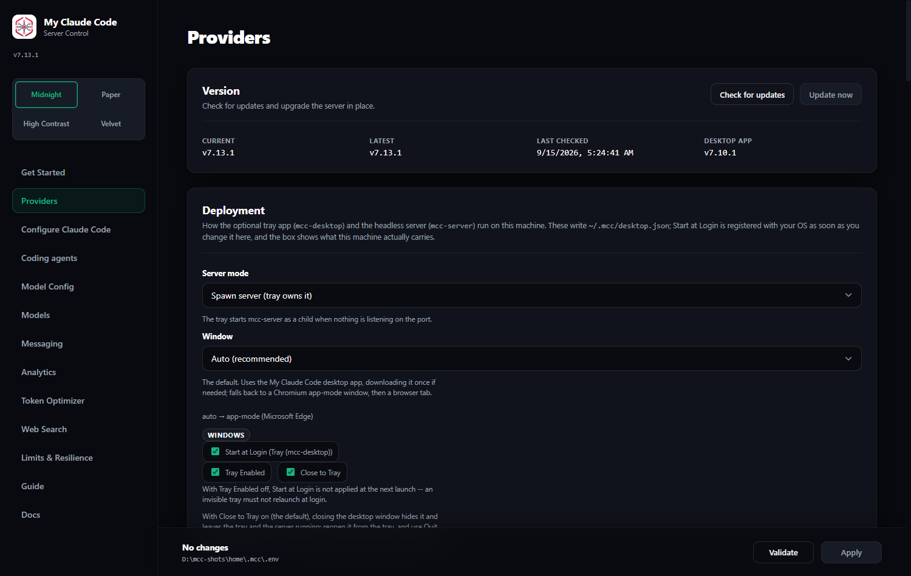
</div>

The dashboard is where everything is configured. Every setting maps to a variable in `~/.mcc/.env`, and the UI writes to that same file — see [.env.example](../.env.example) for the fully annotated list. If you edit the file by hand, restart the server, because configuration is read at startup.

That file records **choices, not defaults**. A setting you have never touched appears as a commented placeholder naming what the code will use — `# FALLBACK_BENCH_ENABLED= (default: false)` — and a plain `KEY=value` line means it was set from the dashboard, so the field shows *set here* beside its label. Every field prints its default underneath, and one that was set gets a **Use default** button that removes the line again. Leaving a setting alone is what lets a later release change its default for you; storing the same value freezes it, which is the point of the distinction.

**Blank means unset.** Clearing a field removes its line, and the code default applies again — the one exception being a key your repo-level `.env` also sets, where MCC writes a bare `KEY=` to mask it if the setting's type accepts an empty value, and returns a warning naming the key if it does not. Warnings from a Save are shown in the dashboard rather than swallowed. Because "unset" is now a real state, selects carry an explicit **Default (…)** option and every boolean is a three-way choice — **Default (On)** / **On** / **Off** — instead of a checkbox that had no way to say "I never picked".

> **If you have been running MCC since before 6.1.0, check one thing.** Until then, the first Save of *anything* wrote every field's default into `~/.mcc/.env` as a real value — and a value on disk always outranks a code default, so no default could ever change for you again. The upgrade deliberately does not rewrite those lines (a value on disk is effective configuration). Open **Limits & Resilience** and look at **Bench failures** (`FALLBACK_BENCH_ENABLED`): if it shows a *set here* chip and you never chose the value, press **Use default**. This is the setting that has moved most — off in 5.58.0, on in 5.61.0, off again in 6.14.0 — and a line on disk has outlived every one of those. Separately, the next Save after 6.2.0 regroups the file under six section headings instead of one `# Limits` heading — the diff looks large, the values are untouched.

There is also a **Guide** tab inside the dashboard with a condensed version of this document, available offline.

On first run, the dashboard opens straight to a **Get Started** checklist instead of the Providers tab. It walks through configuring a provider, mapping model tiers, connecting Claude Code, and then points at the optional web search and analytics pages. Dismiss it once you're set up — the Get Started tab stays in the nav if you want it back.

### Where your configuration lives

Everything MCC keeps for you sits in one directory: the `.env` above, your
custom providers, the OAuth tokens under `auth/`, the per-agent documents the
`mcc-*` launchers write, and `logs/` (the server log plus the request-analytics
database).

| Install | Directory |
| --- | --- |
| A new install | `~/.mcc` — on Windows, `C:\Users\<you>\.mcc` |
| Installed before 6.40.0 | `~/.fcc`, the legacy directory, still used exactly as it always was |
| `MCC_CONFIG_DIR` set | whatever absolute path you gave it, override everything else |

The server prints which directory it chose on the first line of its startup
log, and the Get Started page repeats it. If you are ever unsure which config
you are editing, that is the authoritative answer.

The rule is short and it never moves anything:

1. `MCC_CONFIG_DIR` wins whenever it is set.
2. Otherwise `~/.mcc`, if it exists. If a legacy `~/.fcc` exists too, `~/.mcc`
   wins, the startup log names both, and the legacy one is left completely
   untouched — the two are never merged.
3. Otherwise the legacy `~/.fcc`, if it exists.
4. Otherwise a fresh `~/.mcc` is created.

**Nothing is ever migrated for you.** If you have been running MCC since before
6.40.0 your data stays in the legacy `~/.fcc` for as long as you like; the
directory is fully supported and there is no deadline. The *only* thing that
turns `~/.fcc` into `~/.mcc` is you running `mcc-migrate` yourself. There is no
dashboard button and no HTTP route for it, on purpose: relocating your keys and
your request history is not an action a web page you happen to have open should
be able to take.

#### Legacy `~/.fcc`: migrating with `mcc-migrate`

`mcc-migrate` (`fcc-migrate` is the same command) renames `~/.fcc` to `~/.mcc`
in a single atomic step. Nothing is copied, nothing is deleted, and nothing is
merged — it either relocates the whole tree at once or it refuses and leaves
everything as it was.

**Stop the server and the tray first.** This is not optional. A server that is
still running cached its log path at startup; it goes on writing to the old
location and recreates the legacy directory behind you, leaving you with two
half-configs. The command refuses to run while it can see a live MCC — it
checks the tray's lock file and knocks on the server's `/health` port — but
stop them yourself rather than relying on that.

```bash
# 1. Stop the server (Ctrl-C in its terminal) and quit the tray from its menu.
# 2. Then:
mcc-migrate
# 3. Start the server again:
mcc-server
```

Windows PowerShell is identical — the command is on your `PATH` after any
install.

What you should see:

```text
Moved C:\Users\you\.fcc to C:\Users\you\.mcc. Nothing was copied and nothing
was deleted.

Rollback note written to C:\Users\you\.fcc-old\RESTORE.txt.
```

The command creates one more directory, `~/.fcc-old`, containing a single
`RESTORE.txt` and no data at all. That file records the date and the exact
command to move everything back, written so that it **fails loudly** if the
legacy directory has reappeared instead of quietly nesting your config inside
it. Delete `~/.fcc-old` whenever you are satisfied; nothing reads it.

Reasons the command will refuse, all of which leave every file where it is:

| Message | What to do |
| --- | --- |
| `Refusing to migrate: … already exists` | Both directories are present. Only you know which holds the data you want — move the unwanted one aside, or just keep using `~/.mcc`. |
| `Refusing to migrate: an MCC server is answering …` | Stop the server, then re-run. |
| `Refusing to migrate: the desktop tray still holds …` | Quit the tray from its menu, then re-run. |
| `Could not move …: a file inside the legacy home is still open` | Windows only. The message lists the `mcc-*`/`fcc-*` processes holding files; close them and re-run. |

If you would rather not move anything, you do not have to. Setting
`MCC_CONFIG_DIR=C:\Users\you\.fcc` (or `~/.fcc`) pins the legacy directory
explicitly and silences the startup notice.

#### Pinning a directory with `MCC_CONFIG_DIR`

`MCC_CONFIG_DIR` is an environment variable, not a `.env` setting — the
directory has to be known before there is a `.env` to read. Set it in your
shell (or in the service definition that starts the server) to an absolute
path, and every process that reads it uses that directory and nothing else:

```bash
export MCC_CONFIG_DIR=/srv/mcc/config      # bash/zsh
$env:MCC_CONFIG_DIR = "D:\mcc\config"      # PowerShell, current session
```

It has to be set for the launchers too, not just the server — an `mcc-claude`
started in a shell without it reads a different directory than the server does.
There is no legacy FCC_-prefixed spelling of it; the variable was introduced
with the `MCC_` name and has only ever had that one.

#### Server logs under `logs/`

`logs/server.log` is the current log; older ones rotate to `server.<date>.log`.
`SERVER_LOG_RETAIN_FILES` (default `10`) is how many rotated files to keep —
the current one is never counted and never deleted. `0` keeps every rotated
file, which is how an earlier install grew a 17 GB `logs/` directory. The sweep
runs at startup as well as on each rotation, so lowering the number cleans up a
backlog on the next restart. `logs/requests.db` is the request-analytics
database and is never touched by log rotation.

### The two addresses that matter

| What | Default | Who uses it |
| --- | --- | --- |
| **Proxy API** | `http://127.0.0.1:8082` | your coding agent |
| **Admin UI** | `http://127.0.0.1:8082/admin` | you, in a browser |

Same port. The Admin UI is additionally restricted to loopback callers — see [Security and networking](#14-security-and-networking).

### Running the server with the desktop tray

Two optional commands change how the server is *owned*, and both write to the same `~/.mcc/desktop.json` state file:

| Command | What it does |
| --- | --- |
| `mcc-server` | The headless server. Blocks forever, binds `:8082`. This is the canonical path on WSL / headless Linux / macOS server. |
| `mcc-desktop` | A system-tray app. What it does on launch depends on its **Server mode** (below). |

The dashboard **Deployment** card (and the tray's **Server mode** menu) selects one of three modes:

| Mode | Meaning |
| --- | --- |
| `spawn` | The tray owns `mcc-server` as a child process. On launch, if nothing is listening on `:8082`, it starts the server itself. Best for Windows/macOS desktop users. |
| `attach` | The tray connects to an existing server on `:8082` and **never spawns one**. For people who run `mcc-server` themselves (WSL / headless / ssh). If nothing is listening, the tray reports "server not running" and offers to open the dashboard. |
| `off` | Tray only; the desktop app does not touch the server at all. |

The older boolean `server_auto_start` is migrated on first read: `true` becomes `spawn`, `false` becomes `attach`.

#### Start at login, per platform

**Start at Login** registers a different target depending on where the machine lives, and the dashboard shows only the option that applies to the detected platform:

| Platform | What is registered |
| --- | --- |
| Windows | HKCU `...\CurrentVersion\Run` entry for `mcc-desktop` (the tray). |
| macOS | A LaunchAgent for `mcc-desktop` (the tray). |
| WSL / Linux | A `systemd --user` unit (`~/.config/systemd/user/mcc-server.service`) for headless `mcc-server`, falling back to `~/.config/autostart/mcc-server.desktop` when systemd isn't available. |

You can also drive these from the command line:

```bash
mcc-desktop --server-mode spawn|attach|off
mcc-desktop --autostart on|off
mcc-desktop --status
mcc-desktop --print-status
mcc-desktop --ensure-shell [--target PATH]
```

<a id="ensure-shell"></a>

#### `--ensure-shell`: bring the desktop app up to this release's pin

Every release pins one build of the desktop app, and until 6.60.0 that pin was
checked in exactly one place: the moment the **tray** created a window. Launch
`MyClaudeCode.exe` from the Start Menu, the taskbar, or the Programs-folder
install instead — which is how most people launch an app — and nothing ever
compared what you were running with what the wheel wanted. One person ran the
v6.43.0 window for fifteen releases while the wheel updated itself every time,
so every desktop fix shipped in between was, for them, source-only.

`--ensure-shell` is that comparison as a command:

```console
$ mcc-desktop --ensure-shell
{
  "updated": true,
  "from_tag": "v6.43.0",
  "to_tag": "v6.60.0",
  "staged_path": "C:\\Users\\me\\.local\\bin\\MyClaudeCode.exe.new",
  "restart_required": true
}
```

It reads the receipt beside the binary, and if it names another release it
downloads that release's archive, checks its SHA-256 **twice** — against the
digest pinned in the wheel and against the `SHA256SUMS-desktop-shell.txt` the
release publishes, which must agree — and then puts the verified executable
where it belongs.

**It never writes over a window you are running, and the operating system is
what decides whether you are.** The new executable is written beside the target
and then moved onto it: Windows refuses that for a file that is a running
image, and on Linux and macOS it is safe by construction, because a running
process keeps the file it started from. So if nothing has the app open it is
simply updated (`restart_required: false`); if something does, the file stays
exactly where it is and the replacement waits as `MyClaudeCode.exe.new` for the
next start of the app, which does the rename itself — the one moment nothing
holds either file open.

`--target` names the binary to update; without it the default install
(`~/.local/bin`) is meant. The window passes its own executable, so the copy
that changes is the one you actually launched — the Programs-folder install as
readily as the tray's.

You do not normally run this yourself. The app runs it for you: on launch it
compares the release stamped into it (`MyClaudeCode.exe --version`) with the
`shell_release_tag` in the status document, and when they disagree it stages the
update in the background and offers **Restart now** in its tray menu. The
dashboard's Update banner says the same thing.

<a id="machine-readable-status"></a>

#### `--print-status`: the same answers, as JSON

`--status` prints five `key=value` lines for a human. `--print-status` prints **one JSON
document** on stdout and exits `0`, for a program:

```console
$ mcc-desktop --print-status
{
  "schema": 1,
  "version": "6.42.0",
  "config_dir": "C:\\Users\\me\\.mcc",
  "config_dir_source": "current",
  "config_dir_is_legacy": false,
  "host": "127.0.0.1",
  "port": 8082,
  "root_url": "http://127.0.0.1:8082",
  "admin_url": "http://127.0.0.1:8082/admin",
  "health_url": "http://127.0.0.1:8082/health",
  "server_presence": "healthy",
  "port_conflict": null,
  "server_mode": "spawn",
  "window": "auto",
  "window_open": true,
  "window_width": 1400,
  "window_height": 900,
  "tray_enabled": true,
  "minimize_to_tray": true,
  "close_to_tray": true,
  "start_at_login": true,
  "autostart_reconcile": true,
  "server_log": "C:\\Users\\me\\.mcc\\logs\\server.log",
  "start_timeout_seconds": 20.0,
  "health_check_interval_seconds": 0.25,
  "health_poll_seconds": 5.0,
  "health_failure_threshold": 3,
  "activation_poll_seconds": 1.0,
  "reconnect_timeout_seconds": 1040.0,
  "reconnect_restatus_seconds": 30.0,
  "shell_tray": true,
  "shell_binary": "C:\\Users\\me\\.local\\bin\\MyClaudeCode.exe",
  "shell_release_tag": "v6.43.0",
  "shell_ready": true
}
```

Eight things are worth knowing about it:

- **`autostart_reconcile` says whether anyone is enforcing `start_at_login`.** It is
  `false` when `MCC_DESKTOP_SKIP_AUTOSTART=1` is set in the environment, which turns the
  launch-time reconciliation of the OS registration into a no-op with one log line. Set
  it whenever you run `mcc-desktop` against a configuration directory that is not your
  own — a smoke, an installer test, a bug repro. The reason is that the registration is
  *machine-global* (one `HKCU\...\Run` value, one LaunchAgent, one XDG entry) while the
  preference driving it lives *inside a config directory*: without the switch, launching
  against a scratch `MCC_CONFIG_DIR` reads a fresh `desktop.json`, sees the default
  `false`, and helpfully deletes the registration belonging to your real install.
- **It is a pure read.** No server is started, no singleton lock is taken, `desktop.json`
  is not written, and no autostart registration is touched. It is safe to run against a
  live machine, in a loop, from a script.
- **`host` is where you connect, not where the server binds.** The default bind is
  `0.0.0.0`, which is not an address anything can navigate to; the wildcard is mapped to
  `127.0.0.1` here exactly as it is in the URL the server prints at startup.
- **`server_presence` is a four-way answer**, not a boolean: `healthy` (a My Claude
  Code server is answering), `free` (nothing is listening), `foreign` (something else
  holds the port) or `draining` (MCC's own server is on the port and is refusing every
  request with `503` while it finishes stopping). Only `foreign` fills `port_conflict`,
  and it names the holding process.

  `draining` is **opt-in**: it appears only when you pass `--print-status --presence-v2`.
  Adding a *value* to a key is not a `schema` bump by the rule below, but the desktop
  window refuses a presence it has no branch for rather than guessing at the nearest
  neighbour — so a window built before 6.50.0 would turn a routine restart into an error
  page. It asks for the fourth value; older readers keep the three they were written
  against. Before 6.50.0 a draining server reported as `foreign`, which is why relaunching
  the desktop app during a restart used to land on a port-conflict page accusing MCC's own
  process of not being the MCC server.
- **`close_to_tray` is already resolved for you.** `minimize_to_tray` is the stored
  preference; `close_to_tray` is the answer to "if the user closes this window, is there a
  tray for it to go to?" — the preference **and** a tray that exists. A window cannot work
  that out from `tray_enabled`, because that key answers "should *you* draw an icon", and
  it is `false` on Windows and macOS precisely *because* a tray is already running.
- **`reconnect_restatus_seconds` is how often a reconnecting window should re-read this
  document** rather than only re-pinging `health_url`. It is what lets a window notice that
  the port has gone free and start a server itself.
- **`start_timeout_seconds` and `server_start_retries` are the desktop app's start
  budget.** From 6.66.0 the app multiplies them (`start_timeout_seconds x
  (server_start_retries + 1)`, 45 s on the shipped values) and, once that has passed or
  three servers have been started with no answer, replaces its "Starting the server..."
  spinner with a page naming the child's exit code, its last lines of output, and the two
  log files: the server's own `server_log`, and the app's `logs/desktop-server-start.log`.
  It keeps starting the server every tick regardless — the budget decides what the window
  *says*, never whether it tries again.
- **`schema` is the compatibility handle.** It is bumped when a documented key is removed
  or changes type. New keys can appear without a bump, so a reader must ignore keys it
  does not recognise, and should refuse loudly on a `schema` it does not know. The four
  `shell_*` keys were added in 6.44.0 and the schema stayed at `1`.
- **`tray_enabled` answers "should *you* draw a tray", not "what is saved".** While the
  Python tray is running it reports `false` **to the desktop app it launched** — one icon,
  not two — and `shell_tray` says the same thing in a key that cannot be confused with a
  preference. `mcc-desktop --status` always prints the saved value, so nothing is hidden.

There are no keys, tokens or secrets in the document — it is safe to paste into a bug
report. `reconnect_timeout_seconds` and `health_failure_threshold` are the two numbers a
window must use rather than invent: together they are what stops a routine self-update
restart being drawn as a dead server.

The `fcc-desktop` alias accepts every one of these flags identically.

<a id="the-desktop-app-fetched-verified-installed"></a>

### The desktop app: fetched, verified, installed (6.44.0)

`auto` now starts with **My Claude Code's own desktop app** — a ~1.5 MB window built from
`desktop-shell/` in this repository and attached to the same GitHub release as the wheel.
`uv tool install` cannot deliver a compiled binary, so the first `mcc-desktop` launch
after upgrading fetches it. What that means, in order:

| Step | What happens | If it fails |
| --- | --- | --- |
| Pin | The wheel names one release tag (`shell_release_tag`) and one SHA-256 per platform. | — |
| Published checksums | `SHA256SUMS-desktop-shell.txt` is downloaded from that release and compared against the pinned digests. | Refuses — a replaced release asset cannot change what runs. |
| Archive | The ~1.5 MB `.zip`/`.tar.gz` is downloaded and its SHA-256 compared to the pin. | Refuses. |
| Extract | Exactly one executable is read out of it. Symlinks and `..` paths are refused, not sanitised. | Refuses. |
| Install | Atomic replace into `~/.local/bin/MyClaudeCode[.exe]`; a running copy on Windows is renamed aside and swept later. | Refuses, and says to close the window. |
| Receipt | `MyClaudeCode.receipt.json` records the tag and digest beside the binary. | — |

**Every one of those failures is a warning, not an outage.** Offline, behind a proxy, on
an architecture nothing is built for, or on a read-only home, the launch continues and the
window falls through to app-mode with a single line naming the reason. `--print-status`
reports `shell_ready: false` and a `null` `shell_binary`.

**Because the receipt is checked first, this happens once.** An unchanged pin costs one
JSON read and no network at all. A pin that moves in a later release downloads once more.

Two switches, both environment variables read by `mcc-desktop` at launch:

```bash
DESKTOP_SHELL=off              # never use the desktop app; auto starts at app-mode
MCC_DESKTOP_SHELL_DIR=/some/where   # install it somewhere other than ~/.local/bin
```

`mcc-desktop --window app-mode` is the other way to opt out, and it is the stronger one:
an explicit `--window` falls back only through the *browser* providers, never into the app.

**Unsigned, stated plainly.** Windows SmartScreen may warn on first run — reputation is
per file hash and accrues from real download volume, and since a 2024 policy change even
an EV certificate no longer skips the prompt. Windows 11 machines with **Smart App
Control** may block it outright with no "run anyway"; there, `DESKTOP_SHELL=off` and
app-mode are the answer. On macOS the app is equally unsigned, but a file **Python
downloaded is not quarantined** — quarantine is applied by browsers, and `urllib` is not
one — so it never meets Gatekeeper's download gate. Download the same archive yourself in a
browser and you *will* meet it. That asymmetry was the original reason for shipping no
`.dmg`; since 6.45.3 there is one, and it carries the consequence rather than
ducking it — see [The macOS desktop-app disk image](#the-macos-desktop-app-disk-image).

**Linux.** The app carries its own tray, which is the one thing Linux never had, so
`mcc-desktop` runs there now. It needs webkit2gtk-4.1: Ubuntu 22.04+, Debian 12+,
Fedora 40+. Older distributions keep app-mode and the browser tab.

<a id="picking-a-window"></a>

### Picking a window

There is no single "native window" API that behaves the same across Windows, macOS, and Linux (WebView2 / WKWebView / WebKitGTK all differ), so `mcc-desktop` resolves its window through a **provider chain**: `auto` walks `shell → app-mode → pywebview → browser`.

Chromium **app-mode** — a real browser process launched with no tabs and no URL bar, its own taskbar entry, and a private profile under `~/.mcc/desktop-profile` — is the fallback and remains a first-class one. Three things the dashboard depends on **break inside an embedded webview**: `window.open` (both OAuth logins use it), `<a download>` (the analytics export), and `navigator.clipboard` (every copy button). App-mode is a real browser process, so all three keep working.

Choose it with `--window`:

```bash
mcc-desktop --window auto|app-mode|pywebview|browser
```

`auto` is the default — it tries the desktop app, then app-mode, then a plain browser tab if no Chromium-family browser (Edge, Chrome, Brave) is found. `mcc-desktop --status` reports which provider is currently in effect. Picking an option that isn't available on this machine falls back with a warning, not a failure.

The same choice is on the dashboard's Deployment card as a **Window** control, with a line underneath showing what `auto` currently resolves to (for example `auto → app-mode (Microsoft Edge)`). Reading this at launch means a change applies to the **next** `mcc-desktop` start, not a window already open.

Launching `mcc-desktop` a second time raises the existing window instead of opening a duplicate; closing the window does **not** stop the server (close ≠ quit) — use the tray menu or `--server-mode off` for that.

<a id="installing-the-desktop-shortcut"></a>

### Installing the desktop shortcut

Pass `--desktop` to the installer (`-Desktop` on PowerShell) to add a platform shortcut at install time:

```bash
curl -fsSL <install-script-url> | sh -s -- --desktop
```

```powershell
.\install.ps1 -Desktop
```

This writes a Start Menu `.lnk` on Windows, a `.desktop` entry on Linux, and a minimal `.app` bundle on macOS. It's opt-in — a plain install is unchanged — and if the shortcut can't be created, the installer warns and continues rather than failing the whole install.

<a id="what-the-uninstaller-removes"></a>

<a id="what-the-uninstaller-removes"></a>

### What the uninstaller removes

> These two scripts are the **server's** uninstallers. The Windows desktop app has its
> own, separate one — "My Claude Code (desktop app)" in Apps & Features — which removes
> the window and deliberately leaves everything in this table alone. See
> [The Windows desktop-app installer](#the-windows-desktop-app-installer).

`scripts/uninstall.sh` and `scripts/uninstall.ps1` remove everything the installers and the tray create, not just the command shims. Until 6.41.3 they removed the shims and the config directory only, which left a Start Menu entry pointing at a deleted `mcc-desktop.exe` and an autostart registration relaunching a package that was no longer installed.

**Removed:**

| Artefact | Path or key | Created by |
| --- | --- | --- |
| Command shims | the uv tool bin directory | `uv tool install` |
| Config, logs, data and the exported icon | `~/.mcc/` and a legacy `~/.fcc/` | normal use |
| Start Menu shortcut | `%APPDATA%\Microsoft\Windows\Start Menu\Programs\My Claude Code.lnk` | `install.ps1 -Desktop` |
| Start-at-login value | `HKCU:\Software\Microsoft\Windows\CurrentVersion\Run\MyClaudeCodeDesktop` | **Start at Login** |
| Desktop entry and icon | `~/.local/share/applications/my-claude-code.desktop`, `~/.local/share/icons/hicolor/256x256/apps/my-claude-code.png` | `install.sh --desktop` |
| App bundle | `~/Applications/My Claude Code.app` | `install.sh --desktop` |
| LaunchAgent | `~/Library/LaunchAgents/com.myclaudecode.tray.plist` | **Start at Login** (macOS) |
| systemd user unit | `~/.config/systemd/user/mcc-server.service` — `systemctl --user disable --now` runs first | **Start at Login** (Linux/WSL) |
| XDG autostart entry | `~/.config/autostart/mcc-server.desktop` | **Start at Login** (Linux/WSL, no systemd) |

**Kept:** uv, the uv-managed Python runtime, Claude Code, Codex, Pi, shared `PATH` entries, the shared XDG directories the entry and icon lived in, and the retired `~/.fcc-old/` (the legacy directory holding your rollback note). `~/.claude/` is never touched.

Ordering and safety are unchanged: the desktop artefacts are removed only **after** every shim is verified gone, so a failed or unverified tool removal leaves your config *and* your shortcut alone. A shortcut or registry value that cannot be deleted (a file the shell has open, a locked key) is reported as a warning rather than aborting an uninstall that has already removed the tool. `--dry-run` / `-DryRun` prints every removal without performing it.

<a id="closing-the-window-and-the-reconnect-banner"></a>

**The desktop app starts the server itself, every ten seconds, on every path.**
Since 6.61.0 everything the window does about the server is decided by one
controller on one ten-second tick, and the rule is decision Q4, in the user's own
words: *probe every ten seconds forever; if the server is dead, force start it on
that tick.* There is no attempt cap, no exponential backoff, and no page that
waits for you to press something. Every page carries the same two numbers —

> Starting the My Claude Code server… (last checked 3 s ago, next start attempt
> in 7 s)

— and **Retry now** only brings the next check forward. What it replaced was seven
separate waiting loops, six of which could reach a page with nothing running
behind it.

The concrete failure this fixes, reported on 2026-09-08: *after Update-and-restart
the app stops the server, then only watches; pressing F5 fixes it.* F5 fixed it
because reloading the page re-ran the one code path that could start a server.
Now the tick starts it, so no path depends on a reload — and reloading the window
during a wait shows you the same page you were on rather than resetting it to
*Checking the server…*, which is the other half of the same defect.

**A reload no longer loses the window's state.** Every page used to be *pushed*
into the document, so F5 threw it away. The page now asks the controller what
state it is in as it loads.

**The port-conflict page can now take the port back — but only from My Claude
Code.** The window classifies the holder by *process* (its pid, image and command
line) rather than by whether a socket can be bound, so MCC's own server during its
twenty-second startup is never called a stranger. When the holder is one of ours
and it is wedged, the page offers **Take port**; when it is genuinely somebody
else's, it names the program and the pid, offers nothing, and keeps re-checking —
and it waits `DESKTOP_FOREIGN_GRACE_SECONDS` (default 45) before saying so at all,
because an unidentifiable holder during our own start is overwhelmingly us.

**The update helper no longer starts the server when a window is watching.** The
dashboard's **Update** button, pressed *inside the desktop app*, tells the
installer to install and exit; the window's next tick starts the new server. In an
ordinary browser tab nothing is watching, so the helper restarts exactly as it
always has. Two owners of "restart the server" is how one update came to start two
of them.

**Updating the server now updates the desktop app too.** Just after it becomes
ready — on a thread, once per start, never on a request — the server compares the
desktop app installed on this machine with the release this build pins, and brings
it up to date through the same code `mcc-desktop --ensure-shell` runs: replaced in
place when nothing is running it, staged beside it as `MyClaudeCode.exe.new` when
something is, which the app's own next start renames in. One log line either way
(`desktop app updated to vX` / `desktop app vX staged; it will be used at the next
app start`), and the dashboard's version card says the same thing. Turn it off with
**Update the desktop app automatically** on the Desktop card
(`DESKTOP_SHELL_AUTO_UPDATE=false`), or with `DESKTOP_SHELL=off`, which turns the
app off altogether. Nothing is downloaded on a machine that has no desktop app
installed. Before this, the pin reached a machine only if somebody *ran* something,
and one user consequently ran a fifteen-release-old window while their wheel moved
through fifteen releases of fixes to that window.

**On Windows the desktop app now owns the tray icon.** There used to be two: the
app's and the Python tray's, offering different menus and two different answers to
"restart the server" from two processes that did not know about each other. The
app's is the one that stays, because it is the process that survives an update and
the process that owns the server lifecycle. Closing the **window** hides it to that
icon and leaves the server running; the tray's **Open dashboard** brings it back;
the tray's **Quit** is the only thing that ends the app. The Python tray remains
the fallback wherever there is no desktop app installed, and on macOS.

### Closing the window, and the reconnect banner

**Closing the window puts the app in the tray. It does not quit it.** Before 6.50.0
the close button ended the app outright — and took the tray icon and, in `spawn`
mode, the server with it. Since 6.50.0 the default is **Close to Tray**:

* the **X** hides the window and leaves the tray icon and the server running;
* the tray's **Open Dashboard** (also a plain click on the icon) brings it back;
* the tray's **Quit** is what ends the app, and it still stops only the server it
  started itself.

Turn it off with **Close to Tray** on the dashboard's **Deployment** card, or in the
tray menu, if you would rather the close button ended the app. With **Tray Enabled**
off there is nowhere to close to, so the close button ends the app whatever this says.

**While the server restarts, the window says what it is doing.** An update replaces
the server process, and the window waits for the new one. That wait used to be a
single sentence painted once and never touched again, which over a fourteen-minute
update was indistinguishable from a frozen window. It now repaints on every health
poll with:

* how long it has been trying and how much of the budget is left, counting down;
* what the last check actually said — `connection refused`, `shutting down`,
  `HTTP 502`;
* on Windows, which stage the update helper reported: `Waiting for the running
  server to stop.`, `Installing the new version.`, `Starting the updated server.`

Those stages are appended to `~/.mcc/updates/progress.json`, one JSON object per
line, by the helper that performs the update. Read it if a restart goes wrong; the
last line is where it stopped.

<a id="what-you-see-during-an-update"></a>

#### What you see during an update (6.71.0)

An update takes about a minute and a half on a warm cache. Until 6.71.0 the whole
of it looked like this: one sentence, painted once. `uv`'s output went into a
variable and was written out at the very end, into a file nothing reads until the
episode is over — so during the only part of an update anyone cares about there
was literally nothing on disk to look at.

Now the installer writes **two files, as it goes**, both in
`~/.mcc/updates/`:

| File | What it is |
| --- | --- |
| `progress.json` | One JSON object per line, one per stage. Each carries the stage, the installer's own sentence, a UTC timestamp, seconds since the episode started, the installer's process id, the version it is heading for, and `log` — the path of the transcript below. |
| `install-<stamp>.log` | Everything `uv` printed, **appended a line at a time as it prints it**. One episode, one transcript. |

The stages are monotonic — an episode only ever moves forward:

`waiting-for-parent` → `staging` → `stopping` → `verifying` → `swapping` →
`starting` (the installer starts the server) or `handing-off` (the desktop app
does) → `done`; or `rolling-back` → `recovered` when the new version does not
answer, or `failed` → `recovered` when it never gets that far. `installing`
appears in place of `staging`/`swapping` on the repair path described below.

#### How an update is applied (6.72.0)

Until 6.72.0 an update was one command: `uv tool install --force` against the
environment you were running. uv empties a tool environment *in place* before it
resolves a single new byte, so that one command deleted the only working copy of
MCC on the machine and then went to the network. Measured here: `mcc-server`
answered normally at the start, failed with
`ModuleNotFoundError: annotated_types` 7.2 seconds later, failed with
`ModuleNotFoundError: my_claude_code` at 8 seconds, and the executable itself was
gone at 9.4 seconds. Two real updates took 58 and 102 seconds end to end. For all
of that there was no server, no `mcc-server`, and nothing to go back to — if the
download failed halfway, you had neither version.

Now the new version is built **beside** the one you are running:

1. **`staging`** — the new version is installed into a tools directory of its
   own, at `<uv tools root>/../.mcc-staging/<stamp>/`. Your installed version is
   not touched, so `mcc-server` keeps answering for the whole of it. This is
   where all the time goes, and it starts before the server has even finished
   stopping.
2. **`verifying`** — the staged version is **run**: `mcc-server --version` has to
   print the version that was asked for, and `import my_claude_code` has to
   succeed. A wheel that installs and then cannot run never reaches your
   installed copy; the update stops here and says so, and nothing was replaced.
3. **`swapping`** — two directory renames exchange the old environment for the
   new one. Measured on the machine this was built on: 3.9 ms typical, 20 ms
   worst of ten. Your launchers are not rewritten at all — every `mcc-*` command
   is a small stub that runs whatever environment is at the canonical path, so
   the instant the new one lands there they run the new code. A command window
   you left open can no longer hold up an install.
4. The old environment moves to `<uv tools root>/../.mcc-previous/<stamp>/`. It
   is **not deleted** yet.
5. **`starting`** / **`handing-off`**, then the new server has to answer
   `/health` within 90 seconds. If it does, the update is `done` and the previous
   copy is swept. If it does not, the update goes `rolling-back`: the previous
   environment goes back to the canonical path, it is started, and the page says
   `recovered` rather than pretending the update worked.

Exactly one previous copy is kept — it is the rollback, and a second one is only
disk. It is deleted only after the new server has answered.

Both directories are **siblings** of uv's tools root rather than children of it.
That is measured, not taste: a directory inside the tools root whose name uv
cannot read as a package name makes `uv tool list` fail outright and list
nothing.

**The repair path.** A release that adds a brand-new command needs uv to write a
launcher for it, and no rename can produce one. Those updates (and any machine
that is not a uv tool install) finish with the old in-place `--force` install
instead, against a cache the staging pass has already filled. It is a repair
path now, not the ordinary one.

**Housekeeping.** Older installers renamed the environment aside as
`my-claude-code.old-<stamp>` *inside* uv's tools root, where uv reads each one as
a broken tool and warns about it on every `uv tool` command. Any that are still
there are moved out on the next server start, along with abandoned staging
directories, and the last five installer transcripts are kept.

**The desktop app shows all of it.** While an update runs, the window shows the
stage timeline with each stage's clock time and how long it took, the total
elapsed time, the last fifteen lines of `install-<stamp>.log` refreshed on every
tick, the path of that file so you can open it yourself, and the installer's
process id. It reads both files directly, so it keeps showing them through the
seconds in which `mcc-desktop` itself cannot answer because its environment is
being replaced.

**A dashboard in an ordinary browser tab cannot.** It has no way to read a file
on your disk, and the server it would ask is the thing being replaced. So it is
honest about it instead: when you press **Update now** it prints both paths
before the server stops, then counts down to the reconnect. That is the whole
reason to run the desktop app during an update.

The hand-run installers write the same two files in the same vocabulary, so a
window watching them shows the same timeline whichever installer is running. Set
`MCC_INSTALL_LOG` to an existing transcript to make an installer append to it
rather than open one of its own.

**A slow start is no longer a failed one.** The window gives the server it
starts `DESKTOP_SERVER_START_TIMEOUT` (default 20 s) to answer, and since 6.58.1
it does that **three times** — `DESKTOP_SERVER_START_RETRIES` (default 2) more
attempts, 45 s in all — before it says anything went wrong. A real configuration
here takes **22–25 s** to bind, because everything MCC loads at startup happens
*before* the port is opened; a single 15 s budget could not fit that, and the
window used to park on a Retry button about seven seconds before the server
answered. The countdown says which attempt it is on (`attempt 2 of 3`) so a
window that is patiently waiting cannot be mistaken for a stuck one.

A retry never starts a *second* server. A server that has not finished starting
has not bound its port yet, so every check the window can make says the port is
free — a retry that acted on that reading would put two servers into one bind
race. What it watches instead is the child it started: still running means still
coming up, and only a child that has actually exited is started again.

**And the page you get if all three attempts run out is not the end.** It keeps
checking on the same health poll, so a server that binds a minute late is picked
up and the dashboard loads with nothing asked of you. **Retry** is now an
accelerator — check again *now* — rather than the only way out. Before 6.58.1 it
was the only way out, and it was worse than that: nothing behind that page was
still running, so waiting at it achieved nothing and closing and reopening the
app was the only recovery anybody found.

**The same applies to the very first launch.** When MCC is not installed at all,
the desktop app runs the project's own installer and shows its output. It now
does that **at most three times**. An installer that succeeds without putting
`mcc-desktop` on the running window's `PATH` — the ordinary Windows first launch,
because a `PATH` change reaches only newly started processes — used to mean
installing MCC again every few minutes for as long as the window stayed open,
under a spinner that said *Checking the server…* the whole time. The window now
names what it is doing, quotes the installer's last line, tells you that quitting
and reopening it is the fix, and goes on watching for `mcc-desktop` to appear.
The installer itself is bounded too: one that stops to ask a question it will
never be given an answer to is stopped after 15 minutes rather than holding the
window for the rest of the session.

**And the window now restarts a server that nobody else did.** Every
`DESKTOP_RECONNECT_RESTATUS_SECONDS` (default 30) the reconnect loop re-reads
`mcc-desktop --print-status` instead of only re-pinging the health URL. If the port
has gone free and **Server mode** is `spawn`, it starts the server — **once** per
reconnect, never in a loop — and goes back to polling. Before that, a server that
had exited with nothing to restart it was waited on, idle, for the whole budget, and
closing and reopening the app was the only thing in the design that started one.

**A restarting server is no longer reported as a port conflict.** While MCC drains,
its own port answers every request with `503`, and a window launched in that moment
used to be told the port was *"held by python.exe (pid N), which is not the MCC
server"* — about MCC's own process. The server now stamps `x-mcc-shutdown: 1` on that
refusal and the window reads it as "shutting down", waits, and reconnects.

> **The single biggest thing you can do about a slow restart** is check
> `SERVER_GRACEFUL_SHUTDOWN_SECONDS` on **Limits & Resilience**. It bounds the drain,
> and every update waits it out *twice over*: once while the old server finishes, and
> again in the reconnect budget the window shows you. At the shipped default of `20`
> the banner says about 17 minutes; at `300` it says 22, and roughly five minutes of
> every update is that setting alone.

<a id="desktop-settings-apply-on-the-next-launch"></a>

### DESKTOP_* settings apply on the next launch

> **These settings apply on the next `mcc-desktop` launch, not to a tray already running.** `mcc-desktop` is a separate process from `mcc-server` and reads them once at start — changing one in the dashboard or in `~/.mcc/.env` does nothing to a tray you already have open. Quit and relaunch `mcc-desktop` to pick it up.

Seventeen settings live under **Admin → Providers → Desktop**, beside the live desktop panel. They sat on the Limits page until 6.2.0; if you are following an older note, that is where they went.

| Setting | Default | Range |
| --- | --- | --- |
| `DESKTOP_HEALTH_POLL_SECONDS` | 5 | 0.5–3600 |
| `DESKTOP_HEALTH_FAILURE_THRESHOLD` | 3 | 1–1000 |
| `DESKTOP_ACTIVATION_POLL_SECONDS` | 1 | 0.1–3600 |
| `DESKTOP_RECONNECT_RESTATUS_SECONDS` | 30 | 5–3600 |
| `DESKTOP_SERVER_START_TIMEOUT` | 20 | 1–300 |
| `DESKTOP_SERVER_START_RETRIES` | 2 | 0–20 |
| `DESKTOP_ADMIN_REQUEST_TIMEOUT` | 5 | 0.5–60 |
| `DESKTOP_HEALTH_CHECK_INTERVAL` | 0.25 | 0.05–5 |
| `DESKTOP_WINDOW_WIDTH` | 1400 | 640–7680 |
| `DESKTOP_WINDOW_HEIGHT` | 900 | 480–4320 |
| `DESKTOP_BROWSER_PATH` | (empty) | any path |
| `DESKTOP_TICK_SECONDS` | 10 | 1–3600 |
| `DESKTOP_START_BACKOFF_SECONDS` | 10 | 1–3600 |
| `DESKTOP_HEALTH_PROBE_TIMEOUT` | 1.5 | 0.1–60 |
| `DESKTOP_FOREIGN_GRACE_SECONDS` | 45 | 0–3600 |
| `DESKTOP_STATUS_WALL_SECONDS` | 15 | 1–600 |
| `DESKTOP_SHELL_AUTO_UPDATE` | true | true / false |

The five new in 6.61.0 are the desktop app's lifecycle: `DESKTOP_TICK_SECONDS` is
how often it checks the server *and* how often it starts one that is not running;
`DESKTOP_START_BACKOFF_SECONDS` is the shortest gap between two starts, equal to
the tick by default, and raising it is how you slow the retries on a server that
fails on start without slowing the health check;
`DESKTOP_HEALTH_PROBE_TIMEOUT` is one check's socket timeout, in every process
that makes one, replacing two constants that were meant to be the same number and
were not; `DESKTOP_FOREIGN_GRACE_SECONDS` is how long an unrecognised program may
hold the port before the window calls it a conflict rather than assuming the
holder is My Claude Code still starting; and `DESKTOP_STATUS_WALL_SECONDS` is how
long the app waits for one status read before painting something anyway — raise it
on a machine where antivirus scanning makes a cold start take longer than that.
`DESKTOP_SHELL_AUTO_UPDATE` is the server's one-shot desktop-app update described
above.

`DESKTOP_BROWSER_PATH` points at a browser binary in a nonstandard location; if the path no longer exists, `mcc-desktop` warns and falls back to the built-in search instead of failing to start. `DESKTOP_WINDOW_WIDTH`/`HEIGHT` are only the window's *initial* size — once it has opened, its size and position are remembered across launches, so changing these later applies on first run or when you actually change the setting, not every launch.

<a id="wsl-and-headless-there-is-no-tray"></a>

### WSL and headless: still no tray. Linux desktop: now there is one.

`mcc-desktop` needs a desktop session — a tray, a window manager, a browser it can launch. WSL and headless Linux don't have one. Run `mcc-server` there instead; it's the same server without the tray, and it's the canonical path for WSL / headless Linux / macOS server (see [Running the server with the desktop tray](#running-the-server-with-the-desktop-tray) above). Trying to run `mcc-desktop` on WSL/headless explains this and gives you the dashboard URL instead of hanging.

**A Linux machine with a display is a different case, and changed in 6.44.0.** The old refusal — "no Linux tray backend is packaged" — was about `pystray`, which is declared Windows/macOS only and always will be. The desktop app carries its own tray, so with `DISPLAY` or `WAYLAND_DISPLAY` set *and* the app installed, `mcc-desktop` runs on Linux: one window, one tray, both from the app. Without the app (`DESKTOP_SHELL=off`, no network on first launch, an unbuilt architecture) the refusal comes back and now names the reason it could not be used.

Reach the dashboard from a Windows browser at the address `mcc-server` prints on startup — normally `http://127.0.0.1:8082/admin`, which WSL forwards to Windows automatically in most configurations.

<a id="the-embedded-webview-pywebview-and-its-caveat"></a>

### The embedded webview (pywebview), and its caveat

`pywebview` is the third link of the chain, behind the desktop app and app-mode. It **ships switched off** and is **not installed as a dependency**. Two reasons: MCC can't guarantee `pywebview`'s embedded webview handles downloads and external links correctly (the same `window.open` / `<a download>` / clipboard breakage described above), and on macOS its run loop conflicts with the tray's own run loop.

To opt in anyway: install `pywebview` yourself into the same environment MCC runs in, then set `--window pywebview` (or pick **Embedded webview** on the dashboard's Deployment card). It is present, gated, and unexercised by default — treat it as experimental, and expect OAuth login, the analytics export, and copy buttons to potentially misbehave inside it.

---

## 4. Tutorial: connect Claude Code (CLI)

Claude Code is configured through its **settings file**, not shell variables. This matters: `~/.claude/settings.json` takes precedence over exported environment variables, so `export ANTHROPIC_BASE_URL=...` in your shell will appear to do nothing if the settings file says otherwise.

### Step 1 — open the settings file

| Platform | Path |
| --- | --- |
| macOS / Linux / WSL | `~/.claude/settings.json` |
| Windows | `%USERPROFILE%\.claude\settings.json` |

If the file doesn't exist yet, create it.

Prefer not to hand-edit it? The **Claude Code settings file** card on the dashboard's
Providers view lists every settings file it can see on this machine (including the
Windows-side file when this server runs under WSL) and warns when a higher-precedence
file — like an enterprise managed settings file — already sets these variables and
would override the one you configure here.

### Step 2 — add the `env` block

```json
{
  "env": {
    "ANTHROPIC_AUTH_TOKEN": "<your token from Providers -> Runtime>",
    "ANTHROPIC_BASE_URL": "http://127.0.0.1:8082"
  }
}
```

**Keep any other keys you already have** — merge these two entries into the existing `env` object rather than replacing the file.

- `ANTHROPIC_BASE_URL` points Claude Code at your local server.
- `ANTHROPIC_AUTH_TOKEN` is sent as a bearer token. It must match the proxy's own `ANTHROPIC_AUTH_TOKEN`. Since 6.65.0 that value is generated on your machine the first time `mcc-server` starts without a `.env`, so there is no shipped value to copy: read yours on the dashboard under **Providers -> Runtime**. On a loopback server (`HOST=127.0.0.1`, the default) the token may also be empty, in which case any value works.

> **On the token:** it authenticates your agent *to the proxy*, nothing more. It is not a provider key. If you clear `ANTHROPIC_AUTH_TOKEN` on the server, the proxy stops requiring authentication altogether — convenient on a single-user machine, but read [Security and networking](#14-security-and-networking) first.

### Step 3 — restart Claude Code and verify

Restart the app, then run:

```text
/status
```

It should report:

```text
Anthropic base URL: http://127.0.0.1:8082
```

If it still shows Anthropic's own endpoint, the settings file wasn't picked up — check you edited the right path for your platform and that the JSON is valid.

### Step 4 — pick a model

No model overrides are needed — MCC exposes native **Fable / Opus / Sonnet / Haiku** tier models, so you can type a tier name at the `/model` prompt either way. Claude Code's built-in *picker*, though, only lists the MCC catalog once model discovery is on: add `"CLAUDE_CODE_ENABLE_GATEWAY_MODEL_DISCOVERY": "1"` to the `env` block from Step 2, or use `mcc-claude --discover-models` from the Shortcut below.

<div align="center">
  
  <p><em><code>/model</code> in Claude Code, listing the MCC catalog (model discovery on).</em></p>
</div>

### Shortcut

If you'd rather not edit the settings file, the bundled launcher sets the two
proxy variables for the session:

```bash
mcc-claude
```

`mcc-claude` only sets `ANTHROPIC_BASE_URL` and `ANTHROPIC_AUTH_TOKEN` — it
doesn't touch anything else, since `~/.claude/settings.json` (Step 2 above)
takes precedence over environment variables anyway. This also means its
native model picker stays empty by default; pass `--discover-models` to have
`mcc-claude` additionally set `CLAUDE_CODE_ENABLE_GATEWAY_MODEL_DISCOVERY=1`
for the session (an extra request to the proxy on every launch, so it's
opt-in):

```bash
mcc-claude --discover-models
```

If you want the previous `mcc-claude` behavior — gateway model discovery
enabled, the auto-compact window set, telemetry/autoupdate disabled, and
inherited `ANTHROPIC_*` variables cleared — run `mcc-claude-old` instead.

The legacy `fcc-claude`, `fcc-claude-old`, `fcc-codex` and `fcc-pi` aliases
behave identically.

Official references: [Claude Code LLM gateway docs](https://code.claude.com/docs/en/llm-gateway-connect) · [settings.json reference](https://code.claude.com/docs/en/settings)

---

## 5. Tutorial: connect Claude Desktop

The desktop app has a **native gateway setting**. Since 6.56.0 MCC can write it for you: the **Claude Desktop** card in the [Desktop apps](#6-point-a-desktop-app-here) group owns one document in the app's local configuration library (`%LOCALAPPDATA%\Claude-3p\configLibrary\`, macOS `~/Library/Application Support/Claude-3p/configLibrary/`) and points the library's `appliedId` at it, leaving every configuration you authored where it is. That library is the **lowest**-precedence source the app reads, so where a managed profile is present (`HKLM`/`HKCU\SOFTWARE\Policies\Claude`, or macOS Managed Preferences) the card says so and offers no button rather than writing a file the app will ignore.

The manual route below is still the fallback — it is what to do when the app has never written that library, or when your organisation manages it. Its *Code* tab also honours the `~/.claude/settings.json` above, but the gateway configuration below is the supported path for the app itself.

Menu labels shift slightly between app versions; this is the currently documented route.

### Step 1 — enable Developer Mode

**Help → Troubleshooting → Enable Developer Mode**

The app restarts and gains a **Developer** menu.

> On older builds the path is **Settings → enable Developer mode**, which exposes **Settings → Developer** instead.

### Step 2 — open the inference settings

**Developer → Configure Third-Party Inference…**

<div align="center">
  
</div>

### Step 3 — fill in the Connection section

| Field | Value |
| --- | --- |
| **Connection** | `Gateway` |
| **Gateway base URL** | `http://127.0.0.1:8082` |
| **Gateway API key** | your `ANTHROPIC_AUTH_TOKEN` (dashboard: Providers -> Runtime) |
| **Gateway auth scheme** | `bearer` |
| **Credential kind** | `Static API key` |
| **Model discovery** | on |

<div align="center">
  
</div>

Then click **Apply Changes**.

Use the port from your server's startup log if it isn't `8082`, and match the API key to your `ANTHROPIC_AUTH_TOKEN`, which the dashboard shows under Providers -> Runtime.

### Step 4 — test before restarting

The dialog has **Test connection** and **Test model discovery**. Both hit your running MCC server, so use them to confirm the setup *before* restarting — **the server must be running** or they will fail.

### Step 5 — restart the app

With **Model discovery** on, the app populates its picker from MCC's `/v1/models` at launch, so you can leave **Model list** empty.

**Two things to expect:**

- The **initial warning dialog can be safely ignored.** The picker fills in once discovery completes.
- With a gateway active, the desktop app runs **local sessions only** — no Anthropic-hosted cloud environments.

---

## 6. Point a desktop app here

Section 5 is a tutorial for one application. This section is the general case:
**Coding agents -> Desktop apps** lists every desktop application MCC knows
about, says what state each one is in on this machine, and — for the ones whose
configuration lives in a file MCC can find — gives you one button to write it
and one to take it back out.

MCC never launches these applications, and never sets an environment variable
on your behalf. The card tells you what to export and what to restart; you do
both.

### What each card can say

| Badge | What it means |
|---|---|
| **Not installed** | None of the marker paths this app creates on first run exists here. |
| **Installed, not configured** | The app is here; its config file has no MCC keys, or does not exist yet. |
| **Configured by MCC** | MCC's keys are present and are exactly what a re-apply would write. |
| **Configured but drifted** | MCC's keys are present but different — a hand edit, a stale token, or an older MCC. |
| **Config file will not parse** | The file exists and is not valid. MCC will not write a document it cannot read. |
| **Not routable** | This app cannot be pointed here at all. The card gives the reason and the date it was measured. |

### What Configure writes, and what it leaves alone

Press **What will this write?** first. It returns a real unified diff of your
real file, with any credential masked, and touches nothing on disk.

When you press **Configure**, MCC:

- copies your file to a `.mcc-backup` sibling, once, before its first ever edit
  — so the backup is always your pre-MCC file rather than yesterday's MCC output;
- writes exactly one subtree (`model_providers.mcc`, `provider.mcc`, and so on)
  and carries every other key through byte-for-byte, comments included;
- never writes a literal token. Where the app takes a reference — `env_key`,
  `$VAR`, `{env:VAR}`, `${input:...}` — MCC writes the reference. Where the app
  resolves nothing at all, MCC keeps the value in a file of its own at mode
  0600 rather than in a document you edit.

Re-applying with the same models is a no-op: no rewrite, no changed mtime, no
second backup.

### The two undo modes

Undo offers a picker, because there are two honest answers:

Both remove the keys MCC *created*, and both put back a value MCC *replaced* —
Codex's `model`, Goose's `GOOSE_PROVIDER`, Antigravity's `modelProvider`, Claude
Desktop's `appliedId`, all values you may already have set to something of your
own. What separates them is what they refuse:

- **Remove MCC's keys (and put back what it replaced)** — never refuses. No
  restore record required and no hash check, so it is always available. The
  default.
- **Restore the original values exactly** — guarantees the pre-MCC state
  instead. It requires the record MCC wrote at Configure time and refuses when
  the file has been rewritten since, rather than reverting an edit you made on
  purpose, pointing you at the backup instead. This is the mode that consumes
  the record.

> **Fixed in 6.56.0.** Before this release the first mode *deleted* a replaced
> value rather than restoring it, and then emptied the restore record — so a
> Codex user's own default model was destroyed and "Restore the original
> values" answered *no record* afterwards. Neither happens now.

The same two modes now apply to **Configure Claude Code**. Before 6.55.0 that
page overwrote `ANTHROPIC_BASE_URL` without remembering what it held, so a
user who had it pointed at another gateway lost it. It is remembered now.

### Which apps have a button

| App | Configure button | Notes |
|---|---|---|
| **Codex desktop** | yes | Also writes `model = "mcc/best"`, by necessity: with a custom `model_provider` the app has no UI to pick a model. |
| **OpenCode desktop** | yes | Token stays a `{env:...}` reference. |
| **Crush** | yes | Also the official client for Charm's Hyper/HyperCharm. |
| **VS Code (Copilot custom endpoint)** | yes | MCC owns exactly one element of `chatLanguageModels.json`, matched by name; nothing else in the array is touched. |
| **Goose desktop** | yes | Keys written into Goose's `config.yaml` are *ignored* by Goose, so MCC writes none: it owns a whole provider file and Goose reads the key from its keyring. |
| **Antigravity (`agy`)** | yes | See below. |
| **Roo Code** | yes | Uses Roo's own import hook, so MCC owns the settings file outright. |
| **Command Code** | status only | Already configured by `mcc-commandcode` since 6.27.0; the card reports and does not re-mechanise. |
| **Claude Desktop** | yes | Anthropic's MDM documentation names the local configuration source, so MCC owns one document in `%LOCALAPPDATA%\Claude-3p\configLibrary\` (macOS `~/Library/Application Support/Claude-3p/configLibrary/`) and merges exactly one foreign key, `_meta.json`'s `appliedId`. It is the **lowest**-precedence source the app reads, so a managed profile under `HKLM`/`HKCU\SOFTWARE\Policies\Claude` (macOS: Managed Preferences) replaces it wholesale — MCC probes for one before every write and shows the card as *Managed by your organisation*, with no button, rather than writing a file the app ignores. The credential has no reference form in this store, so it goes into MCC's own document at mode 0600 and never into one you edit. Relaunch the app to load it. |
| **Kimi desktop, Qwen desktop, LM Studio, Warp** | not routable | Each card carries the measured reason and its date. |

### Antigravity

`agy` **is** routable, as of a 2026-09-07 measurement, and MCC needed no new
inbound surface for it: with `modelProvider` set to `gemini`, `agy` speaks the
**public** Gemini API, which MCC has served at `/v1beta` for some time. Two
limits are worth knowing before you turn it on:

- `modelProvider` is the switch, not the base URL. With that key absent, `agy`
  talks to Google's own backend whatever `GOOGLE_GEMINI_BASE_URL` says.
- `agy` validates `--model` against its own catalogue *before* it sends
  anything, so the `mcc/*` tier aliases cannot be named. Use `agy`'s own model
  ids; MCC routes them through the resolution ladder like any other name.

Antigravity has no launcher command of its own, and does not need one:
`agy` publishes no verified settings-path override, so a launcher would have
to write the same file this card already writes, with the same backup and the
same undo, and would add nothing.

### Hyper / HyperCharm

Hyper has no launcher command of its own, and will not get one. **Hyper**
(hyper.charm.land) is a gateway and an API — it ships no CLI and no desktop
application of its own. **Crush is its official client**, and Crush is already
both an MCC harness (`mcc-crush`) and a card in this group. Point Crush here
and you have pointed Hyper's client here.

<a id="tutorial-configure-a-desktop-app-and-undo-it"></a>

### Tutorial: configure a desktop app, and undo it

Codex desktop, start to finish. Every other card works the same way.

**1. Open the card.** **Coding agents** → scroll to **Desktop apps** → *Codex desktop*. Read the four lines that matter before you press anything:

| Line | On this card |
|---|---|
| Config file | `~/.codex/config.toml` |
| MCC owns | `model_providers.mcc` |
| Replaces | `model_provider`, `model` |
| Base URL | `http://127.0.0.1:8082/v1` |

*MCC owns* is the key that is created and is removed again by either undo mode. *Replaces* is the list that makes the second undo mode meaningful — Codex has no UI for picking a model once a custom `model_provider` is set, so Configure has to write `model` too.

**2. Press *What will this write?*** You get a unified diff of your real file. Nothing has been written, and nothing is written by this button — the plan is computed server-side and thrown away. Read the `-` lines: those are your values, and they are what *Restore the original values* would put back.

**3. Press *Configure*.** Three things happen in order: your file is copied to `~/.codex/config.toml.mcc-backup` (once, before the first edit ever), the plan is recomputed server-side rather than trusted from the browser, and the edit is applied to the parsed document — so comments, key order and every setting MCC does not own survive byte for byte.

**4. There is nothing to export.** Codex takes MCC's proxy token as `experimental_bearer_token` inside `config.toml`, and the file is tightened to 0600 where the OS allows it. Until 6.67.0 MCC wrote `env_key = "MCC_AUTH_TOKEN"` and told you to export that variable instead — which nothing in MCC has ever set, and which Codex treats as a fatal error rather than a missing credential (`ERROR: Missing environment variable`). An app you start from the Start Menu inherits no shell export anyway. Undo removes the token with the rest of the block.

**5. Check the badge.** It should now read *configured by MCC*. If you later hand-edit one of the owned keys it becomes *configured but drifted* — a statement, not an error. Nothing is corrected behind your back; press *Configure* again to take MCC's values back.

**Undoing it.** The card offers both modes and they answer different questions:

```
mcc-apps undo codex_desktop              # remove MCC's keys, touch nothing else
mcc-apps undo codex_desktop --restore    # ...and put back the model / model_provider you had
```

Use plain undo if you never had `model` set — restoring it would resurrect a key you never wrote. Use `--restore` if you did, and want your own choice back. Both remove `model_providers.mcc` entirely; the `.mcc-backup` stays where it is either way.

### Without a browser: `mcc-apps`

```
mcc-apps list                      every app and its state
mcc-apps status <app>              one app: its file, its keys, what to export
mcc-apps configure <app>           write MCC's keys
mcc-apps configure <app> --preview show the diff and write nothing
mcc-apps undo <app>                remove MCC's keys
mcc-apps undo <app> --restore      remove them and put back what MCC replaced
```

It calls the same routes the page does, so a card and the command cannot
disagree about what would be written. It needs the MCC server running.

It is **not** `mcc-desktop` — that command is MCC's own tray application.

---

## 7. Tutorial: connect another CLI

> **A coding agent is not a provider.**
> The CLIs in this section sit **downstream** of MCC: they send requests to it.
> The names on the Providers page — including `opencode`, `commandcode`,
> `cline`, `kimi_coding` and `kilo` — are **upstream** gateways MCC buys tokens
> from. Some names appear in both lists and mean different things, and both can
> be on at once: you can run a coding agent against MCC while the same-named
> upstream provider is switched off. In the code they are separate namespaces
> (`harness_id` in `cli/harnesses/` and `config/harnesses.py`, `provider_id` in
> `providers/` and `config/provider_catalog.py`) and are never joined.
>
> **Qwen Code is a third pair.** The providers `qwencloud` and
> `qwencloud_coding` are Alibaba endpoints MCC sends requests *to*, paid for
> with a DashScope key. `mcc-qwen` launches Alibaba's Qwen Code *CLI*, which
> sends its requests to MCC — and needs neither of those providers switched
> on. Its harness id is `qwen_code`, deliberately not `qwen`. `crush` collides
> with nothing today; the id is still spelled out in the registry so a future
> `crush` gateway cannot quietly take it over.
>
> **Cline is a pair too.** The provider `cline` on the Providers page is
> the Cline *gateway* MCC sends requests to. `mcc-cline` launches the Cline
> *CLI*, which sends its requests to MCC, and needs that provider switched
> on for nothing. Its harness id is `cline_cli`, deliberately not `cline`.
> `goose`, `aider` and `droid` collide with nothing today, and each id is
> spelled out in the registry so a future gateway of that name cannot
> quietly take it over.
>
> **Kimi Code is the pair most likely to be misread**, because the two halves
> do not even share a spelling. The providers `kimi` and `kimi_coding` are
> Moonshot endpoints MCC sends requests *to*, paid for with a Moonshot key.
> `mcc-kimi` launches Moonshot's Kimi Code *CLI* (`kimi`, published on PyPI as
> `kimi-cli`), which sends its requests to MCC — and needs no Moonshot account,
> no Moonshot key and neither of those providers switched on. Its harness id is
> `kimi_code`, deliberately not `kimi`.
>
> **Command Code is the sharpest case, because both halves ship.** The provider
> `commandcode` is the Command Code *gateway* MCC sends requests to, paid for
> with a `COMMANDCODE_API_KEY` you bought. `mcc-commandcode` launches the
> Command Code *CLI*, which sends its requests to MCC. Running the CLI routed
> to `anthropic` with the `commandcode` provider switched off is an ordinary
> setup. The registry even gives them different ids — the harness is
> `commandcode_cli` — so no lookup can resolve one and answer with the other.
>
> **Gemini is the newest pair, and the one where the word means three things.**
> The provider `gemini` on the Providers page is Google's own
> OpenAI-compatible endpoint MCC sends requests *to*, paid for with a Google
> AI Studio key. `mcc-gemini` launches Google's Gemini *CLI*, which sends its
> requests to MCC over the Gemini protocol — and needs that provider switched
> on for nothing. And `POST /v1beta/models/{model}:generateContent` is MCC's
> own *inbound* Gemini surface, which is what the CLI talks to. Three
> different things, one word: the harness id is `gemini_cli`, deliberately not
> `gemini`.

Every CLI MCC can launch is declared once, in `config/harnesses.py`. That one
declaration produces the `mcc-<id>` command, the `mcc-help` line, the
installer's verification list, the RTK toggles and the **Coding agents**
dashboard page — so an agent cannot be present in one of those and missing from
another.

Open **Coding agents** in the dashboard to see, per agent: whether its binary is
on your `PATH`, the command to copy, the protocol it will speak to MCC, the
catalogue MCC generates for it (with the file's path, when it was last written,
and how many models carry a value the CLI supplied rather than a provider), and
its RTK toggle.

MCC never installs a coding agent. When one is missing, its launcher prints that
agent's own install command and exits 127.

### Codex and Pi

Both have launchers that configure the environment for you:

```bash
mcc-codex      # Codex CLI against the local MCC Responses provider
mcc-pi         # Pi
```

(The legacy `fcc-codex` and `fcc-pi` aliases behave identically.)

Neither rewrites your own configuration. Codex is configured with ephemeral
`-c` assignments on the command line, and Pi is registered by a bundled
extension that lives only for that process.

Codex reads a model catalog that MCC generates, so its own picker works normally:

<div align="center">
  
</div>

<div align="center">
  
</div>

### OpenCode, OpenCode 2 and Kilo

```bash
mcc-opencode    # OpenCode, against MCC's Anthropic Messages route
mcc-opencode2   # the OpenCode 2 preview (installs beside v1, binary opencode2)
mcc-kilo        # Kilo CLI, a fork of OpenCode with the same config schema
```

These three read their provider configuration from a **file**, which is the
first time an MCC launcher has needed something other than an ephemeral flag
list. MCC does not edit yours. Each CLI documents an environment variable that
names an *extra* config file, merged into its precedence chain rather than
replacing it — `OPENCODE_CONFIG` for OpenCode
([docs](https://opencode.ai/docs/config/)) and `KILO_CONFIG` for Kilo
([docs](https://kilo.ai/docs/code-with-ai/platforms/cli)) — so MCC writes a
document of its own under `~/.mcc` and hands the launched process its path:

| Command | File MCC owns | Variable it is handed with |
| --- | --- | --- |
| `mcc-opencode` | `~/.mcc/opencode-config.json` | `OPENCODE_CONFIG` |
| `mcc-opencode2` | `~/.mcc/opencode2-config.json` | `OPENCODE_CONFIG` |
| `mcc-kilo` | `~/.mcc/kilo-config.json` | `KILO_CONFIG` |

Your `~/.config/opencode/opencode.json` is never read, never written and never
backed up. Stop launching through MCC and the file you wrote is the file you
have.

**The server owns the file; the launcher reads it.** `mcc-server` writes every
agent's document under `~/.mcc` when it starts, and rewrites it whenever the
model inventory or any model's resolved capabilities change. `mcc-opencode`
opens the file it needs and launches — no HTTP, no wait. It asks the server to
build one only when the file is not there at all, which on a machine where the
server has ever run means never. See
[How an agent's model list gets to disk](#how-an-agents-model-list-gets-to-disk).

**Your proxy token is not in the file.** The generated document writes
`options.apiKey` as OpenCode's own `{env:MCC_OPENCODE_API_KEY}` substitution,
and the launcher sets that variable in the launched process only.

MCC appears inside these CLIs as the provider `mcc`, so its models are
addressed as `mcc/<provider>/<model>`:

```bash
mcc-opencode models mcc            # what MCC published, with real limits
mcc-opencode run "say ok"          # one prompt, non-interactively
mcc-opencode -m mcc/openrouter/anthropic/claude-sonnet-4.5
```

**OpenCode 2 caveat, measured.** v2 runs a background service that keeps the
configuration it started with, so a config MCC refreshed after that service
started does not reach it. Pass `--standalone` to run in a private server that
reads the current one:

```bash
mcc-opencode2 run --standalone "say ok"
```

Everything else you type is passed through unchanged; `opencode upgrade`,
`opencode uninstall` and `--version` reach the CLI without MCC configuring
anything or requiring a running proxy.

### Command Code

```bash
mcc-commandcode
```

Command Code is the one agent MCC serves by editing a file you own, because it
gives no alternative. Read out of the installed CLI's own bundle
(`command-code` 1.39.0, `dist/cli.mjs`), `getUserProvidersConfigPath` resolves
`$HOME/.commandcode/providers.json` — `USERPROFILE` only as a fallback — and
`loadProvidersConfig` reads that document and no other. There is no `--config`
path, no config environment variable, and no project-local file.

So MCC merges **one key**, `provider.mcc`, into it and treats everything else
as untouchable:

| Guarantee | How |
| --- | --- |
| One owner | Only `provider.mcc` is written. Every other key is read, carried through and written back byte-for-byte. |
| Backed up once | The document is copied to `providers.json.mcc-backup` before MCC's first edit, and that copy is never overwritten — so it is always your pre-MCC file, not yesterday's MCC output. |
| Idempotent | A refresh that resolves the same numbers writes nothing and does not churn the file's timestamp. |
| Never uninvited | The background refresh only touches the file when `provider.mcc` is already in it. Having a `providers.json` is not consent; running `mcc-commandcode` is. |
| Reversible | `mcc-commandcode --disconnect` deletes `provider.mcc` and leaves the rest of the document exactly as it was. |

**Your proxy token is not in the file.** Command Code refuses a literal key
there — "raw secrets don't belong in providers.json" — and expands a `"$VAR"`
reference from the process environment instead, so MCC writes
`"$MCC_COMMANDCODE_API_KEY"` and the launcher supplies the value to the child
process only. The `baseURL` beside it *is* written literally, because Command
Code validates that field with `new URL(...)` and substitutes nothing into it;
it is a loopback address on your own machine, not a credential.

MCC appears inside Command Code as the provider `mcc`:

```bash
mcc-commandcode --list-models          # what MCC published, with real limits
mcc-commandcode -p "say ok"            # one prompt, non-interactively
mcc-commandcode -m mcc/openrouter/anthropic/claude-sonnet-4.5 -p "say ok"
mcc-commandcode --disconnect           # remove MCC's key again
```

Maintenance subcommands — `update`, `login`, `logout`, `mcp`, `skills`,
`status`, `info`, `--version` — reach the CLI untouched and do not need a
running proxy.

**One thing MCC cannot do anything about, measured on 1.39.0.** Command Code's
headless `-p` mode checks you are signed in to *Command Code* before it runs a
turn, whatever model you asked for — `resolvePrintAuthentication` in its own
bundle — so `mcc-commandcode -p "…"` on a machine that has never run
`cmdc login` exits with `Error: Not authenticated`, even for an MCC-routed
model and even with `--local-only`. Sign in once, or set
`COMMAND_CODE_API_KEY`. MCC will not fake that credential for you: it belongs
to Command Code's account, not to this proxy.

### Kimi Code

```bash
mcc-kimi
```

Kimi Code is Moonshot's `kimi` CLI. It is a **Python tool on PyPI**, not an npm
package: install it with `uv tool install kimi-cli` or `pipx install kimi-cli`.
MCC never installs it — a missing binary prints Moonshot's own line and exits
127. The version everything below was read against is **1.50.0**, and it was
read out of the installed package's source rather than its docs, because four
things the docs would have told you are no longer true:

| What you might expect | What Kimi Code 1.50.0 actually does |
| --- | --- |
| `KIMI_CODE_HOME` overrides the config directory | There is no such variable. The share directory is `$KIMI_SHARE_DIR` or `~/.kimi`, and the config is `<share dir>/config.toml`. `~/.kimi-code/` is an older layout. |
| `[models."…"]` has `max_output_size` | It does not. `LLMModel` is `provider`, `model`, `max_context_size`, `capabilities`, `display_name` — nothing else. Kimi derives the completion cap itself from `max_context_size`. |
| `capabilities` names vision, tools and reasoning | The whole vocabulary is `image_in`, `video_in`, `thinking`, `always_thinking`. There is no tools capability and no per-model reasoning-effort field anywhere. |
| `KIMI_MODEL_*` / `KIMI_API_KEY` can override a provider | Only for provider types `kimi`, `openai_legacy` and `openai_responses`. An `anthropic` provider — the only type that reaches MCC — falls through untouched. |

**Your `~/.kimi/config.toml` is never read, written or backed up.** Kimi
publishes `--config-file PATH`, so MCC writes a `config.toml` of its own at
`~/.mcc/kimi-code-config.toml` and passes that path for the launch. The share
directory is deliberately *not* redirected: it also holds your sessions, your
credentials, your plugins and the background-worker state, and moving it to
serve one config file would hide every session you have.

The trade, stated rather than hidden: `--config-file` **replaces** the config
document, it does not overlay it. So an `mcc-kimi` session takes Kimi's own
defaults for `theme`, `hooks` and `loop_control` rather than yours. Sessions,
skills and MCP servers are unaffected — those come from the share directory and
from Kimi's own MCP defaults, neither of which MCC touches.

**This is the one agent whose generated file holds the proxy token**, and the
reason is in the table above: `api_key` is a plain string with no `"$VAR"`,
`"{env:VAR}"` or `"!command"` form, and Kimi's environment overrides do not
reach an `anthropic` provider. There is no out-of-band channel, so the choice
was a literal value or no Kimi Code support at all. The literal goes into a
file MCC owns under `~/.mcc`, mode `0600`, in the same directory as the
`~/.mcc/.env` that already holds the identical `ANTHROPIC_AUTH_TOKEN` in
clear — nothing is disclosed that was not disclosed already, and nothing is
written into a document you own. With proxy auth off, the value written is the
`fcc-no-auth` marker, which is not a credential.

MCC appears inside Kimi Code as the provider `mcc`, and its models as
`mcc/<provider>/<model>`. Kimi Code has **no model-list subcommand** and MCC
states no default model, so name one on the command line or pick it with
`/model` once the session is up:

```bash
mcc-kimi -m mcc/openrouter/anthropic/claude-sonnet-4.5
mcc-kimi --print -p "say ok"            # one prompt, non-interactively
mcc-kimi --quiet -p "say ok"            # only the final message
```

Maintenance subcommands — `login`, `logout`, `info`, `export`, `mcp`,
`plugin`, `vis` — and `--help` / `--version` reach the CLI untouched and do not
need a running proxy. `acp`, `term` and `web` are not passed through: they run
an agent, so they get MCC's provider like any other session.

### Qwen Code

```bash
mcc-qwen
```

Qwen Code is Alibaba's `qwen` CLI: `npm install -g @qwen-code/qwen-code`. MCC
never installs it — a missing binary prints Alibaba's own line and exits 127.
The version everything below was read against is **0.15.11**, out of the
installed package's `cli.js` and then confirmed on the wire, because two things
the survey expected turned out to be wrong in MCC's favour:

| What you might expect | What Qwen Code 0.15.11 actually does |
| --- | --- |
| `ANTHROPIC_BASE_URL` + `ANTHROPIC_API_KEY` + `ANTHROPIC_MODEL` is how you point it at a proxy | It works, but it is the *lowest*-precedence source. `loadCliConfig` resolves `argv.authType \|\| settings.security.auth.selectedType \|\| getAuthTypeFromEnv()`, so an auth type you once picked in Qwen's UI silently outranks the environment. |
| Selecting the `anthropic` auth type needs a `security.auth.selectedType` write | It does not. `--auth-type anthropic` is a real flag whose `choices` include it, and it outranks both the settings key and the environment. MCC writes nothing under `~/.qwen`. |
| The Anthropic route carries one model, from `ANTHROPIC_MODEL` | `settings.modelProviders.anthropic` is an **array** of `{id, name, baseUrl, envKey, generationConfig}` records — the shape Qwen's own provider wizard writes — so MCC publishes the whole ladder with real context windows. |

**Your `~/.qwen/settings.json` is never read for MCC's sake, never written and
never backed up.** Qwen publishes `QWEN_CODE_SYSTEM_SETTINGS_PATH`, so MCC
writes `~/.mcc/qwen-code-settings.json` and names it in the launched process's
environment only.

**The proxy token is not in that file.** `envKey` names an environment
variable and Qwen reads `process.env[envKey]` at request time, so the file
holds `"envKey": "MCC_QWEN_API_KEY"` and the launcher supplies the value.

The trade, stated rather than hidden: Qwen declares `modelProviders` a
**replace** key and the scope that variable selects is the highest-precedence
one, so for the length of an `mcc-qwen` session MCC's provider list is the
whole list — your own `modelProviders` entries are not merged in. Every other
setting you have deep-merges as usual, because the document MCC writes contains
nothing else.

MCC's models appear under their full gateway ids, which is what Qwen sends on
the wire. Qwen Code has **no model-list subcommand**; `/model` lists what MCC
wrote:

```bash
mcc-qwen "say ok"                                # one prompt, non-interactively
mcc-qwen -m anthropic/openrouter/gpt-5           # start on one model
mcc-qwen -o json "say ok"                        # machine-readable
```

Maintenance subcommands — `mcp`, `extensions`, `auth`, `hooks`, `channel` —
and `--help` / `--version` / `--list-extensions` reach the CLI untouched and do
not need a running proxy. `review` is not passed through: it runs an agent.

### Crush

```bash
mcc-crush
```

Crush is Charm's `crush` CLI: `npm install -g @charmland/crush`, or the Go
binary from its GitHub releases. MCC never installs it. The version everything
below was read against is **v0.92.0**, from its own published JSON schema
(`crush schema` — an undocumented command, not in `--help`) and then measured
on the wire, because the survey's picture of it was out of date:

| What you might expect | What Crush v0.92.0 actually does |
| --- | --- |
| `crush.json` is deprecated; `crushrc` (a Bash script) is the format | Both load, and `crush schema` still publishes the full JSON schema. If a directory has both they merge, with `crushrc` winning. |
| You configure a provider with `crush provider add …` | There is no `provider` command in `--help`. |
| There is no config override, so MCC must merge into your file | `CRUSH_GLOBAL_CONFIG` replaces the global config **directory**, so MCC owns `~/.mcc/crush/` and writes one `crush.json` into it. No merge, no backup file. |
| `discover_models` will find MCC's models | It asks `GET <base_url>/models` — not `/v1/models` — so it finds nothing against a root base URL, and the `/v1` base URL that would reach it breaks `POST /v1/messages`. MCC sets `discover_models: false`. |

**Your `~/.config/crush` is never read for a provider, written or backed up.**
Neither is your data directory: every session, log and statistic Crush has
stays exactly where it was, and only `crush dirs`' first line changes.

**The proxy token is not in that file.** Crush's schema gives
`"$OPENAI_API_KEY"` as the example for `providers.<id>.api_key`, so MCC writes
`"$MCC_CRUSH_API_KEY"` and the launcher sets that variable in the child process
only. Measured: the outgoing request carried the variable's value as
`x-api-key`.

The trade, stated rather than hidden: the variable moves the whole global
layer, so an `mcc-crush` session takes Crush's own defaults for the LSP
servers, MCP servers, permissions and theme you set *globally*. Project-local
configuration — `.crushrc`, `crushrc`, `.crush.json`, `crush.json` in or above
the working directory — is a separate layer and still applies.

**Crush is the harness where "unknown stays unknown" costs the most.** Ten of
its per-model fields are *required*, so a capability nobody published cannot be
omitted and becomes Crush's own value instead. Every one of those is listed in
the file's `_mcc_defaulted` block, on the launcher's stderr and on the Coding
agents card. Two of the numbers were measured rather than assumed: with
`default_max_tokens: 0` Crush's agent request goes out with `max_tokens: 4096`
while its title request goes out with `0`, so MCC writes 4096; `context_window:
0` loads, runs and reaches no request body, so it is written as is.

MCC appears inside Crush as the provider `mcc`, and its models as
`mcc/anthropic/<provider>/<model>`:

```bash
mcc-crush run "say ok"                  # one prompt, non-interactively
mcc-crush models                        # every model Crush can see
mcc-crush dirs                          # which config directory this launch uses
```

Maintenance subcommands — `completion`, `help`, `login`, `logout`, `logs`,
`projects`, `update-providers` — and `--help` / `--version` reach the CLI
untouched and do not need a running proxy. `run`, `models`, `session` and
`dirs` are not passed through: the first three need MCC's provider and the
last should report the directory this launch actually uses.

### Cline

```bash
mcc-cline
```

Cline is the `cline` CLI: `npm install -g cline`. MCC never installs it.
Everything below was read against **3.0.61** and then measured on the wire,
because the survey's picture of it was wrong in two ways:

| What you might expect | What Cline 3.0.61 actually does |
| --- | --- |
| Configure it by running `cline auth --provider openai-native …` against `~/.cline` | `cline --config <dir>` moves the whole configuration directory, and Cline derives its data directory from the settings file inside it. MCC owns `~/.mcc/cline/` and passes the flag. |
| `openai-native` is the OpenAI-compatible provider | It is OpenAI's own hosted entry. `openai` is an alias that normalises to `openai-compatible`, which is the one described as "OpenAI-compatible chat completions endpoint", takes an arbitrary `baseUrl`, and has no `modelsSourceUrl` — so it makes no discovery call to a route MCC does not serve under that id. |
| Writing the provider block is enough | It is not. With the block written but not selected, Cline fell back to its own hosted `cline` provider and failed with "Unauthorized … re-authenticate your Cline account". MCC passes `-P openai-compatible` on every session launch. |
| Leave `apiKey` out and export `OPENAI_API_KEY` | Cline does have that fallback, and on 3.0.61 it neither authenticated nor terminated — the run hung. With the key in the document the same run answered in 885 ms. |

**Your `~/.cline` is never read for a provider, written or backed up.** The
base URL is `<root>/v1`: `@ai-sdk/openai-compatible` appends `chat/completions`
and nothing else.

**This is one of two generated files that carries the proxy token literally.**
It is MCC's own file under `~/.mcc/cline/`, mode `0600`, beside the `.env` that
already holds the same value — the same treatment, and the same justification,
as Kimi Code's `config.toml`.

**Cline's schema carries limits for one model at a time.** There is no
per-model array in `providers.json`: the provider entry holds `contextWindow`
and `maxTokens` for the model it names. So MCC records every routable model's
resolved limits in an inert `_mcc_models` block and promotes the one named by
`-m` / `--model` into the provider block before the file reaches disk. Verified:
with that in place, Cline's own run result echoed back
`info: {contextWindow: 131072, …}` — the ladder's figure for that ref.

```bash
mcc-cline "say ok"                       # headless; -p is --plan, not --print
mcc-cline --json "say ok"                # the same run as JSON events
mcc-cline -m anthropic/<provider>/<model>
mcc-cline -i                             # Cline's interactive TUI
mcc-cline config                         # which configuration this launch uses
```

Maintenance subcommands — `doctor`, `plugin`, `skill`, `mcp`, `schedule`,
`hook`, `connect` — and `--help` / `--version` / `--update` reach the CLI
untouched and do not need a running proxy.

### Goose

```bash
mcc-goose
```

Goose is Block's `goose` binary, from its GitHub releases. MCC never installs
it. Read against **1.48.0**.

**Goose is the one agent MCC configures without writing a file anywhere.** That
is a decision, not a gap. Goose 1.48.0 does have a declared-model mechanism —
a JSON file under `<config dir>/custom_providers/` whose `models[]` carry
`context_limit` and per-token costs — but the config directory is Goose's own
(`%APPDATA%\Block\goose\config` on Windows, `~/.config/goose` elsewhere), it
holds the user's own settings, and Goose publishes no variable or flag moving
the config file alone. Writing there would put an MCC-owned document inside a
directory MCC does not own, which is the one thing every launcher here exists
to avoid.

Everything Goose needs comes from the environment, set in the launched process
only:

| Variable | Value | Why |
| --- | --- | --- |
| `OPENAI_HOST` | the proxy root | Goose joins host and path with RFC 3986 rules |
| `OPENAI_BASE_PATH` | `v1/chat/completions` | Goose's own default, no leading slash — the pair resolves to `<root>/v1/chat/completions` |
| `OPENAI_API_KEY` | your proxy token | sent as `Authorization: Bearer` |
| `GOOSE_PROVIDER` | `openai` | selects the provider with no `config.yaml` |
| `GOOSE_MODEL` | the model this session runs on | your own `--model` outranks it |
| `GOOSE_CONTEXT_LIMIT` | that model's resolved context window | the one place Goose accepts a resolved capability |
| `GOOSE_DISABLE_KEYRING` | `1` | so a locked or absent keyring never prompts for a credential this session does not use |

Measured with an empty config directory: Goose ran straight through and its own
`config.yaml` stayed "missing (can create)". Model discovery still works —
Goose's OpenAI provider fetches `<host>/v1/models` for its picker, which is a
route MCC serves, so `goose configure` lists exactly what `GET /v1/models`
publishes.

```bash
mcc-goose run -t "say ok" --no-session   # one prompt, nothing left behind
mcc-goose session                        # interactive
mcc-goose run --model anthropic/<provider>/<model> -t "say ok"
mcc-goose info -v                        # provider, model and context limit
mcc-goose configure                      # Goose's own wizard, listing MCC models
```

Maintenance subcommands — `update`, `completion`, `help`, `recipe`, `plugin`,
`local-models` — and `--help` / `--version` reach the CLI untouched.

### Aider

```bash
mcc-aider
```

Aider is the `aider` command from the `aider-chat` PyPI package:
`uv tool install aider-chat`. MCC never installs it. Read against **0.86.2**.

**Aider reads two model documents, and looks for each of them in the working
directory, the git root *and* your home directory** — so simply writing them
would mean writing into your `~`. Both have a flag, so MCC owns both files:

| Flag | MCC's file | What it carries |
| --- | --- | --- |
| `--model-metadata-file` | `~/.mcc/aider-model-metadata.json` | LiteLLM's `model_cost` schema: `max_input_tokens`, `max_output_tokens`, `max_tokens`, `input_cost_per_token`, `output_cost_per_token`, `supports_vision`, `litellm_provider`, `mode` |
| `--model-settings-file` | `~/.mcc/aider-model-settings.yml` | a list of `ModelSettings` records: `accepts_settings` (`reasoning_effort`, `thinking_tokens`) and `use_temperature` |

The split is not arbitrary. The first says *what the model is*; the second says
*what it accepts*, which is what decides whether `--reasoning-effort` is
honoured at all. The second is loaded with `ModelSettings(**entry)`, so an
unrecognised key raises — which is why the `_mcc_defaulted` record lives only
in the first, a plain `dict.update` that tolerates it. The settings file is
written as JSON, which `yaml.safe_load` parses identically, so there is one
atomic writer rather than two encoders to keep in step.

**The metadata file is merged over LiteLLM's own registry, not instead of it**,
and an exact hit short-circuits LiteLLM's price-table fetch from GitHub — so a
generated entry also stops Aider phoning out for a model it would never find
there.

**The proxy token is not on disk.** `OPENAI_BASE_URL` (LiteLLM's preferred
name) and `OPENAI_API_BASE` (its fallback) are both set to `<root>/v1`, and
`OPENAI_API_KEY` carries the token, all in the launched process only. The `/v1`
matters: LiteLLM's `get_complete_url` appends `chat/completions` and inserts no
version segment of its own.

Models appear as `openai/anthropic/<provider>/<model>`. The `openai/` prefix
selects LiteLLM's OpenAI handler and is stripped before the request body; the
metadata file is keyed by the whole prefixed string, because that is the exact
key `Model.get_model_info` looks up.

```bash
mcc-aider --message "say ok"             # one prompt, non-interactively
mcc-aider --model openai/anthropic/<provider>/<model>
mcc-aider --list-models openai/anthropic # every MCC-routed model Aider can see
mcc-aider --exit --verbose               # resolve everything, send nothing
```

### Droid

```bash
mcc-droid
```

Droid is Factory's `droid` binary, from `app.factory.ai/cli`. MCC never
installs it. Read against **0.210.0**.

**Droid does not use the chat-completions door, and that is the finding.** The
survey grouped it with the OpenAI-only CLIs and expected a
`generic-chat-completion-api` custom model. Measured, `provider: "anthropic"`
accepts an arbitrary `baseUrl`, instantiates the bundled `@anthropic-ai/sdk`
against it and reaches `POST <baseUrl>/v1/messages` — MCC's own native
protocol, with no translation between the agent and the router. The request log
row read `endpoint=/v1/messages protocol=anthropic status=success`. So that is
what MCC declares, and `baseUrl` is the proxy **root** with no `/v1`, because
the Anthropic SDK appends `/v1/messages` itself.

| What you might expect | What Droid 0.210.0 actually does |
| --- | --- |
| MCC must merge into `~/.factory/config.json` | `--settings <path>` is a runtime settings overlay, merged into the same hierarchy for that process only. MCC owns `~/.mcc/droid-settings.json`. (The persistent file is `settings.json` in current versions; `config.json` is a legacy snake_case fallback. MCC touches neither.) |
| A custom model needs a Factory login | It does not. With a fresh home and no login, `droid exec --model custom:…` logged "Invalid auth", classified the model `isByok`, made no `whoami` call and went straight to the custom base URL. |
| The `apiKey` must be a literal | Droid documents `${VAR}` and expands it from the process environment. MCC writes `${MCC_DROID_API_KEY}` and the launcher supplies the value. |

`authMode: "bearer"` switches the Anthropic SDK from its default `x-api-key` to
`Authorization: Bearer`; MCC accepts both, and Bearer is the header the rest of
this document names.

Models appear as `custom:anthropic/<provider>/<model>` — the `custom:` prefix
is part of the id you type, and not part of the `model` field in the document.

```bash
mcc-droid exec "say ok"                  # one prompt, non-interactively
mcc-droid exec --model custom:anthropic/<provider>/<model> "say ok"
mcc-droid exec --output-format json "say ok"
mcc-droid doctor                         # config, connectivity and auth state
```

Maintenance subcommands — `update`, `mcp`, `plugin`, `computer`, `doctor`,
`help`, `search` — and `--help` / `--version` reach the CLI untouched.

### Gemini CLI

```bash
mcc-gemini                                     # interactive
mcc-gemini -p "say ok"                         # one prompt, non-interactively
mcc-gemini -m anthropic/<provider>/<model> -p "say ok"
mcc-gemini -o json -p "say ok"                 # machine-readable
mcc-gemini --skip-trust -p "say ok"            # see the note on trusted folders
mcc-gemini mcp                                 # passed straight through
```

Gemini CLI is Google's `gemini`, and it is the only agent in this list that
speaks **neither** Anthropic Messages nor an OpenAI shape. It speaks Google's
own protocol and nothing else, which is why MCC now serves a third inbound
surface — `POST /v1beta/models/{model}:generateContent` — described under
[Connect a Gemini client](#connect-a-gemini-client) below.

**What `mcc-gemini` sets, and what it never touches.** Two environment
variables in the launched process only — `GOOGLE_GEMINI_BASE_URL` pointing at
this proxy and `GEMINI_API_KEY` carrying your `ANTHROPIC_AUTH_TOKEN` — plus one
MCC-owned settings document at `~/.mcc/gemini-cli-settings.json`, handed to the
CLI through its own `GEMINI_CLI_SYSTEM_SETTINGS_PATH` variable. **Your
`~/.gemini/settings.json` is never written and never read for authentication**,
and the OAuth tokens beside it are never read at all: the API-key path returns
before Gemini CLI's Code Assist client is ever constructed. Everything in your
own settings that MCC does not name — your theme, your MCP servers, your memory
settings — still applies, because Gemini CLI merges the *system* scope last and
MCC's document contains only three keys.

**Why a file at all.** Setting only the two variables does not work, and it
fails in a way that looks like a bug in MCC. Gemini CLI infers its auth type
from the environment, and the presence of `GOOGLE_GEMINI_BASE_URL` makes it
infer `gateway` — a value its own `validateAuthMethod` then refuses with
"Invalid auth method selected." before a single request leaves the machine. The
one settings key `security.auth.selectedType: "gemini-api-key"` short-circuits
that inference entirely. The same document also sets
`privacy.usageStatisticsEnabled: false`, because a session routed through a
local proxy has no business reporting itself to Google and there is no
environment variable for that switch.

**The model list.** Gemini CLI runs one model at a time and builds its `/model`
picker from a list of Google models compiled into the binary — MCC cannot add
entries to it. So the generated document sets `model.name` to your primary
routed model, `mcc-gemini` prints the full list of routable ids on startup, and
`-m <id>` reaches any of them. Each id also gets an entry under
`modelConfigs.customAliases`, which is where its output ceiling and reasoning
level land; that key merges with Gemini CLI's built-in presets rather than
replacing them.

**Trusted folders.** Gemini CLI refuses a headless run in a directory it has
not been told to trust, and answers with its own message naming `--skip-trust`
and `GEMINI_CLI_TRUST_WORKSPACE`. MCC does not set either for you: trusting a
working directory is your security decision, not a launcher's.

`mcp`, `extensions`, `budget`, `--help` and `--version` reach the CLI
untouched.

### Antigravity: checked, and not possible

Google's Antigravity CLI (`agy`) appears on the **Coding agents** page marked
**Not servable**, with the reason on the card. It is listed rather than omitted
so the question has a dated answer instead of being re-asked every quarter.

**Verified 2026-09-02 against `agy` 1.0.14.** Two independent blockers, either
of which alone is fatal:

* **Every credential path ends in a Google OAuth token.** The binary's auth
  chain is keyring, browser OAuth, Application Default Credentials and a
  corporate login — there is no API-key entry point, and the strings
  `GEMINI_API_KEY`, `GOOGLE_API_KEY` and `GOOGLE_GEMINI_BASE_URL` do not appear
  in it at all. Without a Google sign-in it stops at "You are currently not
  signed in."
* **It does not speak the public Gemini API.** It calls
  `/v1internal:generateContent`, `:loadCodeAssist`, `:onboardUser` and
  `:fetchAvailableModels` on `cloudcode-pa.googleapis.com` — the private Gemini
  Code Assist service — and never `/v1beta/models/{model}:generateContent`. Its
  model list is server-supplied, so `--model` cannot name an MCC route either.

`CLOUD_CODE_URL` does redirect the backend host, so a proxy in front of an
already-signed-in session is technically reachable. That would mean
reimplementing a private Google protocol and would still require your Google
account, which is a different product from the one this proxy is.

### Other CLIs that were checked and cannot be served

| CLI | Checked | Why not |
| --- | --- | --- |
| **Antigravity** (`agy` 1.0.14) | 2026-09-02 | Google OAuth only, and speaks the private Gemini Code Assist protocol rather than the public Gemini API. See above. |
| **Cursor CLI** | 2026-09-01 | No published base-URL or API-key override: the CLI authenticates against Cursor's own account service and routes every request through it. |
| **Amp** (`@sourcegraph/amp`) | 2026-09-01 | Server-side agent. The CLI is a thin client for Sourcegraph's hosted service and has no setting that moves the inference endpoint. |
| **Roo Code CLI** | 2026-09-01 | Ships as a VS Code extension host; its provider configuration lives in the editor's own storage with no file or variable a launcher can point at. |

If one of these publishes a base-URL override, the work is small — every
harness in this section is one entry in `config/harnesses.py` plus a launcher.

### What MCC tells an agent about a model

The catalogue MCC generates for an agent carries each model's **real**
metadata, as MCC's resolution ladder resolved it, translated into that CLI's
own schema:

| What the ladder resolves | Where it lands in Gemini CLI | Where it lands in Codex | Where it lands in Pi | Where it lands in OpenCode / Kilo | Where it lands in Command Code | Where it lands in Kimi Code | Where it lands in Qwen Code | Where it lands in Crush | Where it lands in Cline | Where it lands in Aider | Where it lands in Droid |
| --- | --- | --- | --- | --- | --- | --- | --- | --- | --- | --- | --- |
| context window | *(one model at a time; no field)* | `context_window` / `max_context_window` | `contextWindow` | `limit.context` | `contextWindow` | `max_context_size` | `contextWindowSize` | `context_window`  `contextWindow` | `max_input_tokens` | `maxContextLimit` |
| output ceiling | `generateContentConfig.maxOutputTokens` | *(Codex has no field)* | `maxTokens` | `limit.output` | `maxOutput` | *(Kimi has no field)* | *(Qwen has no field)* | `default_max_tokens`  `maxTokens` | `max_output_tokens` + `max_tokens` | `maxOutputTokens` |
| vision support | *(no field)* | `input_modalities` | `input` | `attachment` + `modalities.input` | *(no field)* | `capabilities: ["image_in"]` | `modalities.image` | `supports_attachments`  *(no field)* | `supports_vision` | `noImageSupport` |
| tool support | *(no field)* | `supports_parallel_tool_calls` | *(Pi has no field)* | `tool_call` | *(no field)* | *(Kimi has no field)* | *(Qwen has no field)* | *(Crush has no field)*  *(no field)* | `supports_function_calling` | *(no field)* |
| reasoning support | `thinkingConfig.thinkingBudget: 0` when known absent | `supports_reasoning_summaries` | `reasoning` | `reasoning` | `reasoning` | `capabilities: ["thinking"]`, plus `"always_thinking"` when it cannot be turned off | `reasoning: false` when known absent | `can_reason`  *(no field)* | *(via settings)* | `enableThinking` |
| reasoning efforts | `thinkingConfig.thinkingLevel`, one starting rung clamped to `LOW\|MEDIUM\|HIGH` | `supported_reasoning_levels`, clamped to Codex's own rungs | *(Pi has no field)* | `variants.<rung>`, clamped to OpenCode's own rungs | `reasoningEfforts[]`, clamped to `low\|medium\|high\|xhigh\|max` | *(Kimi has no field)* | `reasoning.effort`, one starting rung clamped to `low\|medium\|high` | `reasoning_levels[]` + `default_reasoning_effort`, clamped to `low\|medium\|high`  *(no field)* | `accepts_settings: [reasoning_effort]` | *(no field)* |
| prices | *(no field)* | *(Codex has no field)* | `cost.input` / `cost.output` | `cost.input` / `cost.output` | `cost.input` / `cost.output` | *(Kimi has no field)* | *(Qwen has no field)* | `cost_per_1m_in` / `cost_per_1m_out`  *(no field)* | `input_cost_per_token` / `output_cost_per_token` | *(no field)* |
| pinned parameters | *(inherited from the `chat-base` preset)* | *(Codex has no field)* | *(Pi has no field)* | `options` | `options` | *(Kimi has no field)* | *(Qwen has no field)* | `options`  *(no field)* | `use_temperature: false` | *(no field)* |

A model with a 32k window is advertised as 32k. A model that publishes only
`low` and `high` gets exactly those two rungs in Codex's picker — `xhigh`
disappears rather than being offered and rejected. A model that cannot reason
gets no effort list at all.

**Every one of those values walks the same ten-rung ladder.** The routed
deployment's own `/models` payload wins outright; only where it published
nothing does MCC consult models.dev — that provider's own bucket, then the
OpenRouter reference catalogue, then a guarded cross-provider vote — and the
rung that answered is recorded and shown beside the number on the **Models**
page. One resolver feeds the Models page, `/admin/api/catalogue-models`, every
generated catalogue and `GET /v1beta/models`, so those surfaces cannot
disagree about a number or about where it came from.

**Unknown stays unknown.** Where a CLI's schema makes a field optional and no
source anywhere published a value, MCC omits the key rather than writing a
zero. Where the schema *requires* a value, MCC uses **that CLI's own documented
default** — never a number MCC invented — and records the substitution. So you
can always tell which figures are the CLI's guess from which are your
provider's answer.

The record has three homes, and which ones you get depends on the CLI:

* a `_mcc_defaulted` block in the generated file — for every agent except Kilo
  CLI, whose config validator rejects unknown top-level keys outright;
* **one line** on the launcher's stderr when it starts, naming how many models
  and which fields (`limit.context ×4, cost ×8`). Set `MCC_CATALOGUE_VERBOSE=1`
  for the full per-model list, which used to print on every launch;
* the agent's card in **Coding agents**, which is where the Kilo record lives.

What "that CLI's own default" means, per agent:

| Agent | Required-and-unknown becomes | Optional-and-unknown |
| --- | --- | --- |
| OpenCode / OpenCode 2 / Kilo | `limit.context` or `limit.output` → `0`, OpenCode's own unknown marker. The object is all-or-nothing: a `limit` carrying only one of the two makes OpenCode reject the **whole file**, so the known half is kept and the unknown half filled. A model with neither known gets no `limit` at all. | omitted (`cost`, `reasoning`, `tool_call`, `attachment`, `modalities`, `options`, `variants`) |
| Codex CLI | nothing — `context_window` is **optional** in 0.151.0, so an unknown window is omitted, not written as `200000` | omitted (`context_window`, `max_context_window`, `input_modalities`) |
| Pi | `contextWindow` → `128000`, `maxTokens` → `16384`, all four `cost` rates → `0` | omitted |
| Crush | all ten required fields, including `context_window` → `0` and the four `cost_per_1m_*` → `0.0` | omitted (`reasoning_levels`, `default_reasoning_effort`) |
| Kimi Code | `max_context_size` → `0`, Kimi's own marker | omitted (`capabilities`) |
| Qwen Code | nothing required | omitted — but note Qwen then uses its own `DEFAULT_TOKEN_LIMIT = 131072`, not "no gauge" |
| Command Code, Aider, Cline, Droid, Gemini CLI | nothing required beyond identity | omitted |

`0` is a real answer in three of those CLIs and MCC uses it only where the CLI
itself documents it as "unknown" — OpenCode's `limit` coercion, Kimi's
`compute_max_completion_tokens` branch on `<= 0`, Crush's Go zero value. It is
never written as a context window MCC believes in.

**`:batch` refs are excluded from every agent catalogue.** A `:batch` route is
an asynchronous pricing tier of a model you already have, not a second
interactive model, so it doubles a picker for nothing. They remain in
`GET /v1/models`, which answers "what ids may I send?" rather than "what should
I pick". On a real install that is 142 entries down to 82.

**The catalogue obeys `MODEL_VISIBILITY_ALLOW` / `MODEL_VISIBILITY_DENY`**
exactly as `/v1/models` does — same two glob lists, same filter — so a model
hidden on the **Models** page is absent from every agent's catalogue too.

**Three agents have to pin one model to open a session at all** (Cline, Crush
and Goose). They start on the route named by `MODEL`; if that is not among the
visible entries, on the first entry that is not a free tier. Taking the first
entry outright is what they used to do, and on a real install that selected a
free tier the provider had withdrawn, so every session opened on a model that
answered 404.

**Aider is launched with `--no-gitignore`.** Without it Aider appends `.aider*`
to the working tree's `.gitignore`, and `git init`s a directory that is not a
repository — silent edits to your tree that nothing asked for. Pass
`--gitignore` after the command if you want the old behaviour; Aider keeps the
last occurrence.

**Gemini CLI needs `--skip-trust` for a headless run.** MCC does not set it:
workspace trust is the user's decision, not the proxy's. `mcc-gemini -p "..."`
in an untrusted directory exits 55; `mcc-gemini --skip-trust -p "..."` runs.

Kimi Code is the clearest illustration of what "that CLI's own default" means.
`max_context_size` is a *required* integer there, so a model whose context
window nobody published cannot simply omit it — and MCC still refuses to invent
one. It writes `0`, which is Kimi's own marker: `compute_max_completion_tokens`
branches on `max_context_size <= 0` and falls back to its own 32,000-token
budget. The `0` is recorded under `_mcc_defaulted` like every other
substitution.

**Editor integrations** work the same way — Claude Code and Codex in VS Code, or Claude Code through JetBrains ACP. Point them at the proxy address and they behave normally.

---

## 8. Providers and API keys

Open the **Providers** tab. Every provider is one card in a single searchable grid — there are 56 of them, so start by typing in **Search providers**. It matches the provider's name, its id and its environment variable, so `groq`, `GROQ_API_KEY` and `alibaba` all find what you would expect. **Only configured** hides everything you have not set up yet.

<div align="center">
  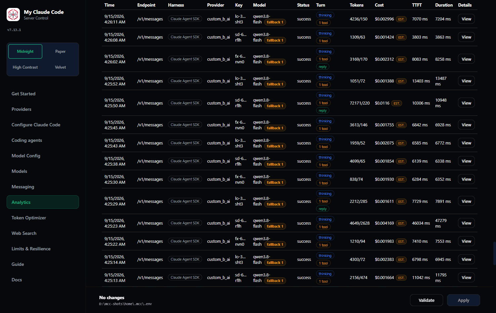
</div>

### The workflow

1. **Find the provider** — search by name or by variable name.
2. **Press Configure.** The card expands and opens that provider's key pool.
3. **Paste your key into "Add key"** and press it. Keys are saved immediately — you do not need **Apply** for them. To add several at once, paste them separated by commas; keys you already have are skipped rather than rejecting the whole paste.
4. **Press Refresh models.** This makes a real API call to that provider. A model count means the key works *and* MCC can read that provider's catalog.
5. **Choose the model** on the **Model Config** tab. There is no "active provider" to select — the model ref you set there decides which provider serves a request.

A provider holds a **pool** of keys, not a single value. Each key in the pool shows its own health (healthy, cooling down, locked out) and has its own **Remove**, which also takes effect immediately. If you added more than one key, pick a **Rotation** policy and press **Apply** — rotation is a restart-required setting, so the server restarts when you apply it.

Local backends (LM Studio, llama.cpp, Ollama) take a base URL instead of a key, and offer **Test connection** where remote providers offer Refresh models.

<a id="using-claude-models"></a>

### Using Claude models

There are two Anthropic providers, and the difference between them matters.

**`anthropic` — a Claude Console API key.** This is the ordinary, supported path: Anthropic's own Messages API, billed per token like any other provider here.

1. Create a key at [platform.claude.com/settings/keys](https://platform.claude.com/settings/keys).
2. Paste it into the **Anthropic (Claude API)** card, exactly like any other provider.
3. Set a model ref such as `anthropic/claude-sonnet-4-6` on **Model Config**.

One thing to know: the override for the upstream address is `ANTHROPIC_UPSTREAM_BASE_URL`, **not** `ANTHROPIC_BASE_URL`. The latter is the variable that points Claude Code *at* MCC — if MCC read it as its own upstream, the proxy would call itself. You almost certainly never need to set either.

**`anthropic_oauth` — a Claude Pro/Max subscription. Anthropic does not permit this.**

Their published terms state that plan OAuth credentials are for Claude Code and Claude.ai only, and that third-party products may not route requests through them. There is no "inside Claude Code" exemption, because once MCC is interposed it is MCC that presents your credential upstream. Anthropic may enforce without notice, and **the risk is to your Claude account**.

If you enable it anyway, MCC refuses by default to use the subscription for anything that did not come from **Claude Code or the Claude Agent SDK** — it reads the `cc_entrypoint` marker Claude Code puts in the request body, so another harness pointed at your proxy is refused rather than silently billed to your plan. Since 6.36.0 the admitted set is `cli`, `cli-bg`, `sdk-cli`, `sdk-py` and `sdk-ts`; before that it was `cli` alone, which refused Anthropic's own SDK.

The Claude subscription card on the **Providers** page reports the plan and rate-limit tier, when the access and refresh tokens expire, the scopes (flagged if `user:inference` is missing, without which the credential cannot answer at all), and the 5-hour and weekly usage windows. Those windows are read from Anthropic's own `anthropic-ratelimit-unified-*` response headers and are never computed: until a real response has carried one, the card says *not yet observed* rather than guessing.

The card has four buttons, and the flow through them is:

1. **Use Claude Code credentials** copies the credential Claude Code already stored into MCC's own store, or **Sign in with Anthropic** gets a fresh one. The sign-in finishes by itself — a callback server on `127.0.0.1` catches the redirect, so there is nothing to copy. If your browser cannot reach MCC's `localhost` (WSL, SSH, a container) it falls back to a paste field, and there you may paste the code, the `code#state` string, or the whole callback URL from the address bar.
2. **Apply settings** — both actions fill `ANTHROPIC_OAUTH_ACCESS_TOKEN` with a non-secret marker, and Apply is what activates the provider. The success message says so.
3. That is all. **No restart.** The running provider notices the new credential on its next request.

The other two buttons are for a credential you already have. **Refresh now** renews it immediately and reports the new expiry. **Disconnect** sets MCC's own store aside — renamed, never deleted — and leaves your Claude Code login alone, so MCC falls back to it if it is healthy.

If a refresh reports that Anthropic is **rate-limiting** (a 429), that means wait. It does not mean your credential is dead, and signing in again in response would rotate a working refresh token away. MCC will not tell you to sign in again for a 429; when it does say that, it means it.

**Read [ANTHROPIC-SUBSCRIPTION.md](ANTHROPIC-SUBSCRIPTION.md) first.** It is the full disclaimer, the settings, and the credential handling.

Claude models also reach you through `bedrock`, `vertex`, and gateways such as `kilo`, `nous_portal` and `cline` — all pay-per-token, none with a policy question attached.

### Reading a failed Refresh models

| Result | Almost always means |
| --- | --- |
| **401 / 403** | The key is wrong, expired, or revoked. |
| **404** | The key is fine — the **model id** isn't available on your account. |
| **402** | Billing: no credit, or plan quota exhausted. |
| **Timeout** | Network, or a self-hosted endpoint that isn't running. |

That 404 case trips people up constantly. If Refresh models fails with 404, check the exact model id against the provider's own model list before assuming the key is bad.

### Doing it by file instead

Set the matching variable in `~/.mcc/.env`:

```bash
NVIDIA_NIM_API_KEY="nvapi-..."
OPEN_ROUTER_API_KEY="sk-or-..."
```

Restart `mcc-server` afterwards.

### OpenCode Zen and OpenCode Go: what MCC sends about itself

Both OpenCode gateways read a small set of identity headers off every request:
which program is calling, which version, which project, which conversation and
which single call. Their own client sends all five. Before 6.69.0 MCC sent
none of them.

**That is why the OpenCode Zen free models stopped working.** Measured on
2026-09-10, with four requests on a real key:

| Request | Answer |
| --- | --- |
| bearer token only — what every release before 6.69.0 sent | **`400 MissingSessionID`** — *"OpenCode's free tier can only be used in OpenCode"* |
| the same request carrying the five headers | `200` |
| the same, with a deliberately **invalid** client id | `200` |
| the same, plus a header the host has never heard of | `200` |

So the check is a refusal, not a smaller allowance, and the header it acts on
is the conversation id. Since 6.69.0 MCC sends all five, to both providers, on
every request:

| Header | What MCC puts in it |
| --- | --- |
| `User-Agent` | `opencode/<version>` — the OpenCode release installed on this machine, else the one this build was pinned against |
| `x-opencode-client` | `cli` |
| `x-opencode-project` | `global` |
| `x-opencode-session` | one stable id per conversation — the id your coding agent supplied, or one derived from how the conversation opened |
| `x-opencode-request` | a fresh id for this one call |

**Say this plainly, because it is your account and your choice.** The default
identifies MCC's requests as the official OpenCode client's. MCC is not the
OpenCode client. The vendor's Zen page says the service is meant to be usable
"with any other coding agent" and documents no required header anywhere, so
there is no published rule either way — but the user-agent is still a claim
about which program made the request, and the free tier's identity check is
the vendor's, not MCC's. The row above showing an invalid client id answered
`200` is the useful part here: the header the host acts on is the conversation
id, which MCC sends under either setting, so the truthful identity is not
known to cost anything.

The truthful opt-out is one setting:

```bash
OPENCODE_CLIENT_IDENTITY="mcc"
```

which sends `User-Agent: my-claude-code/<version>` and
`x-opencode-client: mcc` instead. The conversation, request and project
headers are unchanged — they are the ones the vendor actually asked for, and
the ones that buy prompt-cache stickiness. Not measured, and said rather than
implied: nobody tried a truthful user-agent against the live free tier inside
this release's request budget, so if `mcc` ever stops working, that is the
first thing to suspect. `OPENCODE_CLIENT_VERSION` pins the
release named in the user-agent; empty, the default, reads it from the
`opencode-ai` package installed on this machine.

**OpenCode Go is unverified.** The vendor said on 2026-09-03 that Go requests
must carry the conversation header and began enforcing it on 2026-09-06. MCC
sends it, under the same rule as Zen. Both live Go probes were answered
`401 CreditsError` — the subscription behind the key had run out — so nothing
here claims to have watched the Go requirement be satisfied.

Two things MCC deliberately does **not** send: `x-parent-session-id`, because
MCC never forks a session and would be inventing a relationship, and
`x-mcc-harness` — which coding agent sent the request is between you and MCC,
and never travels upstream.

The conversation id is derived, never forwarded: whatever your agent called
its session is hashed into an opaque id, and the original is not written to
the request log.

**If the vendor turns the check back on**, MCC says so rather than quietly
halving its own quota. A 429 that names the free daily quota and resets at
00:00 UTC is recorded as a learned fact against the provider and shown on
**Models**; **Probe capabilities** on the OpenCode card also spends two
requests asking the host directly, and records *"checked <date>, no difference
observed"* when it cannot tell — which is the honest answer, not a clean bill
of health.

### OpenCode Zen serves different models on different endpoints

**New in 6.74.0.** OpenCode Zen is not one API. It is a front door onto four,
and which one a model lives behind is a property of that model, published in
OpenCode's own registry as a `provider.npm` override. Five of the seven free
models Zen lists today are on Chat Completions; **two — both Muse Spark
contributor models — are served only on the Responses API**, and a request
sent to the wrong endpoint comes back as a bare `HTTP 500 Internal server
error` that names nothing (the vendor's own open issue
[anomalyco/opencode#47969](https://github.com/anomalyco/opencode/issues/47969)
calls it a missing `WrongEndpointError`). Every MCC release before 6.74.0
spoke Chat Completions to all of them, which is exactly what those 500s were.

MCC now resolves the endpoint per model, from four sources, strongest first:

| Shown as | Where it came from |
| --- | --- |
| `responses (override)` | you wrote `"response_surface"` into `model_overrides.json` |
| `responses (learned)` | MCC probed this deployment and the endpoint answered |
| `responses (registry)` | the vendor's published registry, already cached from models.dev |
| `chat_completions (default)` | nobody said otherwise |

The row is on the **Models** page beside every other capability, with the
reason attached — the npm package that selected the endpoint, or why one
cannot be reached. The request log carries it too: each attempt's wire facts
now open with `surface responses (registry)`, so a failed request tells you
which door it knocked on.

**When the registry is wrong, MCC finds out in one request.** If the endpoint
MCC chose refuses in a way that is *about the endpoint* — a bare 500, the
`403 RegionError` the vendor's region check emits instead, or a 4xx naming the
other path — MCC sends one ~16-token probe to the alternative, and on success
remembers it as a learned fact and retries your request there. A 401, a 404, a
429 or any quota refusal never triggers this: those are answers about your
credential or your rate, and moving endpoints would learn nothing. A 500 that
carried a real complaint stays an ordinary retryable outage.

**No model is ever hidden.** A model MCC cannot reach at all — Zen serves a
few through Anthropic's Messages API and one through Google's own API, neither
of which this provider speaks — keeps its row and reads
`unservable (registry)` with the reason spelled out. A catalogue that silently
drops a model the vendor is giving away is worse than one that says why it
cannot use it.

To pin an endpoint yourself, in `model_overrides.json`:

```json
{"models": {"opencode/muse-spark-1.3-contributor-free": {"response_surface": "responses"}}}
```

Values are `chat_completions`, `responses`, `messages` and `unservable`. This
key is deliberately **not** a request parameter — it is never written into a
request body — and an unrecognised value is ignored with a log line rather
than obeyed.

### Local providers

LM Studio, llama.cpp and Ollama need a base URL rather than a key:

```bash
LM_STUDIO_BASE_URL="http://127.0.0.1:1234/v1"
OLLAMA_BASE_URL="http://127.0.0.1:11434"
```

These take no credentials — the key field stays empty and validation just checks reachability.

### Custom providers

Any OpenAI-compatible endpoint that is not one of the 56 built-in cards can be added by hand. Press **Add custom provider** on the **Providers** tab and give it a display name, a base URL and one API key.

**The base URL must include `/v1` (or whatever path segment your gateway uses).** MCC calls the URL you typed, verbatim — it does not append `/v1` for you. `https://api.example.com/v1` is right; `https://api.example.com` is refused by the gateway on every request — measured against one real host, that is a **403** naming the paths it does serve, not a silent 404, and it surfaces immediately as a red card because the create route probes `/models` before it answers you. Check the gateway's own `curl` example: whatever comes before `/chat/completions` is your base URL.

Creating the provider registers it, hot-reloads the provider runtime and queries `GET <base_url>/models` **once**. What that query returns is what the card reports, what `/v1/models` serves, what the **Models** page counts and what the **Model Config** pickers offer — one discovery, one answer, no restart. If it fails, MCC retries it once and then says so: the card turns red with the upstream's error, and the banner tells you to press Refresh models. A failed discovery never renders as a healthy card.

**Refresh models** on a custom card does exactly what it does on a built-in remote card: re-queries the upstream's model list and republishes every generated harness catalogue, including `~/.mcc/codex-model-catalog.json`. Use it after the upstream adds a model, or after a discovery failure you have since fixed. Enabling a provider, adding a key and removing a key each re-run discovery on their own.

Keys for a custom provider live in **`~/.mcc/custom_providers.json`, not `~/.mcc/.env`.** There is no environment variable for them, so the `{ENV}_API_KEY` / `{ENV}_ROTATION` file workflow does not apply — but the pool itself is the same one built-in providers use, so several keys plus a rotation policy work exactly as they do elsewhere.

**Per-key health.** A custom pool has always rotated, benched and cooled down on the same engine a built-in pool uses; since 6.25.0 the card also *shows* it. Each key row carries the same badge the built-in pools carry — `HEALTHY`, a cooldown with the time remaining, a lockout, or `HEALTHY (1 model)` when the key is rate-limited for one model and still serving every other. Custom pools also appear in the **Rotation, per pool** readout on the Providers tab.

**Disabling and deleting.** These now mean different things, because you mean different things by them.

- **Disable** is temporary, so your routing is left alone and switched off instead: every `MODEL*` chain entry naming the provider is **paused**, exactly as if you had paused it on **Model Config**, and the banner names the entries it paused. Re-enabling lifts precisely those pauses — a ref you paused by hand before disabling stays paused.
- **Delete** is permanent, so the references go with it. Every `MODEL*` key that named the provider is rewritten, and the banner lists what was removed. A route whose own model was the deleted provider is reset to its default rather than left pointing at nothing.

Before 6.25.0 either gesture, applied to a provider a `MODEL*` setting named, made the next settings load fail outright — the whole process, rather than the one route. A disabled custom provider now stays valid in configuration while remaining unbuildable at runtime, which is what "disabled" should have meant all along.

**Reasoning dialect.** This is the one capability a custom provider genuinely could not have. A built-in provider's `reasoning_effort` vocabulary is written into its profile by someone who probed the host; a provider you invented has no profile, so it was assumed to speak the four standard OpenAI words (`minimal`, `low`, `medium`, `high`) — and a host that documents `low`, `high`, `max` had every request for `max` quietly clamped to `high`, with no user-accessible way around it.

MCC now asks the host directly. On create, and again on every **Refresh models**, it sends at most two 16-token chat completions: the first carries a deliberately invalid `reasoning_effort`, and if the host answers `400` naming its enum, that enum becomes this provider's vocabulary. Three outcomes, all shown on the card:

| Card reads | What was established |
| --- | --- |
| `learned {low, high, max} on 2026-09-01` | the host named its enum in a 400; MCC now spells those words |
| `ignored on 2026-09-01` | the host answered 200 to a value no scale contains, so it does not read the field |
| `unknown (401)` / `unknown (not probed)` | nothing was measured; behaviour is unchanged from before |

**Probe reasoning dialect** on the card re-runs it on demand, and the field beside it takes a comma list (`low, high, max`) if you would rather state the answer than measure it; clearing the field forgets what was learned. Nothing about reasoning gating changes: the vocabulary is still intersected with the model's own, a clamp is still recorded in the request log, and an unknown dialect still behaves exactly as it did before.

One caveat on capabilities. models.dev, which supplies context windows, output caps and reasoning-effort vocabularies, is keyed by *its* provider ids — and a provider you invented is not in it. That turns out to be an advantage rather than a gap: without a bucket, custom models fall through to the cross-provider vote (the same model id as served by other providers), which in practice resolves *more* than a bucket does. `supported_parameters` and `default_parameters` are the fields that genuinely stay unknown, and they are unknown for nine of the eleven live providers, built-in ones included. Routing, rotation, key health, benching, fallback chains, visibility globs and analytics are all identical to a built-in provider.

---

## 9. Model tiers and routing

MCC routes by **tier**, not by a single model. Fable, Opus, Sonnet, Haiku and a fallback each map to a real model on your provider.

<div align="center">
  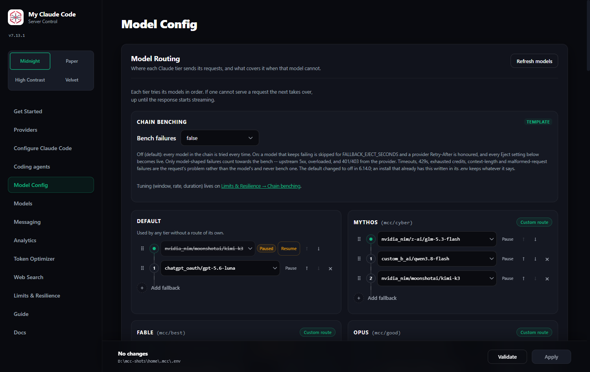
</div>

So when Claude Code requests "Sonnet", it receives whatever you mapped Sonnet to. This is the mechanism that lets an unmodified agent run on any backend.

### Practical advice

**Map Haiku to something cheap and fast.** Agents use the small tier constantly for internal bookkeeping — summarising, classifying, deciding what to do next. A slow model there makes the entire session feel sluggish even when your main model is quick. This single choice affects perceived speed more than anything else in this document.

**Reserve the big tier for actual work.** Opus/Fable should be your strongest available model; you'll hit it far less often than you expect.

**Set the fallback deliberately.** It catches requests for models you haven't mapped. Pointing it at something cheap avoids nasty surprises.

### Fallback chains

Every tier can carry an ordered list of stand-ins. Press **Add fallback** under a tier's model, name a second model, and add a third if you want. When the model a request routes to cannot serve it, the next entry takes over — a free model that rate-limits at an awkward moment stops being the end of the request.

Each chain belongs to its own tier and they are never merged: a tier with its own model tries its own chain, and a tier left on **None** tries `MODEL` and `MODEL_FALLBACKS`.

**Reordering a chain.** Each entry has a grip on its left. Drag it and the row moves; the up/down arrows beside it do the same thing one step at a time and still work, so the whole feature has a keyboard equivalent.

| Gesture | What it does |
| --- | --- |
| Drag a grip within one card | Reorders that chain |
| Ctrl/Cmd-click a row | Adds it to the selection |
| Shift-click a row | Selects the range from the last one you clicked |
| Shift+Space, Shift+Up/Down on a focused grip | The same range, from the keyboard |
| Drag onto another tier's card | **Copies** the model there; the source keeps it |
| Hold **Shift** while dropping on another card | **Moves** it instead — the source loses it |
| Drop onto a card's top slot | That model becomes the route's own model; the one it replaces becomes fallback 1 |
| Escape | Clears the selection, or abandons a drag in progress |
| Ctrl+Z | Undoes the last drag — one level, and only on this page |

A group keeps the order it has on screen, not the order you clicked. Nothing is written until you press **Apply**; the panel at the top of the page says what just happened in a sentence and offers an Undo.

A route's own model is a drag source like any row, but it is never *moved* out of its own card: a route with no model of its own fails validation and the server refuses to start, so that drop is refused with a sentence saying so. Dragging it onto its own first fallback trades the two, which is exactly what its down arrow does.

**Pausing one entry.** Every row, the route's own model included, has a **Pause** button. A paused model keeps its place and stays fully visible with its whole ref, but the router never tries it: **no attempt is spent on it and no deadline is consumed**, and the request log still lists it under *not tried* with the reason `paused`, so a paused route is still debuggable. **Pause is per route.** Pausing an entry on one route does not pause the same model on other routes: a ref that appears in the Opus chain and the Haiku chain is two entries, and pausing the first leaves the second live. Pause it on every route you want it off. The panel names the route it just wrote, which is the route it applies to.

Unlike everything else on this page, a pause is written the moment you click it: there is no Apply, and an unsaved drag elsewhere on the page is left exactly as it was. The status panel offers an Undo. **Since 6.35.1 the click is immediate** — a pause used to rebuild every provider client and re-query every provider's `/models` before it answered, which cost seconds and could briefly stall the proxy; a routing-only write now skips both, because neither can change what a pause does. If a pause fails, the same panel says so and the row goes back to the state it was really in. Pausing every model on a route is allowed and makes that route fail with an error naming the setting, rather than quietly re-routing somewhere you did not ask for.

**Pausing is not hiding.** Hiding a model on the **Models** page only removes it from `/v1/models` and the admin pickers and never changes routing. Pausing only changes routing and never changes listings. They are separate switches on purpose.

| Setting | Holds |
| --- | --- |
| `MODEL_PAUSED` | paused entries on the default route |
| `MODEL_FABLE_PAUSED` | paused entries on Fable |
| `MODEL_OPUS_PAUSED` | paused entries on Opus |
| `MODEL_SONNET_PAUSED` | paused entries on Sonnet |
| `MODEL_HAIKU_PAUSED` | paused entries on Haiku |
| `MODEL_VISION_PAUSED` | paused entries on the vision adapter |
| `VISION_ADAPTER_MODE` | what the vision adapter does with an image: `route` (default, divert the whole request) or `describe` (describe the image, keep the model) |
| `TOOL_RESULT_IMAGE_DELIVERY` | how an image a *tool* returned reaches a non-Anthropic model: `auto` (default), `attach`, `strip` |
| `IMAGE_MAX_LONG_EDGE` | longest edge, in px, an outbound image may have. `1568` (default), `0` to send images untouched |
| `IMAGE_JPEG_QUALITY` | re-encode a resized image as JPEG at this quality. `0` (default) never changes the format |
| `IMAGE_DETAIL` | OpenAI's per-image detail knob: `auto` (default, sends no field), `low`, `high` |

All six are comma-separated `provider/model` lists, written by the Pause button rather than typed, and **new in 6.21.0**. An entry is dropped from its list automatically when it leaves the route it was paused on.

**Failover stops once you have seen output.** This is the part people get wrong:

| The model fails… | What happens |
| --- | --- |
| while connecting, authenticating, or rate-limiting | the next model takes over, invisibly |
| before it emits anything | the next model takes over, invisibly |
| halfway through streaming its answer | the request fails |
| at any point, for a **non-streaming** request | the next model takes over — nothing reached you yet |

A chain rescues the failures that happen before the first word, not the ones that happen at word five hundred. Switching models mid-answer would splice two different replies together, so MCC refuses to.

**A model that goes quiet is a failure too.** Accepting a request and then producing nothing looks, to a proxy with no deadline, exactly like thinking hard — so without a limit it holds the request until the transport gives up, and the chain gets its turn minutes later. Four settings on the **Limits & Resilience** tab bound that:

| Setting | Default | What it does |
| --- | --- | --- |
| First-token deadline | `0` (no limit) | How long a model may stay silent before the next one takes over. Nothing has streamed yet, so you never see the switch. Ships off with the other deadlines, so nothing hands over on silence until you set it. |
| Total request budget | `0` (no limit) | The whole request, across every attempt and retry. A stream that already started cannot be replaced, but it can be stopped. |
| Eject mode | `rate_based` | How a failing **model** is benched. `rate_based` (default) skips a model when its failure rate over the last `FALLBACK_EJECT_WINDOW` requests (default 10) crosses `FALLBACK_EJECT_FAILURE_RATE` (default 50%), with at least `FALLBACK_EJECT_MIN_SAMPLES` (default 8) requests observed, for `FALLBACK_EJECT_SECONDS` (default **10 s** since 6.68.0 — until 6.0.0 a clamp inside route health silently cut that to 1 s for timeout and 5xx ejections, so a model you thought was benched for half a minute was back at the front of the chain a second later). A single blip never benches a working model; sustained failures do. `legacy` preserves the old consecutive-count behaviour keyed on `FALLBACK_EJECT_AFTER_FAILURES` / `FALLBACK_EJECT_SECONDS`. This is about models. It never touches a key — see [Multi-key rotation](#11-multi-key-rotation). |
| Retry primary once | `skip` | What happens when the primary model fails. `skip` (default) moves straight to the next fallback. `retry_once` gives the primary one more chance for transient errors (timeout, 5xx, 429) before falling through. Auth and invalid-request errors are never retried. |

If every model on a route is benched, MCC tries them in order anyway — skipping a bad model is an optimisation, refusing to try anything is an outage.

**Running out of context no longer ends the chain.** A conversation that outgrew a model's window and a genuinely malformed request both come back as HTTP `400`, and until 5.43.0 MCC treated them alike: it gave up on the whole chain, on the reasoning that a bad request will be bad everywhere. That is true of a malformed body and false of a context overflow, which is precisely what a larger-window fallback is for. MCC now tells the two apart and falls through to the next model on an overflow. If you preferred the old behaviour, set `FALLBACK_SKIP_KINDS=invalid_request,model_rejected,context_length` to abort on all of them again.

**Nor does a model refusing the request (6.46.0).** The same reasoning went one step further. A `400` was still treated as *your body is wrong, and it will be wrong everywhere* — but measured across 274,375 live requests, not one `400` any configured provider actually sent was that. They were `Model "stealth/ox-alpha" is not supported on this endpoint.`, `` `top_p` is immutable for this model and must be 0.95 ``, `` `name` must be at most 64 characters, got 68 ``, `Additional info: missing tags` — a model that host does not serve, a sampling value that one model pins, a length cap that is 64 on one dialect and 128 on another and unbounded on a third. Every one of them would have been served by the next model on the chain, and every one of them ended the route instead: 123 requests on a two-model route, 45 on a five-model one, 28 on a chain of twelve.

MCC now splits the two on the provider's own words. A `400` whose message says the request is **malformed** keeps the `invalid_request` kind and still ends the route — nothing else can serve a body the host cannot parse. Every other `400` is the new `model_rejected` kind, which is not in `FALLBACK_SKIP_KINDS` by default, so the chain gets its turn. Nothing changes for your client: both kinds go out on the wire as `invalid_request_error`, and on the Gemini surface as the same invalid-argument status, exactly as before, and neither one benches a model or charges an API key. To get the old behaviour back byte for byte, set `FALLBACK_SKIP_KINDS=invalid_request,model_rejected`.

**Nor does running out of credits.** Since 6.34.0 an account with no balance left is its own failure kind, `quota`. It is what the provider *says*, not what status it picks: HTTP 402, or a 400/403 whose error body names an explicit billing phrase — `insufficient credits`, `purchase more credits`, `insufficient balance`, `NOT_ENOUGH_BALANCE`, `quota exceeded`, `insufficient_quota`, `payment required`, `out of credits`, `credit balance is too low`, `CreditsError`. One measured request on 2026-09-02 asked for `commandcode/z-ai/glm-5.3-flash`, got HTTP 400 *"You have insufficient credits to make this request. Please purchase more credits to continue using the service."*, and — because that body classified as `invalid_request`, which is in `FALLBACK_SKIP_KINDS` by default — six configured chain entries were recorded as *not tried* and the caller got a 400 for a request that was perfectly fine.

**What "credits exhausted" now does.** Another key may have credits, so the pool rotates first; when every key is out, the chain moves to the next model. It never counts toward the chain bench — an empty wallet says nothing about the model. When the phrase is one of the list above, the key is also **benched for `RATE_LIMIT_COOLDOWN_SECONDS`** (the same setting a header-less 429 uses; no new number), whole-key rather than per-model, and the Models page says so: *COOLDOWN — credits exhausted*, with *benched: credits exhausted, 55s left* on hover. A bare 402 with no recognisable phrase still rotates and still falls through, but benches nothing: unsure never benches. If every model on the route ends this way, the error you get names it — *all keys reported exhausted credits* — and points at **Providers**.

Requests that name a provider and model directly (`open_router/…`) are never redirected. An explicit choice is honoured as given.

<a id="tiers-for-every-other-coding-agent"></a>

### Tiers for every other coding agent

Everything above this line has been Claude Code's privilege. Claude Code never
names a model: it asks for `claude-sonnet-5` and receives whatever you mapped
Sonnet to, which is why moving a route moves every session that is already
running on it. Every other agent had to name a concrete `provider/model` ref,
because that was the only thing that existed for it — and the request log is
blunt about the consequence. Across the whole 272,132-row request log the number
of non-Claude-Code requests that ever named a tier-style alias is **zero** —
every coding-agent request named a concrete provider/model ref, because that was
the only thing that existed for them, while 99.98% of Claude Code traffic names
an alias. A model id typed into OpenCode's config a month ago is still that
model id today, however many times you have moved the route it should have been
following.

**New in 6.38.0**, five names close that gap. They sit at the top of the model
picker MCC generates for each of the thirteen agents that carry a catalogue —
Codex, Pi, OpenCode, OpenCode 2, Kilo, Command Code, Kimi Code, Qwen Code,
Crush, Cline, Aider, Droid and Gemini CLI — and each one is a name for a route
on this page rather than a model of its own:

| Name | The route it names | And therefore the chain it uses |
| --- | --- | --- |
| `mcc/best` | `MODEL_FABLE` | `MODEL_FABLE_FALLBACKS`, `MODEL_FABLE_PAUSED` |
| `mcc/good` | `MODEL_OPUS` | `MODEL_OPUS_FALLBACKS`, `MODEL_OPUS_PAUSED` |
| `mcc/medium` | `MODEL_SONNET` | `MODEL_SONNET_FALLBACKS`, `MODEL_SONNET_PAUSED` |
| `mcc/cheap` | `MODEL_HAIKU` | `MODEL_HAIKU_FALLBACKS`, `MODEL_HAIKU_PAUSED` |
| `mcc/vision` | `MODEL_VISION` | `MODEL_VISION_FALLBACKS`, `MODEL_VISION_PAUSED` |

**An image a tool returned reaches the model as an image, since 6.49.0.**
A screenshot or a `Read` of a PNG arrives nested inside the tool result, and
no OpenAI-format chat message can carry an image there. MCC used to flatten
it into base64 text, which every OpenAI-dialect provider billed at roughly a
token per byte -- 324,000 prompt tokens for one 213 KB screenshot the model
never actually saw. It is now moved into a short `user` message right after
the tool output, marked as tool output rather than as something you said.
`TOOL_RESULT_IMAGE_DELIVERY` picks the rule: `auto` attaches unless the model
that answers is published as not accepting images, `attach` always attaches,
`strip` never does. The request log's `image_delivery` field records which
happened, per request.

**Images are shrunk before they are sent, since 6.53.0, and this is on by
default.** `IMAGE_MAX_LONG_EDGE` is `1568` px -- the size Anthropic itself
resizes to, and the size Claude Code ships. An image larger than that is
resized once, on the copy of the request MCC is about to send, and the request
detail shows the before and after (`1920x1080 -> 1456x819`). Nothing MCC stores
changes: the picture in the request log has always been a thumbnail.

The resize respects the destination's *token* budget as well as the pixel one,
which is why 1920x1080 lands on 1456x819 and not on 1568x882 -- the second
would satisfy the 1568 px edge and cost 1792 tokens, over the 1568-token half
of the same budget.

What this actually changes, per family:

| family | formula | effect of the default resize |
| --- | --- | --- |
| Anthropic (`ceil(w/28) x ceil(h/28)`, [docs](https://platform.claude.com/docs/en/build-with-claude/vision)) | 28 px per token, capped 1568 px / 1568 tokens | **none** -- Anthropic resizes to exactly this before billing anyway |
| OpenAI tile (`base + tiles x per_tile`, [docs](https://developers.openai.com/api/docs/guides/images-vision)) | fit 2048², short side to 768, 512 px tiles | **none** -- both sizes land on the same 6 tiles |
| Gemini (258 per tile, [docs](https://ai.google.dev/gemini-api/docs/image-understanding)) | flat 258 under 384 px, else `floor(min(w,h)/1.5)` crop units | **none** -- both sizes land on the same 6 tiles |
| OpenAI patch (`ceil(w/32) x ceil(h/32) x multiplier`, same docs) | per-model patch budget | **-41%**: 2448 tokens becomes 1435, and the model genuinely sees less |

That last row is the reason this is a setting and not a constant. Set
`IMAGE_MAX_LONG_EDGE=0` to send exactly what your client sent, byte for byte.

`IMAGE_JPEG_QUALITY` is off (`0`) by default and means "never change the
format" -- these are screenshots of text and code, the worst case for JPEG
ringing. `85` is the usual opt-in; any image with an alpha channel is skipped
whatever it says.

`IMAGE_DETAIL` is OpenAI's per-image fidelity knob and is meaningless
elsewhere. `auto`, the default, emits no `detail` field at all -- which is what
OpenAI applies anyway. `low` bills the base tokens only and shows the model a
thumbnail, so it will confidently misread a screenshot rather than say it
cannot see one. It never changes MCC's own token estimate: that is a function
of the picture's real dimensions and the host's published formula.

**How MCC estimates what a picture costs, since 6.53.0.** Every provider has a
declared `image_token_family`, shown as a chip on the Models page beside each
host. A host with no published formula is `unknown` and is charged Anthropic's
28-px rate, because the request arrived in the Anthropic protocol and that is
the budget the client itself is reasoning about -- the fallback is recorded,
not hidden. Nothing anywhere branches on a model name to reach the family.

Every request that carried a picture now stores `est_tokens_in` and
`est_image_tokens` in the request log, and the Models page shows a
**billed/est** ratio per host over the uncached successful requests that
carried one. Read it like this: near `1.00x` means that host's declared family
is right. A host far from `1.00x` has either the wrong family or a formula
nobody publishes, and should be marked UNVERIFIED rather than guessed at.

**The vision adapter's describe calls now report what they cost, since
6.53.0.** They always had a row in the request log; that row never had a token
column, so the cost was discarded rather than misfiled. `request_attempts` now
carries nullable `tokens_in` / `tokens_out`, and the request row carries
`adapter_tokens_in` / `adapter_tokens_out` rolled up from them. The request
detail shows the answering model's tokens as it always has, and a separate
`+ adapter` line beneath. The adapter's tokens are **never** folded into
`tokens_in`: that column measures the model that answered and has measured
exactly that since the log existed. NULL there means not measured, never zero.

**The vision adapter has two modes, since 6.51.0.** `VISION_ADAPTER_MODE`
decides what happens when a request carries an image and the model its route
picked is published as unable to read one.

| mode | what happens | who answers |
| --- | --- | --- |
| `route` (default) | the whole request is diverted to `MODEL_VISION` | the vision model |
| `describe` | each image is sent to `MODEL_VISION` on its own, and its description replaces the image | the model the route picked |

`route` is what every release up to 6.50.1 did, and upgrading changes nothing.
Choose `describe` when your coding model is fast, cheap and blind and the
screenshot is *context* rather than the question -- in `route` mode the vision
model has to answer a coding question it has no context for. Choose `route`
when the picture is the question.

A describe call is an ordinary routed request over the vision chain: same
fallbacks, same `MODEL_VISION_PAUSED`, same benching, same retries, and its own
row in the request log linked to the request that carried the picture
(`route_diversion` reads `vision_described`, `image_delivery` reads
`described`). Descriptions are cached against the image's own content, so one
screenshot re-sent on every turn is described once; **Admin UI -> Requests ->
Clear image descriptions** forgets them all. Images of one request are
described concurrently, at most three at a time.

Failure never reaches the client. A describe call that fails falls back to
`route` mode for that request; a route with nowhere to divert to falls back to
a placeholder sentence saying the image could not be described. The request is
answered either way.

The fleet is genuinely split over how it spells a model id, so both spellings
are accepted: the bare `mcc/best` that Codex, Command Code, OpenCode, Kilo, Pi
and Kimi Code put on the wire, and the gateway form `anthropic/mcc/best` that
Cline, Crush, Droid, Gemini CLI, Qwen Code and Aider put on it. The router
answers the same way to both, and the tier segment is matched exactly — no name
merely *containing* `cheap` lands on the cheap rail.

**On a default install all five resolve to the same model, and the dashboard
says so.** `MODEL_FABLE`, `MODEL_OPUS`, `MODEL_SONNET`, `MODEL_HAIKU` and
`MODEL_VISION` ship unset, so every tier collapses onto `MODEL` — primary,
fallbacks and pause list together — which is exactly what `claude-opus-5`
already does today. That includes `mcc/best`, which names `MODEL_FABLE` since
6.51.0: it used to name `MODEL`, which made the ladder's top rung and the floor
every unset route falls back to the same setting, and an install that never set
`MODEL_FABLE` sees no change at all. MCC
deliberately does not invent a different model for an unset tier, because
choosing one would be MCC choosing a model for you; the Tiers section says *Same
as global Opus — currently `<ref>`* instead of quietly picking something. Map
Opus, Sonnet and Haiku the way section 8 recommends and the five names separate
by themselves, with no further configuration.

**Giving one agent its own tier.** Each card on the **Coding agents** page now
carries a collapsible **Tiers** section built from the same rail component as
Model Config: drag a row by its grip to reorder the chain, **Pause** one entry
without deleting it, and drop a fallback onto the top slot to promote it to the
route's own model. **Override** on a tier starts that agent's own chain,
**Revert to global** removes it again. The result is written atomically to
`~/.mcc/harness_tiers.json`, which you can also read or edit by hand:

```json
{
  "harnesses": {
    "opencode": {
      "best":  {"model": "open_router/x-ai/grok-5",
                "fallbacks": ["nous_portal/tencent/hy3"],
                "paused": []},
      "cheap": {"fallbacks": ["open_router/z/cheap-1"]}
    }
  }
}
```

There are three states per agent and tier, and the middle one is the point of
the file:

| What the file says | What the agent gets |
| --- | --- |
| no entry for that agent, or none for that tier | the global chain — the default for every agent and every tier |
| an entry with no `model` | the global primary still leads, but this agent's own `fallbacks` and `paused` follow it |
| an entry with `model` set | this agent's own chain leads |

An entry that names its own `model` owns its **whole** chain: the global
fallbacks are not appended underneath it, because attaching models you never
listed under a heading that says these are yours would be the more surprising
answer. A ref in the `mcc/` namespace is refused — a tier can never point at
another tier — and an entry for an agent id MCC does not know is dropped with a
log line rather than honoured against nothing.

**A request with no agent identity still resolves.** Per-agent overrides need to
know which agent is asking, which MCC learns from the `x-mcc-harness` header its
launchers send or from the user-agent fingerprinting added in 6.37.0. When
neither answers — raw `curl`, an older launcher — the tier still resolves; it
simply resolves against the global chain. The feature never fails a request for
want of an identity.

**Turning the names off.** `HARNESS_TIER_ALIASES` (default `true`) is the master
switch for whether the five aliases are emitted into the generated pickers and
into `/v1/models`. It is on **Model Config**, under the models section, as *List
MCC tiers in coding agents*. Switching it off keeps the pickers to concrete refs
only; it does **not** stop the router resolving a tier alias a client sends
anyway, so an agent whose config already names one keeps working either way. For
the same reason `MODEL_VISIBILITY_ALLOW` and `MODEL_VISIBILITY_DENY` never
filter these five: they are protocol names for MCC's own routes, exactly like
the eight `claude-*` aliases, so filtering one would not hide a model — it would
break an agent whose config file already names it.

**What else moved with them.** Crush now seeds `models.large` on `mcc/best` and
`models.small` on `mcc/cheap`; it used to repeat the same model for both,
because inventing a "small" model by matching on a name would have been MCC
guessing which of your routes is cheap, and `mcc/cheap` is not a guess — it is
the route you labelled cheap. Cline seeds its session model on `mcc/best` for
the same reason. Gemini CLI's seeded model was simply a bug: it took the first
entry of the enumeration rather than the route you configured, so a session
opened on whichever model happened to enumerate first; it now goes through the
same starting-model rule as Cline and Crush. Kimi Code prefixes every ref with
`mcc/`, so a tier's generated key there reads `mcc/mcc/best` while the `model`
value on the wire is the plain `mcc/best`. Claude Code is unaffected — it has no
generated catalogue and keeps speaking the `claude-*` names. And the provider id
`mcc` is now reserved: creating a custom provider whose name would slug to it is
refused with a message saying why, rather than shadowing all five aliases and
leaving that provider's models silently unroutable.

**Finding one in the log.** A request that named a tier is recorded with
`requested_model=mcc/best`, `harness=<agent id>` and `resolved_model=<the real
ref>`, plus `tier`, `tier_source` (`global` or `override`) and `tier_harness` in
the row's parameters — enough to answer the question `resolved_model` alone
cannot, which is whether *your* override fired or the agent quietly followed the
global route. Nothing about the log's schema changed and exports are unchanged.

<a id="how-an-agents-model-list-gets-to-disk"></a>

### How an agent's model list gets to disk

Every agent's generated document lives under `~/.mcc` — `~/.mcc/opencode-config.json`,
`~/.mcc/crush/crush.json`, `~/.mcc/kimi-code-config.toml` and the rest, one per
agent, all listed on the **Coding agents** page with the path and the time it was
last written. They are MCC's files in MCC's own directory; nothing is ever
written inside a CLI's own configuration folder.

**`mcc-server` writes all of them at startup, and rewrites them on every
catalogue publish.** A launcher's job is therefore to open the file and start
the agent. It costs no HTTP at all, so a launch is as fast as the agent itself.

**A launcher fetches only to create a document that is not there** — a machine
where `mcc-server` has never run, or a file you deleted. That single build gets
`CATALOGUE_FETCH_TIMEOUT_SECONDS` (20 s by default, on **Limits & Resilience →
Deadlines**), and if it fails the warning names the file it wanted, the request
it tried, the budget it had and what to do next; the agent then starts without
MCC's provider rather than refusing to start.

Two agents work differently, on purpose:

* **Command Code** has no extra-config variable, so MCC owns one key inside
  `~/.commandcode/providers.json` — a file *you* wrote. That merge happens on
  every `mcc-commandcode` launch and never in the background: a `provider.mcc`
  block must not appear in your own config because a key rotated on a server you
  left running.
* **Goose** has no generated file anywhere. It takes its model and context limit
  from environment variables the launcher sets, so it reads the model list from
  the server on each launch.

> **Before 6.36.1 this was the other way round**, and it deadlocked. Only the
> launcher created a file, and its fetch was given the 1.5 s budget belonging to
> the `GET /health` preflight — for a route that takes 1.8–4.0 s on a real
> install. So the fetch timed out, the file was never created, the server never
> refreshed a file that did not exist, and every later launch failed the same
> way: *"could not prepare the OpenCode config (timed out); launching without an
> MCC provider"*, forever.

### The Codex App catalog

The Codex App has no launcher — it reads a persistent `~/.codex/config.toml` rather than an environment built per command. Its catalogue is written the same way every other agent's is: `mcc-server` writes `~/.mcc/codex-model-catalog.json` at startup and rewrites it whenever the model inventory *or any model's resolved capabilities* change. The Codex App points at that stable path from its config:

```toml
model_catalog_json = "/Users/YOUR_USERNAME/.mcc/codex-model-catalog.json"   # macOS
# model_catalog_json = "C:/Users/YOUR_USERNAME/.mcc/codex-model-catalog.json"  # Windows

model_provider = "fcc"
model = "nvidia_nim/nvidia/nemotron-3-super-120b-a12b"

[model_providers.fcc]
name = "My Claude Code"
base_url = "http://127.0.0.1:8082/v1"
env_key = "FCC_CODEX_API_KEY"
wire_api = "responses"
```

`env_key` reads the same proxy auth token the `mcc-codex` launcher sets per process. Because the server owns this copy of the catalog, the Codex App always sees the current model list — restart it after setup or a model change, then pick an MCC model from its picker.

### Images and the vision adapter

Plenty of fast text-only models cannot read a screenshot. Set a **Vision adapter** on Model Config and any request carrying an image goes there instead — but only when the tier's own model is *known* not to accept images. A model whose provider publishes no capability data is left alone, because rerouting on silence would move traffic away from models that handle images perfectly well.

You do not have to work out which of your models are affected: a tier that needs the adapter says so on its own card, naming where its images actually go. If no adapter is set, the same line turns amber to say those images will fail there.

The adapter is a route like any other, so it gets its own **Add fallback** chain. One unreachable vision model would otherwise lose every image on the machine.

#### Outbound image size

Since 6.53.0 every outbound picture is resized before it is sent, on the deep copy the router already takes — your client's own request is never mutated, and every dialect converter is handed pre-shrunk data.

```bash
IMAGE_MAX_LONG_EDGE=1568   # long edge in px; 0 sends what the client sent
IMAGE_JPEG_QUALITY=0       # 0 = never re-encode; >0 = JPEG at this quality
IMAGE_DETAIL=auto          # OpenAI's per-image fidelity field: auto | low | high
```

`IMAGE_MAX_LONG_EDGE` ships **on**, at 1568 — the budget Anthropic itself resizes to. On three of the four billing families that is token-neutral, because they already resize server-side; on the fourth, OpenAI's patch-billed models, it is a 41% saving and the one case where the model genuinely sees less. Set `0` to turn it off.

`IMAGE_JPEG_QUALITY` is opt-in for a reason: these are screenshots of text and code, which is the worst case there is for JPEG ringing. `0` never changes the format. Any image with an alpha channel is skipped whatever this says.

`IMAGE_DETAIL=auto` emits no field at all, which is unchanged behaviour. It is meaningless outside the OpenAI dialects and is not emitted there.

All three live on **Model Config**, beside the vision adapter. The **Models** page carries a `billed/est` chip on a provider row once there is enough traffic to compare — the input tokens that host actually billed against what MCC's per-family estimator predicted — and the request detail shows the same comparison per request, with a `+ adapter` line when a describe hop contributed tokens of its own.

#### Images a tool returned

An image nested inside a tool result cannot ride in an OpenAI-format tool message at all. `TOOL_RESULT_IMAGE_DELIVERY` chooses what happens to it:

| Value | What is sent |
|---|---|
| `auto` *(default)* | the picture is hoisted into a short `user` message right after the tool output — unless the answering model is published as unable to read one, in which case a plain sentence naming the tool takes its place |
| `attach` | always hoist the picture |
| `strip` | never send it; always the sentence |

There is deliberately no option to send base64 text: that is what cost 324,000 prompt tokens for one 213 KB screenshot before 6.49.0, for a picture the model never saw. The request detail marks what happened with an `image_delivery` line, so a request that lost a picture says so.

<a id="tutorial-describe-mode"></a>

### Tutorial: describe mode

The case this exists for: your Sonnet tier is a fast, cheap, text-only model, and Claude Code keeps sending screenshots mid-conversation. In `route` mode the whole request goes to the vision model, which then has to answer a coding question it has no context for. In `describe` mode the screenshot becomes words and *your* model answers.

**1. Set a vision adapter.** **Model Config** → **Vision Adapter** → pick a model that reads images. Give it a fallback or two; one unreachable vision model would otherwise lose every image on the machine.

**2. Switch the mode.** Under the adapter's chain, **Vision Adapter Mode** → *Describe the image, keep the model*. The line under it tells you which tiers this currently covers — those are the tiers whose models cannot read images.

```bash
VISION_ADAPTER_MODE=describe   # default: route
```

**3. Send a screenshot.** Then open **Analytics → Requests** and find the row. You will see **two** rows for the one turn: the describe call against the vision model, and the answer from the model your route actually picked. That is deliberate — a describe hop is a different model on a different key, so it is priced on its own row rather than folded into the answering model's figure.

**4. Send the same screenshot again.** There is no second describe call. Descriptions are cached against the image itself, so a screenshot Claude Code re-sends every turn is described once. Clear the cache from **Requests → Clear image descriptions** when you switch to a better vision model.

**What it costs, exactly.** One extra sub-request *per image*, not per request, and only for images the answering model could not have read anyway. A model that can see is simply sent the picture, which is cheaper than two calls and always better.

**What it cannot cost you.** An answer. A describe call that fails falls back to `route`; a route with nowhere to divert to falls back to the placeholder sentence. Each describe call is an ordinary routed request, so the vision chain's own fallbacks, pause list, health registry and retry policy all apply to it.

Pick `describe` when the picture is *context*. Pick `route` when the picture *is* the question.

<a id="tutorial-manage-many-models"></a>

### Tutorial: manage many models

A provider with three hundred models is not manageable one tick at a time. On a real catalogue of 1,021 models across 10 providers, hiding the 317 published by one gateway used to be 325 clicks and 634 requests — about 1.07 GB of traffic and five to nine minutes of clicking. The same job is now two interactions and one request: 41 KB, 7 ms.

<div align="center">
  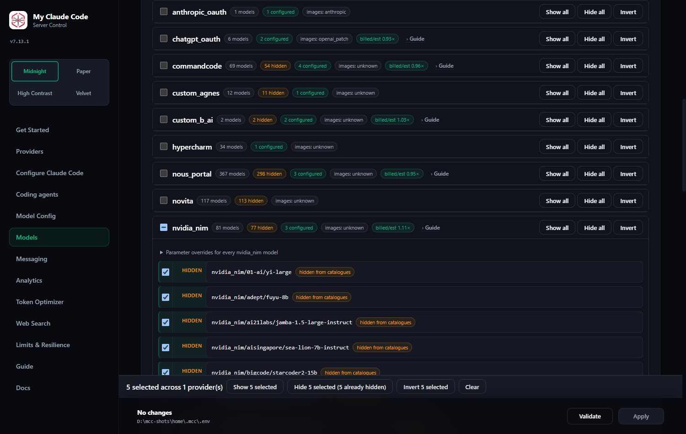
</div>

**1. Open Admin UI → Models.** Each provider is a collapsed disclosure with a sticky header carrying its visible / hidden / configured counts. The header buttons — **Show all**, **Hide all**, **Invert** — work while the provider is still collapsed; you never have to expand 317 rows to act on them.

**2. Press `/` to search.** It focuses the filter from anywhere on the page. Type `opus`, or a provider id, or a fragment of a model name. The facet chips — All / Visible / Hidden / Configured / Overridden — narrow the same list, and the result-count line offers **Select all N**.

**3. Apply to what the filter left.** This is the point of the filter: the bulk buttons act on the *filtered* set, not the whole catalogue. "Hide the 38 models matching `opus` across four providers" is three interactions — filter, Select all 38, Hide.

**4. Or pick a range by hand.** Every row has one checkbox, in the ruled left gutter. Beside it is a readout — `Shown`, `Hidden`, or `Hidden by <pattern>` — which reports the row's state and is not a second control:

| Gesture | Selects |
| --- | --- |
| Click, then **Shift+click** | everything between the two rows |
| **Shift+ArrowDown / Shift+ArrowUp** | extends or shrinks the same range from the keyboard |
| **Shift+Space** | extends the selection from the anchor row to the focused row — the keyboard equivalent of Shift+click; a single row only when no anchor exists |
| Press and **drag down the gutter** | every row the pointer crosses |

A drag never leaves a mixed run — swept rows all take the anchor row's state. The provider header checkbox is tri-state, and the action bar counts what you have picked as you pick it. The keyboard gestures are not decoration: a pointer drag alone would fail WCAG 2.2's dragging-movements rule.

**5. `Escape` clears the selection.** Only when no dialog is open, though — inside the request or export modal, Escape still belongs to the modal. With nothing selected, Escape simply drops focus out of the filter.

**6. Confirm, if it is a big one.** At **200 models or more** the button asks once, in place: it relabels itself `Hide all 317 — confirm` and waits. Press it again to go ahead, or leave it and it reverts after five seconds. There is no modal — visibility is display-only and reversible, and a dialog on every Hide all is exactly the friction being removed.

**7. Read the status panel.** One `role="status"` panel, not a toast: it stays until you dismiss it, because a message that names a pattern you may want to copy has no business vanishing on a three-second timer. It reads, for example: *Hid 317 of 317 nous_portal model(s). Written as one pattern, `nous_portal/*`. Routing is unaffected either way.*

#### The part that is not obvious: what gets written

The bulk actions edit the same `MODEL_VISIBILITY_DENY` / `MODEL_VISIBILITY_ALLOW` lists you can type into by hand, and *which shape* they write is a deliberate distinction:

- **Hide all on a whole provider writes ONE glob**, `nous_portal/*`, as a standing policy. Models that provider publishes next week are hidden on arrival. **Show all** removes that glob again. Running Hide all on an already-globbed provider is idempotent and reports that nothing was written.
- **A selection, or a provider narrowed by a filter, writes exact refs** — one per model. A hand-picked set is a fact, not a policy, and no glob describes it without also hiding something you did not choose. **Invert** writes exact refs for the same reason.
- **A glob you wrote yourself is never deleted on your behalf.** If `*:free` or `nous*` still hides a model after a Show all, the panel says so once per offending pattern — *12 of them did not change: your pattern `*:free` overrules an exact tick* — with a **Show the 12** button that filters the list down to exactly those rows. One pattern named once, not 317 rows reported individually. Those rows also say it themselves, permanently: their readout reads `Hidden by *:free`, and clicking the pattern offers to remove it.
- **Hide all shadows your per-model choices; it does not delete them.** Writing `nous_portal/*` leaves the exact patterns underneath it in place, and the first **Show all** afterwards lifts only the glob — so the per-model state you had before the Hide all comes back exactly. Press **Show all** again and it clears those exact patterns too. Hide all → Show all is an identity; Show all → Show all is "show everything".

**Undo** sits in the same panel and restores both pattern lists exactly as they were, in one click. It restores the *lists*; it cannot undo a hand edit you made to the pattern fields since. And none of this changes routing — hiding is display-only, so a hidden model you have configured still resolves, still serves, and still appears in your agent's picker.

<a id="hiding-models"></a>

#### Hiding models: the three rules

Everything above reduces to three sentences, and they are the whole model:

1. **The allow list is opt-in when it is not empty.** `MODEL_VISIBILITY_ALLOW` empty means "list everything". The moment it names one pattern, every model it does *not* name is hidden.
2. **The deny list is applied after the allow list, and it wins.** `MODEL_VISIBILITY_DENY` cannot be overruled by anything in the allow list, which is why an exact tick can fail against a glob: showing `nous_portal/aion-2.0` writes its exact ref, and `nous_portal/*` still hides it. The row says so — `Hidden by nous_portal/*` — instead of springing back with no explanation.
3. **Hiding never affects routing.** A hidden model named in `MODEL`, in a tier override, or in a `MODEL_*_FALLBACKS` chain still resolves and still serves. Hiding removes it from `/v1/models` and from the pickers; that is all it does. A visibility filter that silently broke a working chain would be worse than a chain entry that is invisible but alive, because the breakage would surface as an outage nowhere near the setting that caused it.

Both lists are comma-separated globs matched case-insensitively against the full `provider/model` ref, with `*`, `?` and `[...]`. `*` crosses `/`, so `nous_portal/*` covers `nous_portal/anthropic/claude-opus-4.6` as well as `nous_portal/aion-2.0`.

#### One mechanism, one write path

There is exactly one way to change what the catalogue shows from this page: select rows in the gutter and press a button in the action bar. That is true for three hundred rows and it is true for one — a single row goes out on the same batched request, so there is one endpoint, one repaint and one owner of what the page is holding. The readout beside each checkbox is a *state* (`Shown` / `Hidden`), never a verb, because a word that reads like a command in the slot that reports what is true makes a row that did not change look like a control that did not respond.

The action bar says how much of the work is already done — *Hide 3 selected (2 already hidden)* — rather than offering a tri-state control. Hide on a mixed selection hides all of it; **Invert** is computed against the state at the moment you click, before anything is written.

#### Folding a thousand exact patterns into globs

Ticking models one at a time writes one exact pattern each, and that adds up: a real install reached **994 exact deny patterns and not a single glob** — a ~30 KB line in the managed env file, parsed and rewritten on every write. **Migrate exact patterns to globs**, beside *Save patterns*, folds every provider whose models are *all* individually hidden into one `provider/*`.

It is offered, never applied on its own. Pressing it previews: how many patterns become how many, which providers, and how many models are hidden before and after. The fold is only offered when those last two numbers are equal — the migration is verified model by model and abandoned whole if it would move even one — and the write that follows is undoable from the same panel. One thing does change going forward: a `provider/*` glob also hides models that provider publishes *later*, which is the point of a policy and is worth knowing before you accept it.

### Catalogue refresh, and what MCC learned

Two things on the **Models** page answer "why does MCC think *that* about this model?".

#### The catalogue re-reads itself

```bash
MODEL_DISCOVERY_REFRESH_SECONDS=3600   # 0 turns the background sweep off
MODEL_PROBE_NEW_MODELS=false           # probe models the sweep has just discovered
```

Every usable provider's `/models` is refetched in the background once an hour, so a gateway that added a model this morning is listed this afternoon without a restart. The line under **Providers and models** reads *"Catalogues: last refreshed 12 min ago, next in 48 min."*, and says *"Automatic model catalogue refresh is off (`MODEL_DISCOVERY_REFRESH_SECONDS=0`)"* when you turn it off — a catalogue whose age is unanswerable is how "this gateway added a model today" became a support question. The server log prints `catalogue changed: +N -M` only when the list actually moved.

> This is **not** Claude Code's model discovery. `CLAUDE_CODE_ENABLE_GATEWAY_MODEL_DISCOVERY` is a variable MCC *writes* for Claude Code and never reads; it decides whether Claude Code's own picker lists this catalog. The setting above decides how often MCC re-reads its providers.

#### What this host taught MCC

Every negative MCC holds was learned from something the upstream itself said: an output ceiling named in a 400, a retry that only succeeded once a reasoning field was dropped, a probe that came back without vision. They are persisted to `~/.mcc/learned_facts.json`, so a restart does not re-pay every rejection.

They also **expire**, and that is the point. MCC stops sending the thing that would produce a positive — it never asks for more than a learned cap again — so a host that raises its own ceiling has no way to tell us. Three evidence classes, three clocks:

| Evidence | What it is | Good for |
|---|---|---|
| **Stated** | a number or an enum the host named in its own words: an output cap, the effort words it accepts, the validator its `/models` last sent | 30 days |
| **Inferred** | "it worked once the field was gone": a rejected reasoning field, no streamed usage, no vision, no tool calls | 7 days |
| **Withheld** | a model id the backend refused by name | 72 hours |

**Expiry never deletes.** A fact past its clock is still loaded and still shown — marked *stale* — and simply stops being applied. The next real request re-pays one rejection and the row is fresh again. That is the self-healing a restart used to give for free, put back on a timer.

**Reading them.** The **Learned** filter chip on the Models page narrows to models this host has corrected. Open one and the **What this host taught MCC** block lists each fact with its age, its evidence, and whether it *disagrees with the catalogue* — which is the interesting case, because it means the published metadata is wrong for this deployment.

**Probing instead of waiting.** **Probe capabilities** on a provider card sends a handful of deliberately tiny requests — a one-pixel image, a trivial tool definition — so a model's real vision and tool support are known before a real request pays to discover them. A probe is narrow on purpose: it only ever records an absence the host demonstrated, never a capability the catalogue already claims.

**Forgetting.** Three scopes: *Forget* on one row, the forget button on a provider card, and **Forget everything learned** under **Requests**. Use them when something changed on the host's side — a raised quota, a new deployment behind the same name — and you do not want to wait out the clock.

> No response text is ever stored. Evidence is the bounded, redacted excerpt the recovery matchers already produce for their log lines; for a probe it is a status word and at most an HTTP code.

### Reasoning control

Providers expose reasoning differently. MCC resolves your intent once at the boundary and each provider adapter translates it, so you configure it in one place rather than per provider. See the Model Config tab.

Two independent facts decide what actually goes on the wire: what the **model** supports, and which reasoning fields the **host** in front of it parses. A control is sent only when both agree; otherwise the nearest thing both can express goes instead, and the request log names the field it went through. A model with only an on/off switch behind a gateway whose only word for "reason" is one of its own effort rungs gets the level you asked for, clamped to that gateway's scale — the gateway's *own* default rung is never put in its place, so a request for `low` never leaves as `max`. Where the host has no reasoning field at all, nothing is sent and the model's own default applies; the request log calls that "no reasoning instruction sent (model default applies)", and it is a correct outcome, not a fault. Where MCC knows neither fact the request is unchanged.

Every OpenAI-compatible host declares the standard `reasoning_effort` field unless it was probed speaking something else; a host that refuses it answers with a 400, is retried once without it, and is not asked again for that model. Since 6.33.0 that is true of **every** provider, whichever protocol it speaks: an Anthropic Messages host that refuses a `thinking` object and a Responses host that refuses a `reasoning` block are learned from the same way, by the same matcher. Your own model-parameter override is applied **after** every postprocessor, so setting `reasoning_effort` explicitly — or to null — on a model always wins over the default dialect.

The Models page shows the two side by side: what the model can do, with the resolution tier each field came from, and what the host parses, labelled **default OpenAI dialect**, **declared by this provider**, or **learned from the host's own rejection** — never a vote.

Since 6.35.0 the tier is shown for **every** resolved field, not only the output ceiling: the context window, vision support, tool support and all four price rates each walk the same ten rungs and each name the one that answered. Where the routed deployment's own `/models` payload supplied the value the badge reads *provider /models or models.dev* with no tier, because the enrichment step that merged them keeps no record of which won; where the ladder supplied it, the rung is exact — down to *cross-provider, bare model*, which is a vote across strangers who merely share a name and is badged **approximate** accordingly. The Models page and every generated agent catalogue read that from the same resolver, so they cannot disagree about a number or about where it came from.

#### What "learned from the host's own rejection" means

It means exactly one thing: this host answered a real request with a 400 whose own words named that reasoning field, the request was retried without it and **succeeded**, and the field is not sent to that model again. It is never inferred from a model name, never voted on across providers, and never written from a retry that failed anyway — a strip that did not fix the request is no evidence the field was the problem. The date beside the label is the day it was learned.

The same holds for the output cap a host states in a 400: the number is read out of the host's own message, applied to that request, and used to clamp later ones. It only ever lowers what is asked for.

**Since 6.52.0 these facts survive a restart — with an age, a source, and an expiry.** They used to be per process: a config reload, a restart or an update rebuilt the provider and forgot everything, so a host that was briefly misconfigured healed by itself at the cost of re-paying every 400 once per restart. That self-healing property has not been given up; it has been moved from the restart onto a clock.

Each fact is written to `~/.mcc/learned_facts.json` with the time it was first learned, the time evidence last confirmed it, how many times it has been confirmed, the source (`rejection`, `probe`, or `observation`), and a bounded, redacted excerpt of the host's own words. **No response text is stored** — the excerpt is at most 160 characters and passes through the same redactor that guards discovery failures.

A fact stops being applied once its evidence class expires. Expiry never deletes: the row stays in the file, stays on the Models page marked *stale, will be re-verified*, and the next real request re-pays exactly one 400 and brings it back to life. Three classes, three clocks:

| Evidence | Examples | Lasts |
|---|---|---|
| The host **stated** a number or an enum | an output cap, an effort vocabulary | **30 days** |
| A refusal **inferred** from a successful strip | a refused reasoning field, a refused `stream_options.include_usage`, a probed absence | **7 days** |
| A **withheld model id** — the weakest negative here | a 404 that may really have been an outage | **72 hours** |

A model that disappears from a provider's catalogue has its facts stopped immediately, because the deployment behind them is gone; they are not deleted, and a model that comes back has to earn them again.

Everything is visible and everything can be forgotten. The Models page has a **Learned** facet, a chip per fact on the model row carrying its value, source and age, and a *Forget* control beside each. The provider card has *Forget everything learned about this provider*, and the Requests page has *Forget all learned facts* beside *Clear image descriptions*. Forgetting reaches the live provider immediately — it does not wait for a restart.

One more fact was added in the same release: a host that answers `stream_options.include_usage` with a 400 is now remembered. Before 6.52.0 nothing recorded that at all, so such a host cost a failed try and a retry on **every single request**, not once per process.

##### Probing what a host actually does

*Probe capabilities* on a provider card measures the deployment instead of reading its catalogue. Each probe is one small request that sends a value no correct host can accept and reads the answer out of the 400: an absurd output budget (which generates no output tokens at all on the 400 path), and a 1×1 image block. `max_tokens` is 16, and at most **25 models** are covered per press — the button states the request count before it runs.

Three outcomes, and the difference matters. **Learned** means the host refused in its own words, and that becomes a stored fact. **Ignored** means the host answered 200, which proves the request was accepted and *not* that the feature works — a host can accept an image block and never look at it — so nothing is recorded. **Unknown** covers a 401, 402 or 403 answered before the body was validated, a timeout, or a 5xx: nothing was measured, so the page says *could not be probed (403)* rather than a verdict.

A probe result ranks **above** the provider's own `/models` (resolution tier 0, *probed on this deployment*), because tier 1 is what the host says and a probe is what it does — and a reseller gateway's catalogue routinely describes the upstream model rather than the deployment it rents. That is only safe because a probe may **only narrow**: it can lower a cap or remove a capability, never raise one. Where a probe and the catalogue disagree the Models page says so beside the field, because that disagreement is a catalogue lying about a deployment.

Probes never run on the request path — not on a first request, not on a fallback, not lazily. They are an operator action. `MODEL_PROBE_NEW_MODELS` (off) would let the background refresh probe models it has just discovered; leave it off unless you want 40 new models overnight to mean 40–120 unattended upstream requests. Tool-calling and streamed-usage probes are implemented but shipped behind that same switch, because a correct host answers them by generating billable output tokens.

##### Keeping catalogues current

`MODEL_DISCOVERY_REFRESH_SECONDS` (default **3600**, `0` turns it off) re-reads every usable provider's `/models` in the background, so a model a gateway added this morning appears without a restart. A value between 1 and 300 is raised to 300: one sweep is one upstream request per provider.

The sweep is quiet by design. A provider whose model set is unchanged logs nothing at all; a provider whose set moved logs exactly one line — `catalogue changed: +3 -1 for openrouter (now 412 models)`. The Models page shows *last refreshed* and *next in* beside its Reload button, or says the refresh is off.

It also refuses to make things worse. A tick that lands while a sweep is already running is skipped, never queued. A config apply always wins over a tick, because both go through the same lock. A provider that answered 401 or 403 is skipped for 1, then 2, then 4, then 8 ticks rather than asked again on the hour. And a sweep that comes back with less than half of a provider's cached models is treated as a failed sweep, not as hundreds of deletions.

This setting has nothing to do with `CLAUDE_CODE_ENABLE_GATEWAY_MODEL_DISCOVERY`, which is a Claude Code variable MCC *writes* for the agent and never reads itself.

A 400 that names a **sampling** parameter — `top_p`, `temperature`, `seed` — is never treated as a reasoning rejection: dropping thinking would not have fixed it, so the error is raised. So is a 400 that names nothing recognisable at all; Command Code's Anthropic endpoint answers a malformed `thinking` value with a bare `Invalid input`, and a gateway that vague gets a visible failure rather than a guess.

---

## 10. Web search

Claude Code's `web_search` is an Anthropic **server tool**: normally Anthropic executes the search and bills you for it. MCC intercepts and fulfils it locally against a provider you choose, so **no Anthropic search credits are used**, and it works with any model provider.

<div align="center">
  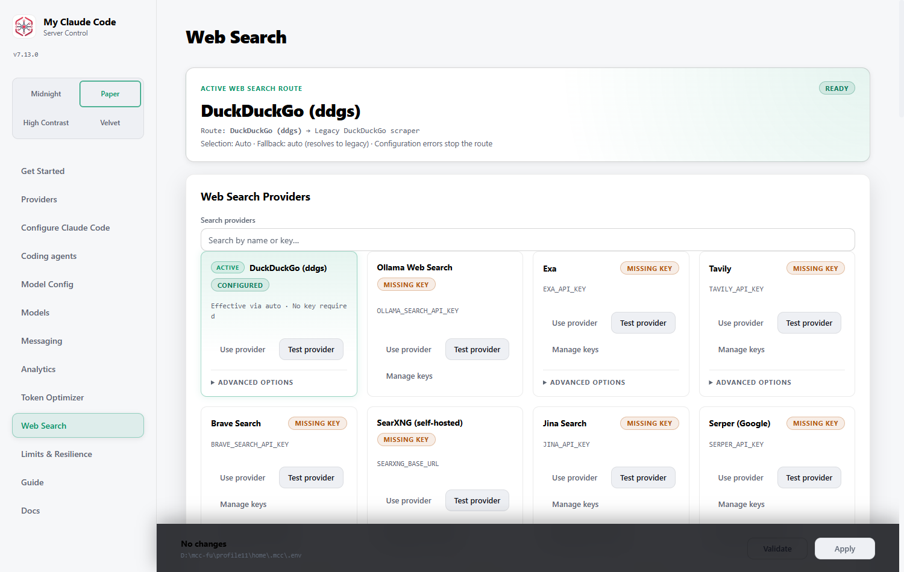
</div>

### Choosing a provider

```bash
WEB_SEARCH_PROVIDER=auto            # auto | off | disabled | <provider id>
WEB_SEARCH_FALLBACK_POLICY=auto     # auto | none | ddgs | legacy
```

**`auto` works with zero configuration.** With no keys set it falls back to keyless DuckDuckGo, so search works out of the box. Set any provider key and `auto` prefers it.

A missing API key on an explicitly selected provider **fails visibly** rather than silently degrading — an unconfigured provider is an operator mistake, not an outage.

14 backends are supported. Free tiers worth knowing: Exa ($10/month ongoing), Tavily (1,000 credits/month), Brave ($5/month), Serper (2,500 one-time), Linkup ($20 topped up monthly), and DuckDuckGo (keyless, unlimited, lower quality).

### The setting most worth changing

By default most providers return a one-or-two sentence **snippet**. Several can return the **extracted text of the page** — the difference between the model guessing from a summary and actually reading the source.

Turn it on for your provider, then give it room to reach the model:

```bash
# Pick the one matching your provider:
EXA_CONTENTS=text                    # or highlights+text, full
TAVILY_INCLUDE_RAW_CONTENT=markdown  # or text
FIRECRAWL_SCRAPE_FORMAT=markdown     # or summary
BRAVE_EXTRA_SNIPPETS=true            # plan-gated

# How much of it actually reaches the model:
WEBSEARCH_DIGEST_CONTENT_CHARS=4000
```

Jina, Parallel and Linkup return extracted text by default and need no switch.

Extracted text has its **own cap**, separate from the snippet cap, so opting in isn't silently trimmed back to snippet length. Set it to `0` to keep snippets only.

> **Cost:** content options bill more on most providers — Firecrawl multiplies credits per result, Exa charges per content type — and they increase input tokens on **every** search. Each option's drawer in the Admin UI states its cost.

### Restricting searches to specific sites

Claude Code declares `allowed_domains`, `blocked_domains` and `max_uses` on its `web_search` tool. MCC reads them and forwards them:

```json
{
  "type": "web_search_20250305",
  "name": "web_search",
  "allowed_domains": ["docs.python.org", "peps.python.org"]
}
```

This filters **server-side** on Exa, Tavily, Firecrawl, Linkup, Perplexity and Parallel — you pay for relevant results instead of filtering after the fact. Providers without native support search normally and drop the filters; every recorded attempt shows `supports_domain_filters`, so the analytics detail tells you which happened.

Anthropic rejects requests carrying both lists, so if both arrive the allow list wins rather than being silently intersected.

### Safe search, locale, freshness

```bash
BRAVE_SAFESEARCH=strict       # off | moderate | strict
SEARXNG_SAFESEARCH=2          # 0 | 1 | 2
SERPAPI_SAFE=active
SEARCHAPI_SAFE=active
DDGS_SAFESEARCH=strict
```

Locale matters if you're not in the US — **Firecrawl returns US results unless told otherwise**:

```bash
FIRECRAWL_COUNTRY=DE
TAVILY_COUNTRY=germany
BRAVE_COUNTRY=DE
SERPER_GL=de                  # SERPAPI_GL / SEARCHAPI_GL / JINA_GL are equivalent
```

Freshness uses each provider's own vocabulary (`BRAVE_FRESHNESS=pw`, `TAVILY_TIME_RANGE=week`, `SERPER_TBS=qdr:w`). For a precise window rather than a relative one:

```bash
TAVILY_START_DATE=2026-01-01
TAVILY_END_DATE=2026-06-30
LINKUP_FROM_DATE=2026-01-01
EXA_START_PUBLISHED_DATE=2026-01-01
```

### Two options especially useful for coding

```bash
FIRECRAWL_CATEGORIES=github,research   # restrict to GitHub or papers
TAVILY_CHUNKS_PER_SOURCE=3             # more text per source, cheaply
```

All **66** advanced options are editable from the Web Search tab's **Advanced options** drawers, and every one states what leaving it blank does.

---

## 11. Analytics

Two separate local SQLite stores under `~/.mcc/logs/`, both written by a background thread so they never block a request.

### Model requests

<div align="center">
  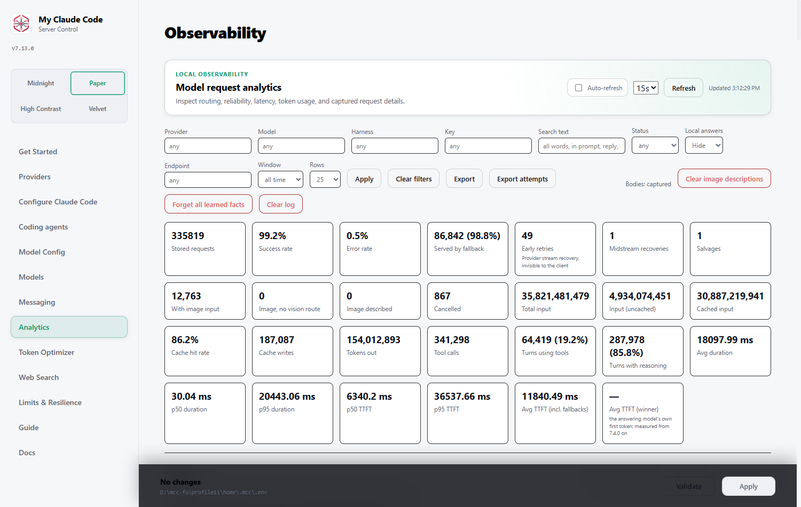
</div>

Summary cards cover volume, success and error rate, latency percentiles, time-to-first-token and token usage. Below: requests over time, tokens by model, and per-provider and per-key tables. Counts, sums and averages are exact; the p50 and p95 latency cards are interpolated from a 64-bucket log-spaced histogram (measured at or under 2.3% error on a 244k-request log), which is what lets an all-time view load in a fraction of a second. A time range that does not start and end on a whole UTC hour is widened outward to one.

<div align="center">
  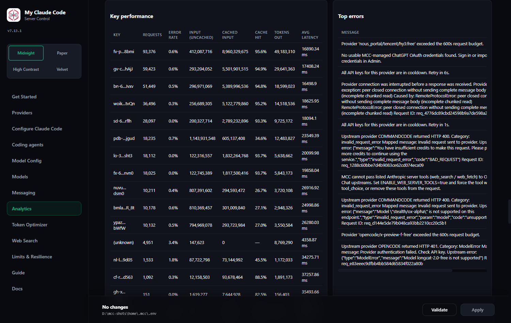
</div>

#### Reading the token columns

Input is reported in two parts, because cached and uncached prompt tokens bill differently:

| Column | Meaning |
| --- | --- |
| **Input (uncached)** | prompt tokens the provider actually processed |
| **Cached input** | prompt tokens served from the provider's cache |
| **Cache hit rate** | cached ÷ total input |
| **Cache writes** | tokens written into the cache |

> **A hit rate of `—` means that provider never reported caching at all** — which is different from a measured `0.0%`.
>
> Prompt caching is provider-dependent. OpenAI reports it for prefixes of 1,024+ tokens; DeepSeek reports it with its own fields; **ChatGPT OAuth reports it from 6.68.2**. **NVIDIA NIM's hosted endpoint does not do real prefix caching** — it returns a small constant regardless of repetition — so a near-zero rate there is accurate rather than a fault. NVIDIA exposes prefix caching as a self-hosted deployment toggle (`NIM_ENABLE_KV_CACHE_REUSE`), not on the shared API.
>
> **ChatGPT OAuth requests logged before 6.68.2 show `—` and keep showing it.** The endpoint was reporting the figure the whole time and MCC was not reading it, so those requests were never measured; nothing is backfilled, because a guess in that column would be worse than a dash. Their **Input (uncached)** counts were also cache-inclusive and so ran high — from 6.68.2 the cached part is reported separately, as it already was for every other provider.

#### Finding a request again

**Search text** matches across everything a request contains, not just the visible prompt and reply:

| Searched | |
| --- | --- |
| Prompt | what you sent |
| Reply | what the model answered |
| **Reasoning** | the model's thinking blocks |
| **Tool calls** | tool names and their arguments — commands, paths, patterns |

Reasoning and tool calls are the majority of a real log: on a typical machine 55% of requests carry thinking text and 78% carry tool calls. Before v4.46.0 neither was searched, so a term that appeared only in a command you ran returned nothing.

**Every word must appear, in any order and anywhere in the request.** Searching `proxy 8082` finds a request that says "restart the proxy" in the prompt and "port 8082 is busy" in the reasoning. A single word behaves exactly as before. Matching is case-insensitive and by substring, so `kube` finds `kubernetes`.

#### Which model actually answered

A request does not always go where the tier points. **View** on any row draws the whole path it took:

```
nous_portal/tencent/hy3:free                    failed
nvidia_nim/nvidia/nemotron-3-ultra-550b-a55b    failed
opencode/deepseek-v4-flash-free                 answered
```

The chain is recorded even when your first choice answers, so you can confirm your fallbacks are configured without waiting for something to break. Rows carry a `fallback N` badge when a stand-in served them, and a `vision` badge when the vision adapter took the request instead — those say, in a sentence, which model could not read the image.

Two panels summarise it across the window: **Failover** pairs each failing primary with what covered for it, and **Vision adapter** does the same for image diversions. The **Served by fallback** card shows how often the safety net engaged; a `—` there means no request in the window recorded routing data at all, which is different from a measured zero.

Requests logged before v4.42.0 have no chain recorded, so the panel is hidden for them rather than inventing one.

Every row's dialog also shows the full request and response, the resolved configuration, and timing. It's usually the fastest way to see what actually happened.

#### Exporting

**Export** opens the export window. It covers Model requests and Web Search, in four formats — JSON, CSV, XLSX and TXT — and streams the **entire** matching row set (it is not capped at the 500-row list page). Pick a period (last hour, 24 hours, 7 days, 30 days, or a custom from–to range), choose which fields to include, and optionally group the output by provider, period, model or key — with the grouping order selectable (e.g. Provider → Period → Model, or Period → Provider → Model). Selecting body-bearing fields (Input, Output, Tool calls, Thinking) includes the stored text for each row.

#### Why the totals stop rising

The request detail view shows the outbound body per attempt: sampling and reasoning parameters are stored whole however large the body is, and only the message and tool structure degrades to counts and names under `REQUEST_LOG_WIRE_BODY_MAX_CHARS`. On the Models page, *reasoning requested* and *reasoning returned* are independent measurements — what left, and whether thinking text came back.

`REQUEST_LOG_MAX_ROWS` caps **stored rows**. Once the table is full, one row is deleted for every row that arrives, so everything computed from those rows is a rolling window:

| Section | Covers | Affected by retention |
| --- | --- | --- |
| Summary cards, charts, tables | the filter row and time range | **yes** — frozen once the cap is reached |
| **All time** | every request ever completed | no — never pruned |

At the cap, Analytics says so above the cards rather than letting a frozen counter look like a bug. **All time** is a small permanent rollup kept per day, provider and model, so per-model request counts and token usage keep climbing after stored rows roll over. It ignores the filters and the time range on purpose.

Two things worth knowing about it:

- Upgrading seeds it from whatever history is still retained. Rows pruned before the upgrade are gone and cannot be recovered, so the two figures start out equal and diverge from then on.
- **Clear log** erases it too. It is an explicit "erase my history" action, and reporting millions of all-time requests over an empty table would read as a bug.

#### Sizing the cap

Bodies are **99% of the stored bytes** — about 30 KB of text per row against 332 bytes of metadata — so retention is really a disk decision.

They are therefore stored zstd-compressed in a side table, against a dictionary trained on your own traffic. That dictionary is what does the work: consecutive requests repeat a near-identical system prompt and conversation history, and per-row compression cannot see across rows. Replaying 4,000 real requests through both paths:

| | database | per row |
| --- | --- | --- |
| Inline text | 168.5 MB | 41.1 KB |
| Compressed | **28.2 MB** | **6.9 KB** |

Roughly **6× more retention for the same disk**. A body costs ~24 µs to read back, and search still matches inside compressed text.

```bash
REQUEST_LOG_ENABLED=true
REQUEST_LOG_MAX_ROWS=700000        # oldest rows pruned beyond this
REQUEST_LOG_COMPRESS_BODIES=true   # false stores text inline, as before
REQUEST_LOG_CAPTURE_BODIES=true    # false drops text entirely, ~77x more rows/GB
REQUEST_LOG_TEXT_MAX_CHARS=10000000 # longer text is truncated before storage
REQUEST_LOG_WIRE_BODY_MAX_CHARS=8000  # bounds stored message/tool structure only
REQUEST_LOG_COMPRESSION_LEVEL=9    # 1-22; 19 measured 4.9% smaller at 9x the time
```

All of these are editable in **Admin UI → Analytics** without touching the file — they are the **Request log storage** card at the bottom of the same page whose contents they govern. Leaving one blank means "use the default" rather than "invalid", so clearing a field can never stop the server starting, and a value outside its range is refused by the form and clamped (with a warning) if it was edited into the file by hand.

Two things not to worry about: the dictionary trains itself once the log has seen a few hundred requests, and each blob records which dictionary compressed it, so retraining never orphans an older row.

#### Compacting a log that predates compression

Compression only ever applies to **newly written** requests, so a database carried across the upgrade keeps paying the old price for its whole history. On a real 1.7 GB log that meant every one of its 50,000 rows.

`mcc-compact-log` (legacy alias `fcc-compact-log`) rewrites them in place:

```bash
# stop the server first, or the final vacuum cannot reclaim the space
mcc-compact-log
```

Measured on a copy of that 1.7 GB database: **1.73 GB → 0.29 GB in 4.9 minutes**, and all 49,934 bodies verified byte-identical against the original afterwards. It is safe to interrupt — each batch commits on its own and a row is converted only after its body is stored, so a kill leaves a consistent database with the work merely unfinished. Running it again resumes.

It also **deduplicates prompts**. The prompt is 98% of the stored bytes and 35.3% of those bytes are exact repeats — a retry or a parallel subagent re-sends the same context — so it is stored in its own shared blob, apart from the reply, reasoning and tool calls that differ every time. Keying on the whole body instead deduplicated 1.4%; keying on the prompt alone removed **29.9%** of an already-compressed real log (299 MB → 209 MB, 35,461 distinct prompts across 50,460 requests).

#### No traffic, or no server?

A flat stretch in **Requests over time** means one of two very different things, and the chart alone cannot tell you which. The server records when it was actually running, so a line under the chart says whether a server covered the range or how much of it had none. Pick a time range to see it — over "all time" there is no bounded window to measure against.

Uptime is only recorded from v4.44.0 onwards, so earlier periods report nothing rather than claiming downtime that was never measured. Brief gaps from a restart are ignored; the threshold scales with the range you are looking at.

<a id="tutorial-read-the-request-detail"></a>

### Tutorial: read the request detail

The detail dialog answers the question "what did MCC actually put on the wire, and which key sent it?" — as opposed to what your configuration says it should have. Every field below is a measurement, not a restatement of settings.

<div align="center">
  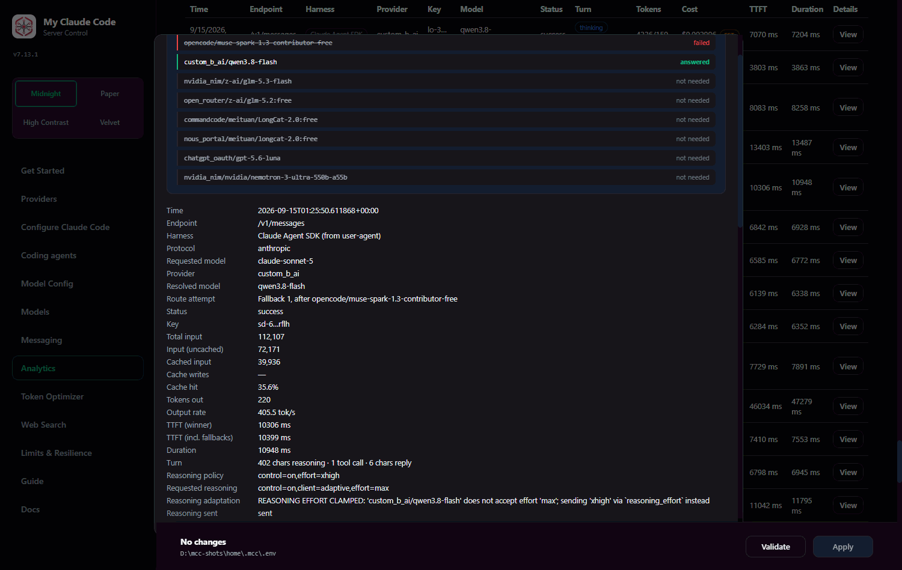
</div>

**1. Open Analytics and find the request.** Filter or search (search reaches the reasoning text and tool arguments too), then press **View** on the row. Since 6.13.0 every filter applies itself — the selects the moment you change one, the text boxes a short pause after you stop typing, and **Clear filters** puts everything back including the default below. **Apply** is still there for when you would rather press it.

**Local answers** defaults to **Hide**, so the table, the cards, the charts and the breakdowns show requests that actually went to a provider. Requests MCC answered itself — title-generation skips, probe replies, suggestion-mode skips — are hidden until you switch it to **Show** (everything, as before 6.13.0) or **Only** (nothing else). The choice is remembered across refreshes. Rows whose provider is genuinely unknown are not local answers and stay visible under Hide, and the **All time** rollup ignores this filter. Exports honour it: since 6.54.0 `/admin/api/export` accepts `local` and `harness`, so a download matches the table it was taken from.

**Harness** names the coding agent that sent the request. Since 6.37.0 every row records it, the
table shows it as a chip, the detail dialog spells it out, there is a **Harness** filter beside
Provider and Model, and Analytics carries a **Requests by harness** breakdown with counts, error
rate, tokens and average latency. The **Coding agents** page shows `Requests (7d)` on each card from
the same data. MCC works it out two ways, and the detail dialog tells you which:

| Detail dialog says | How MCC knows |
| --- | --- |
| `OpenCode 1.18.26 (explicit header)` | MCC's own launcher wrote `x-mcc-harness` into the config it generates for that CLI. Exact, not a guess |
| `Claude Code 2.1.258 (from user-agent)` | inferred from the `user-agent` the client sent |
| `Unknown (no client identification)` | the client sent nothing MCC recognises, or nothing at all |

Eleven of the sixteen agents can carry the explicit header, because their configuration has
somewhere to put one: Claude Code and Gemini CLI through an environment variable, Codex through a
`-c` assignment, Pi through the provider its bundled extension registers, and OpenCode, OpenCode 2,
Kilo, Command Code, Qwen Code, Crush and Cline through the provider document MCC generates for them.
Kimi Code, Aider, Droid and Goose publish no header hook MCC could verify, and Antigravity is not
launched by MCC at all, so those five are identified by user-agent alone.

Two caveats worth knowing before you read the numbers:

- **`Unknown` is large on an old log, and that is history, not a bug.** MCC only started recording
  inbound headers in 5.36.0, so any request written before that has nothing to classify. On the
  reference log that is 146,658 of 272,132 rows. Requests written from 6.37.0 on are always
  attributed to something, even if that something is `Script or curl`.
- **Qwen Code and Pi send Claude Code's user-agent.** Both build `claude-cli/<their own version>`
  on their Anthropic path, so requests from them before 6.37.0 are counted as Claude Code. The
  explicit header separates them from 6.37.0 onward. `Claude Agent SDK` is broken out separately
  from `Claude Code` on purpose — it is a different program, and on the reference log it is the
  busiest client on the box.

**A model that never appears in Analytics never reached the proxy.** The request log records what
MCC was asked to serve; if a model you tried is missing entirely — no rows, not even failed ones —
the agent never sent MCC a request for it. Look at the agent's own configuration and base URL, not
at Analytics. This is different from a request that arrived and failed, which is always logged with
its error.


**2. Read the chain first.** One entry per attempt: outcome badge, model ref, how long it took, and — this is the 6.4.0 addition — **the credential that served that attempt**. Three things it can say:

| Shown | Means |
| --- | --- |
| a key label (`nvap…8f21`) | that attempt used that key. Attempts in one request can name different keys |
| **`no key available`** | every credential in the pool was benched; the attempt never reached a key at all. Since 6.19.0 this splits in two: the whole pool in cooldown, or every key rate-limited **for this model** while its other models still serve |
| a dash | no credential was recorded — not measured, not "keyless" |
| a **ladder headline** (`15 tries · 12×429, 3×502 · 3 keys · 96s sleeping`) | 6.12.0: how many times that attempt actually knocked, and what it met |

**3. Read the ladder.** An attempt is not one request to the upstream. It is up to five tries per credential, across every credential the pool hands it, with MCC's own exponential backoff between them — and before 6.12.0 the database recorded exactly one status for the whole thing. Under a failed attempt you now get four things:

- **The headline**, beside the duration: `15 tries · 12×429, 3×502 · 3 keys · 96s sleeping`. If the sleeping figure is most of the duration, the model was never the slow part.
- **The root-cause line**, stored with the row rather than composed in the browser, so the modal and all four export formats say the same sentence:

  > `3 keys × 5 tries: 12×429, 3×502 — 96s of the 107s were MCC backoff sleeps; keys 0 and 1 benched 60s on 429 (no Retry-After); key 2 not charged (502 is not credential-shaped)`

  That is the real `req_f3b018…`, which the database had recorded as a single `upstream` failure with `HTTP 502` on key 0. The 502 was the last thing that happened, not the thing that went wrong.
- **Show N upstream tries** — one row per try: `#7 · key 1 nvap…8f21 · 429 · 410ms · waited 4900ms · retry-after 12s`. A term that was not measured is omitted, never printed as `0`; a redacted excerpt of the upstream's own body sits under each try that had one, capped by `REQUEST_LOG_LADDER_BODY_MAX_CHARS` (800).
- **The credential decisions** — one line per key the attempt touched, saying whether the pool charged it and why: `key 0 nvap…8f21 — benched 60s (rate_limit): 429, no Retry-After -- operator cooldown 60s`, or `key 2 nvap…c4d0 — health unchanged: 502 is not credential-shaped`. The bench duration is read back out of the rotation engine that set it, never recomputed.

A **timeout** attempt gets a different sentence when most of its duration was spent waiting:

> `deadline reached after 148s of backoff — the model never received an accepted request: 4×429, 1×502`

That is the case the old row got actively wrong. It said *"Provider 'x' produced no output within 120s"*, which sends you to look at the model — when the model was never handed an accepted request at all.

An attempt with a single try shows no ladder: nothing was hidden, so nothing is added. **Rows written before 6.12.0 show no ladder either — that is "not measured", not "there were no retries".**


**4. Expand an attempt's wire pane.** The headline line is the numbers people open this dialog to check, e.g. `max_tokens 131,072 · raised from 64,000 for reasoning · 59 tools · temp 0.7`. That second term appears only when the allowance was widened because the attempt was going to think; the full modal line reads *max_tokens raised from 64,000 to 131,072 for reasoning*, and it is backed by a per-attempt `params.output_widened_from`.

**5. Then the parameter block, which is the important one.** Every parameter MCC sent is listed there — top-level keys, and each provider-specific `extra_body` key under an `extra_body.<name>` row — **above** the message structure, and **never truncated**. A knob MCC learned to send but this pane had never heard of (`min_p`, `tool_choice`, `response_format`) shows up whole rather than falling off the end. A parameter that was not sent has no row: absence is the finding, so it is shown as absence and not as a dash. Anything that looks like a credential by name or shape reads `<redacted>`.

**6. Below it, the stored body — and why it may be shorter than you sent.** The body is stored content-first: the knobs are written whole first, and only `messages` and `tools` degrade, to counts and names, under `REQUEST_LOG_WIRE_BODY_MAX_CHARS` (8,000 by default). The note says exactly that: *Message and tool structure reduced to counts at 8,000 of 214,317 characters. Every parameter is stored whole and shown above.* The stored body always parses as JSON. Before 6.4.0 the cap cut the body alphabetically, so a Claude Code request with ~59 tools spent its whole budget inside `tools` and `temperature`, `top_p` and `reasoning_effort` survived in **0 of 212** truncated bodies measured in one day.

**7. Read the reasoning state on the same summary line.** Three honest states, and none of them is a hidden pane:

- **`reasoning sent: high`** — a reasoning instruction went on the wire, with the value it carried.
- **`no reasoning instruction sent (model default applies)`** — nothing was sent, and that is a correct outcome, not a fault: the host has no field this model's capability could be expressed through, so the model's own default stands.
- **`reasoning not measured`** — this provider has no instrumented commit boundary (Vertex, permanently), or the attempt was never sent.

**8. Take the contradiction badge seriously, and only when it appears.** *gating asked for reasoning; nothing was sent* means the resolved policy chose a value and the body carried none — a real gap between policy and encoder. It is keyed on the stored `reasoning_adaptation_kind` column, never on message text, and it fires for exactly two kinds: **`clamped`** (your rung was moved to the nearest one the host can spell) and **`substituted`** (a different expression of the same intent went instead). **`dropped` stopped badging at 6.6.0** — it had covered two opposite situations and was flagging correct behaviour as a defect — and `nothing_sent` never badges. Rows written **before 6.4.0** badge nothing, because the column did not exist: not measured is not a finding.

**9. Finally, the thinking pane.** `thinking_chars` follows one convention across the whole surface: **`0` is a measurement** — a completed stream that returned no reasoning — and **NULL renders as "Not measured"**. Before 6.8.0 the two were folded together, so "the model thought about nothing" and "nobody was counting" looked identical.

> **ChatGPT OAuth rows before 6.73.2 read `0` for a different reason.** The ChatGPT (Codex) provider speaks OpenAI's Responses protocol, which names its reasoning channel as an event type (`response.reasoning_summary_text.delta`) rather than a delta field. MCC's response-shape tally knew the event; the converter that produces what your client sees did not, so the summary was counted and dropped. Measured on 2026-09-11: **2,671 of 2,671** `chatgpt_oauth` requests over seven days recorded `thinking_chars = 0` while a `reasoning` delta had actually arrived on **1,522 of 2,651** successful attempts (57%), and the Models page read *reasoning requested 2,652, returned 0*. From 6.73.2 the summary becomes a `thinking` block like every other provider's. **Historical rows stay `0`** — they are an honest record of what was delivered at the time, and nothing is backfilled. One case still reads `0` on purpose: when the endpoint returns only `encrypted_content` and no summary, the model thought and released none of it, so there is nothing to show and no empty block is invented.

> **One gotcha worth knowing.** `output_widened_from` is deliberately a plain per-attempt parameter and *not* a reasoning adaptation kind, so widening never badges and never appears in the adaptation severity table. Relatedly, the request-level adaptation line can still name one model while a fallback actually answered — read the per-attempt panes when the chain has more than one entry.

### The Token Optimizer page

**Admin UI → Token Optimizer** answers one question from your own request log: what never reached a provider at all? Nothing on this page is switched on for you.

Some requests are answered inside the proxy by a **local rule** — MCC replies and no provider is ever contacted. Those requests show in the request table as **answered locally · <rule>**, not as provider `(unknown)` the way they read before 5.48.0, and you can filter the table by that value to see only them — or use the **Local answers** filter on Analytics, which hides them all by default and shows only them on **Only**. Because no provider served them, they record no provider, and the tokens they saved are counted from the real request rather than assumed.

The page has four panels:

- **Ledger** — "Tokens never sent": prompt tokens no provider ever received. This is not a bill estimate. What a provider would have charged for the reply cannot be known, and MCC does not guess at it.
- **Local rules** — how often each rule actually fired.
- **Candidates** — recurring request shapes that no rule covers yet, ranked by the tokens they really cost. Press **Scan the log** to produce them. The scan is on demand only: it never runs on a schedule or when the page loads, it reads nothing until you ask, and it changes nothing about how any request is answered. Ask it for more rows than it will scan and it refuses outright instead of quietly sampling and presenting the sample as the whole picture.
- **Cache effectiveness** — prompt-cache hit rate per provider. This is the biggest lever on the page and the optimizer does not control it. A dash means the provider never reported the figure, which is not the same as reporting zero.

Three local rules ship today, each with its own kill switch:

- **Title generation** (`ENABLE_TITLE_GENERATION_SKIP`) — Claude Code's request for a short conversation title.
- **Suggestion mode** (`ENABLE_SUGGESTION_MODE_SKIP`) — a `[SUGGESTION MODE:` turn, which expects no model output at all.
- **Model routing probe** (`ENABLE_PROBE_AUTO_RESPONSE`) — an agent harness's startup reachability check, sent before a run to catch a proxy quietly serving a different model than the one asked for. It is unmistakable: a single `Say OK` user turn, no system text, no tools, not streaming, and `max_tokens` of 16. MCC answers it in milliseconds instead of spending a real upstream call, and the reply names the model that *would* have answered — the first model on the route your fallback health registry has not benched, which is not always the primary — so the probe still detects a substitution truthfully. Set it to `false` if you would rather the probe reach your provider.

The page also shows RTK's measured savings and warns you if the RTK binary installed on your machine has drifted from the version MCC pins.

#### Tool-result trimming (off, and worth leaving off)

Claude Code re-sends the entire conversation every turn, so one big file read is paid for again on every turn after it. MCC can shorten large `Read`, `Grep` and `Glob` results on their way to the model. The controls moved here from the **Limits** tab in 5.48.0.

**It is off by default and this guide is not recommending you turn it on.** It was measured, and it lost. Over a 24-turn session, at the shipped setting, trimming cost **10.9% more fresh input tokens than not trimming at all** — rewriting bytes in the middle of a prompt throws away the provider's prefix cache, and the cache is worth more than the removed text. Turning it on part-way through a conversation costs a near-total cache miss on that turn (a 3.8% hit rate). It only starts to pay if your baseline cache hit rate is **below about 90.9%**, and a well-behaved provider usually sits above that. The full measurement is in `.env.example` and in the source docstring of `core/anthropic/tool_result_trimming.py`.

What it will not do:

- Nothing happens unless you change **two** things: `ENABLE_TOOL_RESULT_TRIMMING` is `false`, and each per-tool rule is separately `off`.
- It never touches `Bash` output.
- It never trims invisibly — every cut carries a note saying MCC made it, how much is missing, and that the model must not describe what it did not see.
- Anything it does not completely understand is passed through untouched.

Each rule has three states, and the middle one is why you would look at this at all: `off`, **`observe`**, and `on`. **`observe` measures what a rule would have removed from your real traffic without changing a single byte on the wire.** That is the way to find out whether trimming would help you: run `observe`, compare against your own cache hit rate on this page, and only then decide. The remaining settings — the size threshold below which nothing is touched, how much of the head and tail survive, and how many recent results are exempt — are documented in the Admin UI and in `.env.example`.

### What a request cost

Since 6.54.0 every request is priced once, at the moment it is written to the log, and the answer is stored beside it in two columns: the amount, and the name of the source that produced it. It is never recomputed when you look at it — a price that changes next month must not silently rewrite last month's bill.

**Pricing walks the same ladder every other model fact walks.** MCC has always resolved a model's context window, its output limit and its capabilities by asking, in order, this provider's own catalogue, then models.dev's bucket for this provider, then a curated reference catalogue, then a vote across same-named rows in other providers' buckets. Cost is now resolved the same way, and for the same reason: the rung that answered is what tells you how much to trust the number.

| Rung | Shown as | Where it comes from |
|---|---|---|
| 1 | *(no badge)* | The host's own reported cost. OpenRouter returns one in the final chunk of every streamed response; any host that reports the same field is read the same way. |
| 2 | `est.` models.dev | The models.dev price for this provider's own bucket — the catalogue MCC already fetches hourly. |
| 3 | `est.` LiteLLM | LiteLLM's published price map, if you turn that source on. The widest table there is, and the only one that names a separate reasoning rate. |
| 4 | `est.` cross-provider | A vote across same-named rows in *other* providers' catalogues. The model is the same; the seller is not. Last resort. |
| — | `—` **not priced** | Nothing published a rate. |

**An unpriced request shows a dash, never `$0.00`.** Those are different facts. `$0.00` is a claim that the request was free, and only a source that actually publishes a zero — a `:free` model's own catalogue entry, for instance — may make it. Every cost total on the Analytics page therefore carries an **"N of M priced"** denominator beside it, so a partial total can never be read as a complete one.

**Reported and estimated amounts are shown side by side and are never added together.** A single merged figure would launder a guess into a fact, and afterwards nobody could tell which half was which. The Cost panel shows the two as two numbers, per provider, per model, per harness and per day.

Details worth knowing:

- **Cache reads and cache writes are priced at their own rates**, from the same source as the base rate. A source that prices input but not cache reads does not price a request that read from cache — that request falls to the next rung whole, rather than being patched together from two sources.
- **Reasoning tokens price as output**, unless the winning source publishes a rate specifically for them. Almost none do, and that is the correct default: the hosts that publish nothing bill reasoning at the output rate.
- **The vision adapter's describe calls are priced separately**, on their own row in the request modal's attempt list. A describe hop is a different model on a different key; folding it into the answering model's figure would make that model look more expensive than it was and would hide what describe mode actually cost. The modal says so explicitly when a request had one.
- **Nothing is backfilled.** Requests logged before 6.54.0 stay unpriced forever. Pricing them at today's rates would produce a confident number that was never anybody's bill.
- **There is no price table in the package.** Both sources are fetched at runtime with conditional requests and cached like every other catalogue. The LiteLLM refresh is integrity-checked before it is accepted — a minimum entry count, and no shrink past half of what is already cached — because it is served from a branch that changes about a hundred times a week and has shipped broken JSON before.

The Models page shows the resolved input, output, cache and reasoning rates per model, in USD per million tokens, each with the ladder rung it came from — so you can see exactly what a request would be priced from before you send one.

Controls live on this page under **Cost estimation**: the master toggle (on by default), which sources may price a request (`auto`, `reported only`, or `computed only` — the last ignores the host's own figure, which is how you audit a provider's billing against a published price), and the LiteLLM source (off by default; it costs one more cached 2.3 MB file and one conditional fetch a day).

<a id="tutorial-read-a-requests-cost"></a>

### Tutorial: read a request's cost

**Where the numbers are.** **Analytics** → the **Cost** panel. Three cards across the top: **Reported** (what the hosts themselves billed), **Estimated** (computed from a published price), and **Priced** — an *"N of M priced"* denominator. Below them, the same three columns broken down by provider, by model, by harness and by day.

**Read the denominator first.** `7 of 8 priced` means one request in that range has no price at all, so the two totals above it are totals of seven requests, not eight. Without that number a window where nine models in ten are unpriced looks like a cheap week.

**Never add the two totals together.** They are different kinds of claim. Reported is a bill; estimated is arithmetic on a published rate. One merged figure would launder the guess into a fact, and afterwards nobody could tell which half was which — so MCC does not offer one.

**Then open the request.** **Requests** → click a row. The modal's cost line names which of the four rungs answered:

| You see | It means |
|---|---|
| an amount, no badge | the host reported this figure itself |
| `est.` **models.dev** | computed from models.dev's price for this provider's bucket |
| `est.` **LiteLLM** | computed from LiteLLM's map — only if you turned that source on |
| `est.` **cross-provider** | a vote across same-named rows in *other* providers' catalogues. Same model, different seller. Treat it as an order of magnitude |
| `— not priced` | nothing published a rate for this model |

**"Why did my image cost that much?"** Open the attempt list in the same modal. If the request carried a picture that the routed model could not read and you are in [describe mode](#tutorial-describe-mode), there is a **second row**: the describe call, against the vision model, priced from its own rate card. The modal says so explicitly. Folding that into the answering model's figure would make that model look more expensive than it was and hide what describe mode cost — so it stays a separate row, and the total you should compare against yesterday is the sum of the rows, which the modal shows.

The other half of an image's cost is tokens, not rates: check the `billed/est` chip on the provider row on the **Models** page and the `Estimated input` line in the request detail. If billed is far above estimated on a model that only ever sees screenshots, `IMAGE_MAX_LONG_EDGE` is the setting to look at.

**"What does 'not priced' mean?"** Exactly what it says: no source published a rate for that model. It is a dash and never `$0.00`, because `$0.00` is a claim the request was free and only a source that publishes a zero — a `:free` model's own catalogue entry — may make it. Two things make a dash more likely: a model nothing but its own gateway has ever listed, and `COST_ESTIMATION_MODE=reported_only`, which stores a host's own figure or nothing at all. Turning on `COST_SOURCE_LITELLM_ENABLED` buys back most of the misses.

**Nothing is backfilled.** A request logged before 6.54.0 stays unpriced forever. Pricing it at today's rates would produce a confident number that was never anybody's bill.

### Web search analytics

The Web Search tab has its own analytics with an important distinction made explicit:

- **Logical searches** — one per `web_search` call.
- **Provider attempts** — one per try. A fallback produces several attempts for one search.

The two are shown in separate tables so the numbers reconcile.

```bash
WEBSEARCH_LOG_ENABLED=true
WEBSEARCH_LOG_MAX_ROWS=500000
WEBSEARCH_LOG_CAPTURE_CONTENT=true      # false = lengths and hashes only
WEBSEARCH_LOG_CONTENT_MAX_CHARS=2000000 # cap per input/output JSON payload
```

> **Privacy.** Search content routinely includes private queries, result URLs and page text. `WEBSEARCH_LOG_CAPTURE_CONTENT=false` withholds the captured payloads **and the query text itself**, keeping only lengths and SHA-256 hashes.
>
> API keys are never written to either store — only masked `first4…last4` labels. Proxy credentials are stripped from recorded URLs.

---

## 12. Multi-key rotation

Both model and web search providers accept several keys in one variable:

```bash
EXA_API_KEY="key-a,key-b,key-c"
EXA_API_KEY_ROTATION=failover
```

| Policy | Behaviour |
| --- | --- |
| `single` | Only the first key. Default with one key. |
| `round_robin` | Even spread across healthy keys. |
| `least_used` | Prefers the key with fewest requests. |
| `failover` | First healthy key; move on when it fails. Default with several keys. |

### Health tracking

Each key carries its own state, and only three things change it. A **401/403** locks the key out on an escalating ladder (`CREDENTIAL_LOCKOUT_TIERS`). A **429** benches it for exactly as long as the provider asked, and only for the **model** that was rate-limited (see `CREDENTIAL_MODEL_BENCH_ESCALATION` below). **Exhausted credits** named in the provider's own words bench the whole key for `RATE_LIMIT_COOLDOWN_SECONDS` (6.34.0). Nothing else does — a timeout, a 5xx, a `410 model gone`, an ordinary 400 or a dropped connection leaves every key exactly as it was, because the same keys serve every model in your chain and none of those failures is the key's doing. When a model will not answer, the fallback chain moves to the next **model**.

A **rate-limited key is benched for exactly as long as the provider says** — parsed from `Retry-After`, `retry-after-ms` or `x-ratelimit-reset-*` — rather than an invented fixed delay. A key that resets in one second isn't idled for a minute, and one that needs an hour isn't hammered.

Since 6.19.0 that bench is also scoped to the **model** it happened on. Gateways that front many models rate-limit them separately: measured on NVIDIA NIM on 2026-08-31, `moonshotai/kimi-k3` returned 429 on all three keys inside 0.1 s while `nvidia/nemotron-3-ultra` and a MiniMax model answered on those same keys in the same second — and NIM sends no `Retry-After` at all. Charging the whole key for that took **every** NIM model off the route for a full minute. Now the pair is benched, the key stays `HEALTHY`, and the key itself is benched only once `CREDENTIAL_MODEL_BENCH_ESCALATION` (default 2) different models are limited on it at once — which is what a genuinely key-wide limit looks like, one extra 429 later.

Per-key state, usage and health are visible in the Admin UI, including which key served which request; the ladder and the no-header cooldown are the **Credential health** card on [Limits and resilience](#12-limits-and-resilience).

<a id="tutorial-why-my-key-was-benched"></a>

### Tutorial: why my key was benched

A key that is out of rotation and a model that is failing look the same from your agent's side, and until 6.0.0 MCC largely conflated them: on one live three-key pool, healthy keys were taken out of service **1,529 times in a single day** by failures none of them had caused — a `410 model gone` on one model ref, a `400 top_p immutable`, a first-token timeout on a slow route. Rotation and key health are now separate questions. This is how to tell which one you are looking at.

<div align="center">
  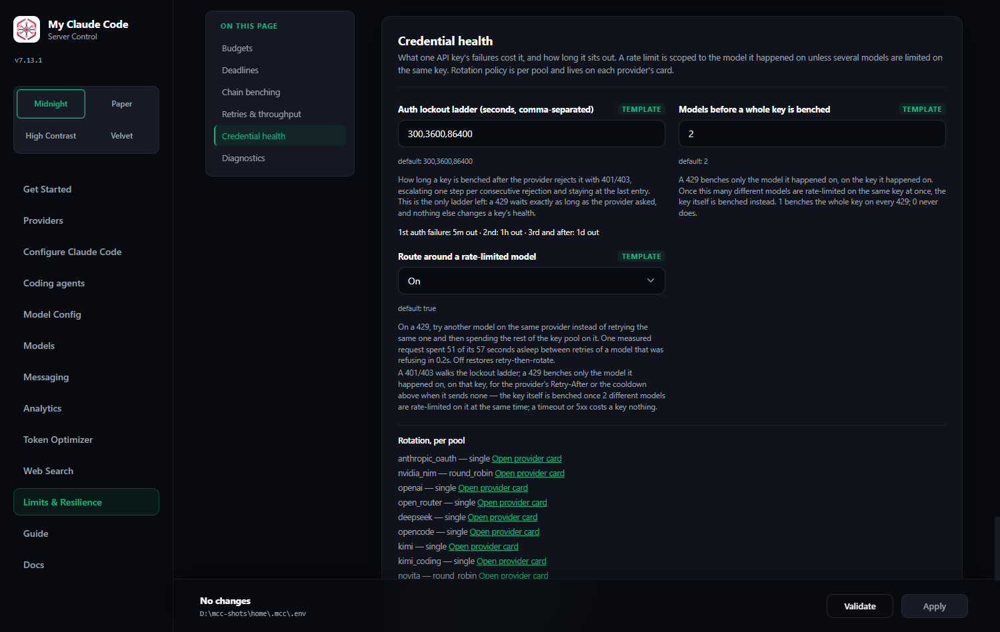
</div>

**1. Look at the key pool.** Providers → the provider's card → **Configure**. Every key in the pool carries its own state badge, and hovering it gives the rest: `LOCKED_OUT — back in 42m — 1,208 requests, 3 failures`.

| Badge | What put it there |
| --- | --- |
| `HEALTHY` | in rotation |
| `HEALTHY` with a model line under it | a 429 on **one model** — that model is benched on this key for a stated time, everything else on the key still serves |
| `COOLDOWN` | a 429 that cost the whole key: several models limited on it at once, or `CREDENTIAL_MODEL_BENCH_ESCALATION=1` |
| `LOCKED_OUT` | a 401 or 403 — benched on the escalating ladder |

**2. Confirm it against a real request.** Analytics → **View** on a failing request → the chain panel names the key per attempt (see [the previous tutorial](#tutorial-read-the-request-detail)). If every entry reads **`no key available`**, nothing was attempted upstream. The error says which of the two reasons applies: *All API keys for this provider are in cooldown* is a credential problem, while *All API keys for this provider are rate-limited for `<model>`* is a **model** problem on a healthy pool — try another model on that same provider. If the attempts name keys and still fail, it is a *model* problem and no key is at fault.

**3. Read the ladder under the attempt.** Since 6.12.0 the chain panel names every upstream try, and one line per credential saying whether the pool charged it. If the ladder shows `12×429` before a `502`, the 502 is not the story — the pool was throttled and the last key simply happened to fail differently.

**4. Match the failure to what it costs.** Exactly two signals charge a key. Everything else is free:

| What the provider returned | The key | The request |
| --- | --- | --- |
| **401 / 403** | steps the `CREDENTIAL_LOCKOUT_TIERS` ladder — **300 s, then 3,600 s, then 86,400 s** (5 min → 1 h → 24 h), one step per consecutive rejection, staying at the last entry | rotates to the next key |
| **429** | the **(key, model) pair** is benched for **exactly the provider's `Retry-After`** — parsed from `Retry-After`, `retry-after-ms` or `x-ratelimit-reset-*` — or `RATE_LIMIT_COOLDOWN_SECONDS` (60 s) when the host publishes no header, capped at one hour either way. The key itself is benched only once `CREDENTIAL_MODEL_BENCH_ESCALATION` different models hold a live bench on it | rotates to the next key |
| connection error / transport fault | nothing | rotates to the next key |
| **timeout, 5xx, `410 model gone`, "overloaded", 400, context overflow** | **nothing at all** | moves to the next **model** in the chain |

The rule behind the table is "judge a key only on signals about the key". The same keys serve every model in your chain, so a model that is gone, overloaded, or slow says nothing about the credential holding the request.

**5. Act on what you found.**

- **`LOCKED_OUT`, one key, others healthy** — that key is wrong, expired or revoked. Remove it from the pool; the ladder is not going to heal a dead key, and by the third rejection it is out for a day.
- **`LOCKED_OUT`, every key** — it is not the keys. Check that the provider is the one the key belongs to, and that your account still has API access.
- **`COOLDOWN` constantly, on every key** — you are over the provider's rate limit, not short of keys. Lower `PROVIDER_RATE_LIMIT` and `PROVIDER_MAX_CONCURRENCY` on **Limits & Resilience → Retries & throughput** rather than adding a fourth key that will cool down alongside the other three.
- **All keys `HEALTHY`, requests still failing** — nothing is wrong with your credentials. Read the chain panel's error kind: this is a model, deadline or benching question, and it lives on [Limits and resilience](#12-limits-and-resilience).

> **The deliberate gap.** A key that fails with a 5xx or a transport fault on *every single request* is never benched — rotation tries it once per request and the chain absorbs the cost. That is the trade MCC made knowingly: the failure classes that could identify such a key were the same ones emptying healthy pools by the thousand. A 401 or 403 still locks it out, which is how a genuinely dead key gets caught.
>
> If your `~/.mcc/.env` still carries a `CREDENTIAL_CIRCUIT_THRESHOLD=` line, it configures nothing — the breaker it belonged to was removed in 6.0.0. The line is ignored rather than fatal; delete it when convenient.

### The RTK token optimizer

RTK (the Rust Token Killer, v0.45.0) is an optional third-party binary that filters noisy terminal output before it reaches the model — trimming the token cost of long, chatty agent sessions without changing what the agent does. MCC manages the binary and its per-agent hooks through one command, `mcc-rtk` (legacy alias `fcc-rtk`):

```bash
mcc-rtk status              # installed binary + enabled agents
mcc-rtk enable claude,pi    # install the hook for these agents
mcc-rtk disable codex       # remove the hook for one agent
mcc-rtk uninstall           # disable every agent and remove the binary
mcc-rtk apply               # re-apply the stored state to the machine
```

Enablement is per agent — `claude`, `codex`, and `pi` are each toggled independently. On first enable MCC downloads the pinned RTK release, verifies its SHA-256, installs it under `~/.local/bin`, and patches the agent's own config with telemetry disabled. Desired state lives in `~/.mcc/rtk.json`; `mcc-rtk apply` reconciles the machine against that stored state after any drift.

The same controls live in the dashboard under the **Token optimizer** card and in the `mcc-desktop` tray's **Token optimizer** submenu, so the three surfaces stay in sync.

MCC reads RTK's own `rtk gain` report and shows the resulting savings on the [Token Optimizer page](#the-token-optimizer-page), and tells you when the RTK binary installed on your machine is no longer the version MCC pins.

**RTK telemetry is off when MCC enables it, and MCC cannot turn it on.** MCC patches each agent's config with telemetry disabled and additionally forces RTK's telemetry opt-out environment variable on every invocation, which also short-circuits RTK's own consent prompt. Enabling RTK through MCC therefore cannot opt you into RTK telemetry.

---

## 13. Limits and resilience

<div align="center">
  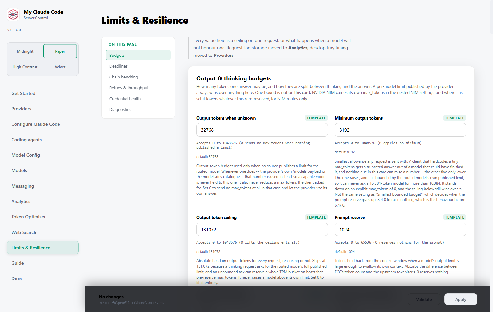
</div>

**Admin UI → Limits & Resilience** holds every setting that decides how long MCC waits, how hard it retries, and when it stops. Six cards — **Budgets**, **Deadlines**, **Chain benching**, **Retries & throughput**, **Credential health**, **Diagnostics** — each stating in one line what it decides, reachable from the sticky section rail down the side of the page. It replaced a single flat grid of 37 fields, two thirds of which were only reachable behind a *Show advanced* toggle; the cost of the split is a long page, which is why the rail follows you down it. Every numeric field carries its accepted range on its own line under the input, so you can see what a box will take without reading the help text.

### Output & thinking budgets

How large one answer may be. MCC sizes `max_tokens` from the routed model's own published limit; these settings only cover what the model cannot answer for itself — the budget used when nobody publishes a limit, the absolute ceiling, the tokens held back so a large output limit cannot swallow its own context window, the smallest bounded budget that reserve may produce, and the answer reserve kept back while extended thinking is on.

**A request that is going to think starts from the model's maximum, not from what the client asked for.** Thinking tokens and the answer are spent from one `max_tokens`, so a client that sized the number for an answer unknowingly sized the thinking as well — and it is the model, not the client, that knows how much it can emit. The ceiling, the context reserve and the model's own limit then clamp that exactly as they clamp any other ask.

**The ceiling ships set at 131,072 for that reason.** Some hosts — OpenAI and Azure style limiters — reserve `max_tokens` against your rate-limit bucket *before* generating anything, so an unbounded thinking turn on a 262,144-output model can 429 a request that would otherwise have been served. The head applies uniformly, reasoning or not; it never raises a model above its own published limit. Set it to **0** to lift it entirely and let every model's own limit stand. Leaving the box empty now means "use the default", not "no ceiling" — that is the one upgrade edge worth knowing about.

### Deadlines

When to stop waiting. The first-token deadline, the whole-request budget, the stall deadline for a stream that started and then went quiet, how long a model may think before the chain moves on, whether reasoning is held back so a thinking model can still be replaced, the commit holdback that keeps a recovery invisible, the three transport timeouts underneath all of it, and how long a closing process gives in-flight requests to drain.

**All four deadlines ship at `0` — no limit — since 6.16.0, and that has one consequence worth stating plainly: with the shipped zeros MCC never ends a silent or stalled upstream on its own. The fallback chain moves only on an error the provider actually returns.** A model that thinks for forty minutes is left to think. A stream that produces two sentences and then goes silent forever stays open until the transport read timeout ends it (`HTTP_READ_TIMEOUT`, 300 s, applied per read rather than per request) or the client disconnects. Nothing in MCC will step in first.

That is a deliberate reversal. Through 6.15.0 these shipped as measured numbers (180 s first token, 600 s budget, 180 s floor, 180 s stall, 450 s thinking) and the failure they produced was the worse one: a reasoning model doing real work was killed mid-thought, the client got `Provider 'x' produced only reasoning for 450s without answering`, and nothing in that sentence said which knob had done it or where it lived. MCC is a system for the operator who runs it, so the shipped value is the one that decides nothing.

**Three settings give you time-based failover back, and they measure different things:**

| Set this | To bound | What happens when it fires |
| --- | --- | --- |
| `FALLBACK_FIRST_TOKEN_TIMEOUT` | silence *before* any output reaches the client | the next model on the chain takes over — the client never sees the handover. **This is the only deadline that produces a failover.** |
| `FALLBACK_STALL_TIMEOUT` | silence *after* output started, measured from the last chunk that moved the answer forward | the request ends. No model can replace a stream the reader is already looking at; with `FALLBACK_END_CLEANLY_AFTER_COMMIT` on it ends as a truncated message rather than an error. |
| `FALLBACK_TOTAL_TIMEOUT` | the whole request, across every attempt, retry and recovery | the request ends, wherever it had got to. |
| `FALLBACK_REASONING_ANSWER_TIMEOUT` | thinking that never becomes an answer, once the provider says it is holding reasoning back | the chain moves on, provided `FALLBACK_ON_REASONING_ONLY` is on — that is what keeps the attempt abandonable. |
| `STREAM_COMMIT_HOLDBACK_SECONDS` + `STREAM_COMMIT_HOLDBACK_CHARS` | how much has to arrive before output is released to you at all | nothing is ended; this is the width of the window in which a failure is still invisible and the next model can start over with nothing shown. Both conditions must be met, or the stream must end. |
| `FALLBACK_ATTEMPT_SHARE_FLOOR` | nothing on its own — it is the smallest slice of `FALLBACK_TOTAL_TIMEOUT` the chain-side division may hand one model | see the arithmetic below. Moot while the total budget is `0`. |

The **Deadlines calculator** on this page turns whatever you set into the number each model on each of your routes actually gets. At the shipped zeros every row reads **no limit**, and the headline names `HTTP_READ_TIMEOUT` as the only thing left that ends a silent model.

**An install that already sets any of these keys keeps its own values.** Upgrading rewrites nothing; the zeros are what a key you never set falls back to.

**Every error one of these limits raises now names its own knob.** A request MCC ended reaches your client as, for example, `Provider 'open_router/qwen/qwen3-max' produced no output within 300s. (FALLBACK_FIRST_TOKEN_TIMEOUT -- change it on the dashboard under Limits & Resilience -> Deadlines)`. The hint names the limit that *actually* ended the attempt: a silent model cut short by its slice of the request budget rather than by the first-token deadline names `FALLBACK_ATTEMPT_SHARE_FLOOR` instead, because raising the first-token box would not have changed anything. The same sentence appears on the attempt row in the request detail, and on the `All API keys for this provider are in cooldown` error, which names `RATE_LIMIT_COOLDOWN_SECONDS` and the **Credential health** card.

**A model's first-token allowance is the smaller of the deadline and its share of the budget — and that share has a floor.** Each attempt gets an equal share of whatever is left of the total budget, counting itself and every model still behind it on the chain; that share is then raised to `FALLBACK_ATTEMPT_SHARE_FLOOR` if it came out lower (never above what is actually left), and what is applied is the smaller of the result and the first-token deadline.

Without the floor the share alone decides: with 600s total and a 120s deadline, a ten-model route gives the first model `min(120, 600 ÷ 10)` = **60s**, and the 120 in the box never applies to that route at all. That is what produced log lines like `produced no first token after 74.9494s` on an eight-model chain — a number that appeared nowhere in the configuration. Set 600s total, 180s first token and a 180s floor and the same route gives every silent model the full **180s**: `min(180, max(600 ÷ 10, 180))`.

The floor is **chain-side**: it bounds each model's first-token allowance, never a retry of the same model. And it buys its honesty with the models behind it — ten models at a 180s floor is 1,800s of demand against a 600s budget, so only the first three silent models can use the whole floor and the ones after them get whatever is left, then nothing. That is the operator's trade to make. `FALLBACK_ATTEMPT_SHARE_FLOOR=0` is the pure equal-share; the shipped value is `3600`, a floor wider than any interactive request. Either way, while `FALLBACK_TOTAL_TIMEOUT` is `0` the whole division is moot: there is no budget to divide, so nothing can undercut the first-token deadline. The Deadlines calculator on this page computes both numbers for your own chains and warns when the floor cannot fit.

**A dead stream is now continued on the next model (6.18.0).** With `FALLBACK_RESUME_AFTER_COMMIT` on (the default), a model that dies part-way through an answer no longer only *ends* the message: the next model on the route is given the words already on your screen, asked to carry on from them, and its output is spliced into the same message. One `message_start`, one text block, one ending — there is no visible seam, on purpose. The model change is recorded in the request detail instead: the stalled attempt keeps its own failure row, and the attempt that finished says *continued here after `<model>` stalled at N chars*. It uses the same chain as any other fallback — benched models skipped, `FALLBACK_SKIP_KINDS` still ending a route, the same request budget, no new retry layer. Continuation is not reliable on every model: many answer nothing at all, and a model that starts the answer over is detected and thrown away rather than printed twice. Every one of those outcomes falls through to the truncated message below, never to an error, which is why it ships on. A half-written tool call is never continued. The first characters of a continuation are held back until it has proved it is continuing rather than restarting, so the rescue costs a short pause before the answer resumes.

**A stream that dies after it started answering now ends as a message, not an error (6.15.0).** The chain commits the moment real text reaches you: from there no other model can take over, because your client has already printed the first model's words. Every failure past that point — the stall deadline, the total budget, a mid-stream 5xx, a dropped connection — used to arrive as an API error underneath a half-written answer, and the turn was dead. With `FALLBACK_END_CLEANLY_AFTER_COMMIT` on (the default) the message is *ended* instead: the open block is closed and the client is told the answer was cut short, so the session continues with a short but complete reply. Nothing about when the stream is stopped changed — only what your client is handed. The answer is genuinely incomplete: the request detail shows the attempt still `failed`, with its real cause, alongside `ended early after N chars`. One case still errors — a stream that stopped halfway through a tool call's arguments, which cannot be completed honestly. Set it `false` for the old error.

The Deadlines card works this out for you. It shows one row per configured route — Default, Fable, Opus, Sonnet, Haiku, Vision — with the arithmetic for that route's chain length, names the floor in the formula when the floor is what decides, and warns either that the floor cannot fit the budget (naming how many silent models it does cover) or that the total budget cannot honour the first-token deadline (naming the budget that would). Routes with no model of their own are left out, because they run on `MODEL` and its chain.

It is a model of the executor, not the executor. It does not know about time already spent earlier in the request, about **Retry primary once** adding an attempt, about a benched model shortening the chain, or about the reasoning path taking over. The card says so where it sits.

<div align="center">
  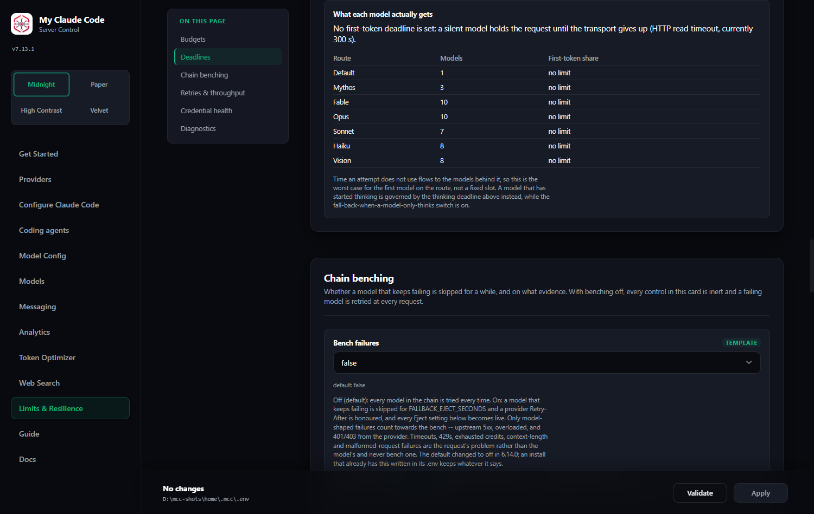
</div>

It also catches two settings that quietly undo a deadline: an `HTTP_READ_TIMEOUT` below the per-model allowance (a slow model then produces a transport error instead of a clean handover to the next one), and a graceful-shutdown window shorter than the total budget (a reload force-drops requests before the budget expires).

**Known gap.** A stream that thinks and then ends with an empty visible answer — `finish_reason=length` after the thinking consumed the allowance — is not rescued by the fallback chain. **Fall back when a model only thinks** only covers a *deadline* reached while a stream is still open, so a stream that ended on time, with output, never reaches it. Raise `MAX_OUTPUT_TOKENS_CEILING`, or lower the reasoning tier, if you see it.

### Chain benching

When to stop trying a model. **Bench failures** is the master switch: turn it off and every other control in the card is inert, and a failing model is tried again on every request.

The mode you are not using stays on screen but disabled, with a note saying which — *Not used while eject mode is legacy*, *Not used while benching is off* — rather than only being dimmed. Disabled fields are skipped by the change tracker, so a mode's unused knobs cannot be saved by accident.

With it on, **Eject mode** picks the arithmetic. `rate_based` (the default) benches a model when at least the failure-rate threshold of its last N requests failed, with a minimum sample count so one bad request on a quiet model cannot trip it. `legacy` benches after a number of *consecutive* failures instead. Each mode ignores the other's settings. Both share how long a benched model stays out of routing, whether the primary gets one more chance before the chain is used, and the shortest remaining rate-limit cooldown that makes stepping over a model worth the chain slot it costs.

Benching never empties a chain: if every model on a route is benched they are tried in order anyway. Which failures abort the chain instead of falling through is a routing decision, not a resilience one, so `FALLBACK_SKIP_KINDS` stays on **Model Config**; the card links across to it.

### Retries & throughput

How hard one model is tried before the chain is used at all: the retries on a 5xx or a dropped connection (a 429 is routed around instead — see **Credential health**), the attempts a provider makes on its own before routing ever sees the failure, the recovery attempts after output has started and the connection dropped, and the exponential backoff between them — first wait, ceiling, and the random jitter that stops several clients retrying in lockstep. The same card carries the client-side pace: requests per window, the window, and how many streams one provider may have open at once.

**The client-side pace cannot throttle interactive traffic.** `PROVIDER_RATE_LIMIT` ships at `300` per `PROVIDER_RATE_WINDOW=2` seconds since 6.68.0 — 150 requests a second, per provider. That is far above anything a person at a keyboard generates, so requests go upstream as fast as your client sends them while a runaway loop still meets a ceiling. (6.62.0 shipped `0`, no pace at all; the number is back, at a value that cannot be the thing holding a request up.) It used to ship at 40 requests per 60 seconds, per provider, against limits no provider had published — and because every routing attempt spends one slot, a route that averaged three attempts began throttling after about thirteen client requests a minute. Measured on one machine, 24 concurrent requests took a median of 938 ms and a 95th percentile of **54 seconds**, all of it MCC waiting for its own window. A provider that really is over its quota answers `429` with a `Retry-After`, and **Credential health** obeys that either way.

Set a positive number only to hold a metered key back on purpose. When you do, the queue is fair: since 6.62.0 waiters are admitted in the order they arrived, so a paced request waits its turn rather than losing a lottery. `PROVIDER_MAX_CONCURRENCY` (default `300` since 6.68.0, was `5`) was never the problem — it is an ordinary semaphore and it was always fair. Lower it if your machine or your link is the bottleneck rather than the provider.

### Credential health

What one key's failures cost it, and it is a short list. A **401 or 403** walks the lockout ladder — `CREDENTIAL_LOCKOUT_TIERS`, five minutes then an hour then a day by default, one step per consecutive rejection and staying at the last entry. A **429** benches the key for exactly as long as the provider asked in its `Retry-After`, or for `RATE_LIMIT_COOLDOWN_SECONDS` when it sends no header — and only for the model it happened on, until `CREDENTIAL_MODEL_BENCH_ESCALATION` (default 2) different models are limited on that key at the same time, which is when the limit is the key's rather than the model's. A **timeout or a 5xx costs a key nothing at all**, because the same keys serve every model in your chain and neither failure is the key's doing.

Since 6.20.0 that 429 also stops costing the *request* anything. `RATE_LIMIT_ROUTES_AROUND_MODEL` (default on) means the pair is benched and the request goes straight to the next model on the **same provider** — same pool, same key — because that is where the evidence points. Nothing sleeps between the two, no provider-wide block is installed, and no key is rotated. When your chain holds no other model on that provider, MCC asks one 16-token question of a model you already configured there: a `200` says the key is fine and only the model is limited, a `429` says the limit is the key's after all and it is benched and rotated exactly as before. That probe appears in the request-detail ladder as its own row, tagged `probe`, and never as a request in your analytics. Turn the setting off to get the old behaviour back, sleeps and all.

### Tutorial: why my request took 57 seconds

Open the request in **Analytics → Requests** and expand the attempt. The ladder under it is the whole story: how many times MCC knocked, what each knock met, which key carried it, and — the number that matters here — how much of the attempt was MCC asleep rather than waiting on the model. A real one read *"3 keys × 5 tries: 14×429, 1×502 — 50s of the 57s were MCC backoff sleeps; keys 0, 1 and 2 benched 60s for moonshotai/kimi-k3"*. Fifteen knocks, six seconds of actual upstream time, and a healthy model on the same three keys sitting one chain slot away that was never asked. If you see a line like that on an install running 6.20.0 or later, check that **Credential health → Route around a rate-limited model** is on, and that the model that refused actually has a sibling configured on the same provider.

### Diagnostics

The logging flags, and the log level that used to sit on its own. Leave them off unless you are chasing something: they are verbose by design.

Two cards that used to live here now sit where you see their effect. The `REQUEST_LOG_*` retention settings are at the bottom of **Analytics**, and the `DESKTOP_*` settings are on **Providers**, beside the live desktop panel.

---

## 14. Updating

<div align="center">
  
</div>

The dashboard shows your running version, checks the release feed (cached for six hours), and announces new releases with **the release notes inline** — expand *What changed* to decide whether an update matters to you.

<div align="center">
  
</div>

**Update now** downloads the release wheel, verifies its SHA-256 against the digest GitHub publishes for that asset, and installs it with `uv`. A checksum mismatch aborts. Extras you originally installed — voice support, for instance — are detected and preserved.

**Upgrading never restarts the server.** A running process keeps serving the code it already loaded, so an upgrade can't drop an in-flight stream. You get a *restart required* banner and restart when convenient.

<a id="the-desktop-app-updates-itself"></a>

#### The desktop app now updates itself too (6.60.0)

An update has two halves, and until 6.60.0 the dashboard only ever reported one
of them. The wheel — the server, the CLI, the dashboard — updates itself every
release. The **desktop app** is a compiled binary the wheel *pins* rather than
carries, and that pin was enforced in one place only: the moment the Python tray
created a window. Launch the app any other way and nothing compared what you
were running with what the wheel wanted, forever. One person ran the v6.43.0
window for fifteen releases while the banner told them they were up to date.

Now:

- **The app checks itself on launch.** It compares the release stamped into it
  with the `shell_release_tag` the wheel reports, and when they disagree it runs
  [`mcc-desktop --ensure-shell`](#ensure-shell) in the background — one command,
  off the interface thread, that downloads and verifies the pinned build.
- **It never replaces its own running executable.** The verified build is
  *staged* beside it as `MyClaudeCode.exe.new`. The tray says **Desktop app
  update ready — restart the app to use vX**, and **Restart now** starts the
  staged build, which renames itself into place before it draws anything. If you
  ignore the tray, the swap happens the next time you start the app anyway —
  which is exactly what the banner promises. The previous build is kept for one
  run as `MyClaudeCode.old-<stamp>.exe` and swept afterwards.
- **The dashboard says so.** The Update banner gains *Desktop app vX available —
  it updates the next time you restart the app*, the version panel shows
  `v6.43.0 → v6.60.0 on next restart`, and **Update now**'s success message names
  both halves rather than declaring you finished when half of you is not.
- **The server says so.** One line in `logs/server.log`, once, behind readiness.

`MyClaudeCode.exe --version` prints which release a binary is, which is the
question that had no answer before.

**Upgrading from a version before 6.60.0 takes one manual step**, because the
mechanism that fetches the app is itself part of what is being fixed — the
window you are running has no swap step in it, so nothing staged beside it
would ever be picked up. Close the app and run

```bash
mcc-desktop --ensure-shell
```

once (add `--target` if the copy you launch is not the one in `~/.local/bin` —
on Windows the installer's is
`%LOCALAPPDATA%\Programs\My Claude Code\MyClaudeCode.exe`). With nothing
running it, the file is replaced outright. Every update after that is
automatic.

**A restart no longer destroys the log that would explain it.** Until 6.58.1
every server start emptied `logs/server.log`, so the one file anyone would open
after a restart went wrong had been erased by that very restart — the timeline of
the hang this release fixes had to be reconstructed from database rows and file
timestamps. A start now moves the previous log aside as
`logs/server.<timestamp>.log` and begins a fresh one, and the same
`SERVER_LOG_RETAIN_FILES` (default 10) that caps loguru's own rotations caps
these: the newest ten survive, older ones are swept on the next start. On Windows
a log another process still holds open cannot be moved; that start truncates as
before rather than refusing to run.

### Windows: the install is deferred

Windows holds a running executable and its loaded DLLs open, so the environment **cannot** be replaced underneath a live process — attempting it fails partway and leaves a broken install.

So on Windows, **Update now** downloads and verifies the wheel, then hands it to a background helper that waits for the server to exit and installs it then. You'll see:

> *Update staged — stop the server to finish installing*

Stop `mcc-server`, the update applies itself, start it again on the new version. **Your working install is untouched until that moment**, so a failed update can't strand you. If the deferred install does fail, the dashboard reports it on the next start.

WSL, Linux and macOS install in place, because they can replace files that are still open.

#### An update can no longer race itself (6.58.3)

The helper used to move every launcher aside before installing, `mcc-desktop`
included. That is the launcher the desktop window asks for its status on every
pass, so for the length of the install the window believed My Claude Code was
not installed — and by design it answers that by running the official installer
itself. Two installers, one tool directory. On 2026-09-07 the helper lost all
five of its attempts to the window's installer and never reached the step that
starts the server again.

Two independent guards, both shipped:

- **The helper never moves the window's own launcher aside.** `uv` replaces it
  in place, and if it happens to be locked at that moment it is kept, exactly
  like any other launcher.
- **The window never installs while a helper is alive.** Every line the helper
  writes to `<config>/updates/progress.json` now carries its process id, when it
  started, and whether it has finished, so anyone can ask the one question that
  matters: *is an installer running right now?* While one is, the window says
  **Updating to X… (installer running, N s)** and waits. It never guesses from
  the stage name — a helper killed mid-install would leave `installing` behind
  forever.

`mcc-desktop --print-status` publishes the same answer as an `update` key, `null`
whenever no helper is running.

#### An open `mcc-claude` window no longer costs the install its fast path (6.58.3)

Windows will not let a running launcher's `.exe` be renamed, and one `mcc-claude`
session left open for the afternoon is enough to refuse one rename. That refusal
used to skip the whole fast install path, forcing every update through the slow
staged fallback (the fingerprint was `attempts = 5` rather than 10). The fast
path now always runs, and a launcher that genuinely could not be replaced is
**kept** and named:

> kept: mcc-claude.exe (in use) — restart it to pick up 6.58.3

That is not a failure. The launcher is a version-agnostic stub that runs the
interpreter in the tool directory the update just replaced, so the command
already runs the new code; only a command *added* by the release would be
missing, and that is reported separately.

#### A failed update brings the previous version back (6.58.3)

`Start-Process` used to sit on the success branch alone, so an install that
failed left a perfectly good previous version on disk with nothing running it.
The helper now starts the server on both branches, records `restarted` in its
receipt, and ends on a `recovered` stage. The dashboard's banner says so:

> The update failed — the previous version was restarted


### Stopping and restarting, and how long it takes

Every stop is the same operation underneath — Ctrl+C, the reload that follows
**Apply** on a settings page, the restart that finishes an update, and the tray's
**Restart Server**. Since 6.41.0 all of them are bounded by one number,
`SERVER_GRACEFUL_SHUTDOWN_SECONDS` on **Limits & Resilience**, and that number
means what it says:

- At the instant a stop begins the server stops taking new work. A request that
  arrives during the drain gets `503` with `Connection: close` and a
  `Retry-After` hint, so a busy client can no longer keep a closing server alive
  by making ordinary requests.
- Requests already in flight get the whole budget to finish.
- At the bound, whatever is still open is closed. An in-flight stream simply
  ends — there is no special error frame on the wire — and your coding agent's
  own retry finds the restarted server a moment later.
- The process exits a few seconds past the bound whatever is still running.

**The default is 20 seconds.** If you carried `SERVER_GRACEFUL_SHUTDOWN_SECONDS=300`
over from an older install, consider lowering it. Before 6.41.0 this number
bounded only one wait inside the stop and everything after it was unbounded, so
a large value cost nothing in practice; now it is the time you spend watching a
tray icon after pressing Restart.

The tray and the update helper follow the same budget rather than numbers of
their own. The tray asks the server to stop, waits that budget, and only then
terminates the process it launched — by the exact process id, never by name. The
Windows deferred-update helper does the same with the server it is waiting for,
and then installs; it used to poll for a full hour and give up without
installing anything.

### From the command line

Re-running the install command does exactly the same thing and always fetches the newest release.

<a id="the-installer-restarts-the-server"></a>

#### The installer can restart the server too (6.73.0)

Until 6.73.0 nothing in the product would start a server after an update unless
the desktop app did it, and on 2026-09-11 that produced the worst case it can
produce: the dashboard's helper stood down because the app said it was watching,
the app was a version that could not act, and the hand-run installer three
minutes later was never allowed to act at all. **Two installs exited 0 and the
machine had no server for a quarter of an hour.**

Add `-Restart` (or `--restart`) and the install command finishes the job:

```powershell
# Windows, PowerShell
& ([scriptblock]::Create((irm "https://raw.githubusercontent.com/FiredMosquito831/my-claude-code/main/scripts/install.ps1"))) -Restart
```

```
rem Windows, Command Prompt
"%TEMP%\install-mcc.cmd" --restart
```

```bash
# Linux, macOS, WSL
curl -fsSL "https://raw.githubusercontent.com/FiredMosquito831/my-claude-code/main/scripts/install.sh" | sh -s -- --restart
```

**Exactly one server is restarted**, and this is the whole of the rule:

1. The installer reads `PORT` and `HOST` from the configuration directory it is
   installing for — `MCC_CONFIG_DIR` if you set it, otherwise `~/.mcc`. It only
   ever *reads*: it never creates that file, never migrates a legacy directory
   and never writes a default back.
2. It asks the product what holds that port (`mcc-server --report-holder`). The
   answer is the same classification the port takeover has used since 6.59.0 and
   the process-tree scan 6.72.2 added — **never** an image name, and never a
   substring of a command line, because the uv tool environment is a directory
   literally named `my-claude-code` and every launcher's command line therefore
   contains the product's name.
3. If that holder is a My Claude Code **server**, it is stopped by its exact
   process ids, within the budget `SERVER_GRACEFUL_SHUTDOWN_SECONDS` sets, and
   the installer waits for the port to come free.
4. `mcc-server` is started detached, so it outlives the installer.
5. The installer waits for `/health` to answer on that port. **That** is success.
   An install that exited 0 is not.

Everything else on the machine is left alone, and said so in the transcript:

> Other My Claude Code servers are running. None of them is touched:
> mcc-server.exe (pid 6764) -> pid 63484

- **A server on another port, or another configuration directory, is never
  stopped.** If you run several instances with agents waiting on them, `-Restart`
  touches the one this install is for and lists the rest.
- **Something that is not ours on the configured port is never stopped either.**
  The installer names the holder, starts nothing, and finishes with
  `restarted: false`.
- **A holder it could not identify is treated as a stranger.** "Cannot tell" is
  never "ours".

If the new server never answers `/health`, the receipt records `failed` with the
child's exit code, the last lines it wrote, and the path to its log. This release
has no staged swap in the installer yet (that is the next one), so the honest
instruction in that case is the one it prints: **the previous version is no
longer installed; run the installer again.**

#### Starting nothing

`-NoStart` / `--no-start`, or `MCC_INSTALL_NO_START=1` in the environment, means
no server is started whatever else was asked — it overrides `-Restart`. The
environment form exists for callers that pass arguments through a layer with its
own opinions about quoting.

#### One update at a time

Both update paths — the dashboard's helper and the install command — now take one
exclusive lock, `<config dir>/updates/update.lock`, before they write anything.
It holds the owner's process id, the second it started and which script it is.

A second updater does not queue and does not install. It says who is installing,
points at the transcript that updater is writing, and exits 0:

> An update is already running (pid 13820, started 15:04:24) -- watching it instead.
> It is writing: C:\Users\you\.mcc\updates\install-20260911-150424.log

A lock whose owner is **gone** is reclaimed rather than waited on, because a
crashed installer must not take the machine out of updating for the rest of the
day.

#### The receipt keeps every episode

`<config dir>/updates/progress.json` used to be emptied by whichever writer
started next. That is how, at 15:04 on 2026-09-11, a hand-run install erased the
entire record of the update that had finished two minutes earlier — while a
window was supposed to be reading it.

Now every writer **appends**, and an episode opens with a marker record
(stage `episode`) naming the writer and its process id. A watcher that looks a
minute late still sees what happened, and the desktop window draws the *current*
episode rather than a timeline that starts with last week's install. Two fields
are new on every record: `restarted` (empty until a restart is attempted, then
true or false) and `holder` (what was on the port).

---

## 15. Security and networking

Worth understanding before you expose anything.

### What binds where

| Surface | Default bind | Access control |
| --- | --- | --- |
| **Proxy API** (`/v1/...`) | `127.0.0.1:8082` by default | Bearer token, if `ANTHROPIC_AUTH_TOKEN` is set |
| **Admin UI** (`/admin`) | same port | **Loopback callers only**, always |

The proxy binds **this machine only** by default (`HOST=127.0.0.1`). The Admin UI is separately restricted to loopback and cannot be reached remotely regardless of bind address.

**To reach the server from another machine** (a LAN, WSL, a phone, a second laptop): set `HOST=0.0.0.0` *and* give `ANTHROPIC_AUTH_TOKEN` a secret. `mcc-server` refuses to start on a non-loopback `HOST` with an empty token, because that combination is an open proxy spending your provider credits for anybody who can route to the port.

### The auth token

`ANTHROPIC_AUTH_TOKEN` is generated on your machine the first time `mcc-server` starts without a `.env` (43 URL-safe characters from `secrets.token_urlsafe`) and written into that `.env`; read it on the dashboard under Providers -> Runtime. It is compared in constant time against the bearer token your agent sends. Before 6.65.0 the template shipped the literal `freecc`, which meant every install shared one password -- existing `.env` files are never rewritten, so change yours if it still says that.

**If you clear it, authentication is disabled entirely** — any caller that can reach the port can spend your provider credits. That is fine on a single-user laptop behind a firewall; it is not fine on a shared or exposed network. Change it from the default if anything other than you can route to the machine.

Loopback-only (`HOST=127.0.0.1`) is the shipped default.

### What never leaves the machine

Provider API keys are never sent to your agent, never written to the analytics stores, and never included in configuration snapshots — only masked `first4…last4` labels. Proxy credentials are stripped from any recorded URL.

---

## 16. Troubleshooting

**`mcc-server: command not found` right after installing.**
Close and reopen your terminal. The installer extends `PATH`; an existing shell won't see it. This is the single most common install issue.

**Windows: installing while MCC is running.**
Supported, and it is the normal path. The installer renames the old tool environment *and* every `mcc-*` / `fcc-*` launcher aside, then lets uv write a complete new set. Running sessions — the server, the tray, an open `mcc-claude` window — keep the old version until they are restarted; anything started afterwards uses the new one. Nothing needs to be closed.

If Windows refuses to move a launcher aside (an antivirus scan, the search indexer, or the shell can hold an `.exe` for a moment), the installer does not give up: it re-runs uv with `UV_TOOL_BIN_DIR` pointed at a staging directory, so uv writes every shim and a complete receipt somewhere nothing is holding, then places the shims one at a time. A shim that still cannot be replaced keeps the file it had and is listed by name as *"these keep working and will refresh on the next install"* — that is not a failure. A uv launcher is a version-agnostic stub that runs the interpreter inside the tool directory, and that directory now holds the new install, so the old stub already runs the new code.

**Windows: the install retries, or says a launcher was "in use".**
Since 6.72.2 it tells you *who*. When a launcher or the tool environment cannot be moved aside, the install prints every My Claude Code process running out of those files — process id, command, when it started, and the exact path it holds — and then takes the staging path described above. **It never stops any of them**, and the server does not either: one of them may be a server you are using right now. The same list is in the server log at every start (`At start: N other My Claude Code server processes are running on this machine`), and in `mcc-desktop --print-status` under `other_servers`. Each entry carries a status: `serving` owns a listening socket, `live` is checking in normally, `unknown` is one MCC cannot classify, and `stale` is the only one that has been *proven* finished — either its heartbeat has been silent past `SERVER_STALE_SESSION_SECONDS` (default 900) *and* the port it recorded is now served by a different My Claude Code, or it is a launcher whose server process is gone. Set `SERVER_STALE_SERVER_ACTION=stop` on **Limits & Resilience** if you want those stale ones stopped automatically; it is `report` by default, and a server with no listening socket is never stopped merely for that — it may be starting, draining, or still streaming an answer it accepted earlier.

**Windows: the installer says a command is missing.**
That means a command the release publishes is genuinely absent, not merely stale. Close the `mcc-claude` window(s) and the tray, then re-run the install command. The installer exits non-zero in that case — it never reports "verified" for a command that does not exist.

**Two configs on Windows.**
If you installed under both PowerShell and WSL you have `C:\Users\<you>\.mcc` *and* `~/.mcc` inside WSL. The server prints which config directory it is using at startup — check that against the one you've been editing.

**Claude Code still talks to Anthropic.**
`~/.claude/settings.json` wins over shell exports. Confirm with `/status` — it should show `http://127.0.0.1:8082`. Check the JSON is valid and that you edited the path for your platform.

**401 from the proxy.**
Your agent's `ANTHROPIC_AUTH_TOKEN` doesn't match the server's. Compare the value in `~/.claude/settings.json` — or the Desktop gateway API key — against the server's setting.

**Provider validation fails with 404.**
Usually the model id, not the key. Check the exact id against the provider's model list.

**Claude Desktop's test buttons fail.**
The server must be running for **Test connection** and **Test model discovery** to succeed — they make real calls.

**Desktop shows a warning dialog on launch.**
Expected with model discovery on; the picker fills in once discovery completes.

**Agent can't reach the proxy from another machine.**
The proxy binds `0.0.0.0`, so it should be reachable — check your firewall. The *Admin UI* is loopback-only by design and will refuse remote callers no matter what.

**Web search returns nothing useful.**
Open the attempt detail in Web Search analytics. It shows exactly what was sent upstream and what came back, including whether your domain filters were applied or dropped.

**Cache hit rate shows `—`.**
That provider doesn't report prompt caching. Not a fault — see [Reading the token columns](#reading-the-token-columns).

**`mcc-desktop` hangs or does nothing on WSL.**
There's no tray on WSL/headless — run `mcc-server` instead and open the dashboard from a Windows browser. See [WSL and headless: there is no tray](#wsl-and-headless-there-is-no-tray).

**I changed a `DESKTOP_*` setting and nothing happened.**
It applies on the next `mcc-desktop` launch, not to a tray already running — quit and relaunch. See [DESKTOP_* settings apply on the next launch](#desktop-settings-apply-on-the-next-launch).

**Update did nothing on Windows.**
Versions below 4.21.5 had a defect where the deferred installer could stall. A self-updater can't fix its own updater, so update once from the install script; after that the dashboard button works.

**Anything else.**
The request analytics **View** dialog shows the complete exchange for any request — request body, response, resolved provider and model, timing, and errors. Start there.


---

## Appendix: what changed in 6.x

Only the keys whose value or meaning moved in 6.0.0–6.8.0. Everything else in `.env.example` is unchanged.

| Setting | Default | What it decides |
| --- | --- | --- |
| `CREDENTIAL_LOCKOUT_TIERS` | `300,3600,86400` | The auth lockout ladder, in seconds. A 401/403 takes the next entry each time and stays on the last one. Any comma-separated list of positive seconds works; the field spells your list back at you as *1st auth failure: 5m out · 2nd: 1h out · 3rd and after: 1d out*. |
| `RATE_LIMIT_COOLDOWN_SECONDS` | `60` | Used when a 429 arrives with no `Retry-After` and no equivalent header, and — since 6.34.0 — as the whole-key bench for an account the provider says is out of credits. When a header does arrive, the provider's own number wins. Capped at one hour either way. Named in the `All API keys for this provider are in cooldown` error since 6.16.0, alongside the **Credential health** card that edits it. |
| `CREDENTIAL_MODEL_BENCH_ESCALATION` | `2` | New in 6.19.0. A 429 benches the (key, model) pair, not the key; this is how many different models must be limited on one key at once before the key itself is benched. `1` restores the 6.18.0 whole-key bench, `0` never escalates. |
| `FALLBACK_FIRST_TOKEN_TIMEOUT` | `0` (no limit) | **Changed in 6.16.0** — was `180`. Silence before any output. The only deadline that produces a failover. |
| `FALLBACK_ATTEMPT_SHARE_FLOOR` | `3600` (one hour) | **Changed in 6.68.0** — was `0`, and `180` before 6.16.0. Chain-side floor on one model's slice of the total budget. Moot while the budget is `0`, which is what it ships as. |
| `FALLBACK_TOTAL_TIMEOUT` | `0` (no limit) | **Changed in 6.16.0** — was `600`. The whole request, across every attempt and retry. |
| `FALLBACK_STALL_TIMEOUT` | `0` (no limit) | **Changed in 6.16.0** — was `180`. Silence after output started. Ends the request; no failover is possible past the first token. |
| `FALLBACK_REASONING_ANSWER_TIMEOUT` | `0` (no limit) | **Changed in 6.16.0** — was `450`. Thinking that never becomes an answer. |
| `FALLBACK_COOLDOWN_STEP_OVER_FLOOR` | `5.0` | The shortest remaining rate-limit cooldown that makes stepping over a model worth the chain slot it costs. |
| `PROVIDER_RETRY_BACKOFF_BASE_SECONDS` | `2` | First wait between retries of one model. |
| `PROVIDER_RETRY_BACKOFF_MAX_SECONDS` | `5` | **Changed in 6.68.0** — was `10`. The longest single wait. The chain is not tried until the ladder is spent, and since 6.20.0 only a 5xx or a dropped connection walks it. |
| `PROVIDER_RETRY_ATTEMPTS` | `2` | **Changed in 6.68.0** — was `3`, and `5` before 6.20.0. Tries one model gets on the same key after a 5xx or a dropped connection. A 429 uses none of them. |
| `RATE_LIMIT_ROUTES_AROUND_MODEL` | `true` | **New in 6.20.0.** A 429 benches the (key, model) pair and the request moves to the next model on the same provider instead of retrying and then spending the rest of the key pool. `false` restores retry-then-rotate. |
| `PROVIDER_RETRY_BACKOFF_JITTER_SECONDS` | `0.5` | **Changed in 6.68.0** — was `1`. Random spread added to it, so several clients do not retry in lockstep, kept below the ceiling above. |
| `REQUEST_LOG_WIRE_BODY_MAX_CHARS` | `8000` | Bounds the stored **message and tool structure** only. Parameters are stored whole at any size. |
| `MAX_OUTPUT_TOKENS_CEILING` | **`131072`** | The hard ceiling on `max_tokens`. **`0` means no ceiling**; a blank field means "use the default", not "off". Range `0`–`1048576`. |
| `MAX_OUTPUT_TOKENS_FLOOR` | **`8192`** | **New in 6.47.0 — this changes behaviour on update.** The smallest allowance any request is sent with, and the only bound here that raises rather than lowers. Never above the routed model's published limit, applied before the context headroom, and it stands down on an explicit `max_tokens: 0`. **`0` turns it off** and restores 6.46.0. Range `0`–`1048576`. |
| `ANTHROPIC_DEFAULT_MAX_OUTPUT_TOKENS` | `81920` | **Settable since 6.47.0.** The last-resort `max_tokens` for a request that reached a provider with none of its own and no published limit to take one from. `0` sends none at all. |
| `REASONING_EFFORT_BUDGET_RATIOS` | `0.10,0.20,0.50,0.80,0.95,0.95` | **New in 6.47.0.** Six shares of the output allowance, one per reasoning effort in order (minimal → max), each strictly between 0 and 1 and never decreasing. |
| `FALLBACK_BENCH_ENABLED` | `false` | Master switch for model benching. Off (the default since 6.14.0) tries every model in the chain every time; on makes the rest of the Chain benching card live, and only upstream 5xx / overloaded / 401 / 403 count towards a bench. Reachable from **Model Config** as well as this card — one setting, two places. Worth checking if your `.env` predates 6.1.0. |
| `FALLBACK_EJECT_SECONDS` | `10` | **Changed in 6.68.0** — was `30`. How long a benched model stays out. Honoured exactly since 6.0.0; a clamp used to cut it to 1 s for timeout and 5xx ejections. |
| `FALLBACK_END_CLEANLY_AFTER_COMMIT` | `true` | **New in 6.15.0.** A model that fails *after* it started answering ends the message cleanly (`stop_reason: max_tokens`) instead of returning an API error under a partial answer. `false` restores the error. |
| `FALLBACK_RESUME_AFTER_COMMIT` | `true` | **New in 6.18.0.** Rather than only ending a half-written answer, hand the text already sent to the next model on the route and splice its continuation into the same message. Falls back to the row above whenever the continuation is unusable, so it can only lengthen an answer, never break one. `false` stops at the short message. |
| `STREAM_COMMIT_HOLDBACK_CHARS` | `0` | **New in 6.18.0.** Visible characters that must arrive before output is released, on top of `STREAM_COMMIT_HOLDBACK_SECONDS`. Raising it means a model that writes a word and dies has shown you nothing, so the route restarts on the next model invisibly; the cost is that much time-to-first-visible-word on every request. `0` uses the clock alone. |
| `HARNESS_TIER_ALIASES` | `true` | **New in 6.38.0.** Lists `mcc/best`, `mcc/good`, `mcc/medium`, `mcc/cheap` and `mcc/vision` at the top of every coding agent's generated picker, each a name for one of MCC's own routes rather than a model of its own. Off keeps those pickers to concrete refs; the router still resolves an alias a client sends anyway, so an agent already configured on one keeps working. Per-agent chains live in `~/.mcc/harness_tiers.json`, written by the **Coding agents** page. See [Tiers for every other coding agent](#tiers-for-every-other-coding-agent). |
| `OPENCODE_CLIENT_IDENTITY` | `opencode` | **New in 6.69.0.** Which client MCC identifies as to OpenCode Zen and OpenCode Go, both of which read identity headers off every request. `opencode` sends the official client's user-agent and client id, which is what the free tier's limiter recognises; `mcc` sends `my-claude-code` and this version instead. The conversation, request and project headers go either way. See [OpenCode Zen and OpenCode Go: what MCC sends about itself](#opencode-zen-and-opencode-go-what-mcc-sends-about-itself). |
| `OPENCODE_CLIENT_VERSION` | *(empty)* | **New in 6.69.0.** Pins the OpenCode release named in that user-agent. Empty reads it from the `opencode-ai` package installed on this machine, and falls back to the release this build was verified against. Only used when `OPENCODE_CLIENT_IDENTITY` is `opencode`. |
| `SERVER_STALE_SERVER_ACTION` | `report` | **New in 6.72.2.** What the server does about other My Claude Code servers it finds at start. `report` names each one in the server log — pid, session, recorded port, start time, last heartbeat, and the files it holds open — and stops nothing. `stop` also stops the ones this install can prove are finished: a heartbeat silent past `SERVER_STALE_SESSION_SECONDS` whose recorded port is now served by a different MCC, or a launcher whose server process is gone. A server is never stopped merely for owning no listening socket. |
| `SERVER_STALE_SESSION_SECONDS` | `900` | **New in 6.72.2.** How long another server's heartbeat must be silent before the word "stale" is available for it. A running server checks in every 30 s, so the default is thirty missed beats. Silence alone never stops anything. Range 60–86400. |
| `SERVER_PORT_TAKEOVER` | `always` | **New in 6.59.0.** What happens when the server starts and its port is already held. `always` stops the holder and takes the port; a holder that is not MCC is named in one `WARNING` line first. Setting it to mcc-only stops only processes this install can identify as its own; never is the pre-6.59.0 behaviour — name the holder and refuse to start. Identification is by process, never by the HTTP answer. |
| `SERVER_GRACEFUL_SHUTDOWN_SECONDS` | `20` | **Changed in 6.41.0** — was `300`, and it used to bound only uvicorn's connection wait while the response cleanup, the provider drain and the ASGI lifespan had no bound at all (a request against a silent upstream meant a server that never exited). It is now one deadline for the whole stop, new requests are refused with `503` for its duration, and the process exits a few seconds past it. Lower an inherited `300` unless you would rather wait five minutes for a restart than cut a long request. |
| `CREDENTIAL_CIRCUIT_THRESHOLD` | **removed at 6.0.0** | The circuit breaker it configured no longer exists for provider pools. A stale line is ignored, not fatal — delete it. |

**Settings that moved page, not meaning:** the nine `REQUEST_LOG_*` keys are at the bottom of **Analytics**, the nine `DESKTOP_*` keys are on **Providers**, `LOG_LEVEL` joined the logging flags under **Diagnostics**, and `HTTP_*_TIMEOUT`, `PROVIDER_RATE_LIMIT`, `PROVIDER_RATE_WINDOW` and `PROVIDER_MAX_CONCURRENCY` came *onto* **Limits & Resilience**. `FALLBACK_SKIP_KINDS` stays on **Model Config**, cross-linked, because which failures abort a chain is a routing decision rather than a resilience one.

**Gone from the vocabulary entirely:** the 10/30/60/120-second cooldown ladder, the provider-pool circuit breaker and its half-open probes, per-credential first-token budgets (`MIN_CREDENTIAL_FIRST_TOKEN_SECONDS`), and "consecutive failures" as something that benches a **key**. Consecutive failures still bench a **model**, under `legacy` eject mode.
