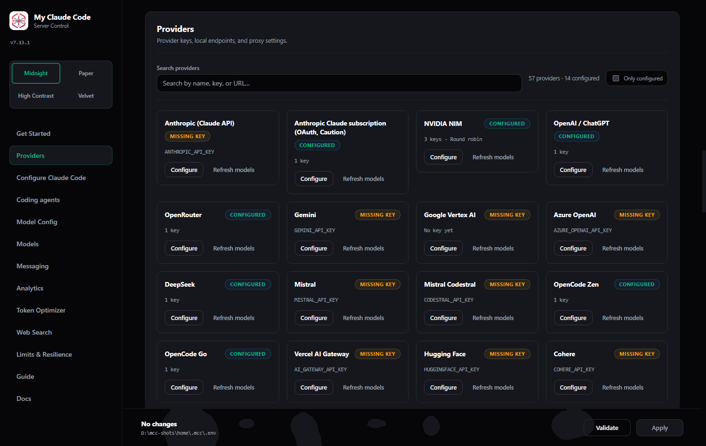
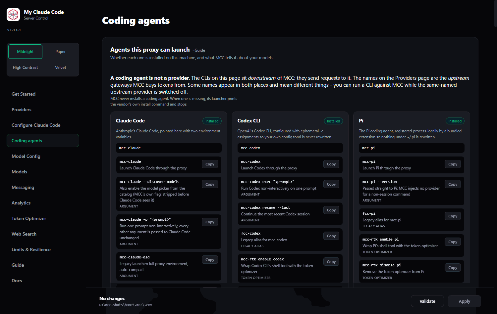

---
# The left sidebar on this page would hold one entry -- "Home" -- because the
# tab it belongs to has no other pages. Hiding it gives the hero screenshot the
# full content column instead of two thirds of it, and a landing page is the
# one page where the reader has not chosen a section to navigate within yet.
hide:
  - navigation
---

<!--
  The documentation SITE's home page, and only the site's.

  `docs/README.md` is the index the dashboard's own Docs page renders offline
  for the version someone installed: a reader who is already here and wants the
  table of contents. This file is for the other reader -- the one who arrived
  from a search engine and does not yet know what MCC is. The two jobs are
  different enough that one page cannot do both, so `scripts/build_docs_site.py`
  stages THIS file as `index.md` and stages `docs/README.md` beside it as
  `documentation.md`.

  The leading underscore keeps it out of the dashboard bundle's curated list by
  convention, and its links and images are written relative to `docs/` like
  every other page here, because the stager rewrites them the same way.

  Anything that is also stated on GitHub, PyPI or npm -- the category line, the
  install routes -- is repeated here verbatim rather than re-phrased. MCC says
  the same thing about itself everywhere.
-->

# My Claude Code

**A local multi-provider LLM proxy, model router and control plane for AI coding agents.**

Claude Code, Codex, OpenCode, Gemini CLI, Crush, Cline, Goose, Aider, Kimi Code, Qwen Code,
Command Code, Droid, Pi, Kilo, Roo Code, Antigravity and the desktop apps (Claude Desktop, Codex
desktop, LM Studio, Warp, VS Code's Copilot endpoint) all point at one address and share one
control panel: routing tiers with fallback chains, reasoning controls, credential rotation and
health, a vision adapter, a native web-search tool proxy, learned provider quirks, cost with
provenance, and a full request log — in front of 57 model providers.

**Your models. Your keys. Your machine.**



*The dashboard's Providers page. Every key stays in your own `.env`, on your own machine.*{ .caption }

## Start here

<div class="grid cards" markdown>

-   **Install it**

    ---

    One line on Windows, macOS, Linux or WSL — or a native desktop app. The installer brings its
    own Python; nothing on your machine is assumed.

    [Install →](USAGE.md#2-install)

-   **What MCC is**

    ---

    An Anthropic-compatible proxy between your coding agent and whichever provider you configure,
    running on `127.0.0.1:8082`. What it does, and what it deliberately does not.

    [Architecture →](ARCHITECTURE.md)

-   **Connect an agent**

    ---

    Sixteen `mcc-*` launchers, plus the recipe for any OpenAI-, Anthropic- or Gemini-shaped client
    that is not one of them.

    [Clients →](CLIENTS.md)

-   **Route your models**

    ---

    Each Claude tier gets an ordered chain of models; the next one takes over when one cannot
    serve. Key rotation, output budgets and retry policy in one reference.

    [Routing reference →](ROUTING-REFERENCE.md)

-   **See what it cost**

    ---

    Every request logged locally with provider, key, model, tokens, time-to-first-token and cost
    with its provenance — estimated or billed, and never guessed silently.

    [Analytics →](USAGE.md#11-analytics)

-   **Bring your providers**

    ---

    57 of them, by API key or by OAuth sign-in. Add one that is not on the list without waiting
    for a release.

    [OAuth providers →](OAUTH-PROVIDERS.md)

</div>

## Install

Pick one. Every route ends at the same server, the same dashboard and the same configuration
directory, and installs `mcc-server` plus the 16 `mcc-*` agent launchers on your `PATH`.

=== "Windows"

    ```bat
    curl -fsSL -o "%TEMP%\install-mcc.cmd" https://raw.githubusercontent.com/FiredMosquito831/my-claude-code/main/scripts/install.cmd && "%TEMP%\install-mcc.cmd"
    ```

    Or download the desktop app:
    [`MyClaudeCode-Setup-windows-x86_64.exe`](https://github.com/FiredMosquito831/my-claude-code/releases/latest/download/MyClaudeCode-Setup-windows-x86_64.exe)

=== "macOS"

    ```bash
    curl -fsSL "https://raw.githubusercontent.com/FiredMosquito831/my-claude-code/main/scripts/install.sh" | sh
    ```

    Or download the desktop app:
    [`MyClaudeCode-macos-universal.dmg`](https://github.com/FiredMosquito831/my-claude-code/releases/latest/download/MyClaudeCode-macos-universal.dmg)

=== "Linux / WSL"

    ```bash
    curl -fsSL "https://raw.githubusercontent.com/FiredMosquito831/my-claude-code/main/scripts/install.sh" | sh
    ```

    Or download the desktop app:
    [`MyClaudeCode-linux-x86_64.deb`](https://github.com/FiredMosquito831/my-claude-code/releases/latest/download/MyClaudeCode-linux-x86_64.deb)
    ·
    [`.tar.gz`](https://github.com/FiredMosquito831/my-claude-code/releases/latest/download/MyClaudeCode-linux-x86_64.tar.gz)

=== "npm"

    ```bash
    npm install -g @firedmosquito831/my-claude-code
    ```

=== "PyPI"

    ```bash
    uv tool install my-claude-code
    ```

    This is the one route that assumes something: it needs **Python 3.14**, and `pip` will refuse
    rather than half-install on anything older. The one-liners above install uv and a managed 3.14
    for you.

Then **close and reopen your terminal** — the installer puts `~/.local/bin` on your `PATH` and a
shell that was already open cannot see it. Check with `mcc-server --version`.

Every platform, every flag, and what the installer cannot do: [Usage Guide → Install](USAGE.md#2-install).

## What it looks like

<div class="grid" markdown>


*Routing: each tier is a chain, tried in order, until one serves.*{ .caption }


*Analytics: 361,468 stored requests, with latency and cost per model.*{ .caption }


*The request log: every call, with the key and the model that answered it.*{ .caption }


*Coding agents: sixteen launchers, each pointed at the same server.*{ .caption }

</div>

---

Full table of contents: [all documentation](documentation.md). Source, issues and releases:
[GitHub](https://github.com/FiredMosquito831/my-claude-code).
